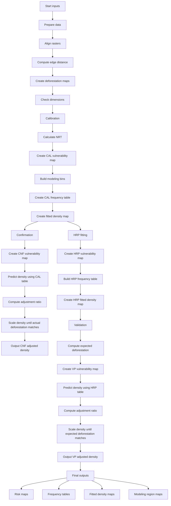

# UDefARP Methodology and End-to-End Flow

This document explains the full risk-mapping pipeline implemented in the `RiskMaps` class and its sub-steps, especially the `run_udefarp()` flow in [computing/forest_additionality/FinalClass.py](../computing/forest_additionality/FinalClass.py).

It also documents the core supporting logic in:

- [computing/forest_additionality/VulnerabilityMap.py](../computing/forest_additionality/VulnerabilityMap.py)
- [computing/forest_additionality/AllocationTool.py](../computing/forest_additionality/AllocationTool.py)
- [computing/forest_additionality/RMT_FIT_CAL.py](../computing/forest_additionality/RMT_FIT_CAL.py)
- [computing/forest_additionality/RMT_PRE_CNF.py](../computing/forest_additionality/RMT_PRE_CNF.py)
- [computing/forest_additionality/RMT_FIT_HRP.py](../computing/forest_additionality/RMT_FIT_HRP.py)
- [computing/forest_additionality/RMT_PRE_VP.py](../computing/forest_additionality/RMT_PRE_VP.py)
- [computing/forest_additionality/AT_FIT_CAL.py](../computing/forest_additionality/AT_FIT_CAL.py)
- [computing/forest_additionality/AT_FIT_HRP.py](../computing/forest_additionality/AT_FIT_HRP.py)
- [computing/forest_additionality/AT_PRE_CNF.py](../computing/forest_additionality/AT_PRE_CNF.py)
- [computing/forest_additionality/AT_PRE_VP.py](../computing/forest_additionality/AT_PRE_VP.py)

---

## 1. Purpose of the pipeline

The pipeline estimates spatial deforestation risk from forest-edge distance and historical deforestation patterns.

At a high level, it works like this:

1. Identify a threshold distance from forest edge beyond which deforestation becomes negligible.
2. Convert distance-to-forest into a vulnerability map.
3. Create risk classes by combining vulnerability classes with administrative units.
4. Compute historical relative deforestation frequencies for each class.
5. Use those historical frequencies to create fitted density maps.
6. Predict future/confirmation-period deforestation using the fitted historical risk structure.
7. Adjust the prediction so the modeled total deforestation matches observed or expected deforestation.

This is a spatial risk-allocation model, not a generic ML model.

---

## 2. Main orchestration: `run_udefarp()`

The method is the end-to-end execution point in [computing/forest_additionality/FinalClass.py](../computing/forest_additionality/FinalClass.py):

```python
def run_udefarp(self):
    print("================= Running UDefARP ===================")
    self.testing_stage_fitting_phase_CAL()
    self.testing_stage_prediction_phase_cnf()
    self.application_stage_fitting_phase_HRP()
    self.application_stage_prediction_phase_VP()
```

This runs four stages:

1. Calibration fitting
2. Confirmation-period prediction
3. Historical reference period fitting
4. Validation / future prediction

---

## 3. Inputs used by the pipeline

The model consumes rasters and masks prepared earlier in the class. Typical inputs include:

- forest cover / forest mask for each year
- distance-to-forest raster for each year
- jurisdiction mask
- administrative division raster
- deforestation binary raster(s)
- working directory for intermediate outputs

The class builds these items such as:

- `forest_edge_distance_start`
- `forest_edge_distance_cnf`
- `forest_edge_distance_vp`
- `deforestation_cal`
- `deforestation_cnf`
- `deforestation_hrp`
- `jurisdiction_mask`
- `administrative_divisions`

These are used in different stages depending on the stage being modeled.

---

## 4. Preprocessing: data preparation

Before `run_udefarp()` is usually called, the class may run:

- `perform_gee_operations()`
- `prepare_data()`
- `final_check()`

### `prepare_data()`
This step:

- resamples forest cover rasters to a common spatial resolution
- generates Euclidean distance rasters from forest edge
- creates deforestation maps between year pairs
- validates the data dimensions and resolution

It uses `GEEManager` to generate and resample the relevant raster products.

### `final_check()`
This ensures that all crucial rasters have:

- the same resolution
- the same rows and columns

If this check fails, the model raises a `ValueError` because downstream operations assume aligned rasters.

---

## 5. Core concept: NRT (Normalized Risk Threshold)

The `NRT` is the most important threshold in the whole method.

It is calculated in [computing/forest_additionality/VulnerabilityMap.py](../computing/forest_additionality/VulnerabilityMap.py), inside `nrt_calculation()`.

### What it represents
It is the distance from the forest edge at which deforestation is considered “negligible” for the risk model.

The logic is:

- read the forest-edge distance map
- multiply it by:
  - deforestation map
  - jurisdiction mask
- keep only deforested pixels inside the valid study area
- construct a histogram of their distances
- compute cumulative probability
- locate the distance where cumulative probability reaches 99.5%
- take the midpoint of that histogram bin as the NRT

In simple terms:

> Among all deforested pixels, what distance from the forest edge marks the point beyond which further distances are effectively negligible risk?

### Why it matters
The `NRT` is used to define the vulnerability classes. Once the threshold is known, all pixels beyond that threshold can be classified according to their relative distance from forest edge.

### Is NRT computed once or many times?
In this implementation, it is intended to be computed once in calibration and then reused across periods.

This is visible in [computing/forest_additionality/FinalClass.py](../computing/forest_additionality/FinalClass.py), where the same `self.nrt` is passed to:

- `RMT_PRE_CNF(..., self.nrt)`
- `RMT_FIT_HRP(..., self.nrt)`
- `RMT_PRE_VP(..., self.nrt)`

That means the model assumes the NRT is a stable reference threshold for the study region.

---

## 6. Vulnerability mapping methodology

The vulnerability classification logic is implemented in `VulnerabilityMap.geometric_classification()`.

### What it does
It converts a continuous distance raster into discrete vulnerability classes using a geometric progression.

The method:

- opens the distance raster
- reads it into a NumPy array
- applies the jurisdiction mask
- sets the maximum class boundary as `NRT`
- builds a series of class boundaries using geometric scaling
- assigns class values to each pixel depending on its distance from forest edge

### Result
The output is a raster where each pixel is assigned a risk class, such as 1, 2, 3, ... up to 30.

This is the key “vulnerability map” used downstream.

---

## 7. Stage 1: Calibration fitting

This is implemented in:

- [computing/forest_additionality/RMT_FIT_CAL.py](../computing/forest_additionality/RMT_FIT_CAL.py)
- [computing/forest_additionality/AT_FIT_CAL.py](../computing/forest_additionality/AT_FIT_CAL.py)

### `RMT_FIT_CAL.calculate_nrt()`
Validates input rasters and calls the vulnerability map logic to compute the NRT.

### `RMT_FIT_CAL.prepare_vulnerability_map()`
Creates the calibration vulnerability raster:

- output: `Vulnerability_Map_CAL.tif`

### `AT_FIT_CAL.process_data()`
This is the allocation step for calibration.

It validates that:

- administrative divisions
- vulnerability map
- deforestation map

all have matching spatial alignment.

Then it calls:

```python
self.allocation_tool.execute_workflow_fit(...)
```

This generates:

- `Acre_Modeling_Region_CAL.tif`
- `Relative_Frequency_Table_CAL.csv`
- `Acre_Fitted_Density_Map_CAL.tif`

### Interpretation
This is the stage where the model learns the historical relationship between:

- vulnerability class
- administrative region
- deforestation intensity

---

## 8. Allocation tool: how the risk classes are converted into densities

The full risk allocation logic lives in [computing/forest_additionality/AllocationTool.py](../computing/forest_additionality/AllocationTool.py).

This file performs the main binning and density-fitting logic.

### `tabulation_bin_id_HRP()`
This creates a unique tabulation ID for each pixel by combining:

- vulnerability class ID
- municipality / administrative unit ID

The formula effectively uses:

```python
(tabulation_bin_id) = (risk_class * 1000) + municipality_id
```

This creates a unique identifier for each vulnerability-by-zone bin.

#### Output
A modeling-region raster representing the unique bins.

### `create_relative_frequency_table()`
For each tabulation bin, this calculates:

- area of the bin in pixels
- total deforested pixels in the bin
- average deforestation per pixel in the bin

It saves the output as a CSV.

This table is the empirical probability model for deforestation by risk class and administrative unit.

### `create_fit_density_map()`
This converts the relative frequency into a continuous density map.

The process is:

- assign each pixel the corresponding average deforestation value from its bin
- multiply by pixel area in hectares
- write the final fitted density raster

Result:

- fitted density map for calibration / HRP

This is the estimated deforestation density associated with each risk class zone.

---

## 9. Stage 2: Confirmation-period prediction

This stage is implemented in:

- [computing/forest_additionality/RMT_PRE_CNF.py](../computing/forest_additionality/RMT_PRE_CNF.py)
- [computing/forest_additionality/AT_PRE_CNF.py](../computing/forest_additionality/AT_PRE_CNF.py)

### `RMT_PRE_CNF.process_data()`
Creates the vulnerability map for the confirmation period using the same `NRT` on the middle-period forest-edge distance image.

Output:

- `Vulnerability_Map_CNF.tif`

### `AT_PRE_CNF.process_data()`
Uses the calibration relative frequency table to predict deforestation in the confirmation period.

It calls:

```python
self.allocation_tool.execute_workflow_cnf(...)
```

This performs:

- tabulation bin creation for the confirmation-period vulnerability map
- comparison of prediction bins with calibration bins
- fills missing bins if needed
- computes prediction density map
- calculates the adjustment ratio
- iteratively rescales prediction until total modeled deforestation is close to actual confirmation-period deforestation

### Why this adjustment is needed
The historical relative frequency table is a generic pattern, but actual confirmation-period deforestation may differ. The adjustment ratio makes the model consistent with reality.

---

## 10. Stage 3: Historical reference period fitting

This stage is implemented in:

- [computing/forest_additionality/RMT_FIT_HRP.py](../computing/forest_additionality/RMT_FIT_HRP.py)
- [computing/forest_additionality/AT_FIT_HRP.py](../computing/forest_additionality/AT_FIT_HRP.py)

### `RMT_FIT_HRP.prepare_vul_map()`
Uses the same NRT and same geometry-based classification logic on the start-year forest-edge distance raster.

Output:

- `Vulnerability_Map_HRP.tif`

### `AT_FIT_HRP.prepare_risk_map()`
Runs the fitting workflow again using the HRP deforestation map.

Outputs:

- `Acre_Modeling_Region_HRP.tif`
- `Relative_Frequency_Table_HRP.csv`
- `Acre_Fitted_Density_Map_HRP.tif`

This is the historical reference baseline used for future estimation.

---

## 11. Stage 4: Validation / future prediction period

This stage is implemented in:

- [computing/forest_additionality/RMT_PRE_VP.py](../computing/forest_additionality/RMT_PRE_VP.py)
- [computing/forest_additionality/AT_PRE_VP.py](../computing/forest_additionality/AT_PRE_VP.py)

### `total_deforestation()`
This helper computes expected deforestation for the validation period.

It:

- opens the HRP deforestation map
- counts pixels with value 1
- converts pixel count to area in square meters
- converts to hectares
- divides by the period length to get annual deforestation

This gives the expected supported deforestation amount for the validation period.

### `RMT_PRE_VP.process_data()`
Creates the validation/future vulnerability map:

- `Acre_Vulnerability_VP.tif`

### `AT_PRE_VP.process_data()`
Uses the HRP relative frequency table and expected deforestation to run the final prediction adjustment.

It computes:

```python
AR = expected_deforestation / MD
```

where:

- `MD` = modeled deforestation from the predicted density map
- `AR` = adjustment ratio

Then it rescales the density map until the total modeled deforestation matches the expected deforestation.

Outputs:

- `Acre_Prediction_Modeling_Region_VP.tif`
- `Acre_Adjucted_Density_Map_VP.tif`

---

## 12. Meaning of “adjust the prediction until it matches expected total deforestation”

This is the central correction step in the prediction stage.

### Why it is done
The predicted density map is only a model from historical patterns. It may not match the actual or expected total deforestation in a new period.

So the algorithm calculates a ratio:

- if model predicts too much, reduce the density map
- if model predicts too little, increase the density map

### The actual mechanism
The code does iterative scaling.

For confirmation:

```python
AR = AD / MD
```

For validation:

```python
AR = expected_deforestation / MD
```

Then:

```python
adjusted_prediction_density_arr = AR * prediction_density_arr
```

After each adjustment, it recalculates `MD` and repeats until the model is close enough to the actual or expected total.

This is effectively a proportional calibration of the predicted deforestation map to the known total deforestation target.

### In plain English
The model is saying:

> “The historical pattern gives us a relative risk surface, but the total amount of deforestation must be constrained to the observed or expected total for this period. So we scale the map until the total predicted loss matches the target.”

---

## 13. Detailed period-by-period flow

### Calibration
Inputs:

- `forest_edge_distance_start`
- `deforestation_hrp`
- `jurisdiction_mask`

Outputs:

- `NRT`
- `Vulnerability_Map_CAL.tif`
- `Acre_Modeling_Region_CAL.tif`
- `Relative_Frequency_Table_CAL.csv`
- `Acre_Fitted_Density_Map_CAL.tif`

### Confirmation
Inputs:

- `forest_edge_distance_cnf`
- `jurisdiction_mask`
- `Relative_Frequency_Table_CAL.csv`
- `deforestation_cnf`

Outputs:

- `Vulnerability_Map_CNF.tif`
- `Acre_Prediction_Modeling_Region_CNF.tif`
- `Acre_Adjucted_Density_Map_CNF.tif`

### Historical Reference Period (HRP)
Inputs:

- `forest_edge_distance_start`
- `jurisdiction_mask`
- same `NRT`
- `deforestation_hrp`

Outputs:

- `Vulnerability_Map_HRP.tif`
- `Acre_Modeling_Region_HRP.tif`
- `Relative_Frequency_Table_HRP.csv`
- `Acre_Fitted_Density_Map_HRP.tif`

### Validation / VP
Inputs:

- `forest_edge_distance_vp`
- `jurisdiction_mask`
- `Relative_Frequency_Table_HRP.csv`
- `expected_deforestation`

Outputs:

- `Acre_Vulnerability_VP.tif`
- `Acre_Prediction_Modeling_Region_VP.tif`
- `Acre_Adjucted_Density_Map_VP.tif`

---

## 14. Summary

The UDefARP pipeline is a risk modeling workflow built around these central ideas:

- distance-to-forest is a key predictor of deforestation risk
- historical deforestation patterns define relative risk frequencies
- vulnerability classes are formed using a threshold (`NRT`)
- each risk class is combined with administrative units into tabulation bins
- historical relative frequencies are converted to fitted density maps
- future or confirmation-period predictions are adjusted to match the observed or expected deforestation totals

The algorithm is therefore best seen as a hybrid of:

- spatial risk classification
- historical frequency-based density estimation
- iterative deforestation-volume adjustment

---

## 16. Practical interpretation

The model attempts to answer the question:

> “Given the observed historical relationship between forest-edge distance and deforestation, where is deforestation likely to occur, and how much of it should be expected in a future or confirmation period?”

It does that by building a map of relative risk, then scaling it to observed totals so the prediction is consistent with the available deforestation reality.

---

## Final flow diagram



This diagram shows the full lifecycle of the method: estimate a common NRT, classify vulnerability by distance to forest edge, build historical deforestation densities by risk and administrative bin, and then adjust prediction maps so the modeled total matches the actual or expected deforestation for each period.
