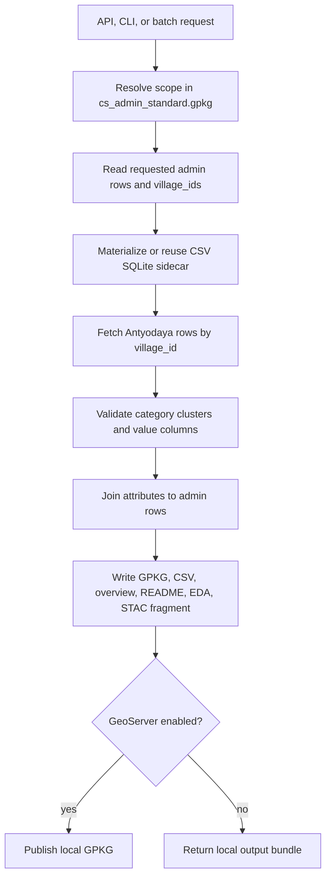

# Mission Antyodaya Local Pipeline

This package replaces the older precomputed-GPKG clipping path with a keyed
runtime join:

The large source CSV and generated SQLite sidecar remain under ignored `data/`.
Tracked files in this package carry the runtime logic and domain mapping.

## How To Read The Data

The runtime asset keeps:

- category values: `*_cat_value`
- category clusters: `*_cat_cluster`, normalized to `HIGH`, `MEDIUM`, `LOW`
- feature values: `*_feat_value`
- raw indicators, ordered through `antyodaya_2020_mapping.yaml`

`*_feat_cluster` columns are intentionally excluded from the current standard
asset. Feature-level values remain available, while clustering is presented at
category level for simpler interpretation.

Focused outputs keep compact admin columns, an `antyodaya_status` marker, and
then the ordered Antyodaya metrics. Rows without a usable admin `village_id` or
without a matching Antyodaya row keep admin fields and leave metric fields blank.

## Reports And Explorer

- Full report PDF: `data/antyodaya/report/antyodaya_cluster_analysis_report.pdf`
- Blog/short PDF: `data/antyodaya/report/antyodaya_cluster_analysis_blog.pdf`
- GEE explorer: https://core-stack-learn.projects.earthengine.app/view/antyodaya2020explorer

These reports explain the clustering and category interpretation. The runtime
README links to them so users can read the CSV/GPKG outputs without needing to
inspect the code.

## Output Modes

- `focused`: default API mode. Writes compact GPKG and focused/Excel-ready CSVs.
- `all`: includes verbose CSV, overview, focused CSVs, GPKG, README, mapping, EDA, and STAC.
- `excel`: writes only the focused Excel/report CSV.
- `metadata`: writes run metadata only.
