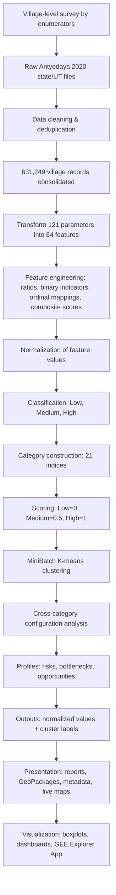
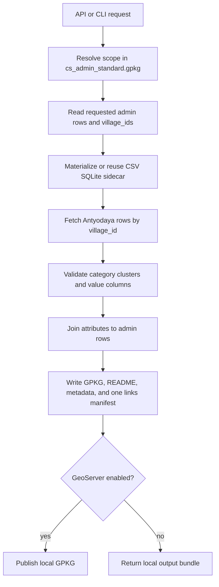

# Mission Antyodaya 2020 Village Dataset

## Why This Data Exists

Mission Antyodaya is a Government of India survey framework, anchored by the
Ministry of Rural Development, that gathers village-level information about
public services, institutions, infrastructure, livelihoods, agriculture, and
welfare programmes. It was designed to support Gram Panchayat Development
Planning: before a panchayat, block, or district can plan, it needs a shared
picture of what exists on the ground. The 2020 round produced one of the most
comprehensive publicly available snapshots of rural India at the village
level.

For development work — watershed programmes, natural resource management,
livelihood missions, financial inclusion drives, and the Core Stack platform
([core-stack.org](https://core-stack.org)) — this data matters because it lets
villages be compared consistently across sectors. A water-security
intervention, for example, is planned differently in a village with strong
market access and SHG institutions than in one where both are weak.

## From 121 Survey Parameters to 21 Category Indices

Mission Antyodaya 2020 contains a large number of village-level variables.
Reading these variables separately makes comparison difficult and obscures
relationships across sectors. We developed a compact analytical framework
that reduces this complexity while retaining the underlying feature-level
information.

The analysis uses **121 raw survey parameters** from 32 Mission Antyodaya 2020
state and union-territory files. Duplicate records were grouped to produce
**631,249 village records**. The raw parameters were transformed into **64
features** using household ratios, binary availability measures, ordinal
mappings, and composite scores. Examples include SHG penetration, piped-water
coverage, electricity availability, land utilization, child nutrition,
agricultural risk support, and market access.

Features were normalized and classified as Low, Medium, and High where
sufficient variation existed; binary indicators used Low and High. Within each
of **21 categories**, feature classes were assigned scores (Low = 0,
Medium = 0.5, High = 1) and combined with equal weight. The resulting category
index was then classified using MiniBatch K-means. The output therefore
provides both a compact category class and the component feature values needed
to explain it.



**Reading an example.** In the Maternal and Child Health category, the full
report shows the five component features separately for villages assigned to
the final Low, Medium, and High classes. The category label is a summary, not
a statement that all component features are equally strong. Villages in the
High category have higher values across most features, but Health Schemes
Utilization remains more variable and lower than several other components.
Interpretation must therefore move from the category class to the feature
distributions beneath it.

**Output structure.** For each category and feature, the consolidated results
contain a normalized value and a cluster label. This allows users to begin
with a small set of category indices, then inspect the specific variables
driving a village's profile.

**Current Excel and KYL flow.** The analytical source and the published
GeoPackage/GeoServer layer still retain the 64 `*_feat_value` fields. They are
not carried into the generated Excel sheet or the village KYL JSON. Those
report-facing outputs use the 21 `*_cat_cluster` fields, the corresponding 21
`*_cat_value` fields, and the 109 raw survey fields. This keeps the handoff
readable and lets a category result be checked against the survey values
without making future report code depend on the intermediate feature columns.

## What the Indices Make Possible

The category indices provide a consistent way to filter villages across
multiple sectors. A single Low or High class is usually insufficient for
interpretation. Cross-category configurations are more informative because
they show how dependence, resources, services, institutions, and market
access occur together. The following examples are descriptive profiles
generated from the consolidated output.

- **Water-security risk — 111,658 villages (17.7%).**
  *High Farm Employment + Medium/High Land Cultivation + Low Irrigation and
  Watershed.* Many households depend on farming and land is actively
  cultivated, but the recorded water-security system is weak. This
  configuration is consistent with exposure to rainfall variability, crop
  failure, constrained cropping intensity, and limited diversification. It
  identifies villages where the adequacy and sustainability of irrigation,
  watershed works, rainwater harvesting, and micro-irrigation should be
  examined on the ground.

- **Agricultural dependence without protective systems — 84,118 villages
  (13.3%).**
  *High Farm Employment + Medium/High Land Cultivation + Low Agriculture
  Support Services + Low Agricultural Markets + Low Financial Inclusion.*
  These villages combine substantial agricultural dependence with weak
  recorded access to support services, finance, storage, and markets. The
  configuration does not measure crop yield or prove exploitation. It
  indicates a risk that productive effort may not be converted into stable
  producer income because credit, risk protection, aggregation, storage, or
  bargaining institutions are limited.

- **Collective capacity without enterprise conversion — 42,744 villages.**
  *High SHG Federation + Low SHG Credit + Low FPO/PACS Strength + Low
  Agricultural Markets.* A collective base is present, but its linkage to
  formal credit, producer institutions, and markets is weak. This profile can
  be used to investigate whether existing SHG structures can support producer
  groups, enterprise activity, or market aggregation.

- **Physical connectivity without local economic conversion — 34,931
  villages.**
  *High Road Connectivity + High Energy Access + Low Financial Inclusion +
  Low Agricultural Markets + Low Cottage and Traditional Industry.* Roads and
  energy are present, but the recorded financial, market, and enterprise
  systems remain weak. This profile can help identify places where physical
  infrastructure is underused for local economic activity.

The same method can identify opportunity profiles. High Common Pastures with
Low Livestock and Veterinary services may indicate a resource base without
adequate animal-health or market support. High Fisheries with weak finance,
roads, or cold-chain access may indicate an existing livelihood activity
constrained by a missing service layer. These profiles are starting points
for investigation, not programme recommendations.

## How to Interpret the Results

1. **Begin with the category, then inspect its features.** A category class
   summarizes several indicators. A High category can still contain a weak
   component, and two villages in the same class can have different feature
   profiles.
2. **Compare like with like.** Values are comparable within the same feature
   or category. A value in Financial Inclusion is not directly equivalent to
   the same value in Water and Sanitation because the underlying indicators
   differ.
3. **Interpret the meaning of the category.** Low WASH, civic capacity, or
   financial inclusion can indicate a broadly relevant service deficit. Low
   fisheries, forest resources, common pastures, or traditional industry may
   reflect local ecology and livelihood structure rather than poor
   development.
4. **Read related categories together.** The main analytical value lies in
   configurations. Category combinations can identify a possible bottleneck,
   risk, or opportunity that is not visible in any single index.
5. **Use the result to frame a field question.** Check the raw variables,
   local geography, neighbouring villages, current conditions, and the
   perspectives of residents and local institutions before drawing a
   conclusion.

## Use with Caution

The analysis should not be used directly to prescribe interventions or
allocate resources. The classes are relative groupings in the 2020 dataset,
not statutory standards. They describe village aggregates and cannot reveal
differences by household, hamlet, caste, class, or gender. The data are a
2020 snapshot and may not represent current conditions. Administrative
reporting may contain missing values, coding errors, or uneven reporting
practices. Cross-category associations identify plausible relationships but
do not establish causation or programme impact.

The appropriate sequence is therefore: inspect the category, examine the
component features, review the raw variables, map the surrounding context,
and validate the interpretation through field enquiry. The results are best
used for screening, comparison, research design, and prioritizing where
further investigation is required.

## How the Runtime Pipeline Works

This package serves the consolidated analysis for any requested geography
through a keyed runtime join — no precomputed per-district files:



The large source CSV and generated SQLite sidecar remain under ignored
`data/`. Tracked files in this package carry the runtime logic and the domain
mapping (`antyodaya_2020_mapping.yaml`), which records for every category the
constituent features, the raw columns used, and the calculation formulae.

## Output Structure

Every run writes a standard bundle (each artifact can be switched off per
request or through `default_outputs` in `antyodaya_pipeline.yaml`):

| Artifact | Contents |
| --- | --- |
| `<layer>.gpkg` | Village geometries with the full attribute set, including `*_feat_value` feature columns for deeper analysis. |
| `README.md` | One run summary with a column reference table. |
| `<layer>.run_metadata.json` | One metadata file with column descriptions, `column_rename_mapping`, and EDA. |
| `<layer>.links.json` | One manifest containing local and GeoServer links. |
| `antyodaya_2020_mapping.yaml` | Copy of the category/feature/raw-column mapping for provenance. |
| GeoServer layer | Published from the GPKG when enabled. |

The `antyodaya_status` column sits right after the admin columns in every
output and records data availability per village: `matched`,
`no village id available`, or `no data available for this village`. It is
configured under `output_contract.status_column` in the pipeline YAML and can
be dropped from any artifact by removing that output from its `outputs` list.

Category clusters are normalized to `HIGH`, `MEDIUM`, `LOW` at runtime, and
`*_cat_value` / `*_feat_value` columns are validated to the 0–1 range.

## Running It

```bash
# Simple body, same as the other Core Stack layer APIs (implies tehsil scope)
POST /api/v1/generate_antyodaya/
{"state": "jharkhand", "district": "ranchi", "block": "angara",
 "sync_to_geoserver": false}

# Structured body, for any scope level and per-artifact output control
POST /api/v1/generate_antyodaya/
{"scope": {"level": "district", "state_name": "Jharkhand", "district_name": "Ranchi"},
 "outputs": {"metadata": true},
 "publish": {"sync_to_geoserver": false}}

# CLI
python -m computing.misc.antyodaya --state Jharkhand --district Ranchi --tehsil Angara --no-geoserver
```

## References and Data

- [Two-page Mission Antyodaya analysis note](https://github.com/core-stack-org/core-stack-backend/blob/main/docs/antyodaya_reports/antyodaya_cluster_analysis_blog.pdf)
- [Mission Antyodaya 2020 Village Cluster Analysis Report](https://github.com/core-stack-org/core-stack-backend/blob/main/docs/antyodaya_reports/antyodaya_cluster_analysis_report.pdf)
- [Village-level normalized values and cluster labels](https://drive.google.com/file/d/1cknoBS24yvOCBZEylHeiYJtWe966uM6I/view?usp=sharing)
- [Pan-India GeoPackage](https://drive.google.com/file/d/1RY8ualBzeCk3nN_0IStcYFEl_P3OhtH1/view?usp=sharing)
- [Mission Antyodaya 2020 raw data files](https://drive.google.com/drive/folders/1pmVGOh_VEWIHey7QTdFUhXEIcLEXvdNZ?usp=sharing)
- [GEE Antyodaya 2020 Explorer App](https://core-stack-learn.projects.earthengine.app/view/antyodaya2020explorer)

## Conclusion

The analysis reduces more than one hundred survey parameters to 21
interpretable category indices without discarding the underlying
feature-level evidence. This makes it possible to compare villages
consistently and to identify cross-sector configurations that may represent
risks, bottlenecks, or opportunities. Its value depends on careful
interpretation: category labels should lead users back to the features and
then to current conditions on the ground.
