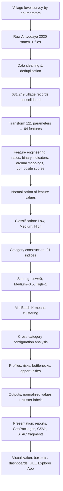

# Mission Antyodaya 2020 DataSet

\vspace{0.15em}

Mission Antyodaya 2020 contains a large number of village-level
variables covering public services, institutions, infrastructure,
livelihoods, agriculture, and welfare programmes. Reading these
variables separately makes comparison difficult and obscures
relationships across sectors. We developed a compact analytical
framework that reduces this complexity while retaining the underlying
feature-level information.

\section{From 121 Survey Parameters to 21 Category Indices}

\noindent
\begin{minipage}[t]{0.38\textwidth}
\small
\vspace{0pt}
The analysis uses 121 raw survey parameters from 32 Mission Antyodaya
2020 state and union-territory files. Duplicate records were grouped to
produce 631,249 village records. The raw parameters were transformed
into 64 features using household ratios, binary availability measures,
ordinal mappings, and composite scores. Examples include SHG
penetration, piped-water coverage, electricity availability, land
utilization, child nutrition, agricultural risk support, and market
access. Features were normalized and classified as Low, Medium, and
High where sufficient variation existed; binary indicators used Low and
High. Within each of 21 categories, feature classes were assigned scores
(Low \(=0\), Medium \(=0.5\), High \(=1\)) and combined with equal
weight. The resulting category index was then classified using
MiniBatch K-means. The output therefore provides both a compact category
class and the component feature values needed to explain it.

\textbf{Reading the example.}
Figure~\ref{fig:mch-boxplot} shows the five features used in the
Maternal and Child Health category, separately for villages assigned to
the final Low, Medium, and High classes. The box plots summarize the
distribution of normalized feature values within each class. The
category label is a summary, not a statement that all component features
are equally strong. For example, villages in the High category have
higher values across most features, but Health Schemes Utilization
remains more variable and lower than several other components. The plot
therefore shows why interpretation must move from the category class to
the feature distributions beneath it.

\textbf{Output structure.}
For each category and feature, the consolidated results contain a
normalized value and a cluster label. This allows users to begin with a
small set of category indices, then inspect the specific variables
driving a village's profile.
\end{minipage}
\hfill
\begin{minipage}[t]{0.58\textwidth}
\vspace{0pt}
\centering
\includegraphics[
  width=\linewidth,
  height=0.69\textheight,
  keepaspectratio
]{media/image10.png}
\captionof{figure}{Feature distributions within the Low, Medium, and
High Maternal and Child Health category classes. Blue lines show
medians; red dashed lines show means.}
\label{fig:mch-boxplot}
\end{minipage}

\clearpage

\begin{multicols}{2}
\fontsize{9.4}{11.15}\selectfont

\section{What the Indices Make Possible}

The category indices provide a consistent way to filter villages across
multiple sectors. A single Low or High class is usually insufficient for
interpretation. Cross-category configurations are more informative
because they show how dependence, resources, services, institutions, and
market access occur together. The following examples are descriptive
profiles generated from the consolidated output.

\pattern{Water-security risk: 111,658 villages (17.7\%).}{
\textbf{High Farm Employment + Medium/High Land Cultivation + Low
Irrigation and Watershed.} Many households depend on farming and land is
actively cultivated, but the recorded water-security system is weak.
This configuration is consistent with exposure to rainfall variability,
crop failure, constrained cropping intensity, and limited
diversification. It identifies villages where the adequacy and
sustainability of irrigation, watershed works, rainwater harvesting, and
micro-irrigation should be examined on the ground.
}

\pattern{Agricultural dependence without protective systems: 84,118
villages (13.3\%).}{
\textbf{High Farm Employment + Medium/High Land Cultivation + Low
Agriculture Support Services + Low Agricultural Markets + Low Financial
Inclusion.} These villages combine substantial agricultural dependence
with weak recorded access to support services, finance, storage, and
markets. The configuration does not measure crop yield or prove
exploitation. It indicates a risk that productive effort may not be
converted into stable producer income because credit, risk protection,
aggregation, storage, or bargaining institutions are limited.
}

\pattern{Collective capacity without enterprise conversion: 42,744
villages.}{
\textbf{High SHG Federation + Low SHG Credit + Low FPO/PACS Strength +
Low Agricultural Markets.} A collective base is present, but its linkage
to formal credit, producer institutions, and markets is weak. This
profile can be used to investigate whether existing SHG structures can
support producer groups, enterprise activity, or market aggregation.
}

\pattern{Physical connectivity without local economic conversion:
34,931 villages.}{
\textbf{High Road Connectivity + High Energy Access + Low Financial
Inclusion + Low Agricultural Markets + Low Cottage and Traditional
Industry.} Roads and energy are present, but the recorded financial,
market, and enterprise systems remain weak. This profile can help
identify places where physical infrastructure is underused for local
economic activity.
}

The same method can identify opportunity profiles. High Common Pastures
with Low Livestock and Veterinary services may indicate a resource base
without adequate animal-health or market support. High Fisheries with
weak finance, roads, or cold-chain access may indicate an existing
livelihood activity constrained by a missing service layer. These
profiles are starting points for investigation, not programme
recommendations.

\section{How to Interpret the Results}

\begin{enumerate}
\item \textbf{Begin with the category, then inspect its features.} A
category class summarizes several indicators. A High category can still
contain a weak component, and two villages in the same class can have
different feature profiles.

\item \textbf{Compare like with like.} Values are comparable within the
same feature or category. A value in Financial Inclusion is not directly
equivalent to the same value in Water and Sanitation because the
underlying indicators differ.

\item \textbf{Interpret the meaning of the category.} Low WASH, civic
capacity, or financial inclusion can indicate a broadly relevant service
deficit. Low fisheries, forest resources, common pastures, or traditional
industry may reflect local ecology and livelihood structure rather than
poor development.

\item \textbf{Read related categories together.} The main analytical
value lies in configurations. Category combinations can identify a
possible bottleneck, risk, or opportunity that is not visible in any
single index.

\item \textbf{Use the result to frame a field question.} Check the raw
variables, local geography, neighbouring villages, current conditions,
and the perspectives of residents and local institutions before drawing
a conclusion.
\end{enumerate}

\section{Use with Caution}

The analysis should not be used directly to prescribe interventions or
allocate resources. The classes are relative groupings in the 2020
dataset, not statutory standards. They describe village aggregates and
cannot reveal differences by household, hamlet, caste, class, or gender.
The data are a 2020 snapshot and may not represent current conditions.
Administrative reporting may contain missing values, coding errors, or
uneven reporting practices. Cross-category associations identify
plausible relationships but do not establish causation or programme
impact.

The appropriate sequence is therefore: inspect the category, examine the
component features, review the raw variables, map the surrounding
context, and validate the interpretation through field enquiry. The
results are best used for screening, comparison, research design, and
prioritizing where further investigation is required.

\section{Conclusion}

The analysis reduces more than one hundred survey parameters to 21
interpretable category indices without discarding the underlying
feature-level evidence. This makes it possible to compare villages
consistently and to identify cross-sector configurations that may
represent risks, bottlenecks, or opportunities. Its value depends on
careful interpretation: category labels should lead users back to the
features and then to current conditions on the ground.

\vfill
\hrule
\vspace{0.35em}
{\scriptsize
\textbf{References and data:}
\href{https://drive.google.com/file/d/1WpxzwZ-Kjsf1c1aY7U3VQg-JMAFC2ljg/view?usp=sharing}{Mission Antyodaya 2020 Village Cluster Analysis Report};
\href{https://drive.google.com/file/d/1cknoBS24yvOCBZEylHeiYJtWe966uM6I/view?usp=sharing}{village-level normalized values and cluster labels};
\href{https://drive.google.com/file/d/1RY8ualBzeCk3nN_0IStcYFEl_P3OhtH1/view?usp=sharing}{pan-India GeoPackage};
\href{https://drive.google.com/drive/folders/1pmVGOh_VEWIHey7QTdFUhXEIcLEXvdNZ?usp=sharing}{Mission Antyodaya 2020 raw data files};
\href{https://core-stack-learn.projects.earthengine.app/view/antyodaya2020explorer}{GEE Antyodaya 2020 Explorer App}.

The large source CSV and generated SQLite sidecar remain under ignored `data/`.
Tracked files in this package carry the runtime logic and domain mapping.

## How To Read The Data

The runtime asset keeps:

- category values: `*_cat_value`
- category clusters: `*_cat_cluster`, normalized to `HIGH`, `MEDIUM`, `LOW`
- feature values: `*_feat_value`
- raw indicators, ordered through `antyodaya_2020_mapping.yaml`

`*_feat_cluster` columns are intentionally excluded from the current standard
asset. Feature-level values remain available, while clustering is presented at
category level for simpler interpretation.

Focused outputs keep compact admin columns, an `antyodaya_status` marker, and
then the ordered Antyodaya metrics. Rows without a usable admin `village_id` or
without a matching Antyodaya row keep admin fields and leave metric fields blank.

## Reports And Explorer

- Full report PDF: `data/antyodaya/report/antyodaya_cluster_analysis_report.pdf`
- Blog/short PDF: `data/antyodaya/report/antyodaya_cluster_analysis_blog.pdf`
- GEE explorer: https://core-stack-learn.projects.earthengine.app/view/antyodaya2020explorer

These reports explain the clustering and category interpretation. The runtime
README links to them so users can read the CSV/GPKG outputs without needing to
inspect the code.

