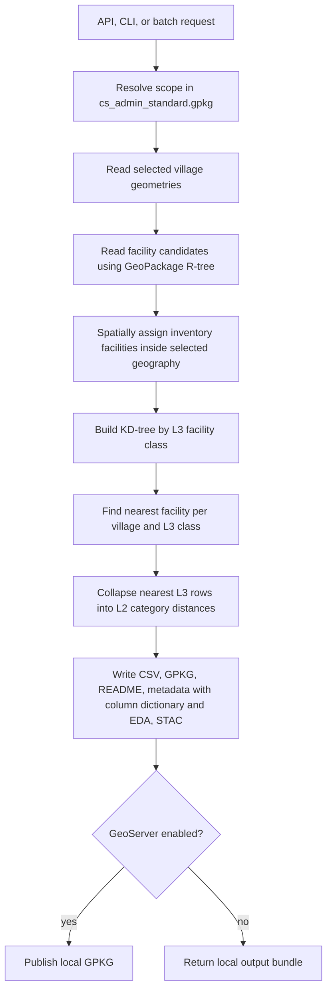

# Facility Proximity & Village Service Access Dataset

## Why Service Proximity Matters

Distance is one of the most decisive and least visible determinants of rural
well-being. A school that exists but is 12 km away is, for a six-year-old,
a school that does not exist. Health outcomes, learning continuity, savings
behaviour, the price a farmer receives for produce, and whether milk reaches
a market before it spoils are all shaped by how far a household is from the
nearest working facility. Human development programmes usually track whether
facilities exist; this dataset instead measures **how reachable they are,
village by village** — which is what planning, siting, and prioritisation
decisions actually need.

For Core Stack ([core-stack.org](https://core-stack.org)) this layer connects
people to services the way the hydrology layers connect land to water: it
turns point locations of schools, health centres, banks, ration shops,
markets, and agri-industry units into per-village access measures that can be
read alongside Antyodaya development indices, livestock counts, and watershed
data.

## Where the Facility Points Come From

Public facility registries were cleaned and consolidated into one pan-India
Core Stack GeoPackage (`cs_pan_india_facilities.gpkg`, ~4.19 million facility
points), keeping one row per physical facility with a stable identifier:

- **Education**: UDISE-style school records (primary through higher
  secondary) and AISHE records for colleges and university-type institutions.
- **Health**: sub-centres, PHCs, CHCs, district hospitals, and
  specialist/tertiary hospitals from public health facility registries.
- **Food security**: PDS fair price shops.
- **Finance**: Common Service Centres, bank mitras/business correspondents,
  bank branches, and ATMs.
- **Agriculture**: APMC mandis and agri-industry units (markets and trading,
  storage and warehousing, distribution utilities, processing, industrial
  manufacturing, co-operatives and societies, dairy and animal husbandry, and
  agriculture support infrastructure).

Each source's cleaned file, identifier column, and per-class description are
recorded in `facility_classifications.yaml`; the full build metadata (row
counts, coverage, per-column EDA of the pan-India asset) lives in
`utilities/scripts/facilities_utils/facilities_column_metadata.yaml`.

## The Classification: L1 → L2 → L3

Facility points carry a three-level classification, defined and documented in
`facility_classifications.yaml`:

- **L3 facility classes** are concrete service types — `school_primary`,
  `health_phc`, `bank_atm`, `apmc`, and so on (25 classes).
- **L2 filter groups** collapse related L3 classes into one *access
  question* — "is essential education reachable?", "is advanced health
  reachable?" (11 groups).
- **L1 domains** organise groups by sector: education, health, food
  security, finance, agriculture.

The interesting design decision is **how a group summarises its members**,
because different access questions have different logic:

- **`max` — baseline bundles.** Essential education requires primary,
  upper-primary, *and* secondary access; essential health requires both
  sub-centre and PHC; financial inclusion requires CSC, bank mitra, branch,
  and ATM. For a bundle, the farthest required member is the bottleneck, so
  the group distance is the *maximum* — a low value means the whole baseline
  package is nearby.
- **`min` — opportunity gateways.** Higher education, advanced health,
  markets, and post-harvest infrastructure are satisfied by *any one*
  member: reaching any college or higher-secondary school opens the
  higher-education gateway. The group distance is the *minimum* over the
  alternatives.
- **`direct` — single services.** PDS, cooperatives, dairy/animal husbandry
  support, and agriculture support infrastructure map one-to-one to a single
  L3 class.

This is why the category columns can be read as one number per service
domain without hiding what drives them: every `*_cat_distance_km` value can
be traced back to the `nearest_*` facility columns beneath it.

## What the Pipeline Computes

At request time, for the villages in the requested scope:

1. Village polygons are read from `cs_admin_standard.gpkg` (SQLite-indexed;
   only the requested rows are loaded).
2. Facility candidates are read from the pan-India GeoPackage using its
   R-tree over a modestly expanded bounding box; classes still missing get a
   wider supplemental search, so remote services like district hospitals are
   found without loading millions of rows.
3. Facilities inside the scope are recorded as the **inventory**.
4. For each village (represented by a point inside its polygon) and each L3
   class, the nearest facility is found with a KD-tree and its great-circle
   distance in km is computed.
5. L3 results are collapsed into the L2 category distances using the
   `max`/`min`/`direct` rollups above.



## Output Structure

| Artifact | Contents |
| --- | --- |
| `<layer>.csv` | Report CSV: admin columns, `facilities_status`, then for each L2 group its `*_cat_distance_km` column followed by the `nearest_<facility>` detail and `nearest_<facility>_distance_km` pair for each member class. |
| `<layer>.gpkg` | Village geometries plus the full machine columns (`l2_*`, `l3_*` distances, facility identifiers, inside-scope flags) for GIS and re-processing. |
| `README.md` | Run summary with a column reference table (column, type, description). |
| `<layer>.run_metadata.json` | Request, effective outputs, per-output column dictionary (`column`, `description`, `datatype`) and EDA summary for the CSV, GPKG, inventory, and nearest frames. |
| `<layer>.stac_fragment.json` | STAC item fragment for catalog integration. |
| GeoServer layer | Published from the GPKG when enabled. |

The report CSV column list is not hard-coded: it is derived from the
classification structure (group order → category column → member classes),
with names overridable through `output_contract.l2_distance_columns` in
`facilities_pipeline.yaml` (for example `apmc_access` publishes as
`market_cat_distance_km`). Column descriptions come from the description
templates in `facility_classifications.yaml`, so CSV, README, and metadata
always agree.

The `facilities_status` column sits right after the admin columns in every
output and records data availability per village: `computed`,
`no village id available`, or `no data available for this village`. It is
configured under `output_contract.status_column` in the pipeline YAML and can
be dropped from any artifact by removing that output from its `outputs` list.

## What You Can Do With It

- Rank villages of a block by `essential_education_cat_distance_km` to see
  where the full schooling ladder is out of daily reach.
- Map `advanced_health_cat_distance_km` to find emergency-care deserts and
  test ambulance or referral-transport routings.
- Cross `financial_inclusion_cat_distance_km` with Antyodaya SHG-credit
  categories to separate "no access" from "access but no uptake".
- Combine `dairy_livestock_cat_distance_km` with the livestock census layer:
  many large animals plus distant dairy support is a concrete market-linkage
  opportunity.
- Use the inventory layer to audit what exists *inside* a panchayat before a
  gram sabha planning session.

## Use with Caution

- Distances are **great-circle approximations from a village representative
  point**, not travel time or road distance; terrain and rivers can make a
  near facility far in practice.
- Facilities outside the requested geography appear in nearest-service
  results whenever they are the closest option — that is by design.
- Source registries have different vintages and location accuracy;
  a nearest facility may have closed, moved, or be non-functional.
- Point presence says nothing about staffing, stock, or quality of service.

## Running It

```bash
# API (Django + celery running)
# Simple body, same as the other Core Stack layer APIs (implies tehsil scope)
POST /api/v1/generate_facilities_proximity/
{"state": "madhya pradesh", "district": "damoh", "block": "hatta",
 "sync_to_geoserver": true, "overwrite": true}

# Structured body, for any scope level and per-artifact output control
POST /api/v1/generate_facilities_proximity/
{"scope": {"level": "district", "state_name": "MADHYA PRADESH",
           "district_name": "DAMOH"},
 "outputs": {"stac": false},
 "publish": {"sync_to_geoserver": true}}

# CLI
python -m computing.misc.facilities --state "MADHYA PRADESH" --district DAMOH --tehsil HATTA --no-geoserver

# Batch
python -m computing.misc.facilities --request-file requests.yaml
```

Outputs (`gpkg`, `csv`, `readme`, `metadata`, `stac`, `geoserver`) can each be
toggled per request under `outputs`, or by default in
`facilities_pipeline.yaml` `default_outputs`.
