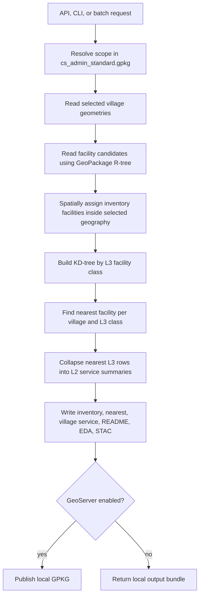

# Facilities Local Pipeline

This package replaces the older GEE export path with a local GPKG/admin
pipeline:



The pipeline reads the facility GeoPackage directly through SQLite and never
loads all 4M+ facility rows for one request.

## Request Body

The API accepts the old body:

```json
{"state": "MADHYA PRADESH", "district": "DAMOH", "block": "HATTA"}
```

It also accepts the structured body used by the local pipeline:

```json
{
  "scope": {
    "level": "tehsil",
    "state_name": "MADHYA PRADESH",
    "district_name": "DAMOH",
    "tehsil_name": "HATTA"
  },
  "outputs": {"mode": "focused"},
  "publish": {"sync_to_geoserver": true}
}
```

`focused` is the default API mode and still publishes to GeoServer unless
`publish.sync_to_geoserver` or `outputs.geoserver` is set to `false`.

## Output Modes

- `focused`: compact village-service GPKG plus focused and Excel-ready CSVs.
- `all`: inventory, nearest L3, village service, focused CSVs, methodology, EDA, STAC, and GPKG layers.
- `excel`: focused CSV only.
- `metadata`: run metadata only.
- `methodology`: documentation-oriented output.

The L3-to-L2 access grouping and `min`/`max`/`direct` rollup decisions are
tracked in `facility_classifications.yaml`.
