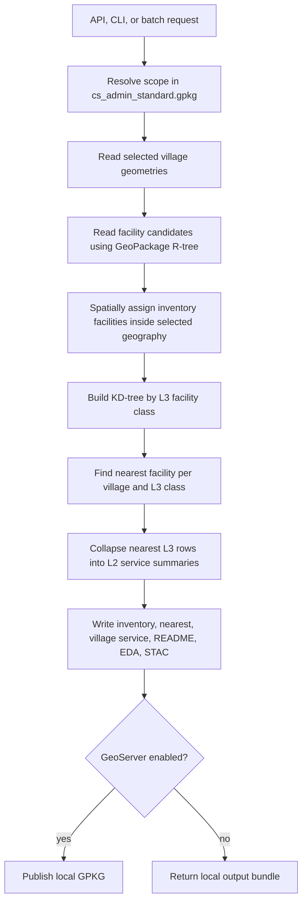

# Facilities Local Pipeline

This package replaces the older GEE export path with a local GPKG/admin
pipeline:

The pipeline reads the facility GeoPackage directly through SQLite and never
loads all 4M+ facility rows for one request.
