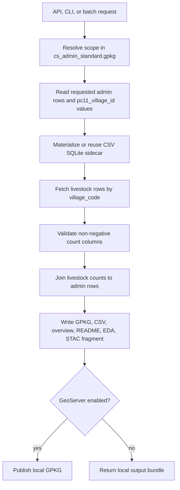

# Livestock Local Pipeline

This package replaces the older precomputed-GPKG clipping path with a keyed
runtime join:

The large source CSV and generated SQLite sidecar remain under ignored `data/`.
