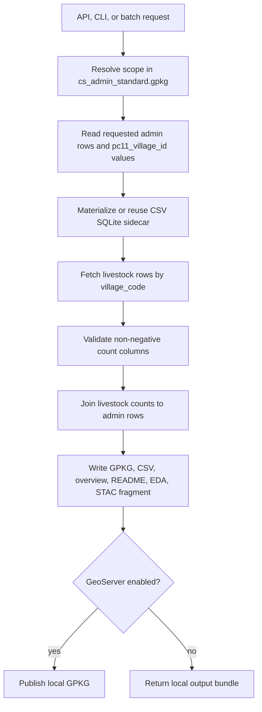

# Livestock Local Pipeline

The Department of Animal Husbandry & Dairying under Ministry of Fisheries, Animal Husbandry & Dairying attributes critical importance to livestock and to the collection and availability of up-to-date and accurate data related to livestock, as they are the vital component of rural economy. For proper planning and formulation of any programme meant for bringing further improvement in this sector and its effective implementation and monitoring, valid data are required at every decision making stage.

The Livestock Census is the main source of such data in the country. The livestock census is conducted across the country periodically since 1919. The census usually covers all domesticated animals and head counts of these animals are taken. So far, 19 Livestock Censuses were conducted in participation with State Governments and UT Administrations. The 20th Livestock Census was launched during the month of October, 2018. The enumeration was done in both rural and urban areas. Various species of animals (cattle, buffalo, mithun, yak, sheep, goat, pig, horse, pony, mule, donkey, camel, dog, rabbit and elephant)/poultry birds (fowl, duck and other poultry birds) possessed by the households, household enterprises/non-household enterprises were counted at that site. Another important feature of 20th Livestock Census is it has been designed to capture Breed-wise number of animals and poultry birds.

For the first time, livestock data were collected on line in 20th Livestock Census. Advance technology has been adopted to collect data through tablet computers. The National Informatics Centre, Ministry of Electronics & IT has developed Android based mobile application for data collection with various features such as data entry module to facilitate recording the data on tablets, web-based work application, local government directory codes etc. The data captured by the enumerators have been verified through proper data checking process carried out by the supervisors through webbased programmes. Besides the initial scrutiny, another level of validation of data was also carried out with the help of a separate web-based data validation programme in which supervisors were allowed to correct any wrong entry.

The Animal Husbandry Departments of States/UTs have been entrusted to conduct the field operations. In the 20th Livestock Census, the data were collected and scrutinised mostly by para-veterinarians and veterinarians. In this whole Census operations more than 80,000 field staff were deployed for smooth conduct of 20th Livestock Census. Training was an important component for 20th Livestock Census as for the first time field staff were required to operate tablet computers for such massive census operations. Training was conducted at various levels starting from “All India Training Workshop for Trainers” at Delhi, followed by State, District level trainings. Apart from training, Training Manual, Tutorial video, online e-learning classes etc. have been arranged.

The 20th Livestock Census was carried out in about 6.6 lakhs villages and 89 thousand urban wards across the country covering more than 27 Crores of Households and Non Households.
Key Results

Some of the key outcomes of the 20th Livestock Census is summarised below:

    The total Livestock population is 536.76 million in the country showing an increase of 4.8% over Livestock Census 2012
    Total Bovine population (Cattle, Buffalo, Mithun and Yak) is 303.76 Million in 2019 which shows an increase of 1.3 % over the previous census.
    The total number of cattle in the country is 193.46 million in 2019 showing an increase of 1.3 % over previous Census.
    The Female Cattle (Cows population) is 145.91 million, increased by 18.6% over the previous census (2012).
    The Exotic/Crossbred and Indigenous/Non-descript Cattle population in the country is 51.36 million and 142.11 million respectively.
    The Indigenous/Non-descript female cattle population has increased by 10% in 2019 as compared to previous census.
    The population of the total Exotic/Crossbred Cattle has increased by 29.3 % in 2019 as compared to previous census.
    There is a decline of 6 % in the total Indigenous (both descript and non-descript) Cattle population over the previous census. However, the pace of decline of Indigenous Cattle population during 2012-2019 is much lesser as compared to 2007-12 which was about 9%.
    The total buffaloes in the country is 109.85 Million showing an increase of about 1.1% over previous Census.
    The total milch animals (in-milk and dry) in cows and buffaloes is 125.75 Million, an increase of 6.0 % over the previous census.
    The total sheep in the country is 74.26 Million in 2019, increased by 14.1% over previous Census.
    The Goat population in the country in 2019 is 148.88 Million showing an increase of 10.1% over the previous census.
    The total Pigs in the country is 9.06 Million in the current Census, declined by 12.03% over the previous Census.
    The total Mithun in the country is 3.9 Lakhs in 2019, increased by 30.0% over previous Census.
    The total Yak in the country is Fifty Eight Thousand in 2019, decreased by 24.9% over previous Census.
    The total Horses and Ponies in the country is 3.4 Lakhs in 2019, decreased by 45.2% over previous Census.
    The total population of Mules in the country is Eighty Four Thousand in 2019, decreased by 57.1% over previous Census.
    The total population of Donkeys in the country is 1.2 Lakhs in 2019, decreased by 61.2% over previous Census.
    The total Camel population in the country is 2.5 Lakhs in 2019, decreased by 37.1% over previous Census.
    The total Poultry in the country is 851.81 Million in 2019, increased by 16.8% over previous Census.
    The total Backyard Poultry in the country is 317.07 Million in 2019, increased by 45.8% over previous Census.
    The total Commercial Poultry in the country is 534.74 Million in 2019, increased by 4.5% over previous Census.
    In 20th Livestock Census, distribution of livestock population is as follows - 36.04%-Cattle, 27.74%-Goat, 20.47%-Buffaloes, 13.83%-Sheep, 1.69%-Pigs.
    Mithun, Yaks, Horses, Ponies, Mules, Donkeys and Camels taken together contribute 0.23% of the total livestock.
    As compare to previous census the percentage share of sheep and goat population has increased whereas the percentage share of cattle, buffalo and pig has marginally declined.

Livestock Population - Major Species
Category	Population (In million) 2012	Population (In million) 2019	% growth
Cattle	190.90	193.46	1.34
Buffalo	108.70	109.85	1.06
Sheep	65.07	74.26	14.13
Goat	135.17	148.88	10.14
Pig	10.29	9.06	-12.03
Mithun	0.30	0.39	29.52
Yak	0.08	0.06	-24.90
Horses & Ponics	0.63	0.34	-45.22
Mule	0.20	0.08	-57.09
Donkey	0.32	0.12	-61.23
Camel	0.40	

0.25
	-37.05
Total Livestock	512.06	536.76	4.82

Livestock Population - Major Species During 2007 to 2019
Species	Population (In million) 2007	Population (In million) 2012	Population (In million) 2019
Cattle	199.08	190.9	193.46
Buffaloes	105.34	108.7	109.85
Sheep	71.56	65.07	74.26
Goats	14.054	135.17	148.88
Pigs	11.13	10.29	9.06
Mithun	0.26	0.30	0.39
Yaks	0.08	0.08	0.06
Horses & ponies	0.61	0.63	0.34
Mules	0.14	0.2	0.08
Donkeys	0.44	0.32	0.12
Camels	0.52	0.4	0.25
Total Livestock	529.70	512.06	536.76

The large source CSV and generated SQLite sidecar remain under ignored `data/`.

## Runtime Schema

`livestocks_schema.yaml` defines the report-facing livestock hierarchy:

- large animals: cattle, buffalo
- small animals: sheep, goat, pig
- derived totals: `large_animals_total`, `small_animals_total`, and `all_livestock_total`

