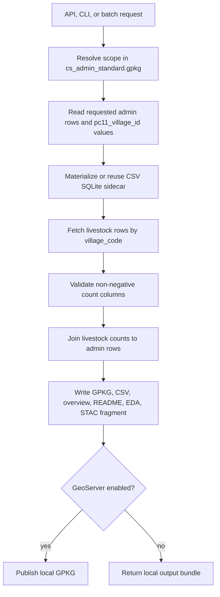

# Livestock Local Pipeline

This package replaces the older precomputed-GPKG clipping path with a keyed
runtime join:

The large source CSV and generated SQLite sidecar remain under ignored `data/`.

## Runtime Schema

`livestocks_schema.yaml` defines the report-facing livestock hierarchy:

- large animals: cattle, buffalo
- small animals: sheep, goat, pig
- derived totals: `large_animals_total`, `small_animals_total`, and `all_livestock_total`

The sidecar stores only `village_code` plus male/female count columns. Species
totals and group totals are derived during the pipeline run, which keeps the
indexed sidecar smaller and easier to audit.

## Output Modes

- `focused`: default API mode. Writes a compact village-service GPKG and focused/Excel-ready CSVs.
- `all`: includes verbose CSV, overview, focused CSVs, GPKG, README, EDA, and STAC.
- `excel`: writes only the focused Excel/report CSV.
- `metadata`: writes run metadata only.

Focused rows keep compact admin columns, a `livestock_status` marker, and only
the metrics useful for report ingestion.
