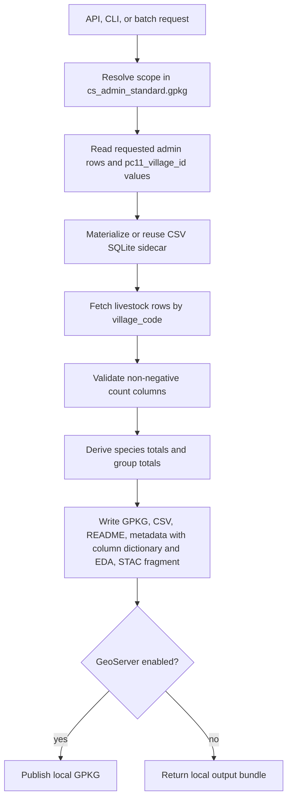

# 20th Livestock Census (2019) Village Dataset

## Why Livestock Data Matters

The Department of Animal Husbandry & Dairying (DAHD), under the Ministry of
Fisheries, Animal Husbandry & Dairying, attributes critical importance to
livestock and to the collection of up-to-date and accurate livestock data,
because livestock are a vital component of the rural economy. Animals are
working capital, savings, insurance against crop failure, a daily income
stream through milk, and a livelihood base for landless and marginal
households. For planning and formulating any programme meant to improve this
sector — and for its effective implementation and monitoring — valid data are
required at every decision-making stage.

For Core Stack ([core-stack.org](https://core-stack.org)) this dataset
complements the land, water, and facilities layers: grazing pressure relates
to commons and watershed health, livestock water demand matters for water
budgeting, and dairy potential depends on the support infrastructure mapped
in the facilities dataset.

## How the Census Was Conducted

The Livestock Census is the main source of such data in the country and has
been conducted periodically since 1919. It covers all domesticated animals by
headcount. Nineteen censuses had been completed in participation with State
Governments and UT Administrations before the 20th Livestock Census was
launched in October 2018, enumerating both rural and urban areas. Species
counted include cattle, buffalo, mithun, yak, sheep, goat, pig, horse, pony,
mule, donkey, camel, dog, rabbit and elephant, plus poultry birds (fowl,
duck, and others) held by households and enterprises. The 20th census was
also the first designed to capture breed-wise counts.

Several features of the 20th census make it unusually reliable:

- **Digital-first collection.** For the first time, data were collected
  online through tablet computers, using an Android application developed by
  the National Informatics Centre with data-entry modules, web-based work
  monitoring, and Local Government Directory codes.
- **Layered validation.** Data captured by enumerators were verified by
  supervisors through web-based programmes; a separate web-based validation
  programme allowed supervisors to correct wrong entries after initial
  scrutiny.
- **Trained field force.** State/UT Animal Husbandry Departments conducted
  the field operations, with data collected and scrutinised mostly by
  para-veterinarians and veterinarians — more than 80,000 field staff overall,
  trained through a national workshop, state and district trainings, manuals,
  tutorial videos, and e-learning classes.
- **Scale.** About 6.6 lakh villages and 89 thousand urban wards were
  covered, spanning more than 27 crore households and non-household premises.

## Key National Results

- Total livestock population: **536.76 million**, up 4.8% over the 2012 census.
- Total bovines (cattle, buffalo, mithun, yak): 303.76 million (+1.3%).
- Cattle: 193.46 million (+1.3%); female cattle (cows) 145.91 million (+18.6%).
- Exotic/crossbred cattle 51.36 million (+29.3%); indigenous/non-descript
  cattle 142.11 million. Total indigenous cattle declined 6%, a much slower
  decline than the ~9% of 2007–12.
- Buffalo: 109.85 million (+1.1%); total milch animals (in-milk and dry cows
  and buffaloes) 125.75 million (+6.0%).
- Sheep: 74.26 million (+14.1%). Goat: 148.88 million (+10.1%).
  Pig: 9.06 million (−12.03%).
- Mithun +30.0%, yak −24.9%, horses & ponies −45.2%, mules −57.1%,
  donkeys −61.2%, camels −37.1% — the working- and pack-animal decline is one
  of the census's clearest structural signals.
- Poultry: 851.81 million (+16.8%), of which backyard poultry 317.07 million
  (+45.8%) and commercial poultry 534.74 million (+4.5%).
- Species shares of total livestock: cattle 36.04%, goat 27.74%, buffalo
  20.47%, sheep 13.83%, pig 1.69%; mithun, yak, horses, ponies, mules,
  donkeys and camels together 0.23%. Sheep and goat shares grew while cattle,
  buffalo and pig shares marginally declined.

### Major Species, 2007–2019 (millions)

| Species | 2007 | 2012 | 2019 | Growth 2012–19 |
| --- | ---: | ---: | ---: | ---: |
| Cattle | 199.08 | 190.90 | 193.46 | +1.34% |
| Buffalo | 105.34 | 108.70 | 109.85 | +1.06% |
| Sheep | 71.56 | 65.07 | 74.26 | +14.13% |
| Goat | 140.54 | 135.17 | 148.88 | +10.14% |
| Pig | 11.13 | 10.29 | 9.06 | −12.03% |
| Mithun | 0.26 | 0.30 | 0.39 | +29.52% |
| Yak | 0.08 | 0.08 | 0.06 | −24.90% |
| Horses & ponies | 0.61 | 0.63 | 0.34 | −45.22% |
| Mule | 0.14 | 0.20 | 0.08 | −57.09% |
| Donkey | 0.44 | 0.32 | 0.12 | −61.23% |
| Camel | 0.52 | 0.40 | 0.25 | −37.05% |
| **Total livestock** | **529.70** | **512.06** | **536.76** | **+4.82%** |

## What We Did With It

The official village/ward-level release —
[VillageAndWardLevelDataMale-Female.xlsx](https://dahd.gov.in/sites/default/files/2023-07/VillageAndWardLevelDataMale-Female.xlsx)
(dahd.gov.in) — publishes male and female headcounts per village for the five
species reported at village level: **cattle, buffalo, sheep, goat, and pig**.
We standardized it into `cs_livestock_census_20.csv` keyed by the census
village code, and this pipeline joins it at runtime to the Core Stack
standard admin boundary (`pc11_village_id` ↔ `village_code`).

Presentation decisions, all encoded in `livestocks_schema.yaml`:

- **Totals are derived, not stored.** The sidecar keeps only the village key
  and male/female counts; species totals and group totals are computed during
  each run, which keeps the indexed sidecar small and auditable.
- **Large vs small animals.** Cattle and buffalo (large animals) represent
  dairy and draught capital with high per-head value and high feed/water
  demand; sheep, goat, and pig (small animals) are shorter-cycle, more liquid
  assets that often matter most for landless and marginal households. The
  derived `large_animals_total`, `small_animals_total`, and
  `all_livestock_total` make these two economies visible at a glance.
- **The report CSV keeps totals only** in a fixed, human-readable order:
  admin columns, `livestock_status`, then `all_livestock_total`,
  `large_animals_total`, `cattle_total`, `buffalo_total`,
  `small_animals_total`, `sheep_total`, `goat_total`, `pig_total`.
- **The GeoPackage and GeoServer layer keep female and male counts alongside
  each animal total**, in the same order, for sex-ratio and herd-composition
  analysis (female share signals dairy orientation for cattle and buffalo).

## What You Can Do With It

- Compare livestock dependence across villages of a block before planning
  fodder, water, or veterinary interventions.
- Pair with the facilities proximity dataset: villages with high
  `large_animals_total` but distant dairy/animal-husbandry support are
  candidate sites for milk routes, chilling points, or veterinary outreach.
- Pair with Antyodaya categories: high common pastures with low livestock
  services, or high livestock counts with low financial inclusion, frame
  concrete field questions about credit, insurance, and market linkage.
- Use small-animal concentrations to target livelihood programmes for
  landless and marginal households.
- Feed `all_livestock_total` into village water-budget estimates.

## Use with Caution

- Counts are a **2019 snapshot**; herds change with drought, disease, and
  markets.
- Villages without a matching census `village_code` remain in outputs with
  the status `no data available for this village` — absence of a join is not
  evidence of zero livestock.
- Headcounts say nothing about productivity, breed, or animal health.
- Village-level poultry counts are not part of this per-village release.

## How the Runtime Pipeline Works



The large source CSV and generated SQLite sidecar remain under ignored
`data/`.

## Output Structure

| Artifact | Contents |
| --- | --- |
| `<layer>.csv` | Report CSV with admin columns, `livestock_status`, and animal totals in the fixed order above. |
| `<layer>.gpkg` | Village geometries with totals plus female/male counts interleaved per animal. |
| `README.md` | Run summary with a column reference table (column, type, description). |
| `<layer>.run_metadata.json` | Request, effective outputs, per-output column dictionary (`column`, `description`, `datatype`) and EDA summary. |
| `<layer>.stac_fragment.json` | STAC item fragment for catalog integration. |
| GeoServer layer | Published from the GPKG when enabled. |

The `livestock_status` column sits right after the admin columns in every
output and records data availability per village: `matched`,
`no village id available`, or `no data available for this village`. It is
configured under `output_contract.status_column` in the pipeline YAML and can
be dropped from any artifact by removing that output from its `outputs` list.

## Running It

```bash
# API (Django + celery running)
POST /api/v1/generate_livestocks/
{"scope": {"level": "tehsil", "state_name": "Jharkhand",
           "district_name": "Ranchi", "tehsil_name": "Angara"},
 "publish": {"sync_to_geoserver": false}}

# CLI
python -m computing.misc.livestocks --state Jharkhand --district Ranchi --tehsil Angara --no-geoserver

# Batch
python -m computing.misc.livestocks --request-file requests.yaml
```

## Source

- Official village/ward release: <https://dahd.gov.in/sites/default/files/2023-07/VillageAndWardLevelDataMale-Female.xlsx>
- 20th Livestock Census, Department of Animal Husbandry & Dairying,
  Government of India (2019).
