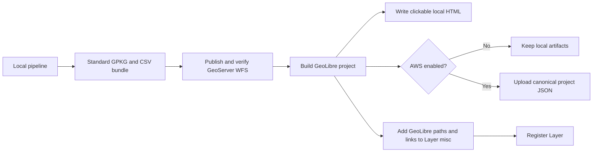

# GeoLibre integration for local pipelines

## Outcome

Every facilities, Mission Antyodaya, or livestock run that successfully
publishes a GeoPackage to GeoServer now creates a GeoLibre project before the
layer is registered. The default adds two small local artifacts:

- `<layer>.geolibre.json`: a reusable GeoLibre project containing live WFS
  references, styles, the computed map view, and provenance;
- `<layer>.geolibre.html`: a directly clickable browser page that embeds the
  project through GeoLibre's supported postMessage bridge.

No features are copied into these files. GeoServer remains the data source, so
the same project can be opened locally, hosted by Core Stack, or uploaded as one
small S3 object.

The adapter is pinned to [opengeos/GeoLibre](https://github.com/opengeos/GeoLibre)
commit `217a600725d35cf42692a5010b3e4e76f5331c06` (verified 2026-07-12) and project
format `0.2.0`. GeoLibre currently provides WFS loading, identify/attributes,
styling, in-app vector editing, and export. Edits can be exported; persistent
write-back to a GeoServer WFS source is not currently promised by upstream.

## Runtime position



GeoLibre is presentation/discovery infrastructure, so its local or AWS failure
does not delete valid pipeline/GeoServer outputs. A failure is returned as a
structured `geolibre.status` and registration continues with that status.

## API

Local GeoLibre output is on by default; the simple request remains unchanged:

```json
{
  "state": "gujarat",
  "district": "banas kantha",
  "block": "palanpur"
}
```

Disable it explicitly with `"outputs": {"geolibre": false}`.

To show all matching GeoServer layers for the requested tehsil:

```json
{
  "state": "gujarat",
  "district": "banas kantha",
  "block": "palanpur",
  "include_tehsil_layers": true
}
```

The structured form exposes bounded experiments without expanding `api.py`:

```json
{
  "scope": {
    "level": "tehsil",
    "state_name": "gujarat",
    "district_name": "banas kantha",
    "tehsil_name": "palanpur"
  },
  "outputs": {"geolibre": true},
  "geolibre": {
    "include_tehsil_layers": true,
    "max_layers": 25,
    "refresh_interval_seconds": 0
  }
}
```

Same-scope discovery reads WFS GetCapabilities and suffix-matches the existing
Core Stack layer convention. The current layer is always first; discovery is
capped at 100 even if a request asks for more.

## Output and registration contract

The pipeline result adds:

```json
{
  "geolibre_project_path": "/.../facilities_banas_kantha_palanpur.geolibre.json",
  "geolibre_html_path": "/.../facilities_banas_kantha_palanpur.geolibre.html",
  "geolibre": {
    "ok": true,
    "status": "created",
    "local_viewer_url": "file:///.../facilities_banas_kantha_palanpur.geolibre.html",
    "viewer_url": null,
    "layer_count": 3,
    "layers": [
      "testworkspace:facilities_banas_kantha_palanpur",
      "testworkspace:antyodaya20_banas_kantha_palanpur",
      "testworkspace:livestocks_banas_kantha_palanpur"
    ]
  }
}
```

`Layer.misc` receives the compact status, local paths/link, optional public
viewer link and S3 URI, and selected layer count. The canonical registered
`asset_id` stays the GeoServer WFS URL.

## Optional AWS publication

AWS is disabled until the team supplies a dedicated bucket and server-side
credentials. Configure the destination in trusted pipeline/server config:

```json
{
  "geolibre": {
    "aws": {
      "enabled": true,
      "bucket": "corestack-geolibre",
      "prefix": "geolibre/projects",
      "region": "ap-south-1",
      "public_base_url": "https://maps.example.org"
    }
  }
}
```

The normal boto3 environment/instance-role credential chain is used. Credentials
must not appear in API bodies or repo files. The default uploads only the
canonical `.geolibre.json`; its stable scope key is overwritten on reruns rather
than creating redundant copies. `public_base_url` should point to the bucket or
CloudFront origin and is required to return a public GeoLibre viewer URL.

Once configured, an API caller may only toggle `"publish_to_aws": true` (or
`"geolibre": {"aws": {"enabled": true}}`). Bucket, prefix, region, endpoint,
and public base URL from a request are ignored so callers cannot redirect
server-side writes.

`upload_html: true` is experimental and adds the standalone HTML object. It is
off by default because the project JSON plus hosted viewer already provides the
same map.

## Output experiments

| Mode | Default | Decision |
|---|---:|---|
| Local project JSON | Yes | Canonical portable project |
| Local clickable HTML | Yes | Best zero-server developer/team demo |
| Current layer only | Yes | Fastest and least surprising |
| All tehsil layers | No | Useful comparison, bounded and opt-in |
| Automatic WFS refresh | No | Opt-in for changing layers |
| S3 project JSON | No | Preferred public hosting once credentials exist |
| S3 standalone HTML | No | Small but duplicates the project manifest |
| Embedded feature data | No | Rejected as redundant with GeoServer |
| WMS-only project | No | Lighter rendering but weaker attribute/export flow |
| GeoLibre Share API | No | Requires a separate user token and ownership model |
| Self-hosted GeoLibre app | No | Team deployment decision, independent of adapter |

Prototype new GeoLibre outputs as optional. Compare load time, file size,
attribute behavior, browser support, editing/export flow, and hosting cost before
promoting any mode to default.

## Verified Palanpur demo

The live test used the existing facilities output directory under
`data/tests/outputs/facilities/gujarat/banas_kantha/palanpur/`.

- WFS CORS response: `Access-Control-Allow-Origin: *` for the GeoLibre origin.
- Discovered layers: facilities, Antyodaya 2020, and livestock.
- Computed view: center `[72.42385708, 24.20409023]`, zoom `8.57`, with the
  union WGS84 bounding box from GeoServer capabilities.
- Browser result: Chrome loaded GeoLibre, rendered village polygons, listed all
  three layers, and exposed the live style/layer controls.
- Local artifact sizes in this three-layer demo: about 7.1 KB JSON and 6.4 KB
  HTML; feature data remained in GeoServer.

Generated demo files remain under ignored `data/` and are not branch content.

## Maintenance

Keep personal GeoLibre audit skills local-only and excluded from Git. At each
review:

1. Fetch official GeoLibre source and record its exact commit/date.
2. Compare project version, standalone HTML bridge, URL-backed vector restore,
   WFS behavior, and editing/export claims.
3. Update adapter constants only after focused unit, live WFS, and browser tests.
4. Keep the compatibility snapshot in the skill reference current.
5. Keep generated demos and credentials out of git.
