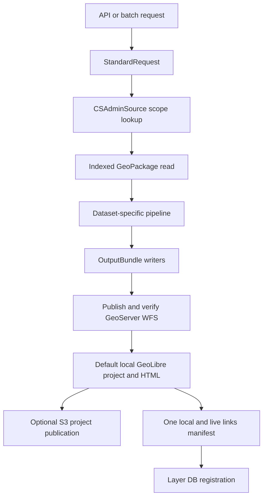

# Local Pipeline Core

Shared helpers for fast local geospatial pipelines in `computing/misc`.

The core package keeps reusable mechanics separate from dataset-specific
pipelines:

- SQLite-backed GeoPackage inspection, filtered reads, and first-run indexes.
- Standard admin scope resolution from `cs_admin_standard.gpkg`.
- CSV-to-SQLite sidecars for repeated keyed lookups.
- Standard request parsing for API, CLI, and batch execution.
- Standard output bundle writers for Unicode-normalized GPKG, README, run
  metadata (column descriptions, optional rename mappings, and EDA), and one
  JSON links manifest.
- GeoLibre projects and clickable HTML maps backed by live GeoServer WFS
  layers, with optional non-redundant S3 publication.

Runtime scripts in `computing/misc` should not use `pyogrio`. This package reads
GeoPackage rows through SQLite and writes GeoPackages through GeoPandas/Fiona.

See [GEOLIBRE_INTEGRATION.md](GEOLIBRE_INTEGRATION.md) for the API contract,
artifact choices, AWS boundary, live demo evidence, and upstream-update process.
