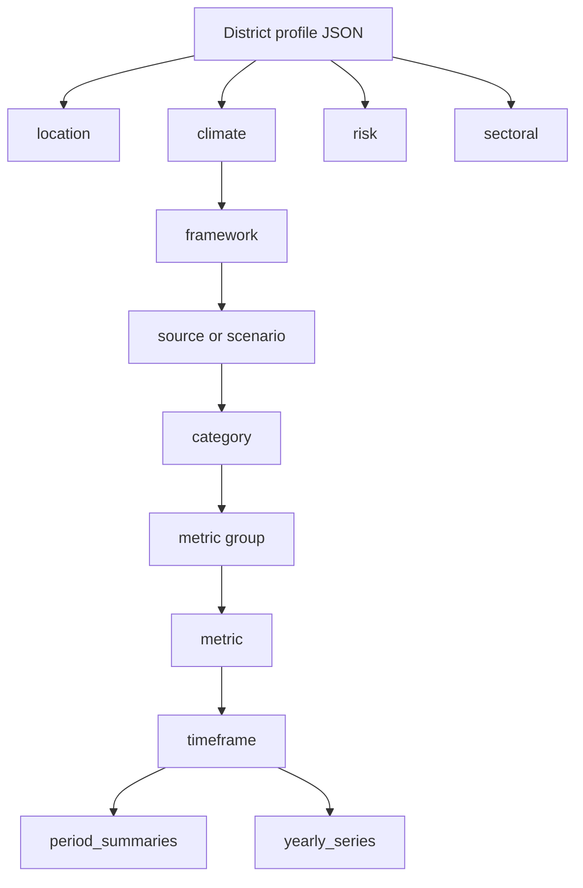
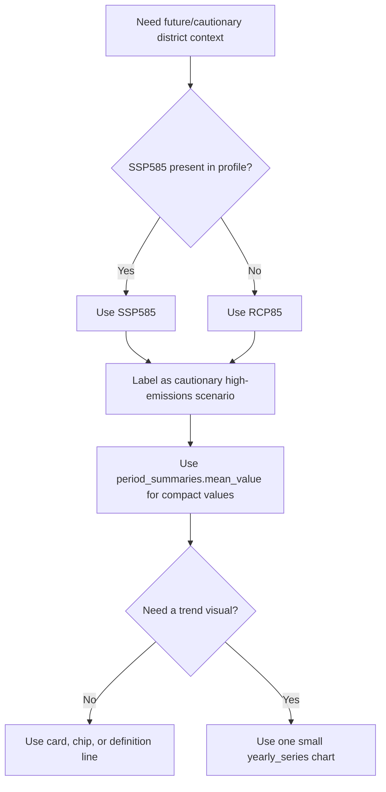
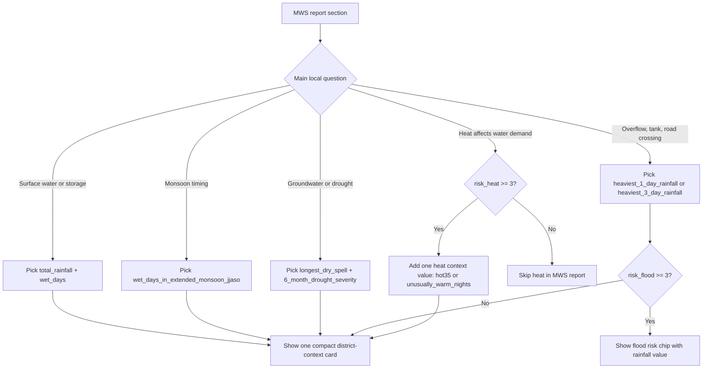
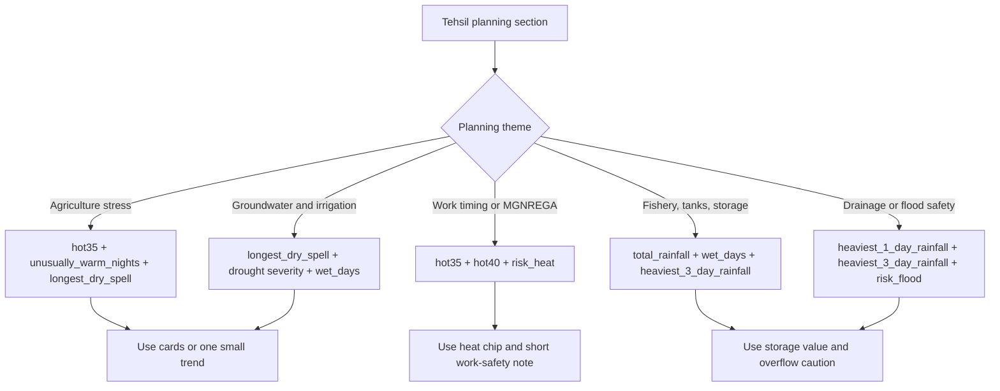
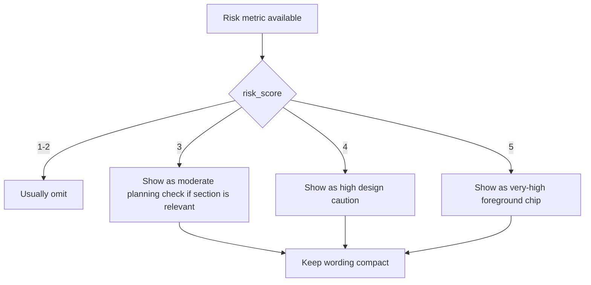
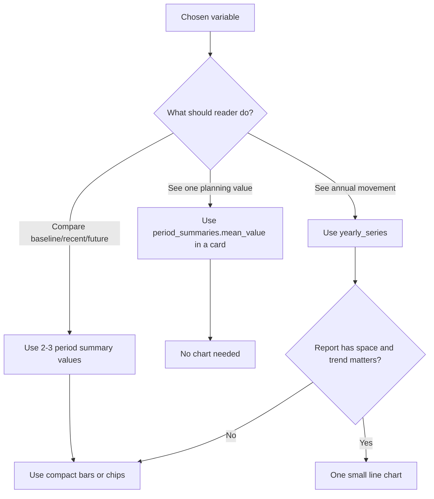

# CEEW/CRAVIS Dataset Structure Guide

This guide explains the cleaned CEEW/CRAVIS district dataset in plain words. Keep `data/ceew_cravis/docs/ceew_methodology.md` as the main methodology reference. Use this file when you need to quickly understand what the profile files contain, what a value means, and how it can be shown in Core-Stack reports.

## One Minute Version

Each district profile is a district-level climate and risk context file. It is not raw daily climate data. It contains already-prepared district metrics such as rainfall, wet days, hot days, dry spells, drought severity, warm nights, and risk scores.

Climate metrics are stored as yearly time series. Each climate metric also has period summaries, which are the best values for maps, cards, and short report inserts.

Risk metrics are scalar district scores from 1 to 5. Use them only as compact context, especially when the score is moderate or higher.

For tehsil, MWS, block, or village reports, CEEW values must be labelled as district-level context. They should add a number, definition, or small visual at the right place. They should not become a separate climate interpretation section.

## Main Files

| File | What it is for |
| --- | --- |
| `data/ceew_cravis/output/district_profiles/{state}/{district}/{state}_{district}_profile.json` | The actual district values. |
| `data/ceew_cravis/output/district_profiles/{state}/{district}/{state}_{district}_metadata_config.json` | Labels, units, legends, source notes, and display metadata. |
| `data/ceew_cravis/docs/ceew_climate_metrics_detailed.csv` | One row per climate metric: type, units, frequency, source, meaning, report location, display guidance, and profile path. |
| `data/ceew_cravis/docs/ceew_data_report_integration_schema.yaml` | Compact machine-readable contract for report integration. |
| `data/ceew_cravis/docs/district_profile_schema.yaml` | Human-readable shape of the district profile JSON. |
| `data/ceew_cravis/docs/ceew_dataset_glossary.md` | Longer glossary and climate metric explanations. |

## District Profile Shape



Top-level sections:

| Section | Data shape | What it means |
| --- | --- | --- |
| `location` | District identifiers | State, district, zonal id, aliases. |
| `climate` | Nested time-series metrics | Observed and projected district climate metrics. |
| `risk` | Scalar district scores | Risk index and risk score for hazards such as heat, flood, lightning, forest fire, cyclone, and landslide. |
| `sectoral` | Zonal observations and point features | Extra district observations and location features. Most are not used in compact report integration. |

## How To Read A Climate Path

The climate path follows this idea:

```text
climate.{framework}.{scenario_or_source}.{category}.{metric_group?}.{metric}.{timeframe}
```

Example:

```text
climate.rcpssp.RCP85.precipitation.derived_metrics.wet_days_in_extended_monsoon_jjaso.annual
```

This means:

| Part | Meaning |
| --- | --- |
| `climate` | Climate section of the district profile. |
| `rcpssp` | Climate branch organised by IMD observations and RCP/SSP-style scenarios. |
| `RCP85` | High-emissions cautionary scenario used when SSP585 is not present in the profile. |
| `precipitation` | Rainfall category. |
| `derived_metrics` | Metric computed from rainfall series, not a simple raw rainfall total. |
| `wet_days_in_extended_monsoon_jjaso` | Number of wet days during June to October. |
| `annual` | One value per year. |

## Climate Frameworks And Scenarios

| Term | Meaning | How to use |
| --- | --- | --- |
| `imd` | Observed IMD data. | Use for historical observed context. |
| `scenario` | Modeled future pathway in `yearly_series`. | Use for future charts only when needed. |
| `rcpssp` | Branch organised around IMD, RCP, and SSP-style scenarios. | Main branch for period comparisons. |
| `RCP45` | Medium emissions pathway. | Use when the report needs a less severe scenario. |
| `RCP85` | High emissions pathway. | Use as cautionary scenario when SSP585 is not in the generated profile. |
| `SSP585` | Shared Socioeconomic Pathway 5-8.5. | Preferred cautionary scenario when present. |
| `globalWarming` | Branch organised by warming levels such as 1 C, 1.5 C, 2 C, and 3 C. | Useful for warming-level comparisons. |

## Timeframes And Seasons

| Code | Meaning |
| --- | --- |
| `annual` | Full year value. |
| `winter_JF` | January-February. |
| `summer_MAM` | March-April-May. |
| `monsoon_JJAS` | June-July-August-September. |
| `post_monsoon_OND` | October-November-December. |
| `JJASO` | June-July-August-September-October. Used by extended monsoon wet days. |
| `january` to `december` | Monthly components. |

Temperature metrics and total rainfall have annual, seasonal, and monthly components. Most other derived metrics are annual.

## The Climate Data Object

Every climate metric leaf has this shape:

```text
period_summaries: compact period values
yearly_series: annual values by year
```

### `yearly_series`

This is the annual time series.

| Field | Meaning |
| --- | --- |
| `imd` | Observed annual values. In current sample profiles, this usually runs from 1981 to 2024. |
| `scenario` | Modeled scenario annual values. In current sample profiles, this usually runs from 2006 to 2099. |

Use `yearly_series` for a small line chart when a trend is central to the report section. Do not load or show full yearly series when a single period value is enough.

### `period_summaries`

These are compact summaries for named periods. They are the best choice for maps, cards, and short report values.

| Field | Meaning | Best use |
| --- | --- | --- |
| `period_key` | Name of the period, such as `1981-2010`, `2011-2024`, `2031-2050`, or `2051-2070`. | Labelling the value. |
| `mean_value` | Average value across the period. | Main map/card/statistic value. |
| `min_value` | Lowest annual value inside the period. | Range or caveat. |
| `min_year` | Year in which the lowest value occurred. | Tooltip or detailed note. |
| `max_value` | Highest annual value inside the period. | Range or caveat. |
| `max_year` | Year in which the highest value occurred. | Tooltip or detailed note. |
| `delta_value` | Supplied trend-style or change value for the period. | Use only with careful label: trend/change field. Do not call it a simple future-minus-baseline difference unless separately verified. |

## Metric Families

The current climate catalog has 25 metric families.

| Family | Metrics | Data available |
| --- | --- | --- |
| Temperature baselines | `maximum_temperature`, `minimum_temperature`, `average_temperature` | Time series and period summaries for annual, seasonal, and monthly timeframes. |
| Precipitation baseline | `total_rainfall` | Time series and period summaries for annual, seasonal, and monthly timeframes. |
| Precipitation reliability | `wet_days`, `wet_days_in_extended_monsoon_jjaso` | Annual time series and period summaries. |
| Precipitation extremes and drought | `unusually_heavy_rainy_days`, `unusually_very_heavy_rainy_days`, `heaviest_1_day_rainfall`, `heaviest_3_day_rainfall`, `heaviest_3_month_rainfall`, `longest_dry_spell`, `6_month_drought_severity` | Annual time series and period summaries. |
| Hot weather | `days_with_maximum_temperature_greater_than_35c`, `days_with_maximum_temperature_greater_than_40c`, `days_with_minimum_temperature_greater_than_20c`, `days_with_minimum_temperature_greater_than_25c`, `cooling_degree_days`, `average_day_night_temperature_difference`, `highest_maximum_temperature_in_a_year`, `unusually_hot_days`, `unusually_warm_nights` | Annual time series and period summaries. |
| Cold weather | `heating_degree_days`, `unusually_cold_days`, `unusually_cold_nights` | Annual time series and period summaries. |

For row-level detail, use `data/ceew_cravis/docs/ceew_climate_metrics_detailed.csv`. Its columns are:

```text
variable_name, type, units, frequency, source, description, report_location_if_any, display_guidance, path
```

## What The Units Mean

| Unit | Meaning |
| --- | --- |
| `degC` | Degrees Celsius. Used for temperature values. |
| `mm` | Millimetres of rainfall. |
| `days` | Count of days in a year or season. |
| `degree-days` | Cumulative temperature demand above or below a base threshold. Used for cooling/heating demand. |
| `normalized index` | Index value, used by the 6-month drought severity metric. |
| `risk_score` | Hazard score from 1 to 5. |

## Risk Data

Risk lives directly under `risk` in the district profile.

```text
risk.risk_heat
risk.risk_flood
risk.risk_cyclone
risk.risk_lightning
risk.risk_forest_fire
risk.risk_landslide
```

Each risk record can contain:

| Field | Meaning |
| --- | --- |
| `risk_score` | Score from 1 to 5. |
| `risk_index` | Label such as very low, low, moderate, high, or very high. |
| `categories` | Extra source category values. |

Use risk as a compact chip or statistic. A good default gate is to show risk when `risk_score >= 3`, or when the report section already talks about that hazard.

## Sectoral Data

Sectoral data contains extra observations and point features. For the current report strategy:

- Do not use point features.
- Do not use agriculture crop, LULC forest, or population layers as CEEW report insertions.
- Selected zonal observations can be used only when they directly support an existing section, such as flood susceptibility, lightning days, landslide counts, forest-fire frequency, or water-related observations.

## Report Use Strategy

The new report strategy is compact.

Use CEEW district data as district context only. Add values where they naturally belong. Do not write long climate interpretations from the district profile. Do not create a separate climate section unless a report specifically asks for it.

Good forms:

- one value with unit
- small card
- risk chip
- short definition line
- one small time-series chart, only when the section needs a trend
- map value for district or pan-India views

Avoid:

- tables inside reports
- long interpretation paragraphs
- point features
- treating district values as tehsil, village, or MWS measurements
- using annual rainfall alone to claim drought or flood

## Where Values Fit In Reports

| Existing report topic | Best CEEW values | Good form |
| --- | --- | --- |
| Water balance, surface water, storage | `total_rainfall`, `wet_days`, `wet_days_in_extended_monsoon_jjaso` | Small statistic or definition line. |
| Drought, groundwater, irrigation risk | `longest_dry_spell`, `6_month_drought_severity`, `wet_days` | Small statistic or compact caution value. |
| Drainage, overflow, road crossings, tanks | `heaviest_1_day_rainfall`, `heaviest_3_day_rainfall`, `unusually_heavy_rainy_days`, `risk_flood` | Engineering caution value. |
| Outdoor work, heat safety, crop heat stress | `days_with_maximum_temperature_greater_than_35c`, `days_with_maximum_temperature_greater_than_40c`, `unusually_warm_nights`, `risk_heat` | Heat statistic or one small line chart. |
| Night recovery for people, crops, livestock | `unusually_warm_nights`, `days_with_minimum_temperature_greater_than_25c` | Short note with definition. |
| Cold-sensitive crops, livestock shelter, winter health | `heating_degree_days`, `unusually_cold_days`, `unusually_cold_nights` | Use only where cold is locally relevant. |

## Decision Graphs For Metric Choice

These graphs are for choosing a small set of useful variables, not for using all 25 metrics. The first choice is the report type. MWS reports should stay water-first. Tehsil reports can carry broader planning context.

### Scenario Choice



### MWS Report: Water-First Choice



MWS default set: `total_rainfall`, `wet_days_in_extended_monsoon_jjaso`, `longest_dry_spell`, plus `risk_flood` or `risk_heat` only when the score is at least 3.

### Tehsil Report: Planning Choice



Tehsil default set: one water reliability metric, one heat metric, and one risk chip. Use more only if a section already discusses that planning theme.

### Risk Gate



### Card Or Chart



## Map And Chart Defaults

For a pan-India district map, use one reduced value per district:

- `period_summaries.mean_value` for a selected metric and period
- `risk_score` for a selected hazard

For reports, use cards and short values first. Charts should be compact and directly tied to a section.

## Practical Reading Order

1. Open the district profile JSON.
2. Go to `location` to confirm the district.
3. Go to `climate.rcpssp.RCP85` for cautionary planning if SSP585 is not present.
4. Pick the metric from `data/ceew_cravis/docs/ceew_climate_metrics_detailed.csv`.
5. Use `period_summaries.mean_value` for a compact value.
6. Use `yearly_series` only if a chart is needed.
7. Check the metadata config for labels, units, legends, and source notes.
8. Insert the value only where it fits an existing report topic.
