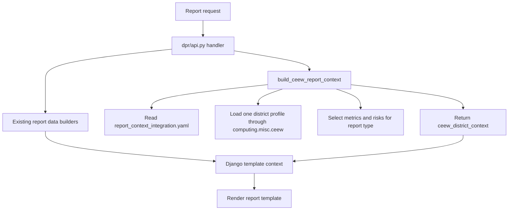
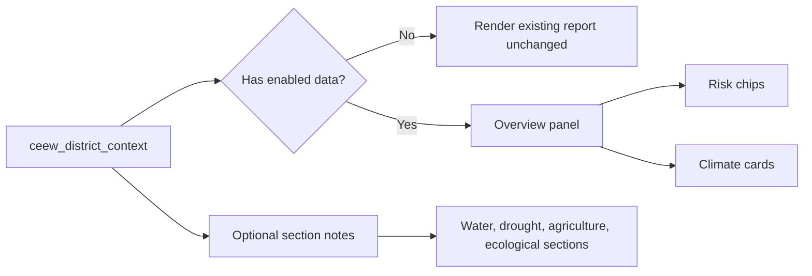

# YAML-Driven CEEW District Context For Core Stack Reports

Main scientific reference: `data/ceew_cravis/docs/ceew_methodology.md`.

This document records the current report-building paths and the proposed
configuration-driven method for adding cleaned CEEW/CRAVIS district context to
Core Stack Tehsil, MWS, and Village reports. It does not use
`data/ceew_cravis/llm/` outputs.

## Objective

Use the generated district profiles as a reusable backend data source for
existing reports:

```text
data/ceew_cravis/output/district_profiles/{state}/{district}/{state}_{district}_profile.json
data/ceew_cravis/output/district_profiles/{state}/{district}/{state}_{district}_metadata_config.json
```

The implementation should be controlled through:

```text
data/ceew_cravis/config/report_context_integration.yaml
```

The YAML decides which report gets which district metrics, risk chips, and
section notes. Backend code should read that config and build one compact
template context object, normally named:

```text
ceew_district_context
```

## Current Report Paths

Backend URL routing:

```text
nrm_app/urls.py
  /api/v1/ -> dpr.urls

dpr/urls.py
  generate_tehsil_report/  -> dpr.api.generate_tehsil_report
  generate_mws_report/     -> dpr.api.generate_mws_report
  generate_village_report/ -> dpr.api.generate_village_report
```

Backend render chain:

| API | Handler | Builder module | Template |
| --- | --- | --- | --- |
| `/api/v1/generate_tehsil_report` | `dpr/api.py::generate_tehsil_report` | `dpr/gen_tehsil_report.py` | `templates/block-report.html` |
| `/api/v1/generate_mws_report` | `dpr/api.py::generate_mws_report` | `dpr/gen_mws_report.py` | `templates/mws-report.html` |
| `/api/v1/generate_village_report` | `dpr/api.py::generate_village_report` | `dpr/gen_village_report.py` | `templates/village-report.html` |

Frontend report openers in `landscape-explorer`:

| Report | Frontend path | Current role |
| --- | --- | --- |
| Tehsil | `src/components/kyl_rightSidebar.jsx` | Opens `generate_tehsil_report` in a new tab. |
| MWS | `src/components/kyl_MWSProfilePanel.jsx` | Opens `generate_mws_report` in a new tab. |
| MWS | `src/components/kyl_rightSidebar.jsx` | Opens a hard-coded production MWS report URL. |
| Village | `src/pages/PlanViewPage.jsx` | Opens a hard-coded localhost village report URL. |

Frontend code should not own CEEW report content. It should only open the
backend report endpoints, preferably using `REACT_APP_API_URL` consistently.

## Current Report Content

Tehsil report currently focuses on:

```text
overview stress patterns
groundwater stress
drought incidence
irrigation risk
cropping yield stress
forest degradation
mining presence
socio-economic patterns
fishery potential
```

MWS report currently focuses on:

```text
landscape overview
terrain and LULC
hydrology and basin shape
groundwater extraction
cropping and water availability
land degradation, tree cover, urbanization
surface water and water balance
drought analysis
village intersections and MGNREGA works
```

Village report currently focuses on:

```text
village profile and overview
demographics
basic infrastructure
health and WASH
education
financial inclusion
welfare
community institutions
livelihood diversification
livestock
irrigation
agricultural support
ecological and climate resilience practices
```

## Scale Rule

CEEW/CRAVIS profile values are district-scale values. In tehsil, block, MWS, or
village reports, they must be labelled as district-scale context.

Allowed wording:

```text
CEEW District Context
At district scale, Jamui shows high heat risk and moderate flood risk.
These values provide wider climate context for the local evidence below.
```

Disallowed wording:

```text
This MWS has high heat risk.
This village will receive 1429 mm rainfall.
This tehsil has 23 hot days from CEEW.
```

## YAML Contract

The YAML has five practical blocks:

```text
data_sources          where profile and metadata files are read from
scale_policy          labels, caveats, allowed derivations
metric_selectors      named climate, risk, and sectoral selectors
reports               report-specific insertion points
validation            sample requests and checks
```

Metric selectors should use dotted paths that match the district profile JSON.
Examples from current profiles:

```text
climate.rcpssp.RCP85.precipitation.time_series_metrics.total_rainfall.annual
climate.rcpssp.RCP85.precipitation.derived_metrics.longest_dry_spell.annual
climate.rcpssp.RCP85.hot_weather.days_with_maximum_temperature_greater_than_35c.annual
risk.risk_heat
sectoral.zonal_observations.extreme_event_flood_susceptibility_area
```

The default scalar climate value is:

```text
period_summaries[*].mean_value
```

The selected periods are:

```text
1981-2010
2011-2024
2031-2050
2051-2070
```

Use yearly series only when the report explicitly needs a small time-series
chart. Do not load all district profiles into request-time report generation.

## Backend Implementation Flow



Target helper:

```text
dpr/ceew_report_context.py::build_ceew_report_context(report_kind, state, district, block=None, mws_id=None, village_id=None)
```

The helper should fail closed. If the YAML or district profile is missing, the
report should still render without CEEW context.

## Template Implementation Flow



Recommended template pattern:

```django

  

```

Keep the partial compact and style-compatible with each report. Avoid a large
standalone climate report inside existing planning reports.

## Report-Specific Placement

Tehsil:

| Placement | Purpose |
| --- | --- |
| Overview panel | District hazard and climate envelope for all tehsil stress patterns. |
| Agriculture section note | Rainfall, dry spell, heat, and drought context for crop stress. |
| Drought section note | District dry spell and drought severity context. |
| Forest section note | Heat and forest-fire risk context. |

MWS:

| Placement | Purpose |
| --- | --- |
| Landscape overview panel | District climate/risk frame for the selected MWS. |
| Hydrology note | Rainfall and wet-day context for basin and groundwater evidence. |
| Water availability note | Rainfall intensity and flood-risk context. |
| Drought note | Dry spell, drought severity, and heat context. |

Village:

| Placement | Purpose |
| --- | --- |
| Village overview panel | District climate/risk frame for village development indicators. |
| Irrigation note | Monsoon rainfall, wet days, and dry-spell context. |
| Ecological section note | Climate context for NRM and resilience works. |

## Frontend Follow-Up

The frontend should be cleaned separately so all report URLs use
`REACT_APP_API_URL`. Current hard-coded URLs are:

```text
landscape-explorer/src/pages/PlanViewPage.jsx
landscape-explorer/src/components/kyl_rightSidebar.jsx
```

This is not required for backend CEEW insertion, but it is required for clean
environment portability.

## Implementation Sequence

1. Create `dpr/ceew_report_context.py`.
2. Read and validate `data/ceew_cravis/config/report_context_integration.yaml`.
3. Use `computing.misc.ceew.get_ceew_data()` to load one district.
4. Build compact `ceew_district_context` using YAML selectors.
5. Add the context call to the three handlers in `dpr/api.py`.
6. Add one reusable template partial, then include it at YAML-defined anchors.
7. Render one Bihar/Jamui tehsil, MWS, and village report.
8. Confirm reports still render when CEEW is disabled in YAML.
9. Clean frontend report URLs to use `REACT_APP_API_URL`.

## Validation Requests

Local Django examples:

```text
http://localhost:8000/api/v1/generate_tehsil_report/?state=bihar&district=jamui&block=jamui
http://localhost:8000/api/v1/generate_mws_report/?state=bihar&district=jamui&block=jamui&uid=12_325505
http://localhost:8000/api/v1/generate_village_report/?state=bihar&district=jamui&block=jamui&villageId=259074
```

Expected checks:

```text
CEEW District Context appears once.
The context label says district-scale.
Existing maps/charts still load.
Reports render when enabled: false.
Reports render if a district profile is missing.
No code reads data/ceew_cravis/llm/.
```
