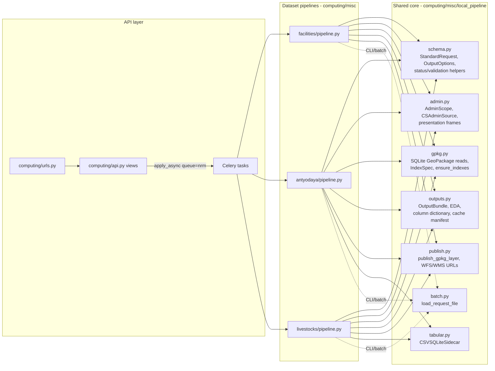
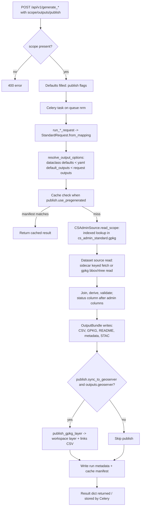
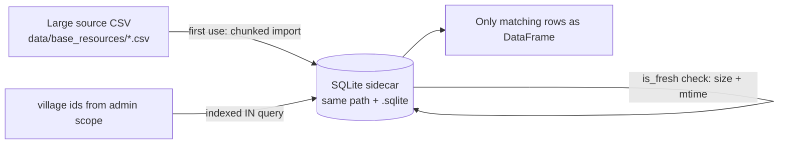
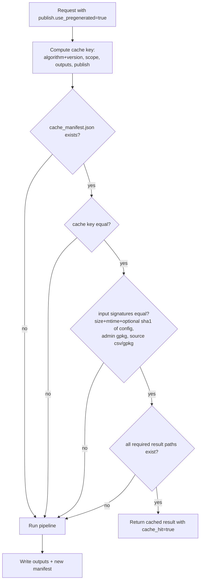

# Architecture and Core Methodology

## Design Goals

The local pipelines exist to answer one question fast: *"give me dataset X
for geography Y, packaged so a human, a GIS, and a machine can all use it."*
The design choices follow from that:

1. **Runtime joins over precomputation.** Pan-India source assets are kept
   once (a facilities GeoPackage, per-dataset CSVs); requested geographies
   are cut at request time. There is no fleet of per-district files to keep
   in sync.
2. **SQLite as the workhorse.** Both GeoPackages (which *are* SQLite) and
   CSV sidecars are queried through indexed SQLite reads, so a request for
   one tehsil never loads a 4-million-row asset into memory.
3. **One standard request, one standard bundle.** Every pipeline accepts the
   same request shape and writes the same artifact set, so tooling, tests,
   and documentation generalise.
4. **Config over code.** Column contracts, status columns, descriptions, and
   default outputs live in per-pipeline YAML, so presentation decisions are
   reviewable and changeable without touching Python.

## Module Map



Each dataset package (`facilities/`, `antyodaya/`, `livestocks/`) contains:

- `pipeline.py` — the runtime implementation plus its Celery task and CLI.
- `<name>_pipeline.yaml` — sources, output root/layer names, default
  outputs, and the output contract (status column, column-name overrides).
- A schema/classification YAML (`facility_classifications.yaml`,
  `livestocks_schema.yaml`, `antyodaya_2020_mapping.yaml`) — the domain
  knowledge: groupings, derivations, descriptions.
- `README.md` — the dataset knowledge article.
- `__main__.py` — `python -m computing.misc.<name>` CLI entry.

## Request Lifecycle



Key details:

- **Scope levels**: `state`, `district`, `tehsil` (alias `block`), and
  `village` (by `village_ids`, matching either `village_id` or
  `pc11_village_id`). Names are matched case-insensitively through
  expression indexes (`lower(trim(...))`).
- **First-run index creation**: `ensure_indexes` creates the admin and
  facility SQLite indexes the first time a machine runs a request; the
  created index names are reported in the result
  (`admin_created_indexes`, `created_facility_indexes`).
- **Villages without joins are kept**: a request returns every village in
  scope; the `*_status` column explains rows with no data instead of
  dropping them.

## The Two Source-Read Patterns

### Keyed CSV sidecar (Antyodaya, Livestock)



`CSVSQLiteSidecar.materialize()` imports the CSV once (selected columns
only), stores a metadata row (source size, mtime, row count, columns), and
creates key indexes. Later runs reuse the sidecar as long as the source
signature matches; an interrupted build has no metadata row and is rebuilt
automatically.

### Spatial GeoPackage read (Facilities)

The pan-India facilities GeoPackage is queried through its R-tree for the
scope's bounding box (expanded by `search.base_expansion_degrees`); any L3
facility class still missing after that gets a second, wider search
(`supplemental_expansion_degrees`) filtered by class using a dedicated
index. Nearest-service computation then runs per L3 class with a KD-tree
over candidate points, and distances are great-circle km.

## Output Bundle

Every run writes into
`<output.root>/<state>/<district>/<tehsil>/<layer_name>/`:

```
livestocks_ranchi_angara/
├── livestocks_ranchi_angara.csv                  # report CSV (human contract)
├── livestocks_ranchi_angara.gpkg                 # geometry + full columns
├── README.md                                     # run summary + column reference
├── livestocks_ranchi_angara.run_metadata.json    # request, outputs profile, EDA
├── livestocks_ranchi_angara.stac_fragment.json   # STAC item fragment
├── livestocks_ranchi_angara.geoserver_links.csv  # only when published
└── livestocks_ranchi_angara.cache_manifest.json  # cache key + input signatures
```

Every artifact is independently switchable through `outputs`
(`gpkg`, `csv`, `readme`, `metadata`, `stac`, `geoserver`), with pipeline
defaults in the YAML `default_outputs`.

## Caching



The manifest stores the exact result dict, so a cache hit is byte-identical
to the original run's response (plus cache timing fields).

## GeoServer Publishing

`publish_gpkg_layer` uploads the run's GPKG as a datastore layer in the
configured workspace. Workspace resolution order: request
`publish.geoserver_workspace` → pipeline YAML `output.geoserver_workspace` →
constant in `utilities/constants.py`. Publishing failures never fail the
run: the result carries `geoserver.status = publish_failed` with the error,
and the links CSV is only written on success (stale links are removed).

## Where Things Live

| Path | Role |
| --- | --- |
| `data/admin-boundary/cs_admin_standard.gpkg` | Standard village/admin boundary, the spine of every join. |
| `data/facilities/outputs/cs_pan_india_facilities.gpkg` | Pan-India facility points (~4.19M). |
| `data/base_resources/cs_antyodaya_2020_cluster_analysis.csv` (+ `.sqlite`) | Antyodaya consolidated analysis + sidecar. |
| `data/base_resources/cs_livestock_census_20.csv` (+ `.sqlite`) | Livestock census counts + sidecar. |
| `<output.root>` per pipeline YAML | Run outputs (currently `data/tests/outputs/...` on test branches). |
| `utilities/scripts/facilities_utils/` | Build scripts and full column metadata for the pan-India facilities asset. |
