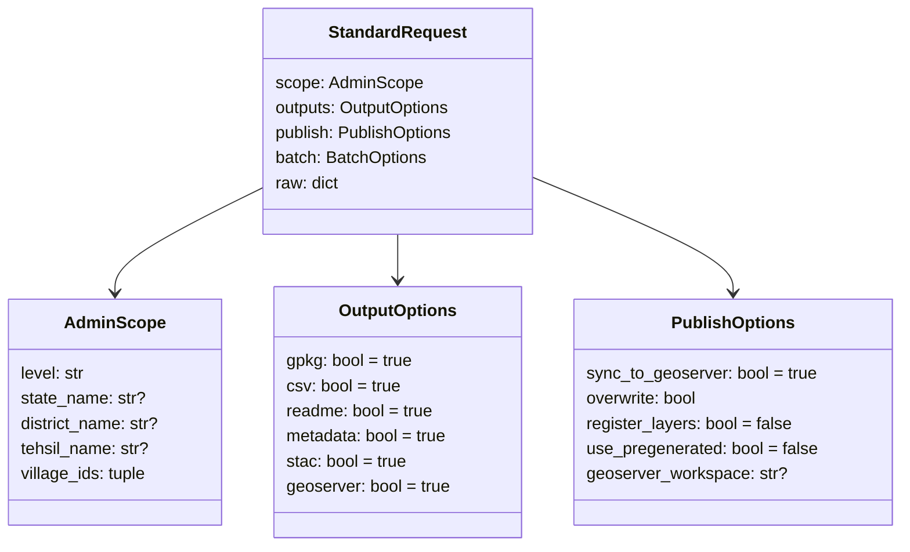

# Data Structures and Schema

This document is the schema reference for the local pipeline system: the
request shape, the option objects, the on-disk bundle, the per-dataset
column contracts, and the sidecar internals.

## The Standard Request

Every API body, CLI invocation, and batch row is normalised into a
`StandardRequest` (`computing/misc/local_pipeline/schema.py`):

```jsonc
{
  "scope": {
    "level": "tehsil",              // state | district | tehsil (block) | village
    "state_name": "Jharkhand",
    "district_name": "Ranchi",
    "tehsil_name": "Angara",        // block_name / block also accepted
    "village_ids": ["357030", "..."] // only for level: village
  },
  "outputs": {                       // all optional; defaults true
    "gpkg": true,
    "csv": true,
    "readme": true,
    "metadata": true,
    "stac": true,
    "geoserver": true
  },
  "publish": {                       // all optional
    "sync_to_geoserver": true,
    "overwrite": false,
    "register_layers": false,
    "use_pregenerated": false,       // enable the cache manifest check
    "geoserver_workspace": "testworkspace"
  },
  "batch": {"mode": "single"}
}
```



**Output option resolution** (`resolve_output_options`): dataclass defaults
← pipeline YAML `default_outputs` ← request `outputs`. Later layers win.

## Standard Admin Columns

`admin_presentation_frame` renames source admin fields into the fixed
presentation set that starts every output, in this order:

| Column | Source field | Description |
| --- | --- | --- |
| `index` | `fid` | Stable row index in `cs_admin_standard.gpkg`. |
| `state_id` | `pc11_state_id` | Census 2011 state code. |
| `district_id` | `pc11_district_id` | Census 2011 district code. |
| `tehsil_id` | `pc11_subdistrict_id` | Census 2011 sub-district code. |
| `village_id` | `village_id` | Core Stack village identifier for keyed joins. |
| `state_name` / `district_name` / `tehsil_name` / `village_name` | names, title-cased | Readable admin names. |

Internal source fields (`fid`, `pc11_*`, `TEHSIL`, `NAME`, `cs_*`) never
leak into outputs (`INTERNAL_ADMIN_COLUMNS` guard).

## Status Columns

Every dataset writes a per-village data-availability marker **immediately
after the admin columns** in each configured artifact:

| Value | Meaning |
| --- | --- |
| `matched` (joins) / `computed` (facilities) | Data was found and joined/computed for this village. |
| `no village id available` | The admin row has no usable village identifier, so no join was attempted. |
| `no data available for this village` | The village is known, but the source had no matching record (or no candidates were found). |

Configuration, per pipeline YAML:

```yaml
output_contract:
  status_column:
    name: livestock_status          # antyodaya_status / facilities_status
    outputs: [csv, gpkg, geoserver] # remove an entry to drop the column there
```

The GeoServer layer is published from the GPKG, so `gpkg` and `geoserver`
share one frame; the column is kept when either is listed.

## Run Metadata: Column Dictionary + EDA

`<layer>.run_metadata.json` contains, alongside the request and result:

```jsonc
"outputs": {
  "csv": {
    "columns": [ {"column": "...", "description": "...", "datatype": "integer|number|text|boolean|datetime|geometry"} ],
    "eda":     { "row_count": 81, "column_count": 18, "columns": [...],
                 "null_counts": {...}, "numeric_summary": {"col": {"count","min","mean","max"}} }
  },
  "gpkg_villages": { ... },
  "overview": { ... }
}
```

Descriptions come from the same YAML-driven sources as the README column
reference, so CSV, README, and metadata always agree:

- Facilities: description templates + per-class labels in
  `facility_classifications.yaml`.
- Antyodaya: suffix rules (`*_cat_cluster`, `*_cat_value`, `*_feat_value`)
  plus category titles and raw-column usage from
  `antyodaya_2020_mapping.yaml`.
- Livestock: animal/total/female/male structure and derived-metric labels
  in `livestocks_schema.yaml`.

## Per-Dataset Column Contracts

### Facilities report CSV

Derived structurally from `facility_classifications.yaml`, not hard-coded:
for each L2 group in order → its category distance column, then for each
member L3 class → `nearest_<class>` (compact facility detail) and
`nearest_<class>_distance_km`.

- Category columns default to `<group>_cat_distance_km`; overrides in
  `facilities_pipeline.yaml` `output_contract.l2_distance_columns` map
  `apmc_access → market_cat_distance_km`,
  `cooperative → cooperative_societies_cat_distance_km`,
  `livestock → dairy_livestock_cat_distance_km`.
- Category semantics by rollup: `max` = baseline bundle (farthest required
  member), `min` = opportunity gateway (nearest alternative), `direct` =
  single service.
- The GPKG keeps the machine columns instead: per-L3
  `l3_<class>_distance_km` / `_facility_uid` / `_inside_scope`, and per-L2
  `l2_<group>_distance_km` / `_facility_uid` / `_selected_l3` /
  `_selected_l3_label`.

### Antyodaya report CSV

Admin columns, `antyodaya_status`, then **all** `*_cat_cluster` columns
(21 categories), **all** `*_cat_value` columns, then the raw survey
columns. `*_feat_value` feature columns are excluded from the CSV and kept
in the GPKG. Clusters are normalized to `HIGH`/`MEDIUM`/`LOW`; values are
validated to 0–1.

### Livestock report CSV

Fixed order:

```
index, state_id, district_id, tehsil_id, village_id,
state_name, district_name, tehsil_name, village_name,
livestock_status,
all_livestock_total, large_animals_total, cattle_total, buffalo_total,
small_animals_total, sheep_total, goat_total, pig_total
```

The GPKG/GeoServer layer inserts `cattle_female, cattle_male` after
`cattle_total` (and likewise for buffalo, sheep, goat, pig) —
`gpkg_columns` in `livestocks_schema.yaml`.

## CSV SQLite Sidecar Format

`CSVSQLiteSidecar` (`tabular.py`) materialises a large CSV into
`<csv_path>.sqlite`:

- One data table named after the pipeline (`name:` in the YAML), containing
  only the configured `source_columns`.
- Key indexes on the configured `key_columns` (e.g. `village_id`,
  `village_code`).
- A `local_pipeline_sidecar_metadata` table storing the source signature
  (size + mtime), row count, and materialised columns. `is_fresh()` compares
  the signature; a missing or stale signature triggers a rebuild, so an
  interrupted import self-heals.
- `fetch_by_values(key, values)` runs chunked indexed `IN` queries and
  returns a DataFrame of only the matching rows.

## Cache Manifest

`<layer>.cache_manifest.json`:

```jsonc
{
  "cache_key": "sha1 of {algorithm, version, scope, outputs, publish-sans-use_pregenerated}",
  "input_signatures": {"admin_gpkg": {"path","size","mtime_ns","sha1?"}, ...},
  "required_result_paths": ["csv_path", "gpkg_path", ...],
  "result": { ...exact result dict... }
}
```

A cached result is served only when the key matches, every input signature
matches, and every required path still exists.

## API Endpoints

| Endpoint | Task | Queue |
| --- | --- | --- |
| `POST /api/v1/generate_facilities_proximity/` | `generate_facilities_proximity_task` | `nrm` |
| `POST /api/v1/generate_antyodaya/` | `generate_antyodaya_layer_task` | `nrm` |
| `POST /api/v1/generate_livestocks/` | `generate_livestocks_layer_task` | `nrm` |

All three require the structured body with a `scope` object (a missing
`scope` returns 400) and respond immediately with the normalised request;
the work happens on the Celery `nrm` queue.
