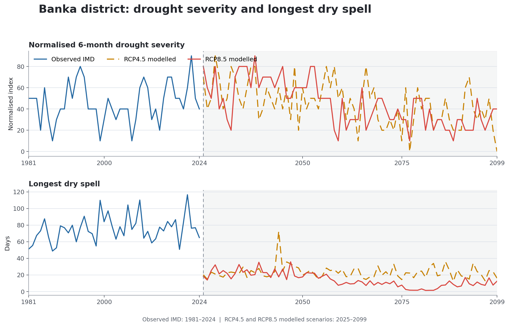
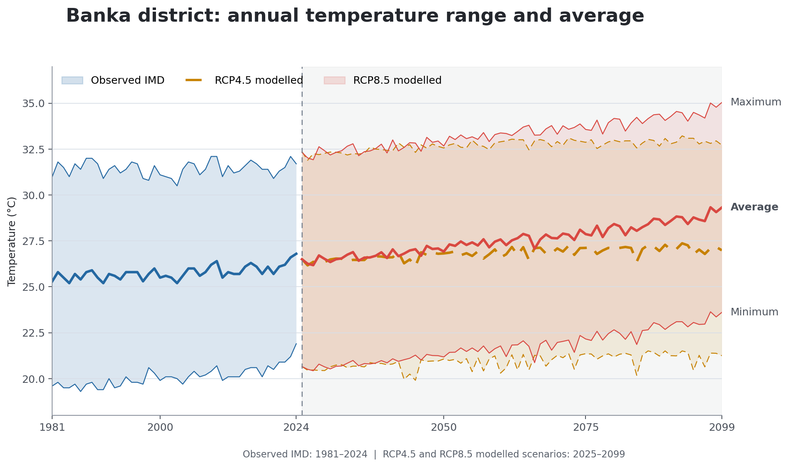
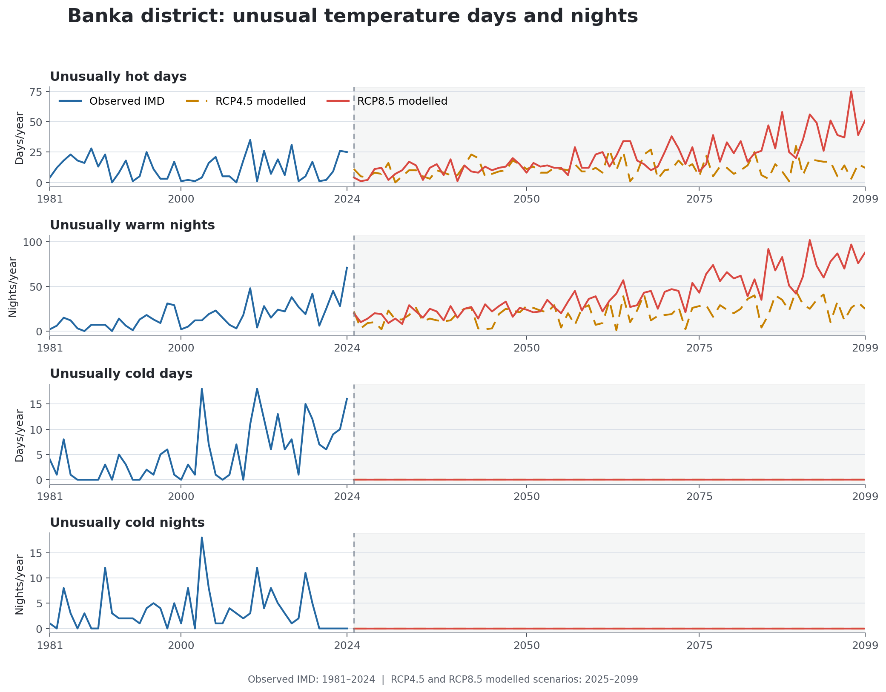
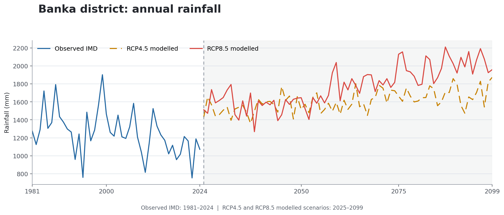
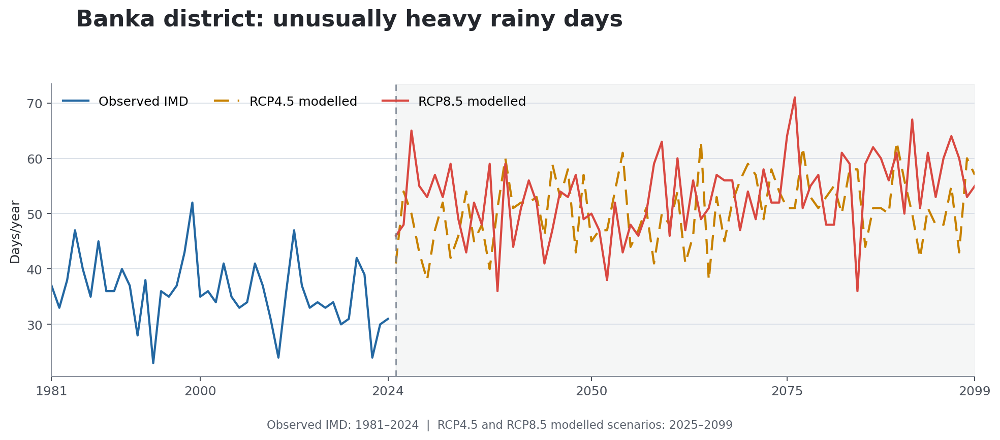

# Tehsil Data Analysis Report

## Spatial and Temporal Analysis of Key Metrics

## Overview of Tehsil characteristics

The Tehsil Banka having total area 369,794 hectares has towns and cities of Banka, Amarpur, and Asarganj. Part of Bhimbandh WLS, covering roughly 4937.1 hectares, lies within the Tehsil supporting local wildlife and promoting biodiversity.

## Socio-ecological patterns across Tehsil

The following map shows the variation of different socio-ecological stress patterns across micro-watersheds and villages in the tehsil. As the number of stress patterns in a micro-watershed increases, its gradient moves from green to red.

**Various stress patterns across micro-watersheds**

- High drought incidence
- High irrigation risk
- Likely stress in cropping yield
- Tree health degradation

**Various stress patterns across villages**

- Poor uptake of MGNREGA works

*This chart shows the number of stressor patterns in a micro-watershed. Darker shades of red indicate compounding stresses. The report highlights areas in the tehsil where several stresses occur together.*

## Stress patterns affecting agriculture

### High Drought Incidence

8310.67 hectares out of 284141.55 hectares of cropping area in the tehsil appears to have a high drought incidence.

**Stress pattern identified where:**

- Drought frequency is high.
- Dry-spell length is long.

**Suggestions:**

- Changes in cropping patterns.
- Creation of rainwater harvesting structures.
- Formation of water user associations.

Areas where there have been at least two drought years or at least two intensive dry-spell years during 2017–2024 are shown in yellow. Areas which experienced both conditions are shown in red.

*Timeline of the weighted share of drought-affected cropping area across the micro-watersheds assessed by the report.*

*Note: Drought is defined as per the Government of India's Drought Manual and considered moderate or severe if the number of drought weeks is five or more. Drought weeks are identified from meteorological drought and/or agricultural drought. Severe drought weeks are those when both are coincident. An intensive dry spell is four consecutive weeks in which each week has a rainfall deviation greater than 50% from the historical average.*

<strong>District Level Drought Context:</strong> Banka tehsil lies in <em>Banka</em> district. Following figure shows available Observed IMD series (1981–2024), followed by corresponding RCP4.5 and RCP8.5 modelled-scenario series (2025–2099) for the normalised 6-month drought severity index and longest dry spell (continuous days in the district with less than 1mm rainfall) showing serious watrer scarcity.

<em>District-level climate context used in this tehsil report.</em>

The observed normalized drought-severity value averaged 43.3 during 1981–2016 and 56.3 during 2017–2024. The modelled segment is shown together, while a separation line shows clear demarcation between them. This district's RCP8.5 modelling seems to predict a continuously bettering scenario, as shown by largely declining drought severity, and smaller periods without rain.

### High Irrigation Risk

542.80 hectares out of 284141.55 hectares of cropping area in the tehsil appears to have a high irrigation risk.

**Stress pattern identified where:**

- Surface water during Rabi is low.
- The surface-water trend over the assessed years is negative.

**Suggestions:**

- De-silting of waterbodies.
- Regular maintenance tasks.
- Formation of water user associations.
- Construction of new waterbodies.

Areas where average surface-water availability during Rabi is less than 30% or the annual surface-water trend is negative are shown in yellow. Areas which experienced both conditions are shown in red.

*Timeline of weighted seasonal surface-water availability.*

*Note: Sentinel-1 SAR VV-band data are used for water-pixel detection in Kharif; Dynamic World is used in Rabi and Zaid.*

### Likely stress in cropping yield

Likely stress in cropping yield is assessed from degradation of farmland into barren or shrub areas and from reduced cropping intensity. Micro-watersheds where either condition exceeded 30 hectares during 2017–2024 are shown in yellow. Micro-watersheds where both conditions exceeded 30 hectares are shown in red.

3143.25 hectares in the tehsil appears to have had a reduction in cropping area.

284141.55 hectares in the tehsil appears to have had a reduction in cropping intensity.

**Stress pattern identified where:**

- Reduction in cropping area over the assessed years is greater than 30 ha.
- Reduction in cropping intensity over the assessed years is greater than 30 ha.

**Suggestions:**

- Investigate the reasons for reduction.
- Changes in cropping patterns.
- Methods to improve soil health.

*Note: Cropping degradation is calculated from farmland transitions to barren land or scrub and from reductions in cropping intensity. IndiaSAT annual land-use/land-cover outputs are used to identify farmland transitions and changes among single, double and triple cropping.*

## Stress patterns affecting Tree cover

### Reduction in Tree Cover

7227.22 hectares out of 12831.95 hectares of area under tree cover in the tehsil appears to have been lost.

The data is computed over the years 2017–2024.

**Stress pattern identified where:**

- Reduction in tree cover over the assessed years is greater than 50 ha.

**Suggestions:**

- Formation of forest protection committees.
- Strengthening of collective norms.

*Note: The reduction in tree cover is computed using IndiaSAT land-use/land-cover outputs. Transitions from tree cover to barren land, scrub, built-up land or farmland are included.*

## Socio-economic patterns

### High density of marginalized caste communities

1,161 people in 5 villages are from marginalized groups.

**Stress pattern identified where:**

- SC population is greater than 17%.
- ST population is greater than 33%.

**Suggestions:**

- Examine access to social entitlements.
- Address any incidence of discrimination.

*Note: Demographic details on caste-based population density are taken from Census 2011.*

### Poor uptake of MGNREGA works

1286 villages out of 1604 have had a low number of MGNREGA works—fewer than 100—during 2005–2024.

**Stress pattern identified where:**

- Number of MGNREGA works is less than 100.

**Suggestions:**

- Positive discrimination in access to MGNREGA assets.
- Increase awareness of MGNREGA work opportunities.

*Note: Metadata on MGNREGA assets, including work name and work type, are obtained from the NREGA MIS.*

## Intervention opportunities

### Fishery

Up to 1012.78 hectares of area in the tehsil appears to have good potential for fishery due to surface water retained throughout the year. Good water potential in a micro-watershed is assessed from three conditions: Rabi surface-water availability above 30%, Zaid surface-water availability above 30%, and a non-declining trend in annual surface-water availability during 2017–2024. The map uses a blue gradient according to the number of conditions satisfied; dark blue indicates that all three conditions are met.

*Note: Sentinel-1 SAR VV-band data are used for water-pixel detection in Kharif; Dynamic World is used in Rabi and Zaid.*

<h2>District Climate Context</h2>

Banka tehsil lies in <em>Banka</em> district. While we recognise lack of tehsil level data regarding Climate Change, however we realise its immense importance for Water Resources management needs, therefore this section is added to show publicly available District Level Climate, how it has been changing, how based on best estimations it is projected to change in the future as well, allowing us to plan for mitigation and/or adaption regarding water resources, agriculture, people, livelihoods, governance.

RCP4.5 is an intermediate greenhouse-gas concentration pathway reaching approximately 4.5 W/m² of radiative forcing, while RCP8.5 is a high pathway reaching approximately 8.5 W/m² by 2100. They are shown together to examine climate change under intermediate and high pathways. These are modelled projections rather than predictions, and actual future observations may differ.

<em>Annual district maximum, average and minimum temperature. The shaded band connects the minimum and maximum temperature series, while the central line shows average temperature. Observed IMD values continue through 2024, followed by RCP4.5 and RCP8.5 modelled values from 2025 onwards.</em>

The observed IMD averages during 2017–2024 were 31.5°C for maximum temperature, 26.2°C for average temperature and 20.9°C for minimum temperature. Under RCP8.5, all three annual temperature series show clear increasing trends. Compared with the modelled 2017–2024 averages, the modelled changes during 2025–2049 are 0.4°C, 0.4°C and 0.4°C for maximum, average and minimum temperature; during 2075–2099 they are 2.1°C, 2.2°C and 2.3°C.

<em>Annual counts of unusually hot days, unusually warm nights, unusually cold days and unusually cold nights. The observed series continues through 2024, followed by the RCP4.5 and RCP8.5 modelled series from 2025 onwards.</em>

Compared with 1981–2016, the observed averages during 2017–2024 show fewer unusually hot days (10.8 from 12.3), more unusually warm nights (32.9 from 13.6), more unusually cold days (9.5 from 4.2), and fewer unusually cold nights (2.3 from 3.8).

As we can see, the district's climate is moving towards hotter conditions, with an increasing number of unusually hot days and an increasing number of unusually warm nights. It is also projected to have almost no unusually cold days and almost no unusually cold nights. Among these temperature extremes, the two largest modelled changes between 2025–2049 and 2075–2099 are unusually warm nights, from 20.1 to 67.4 a year, and unusually hot days, from 10.0 to 35.0 a year.

<em>Annual district rainfall from 1981–2099. The observed IMD series continues through 2024, followed by the RCP4.5 and RCP8.5 modelled series from 2025 onwards.</em>

Annual district rainfall averaged 1300.2 mm during 1981–2016 and 1060.5 mm during 2017–2024. Under RCP8.5, annual rainfall shows a clear increasing trend, with the modelled average changing from 1569.5 mm during 2025–2049 to 2003.6 mm during 2075–2099.

<em>Annual count of unusually heavy rainy days. The observed series continues through 2024, followed by the RCP4.5 and RCP8.5 modelled series from 2025 onwards.</em>

Compared with 1981–2016, the observed average during 2017–2024 shows fewer unusually heavy rainy days (32.6 from 36.6). Under RCP8.5, the district is projected to have an increasing number of unusually heavy rainy days, with the modelled annual average changing from 51.4 during 2025–2049 to 56.9 during 2075–2099.

<em>CoRE Stack. Data presented through Climate Resilience Analytics and Visualisation Intelligence System (CRAVIS.ai). 2026. New Delhi: Council on Energy, Environment and Water (CEEW). Available at: https://cravis.ai.</em>

---

Report generated on 19 August 2026 | CoRE Stack Team

Refer to the technical manual for more details on how data was collected and processed.

While the underlying datasets have been validated against ground truth in some locations, feedback is needed on whether the outputs agree with observations from this area. Please share feedback with contact@core-stack.org.
