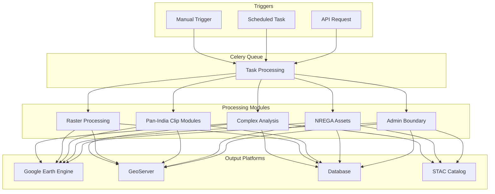
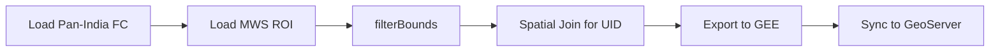
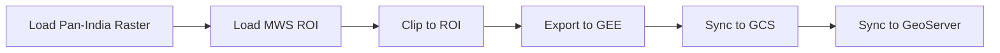
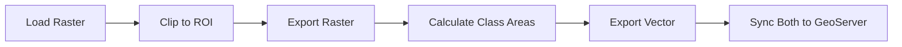
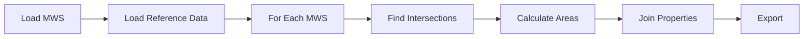
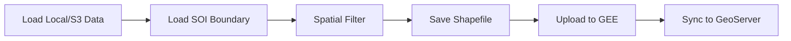
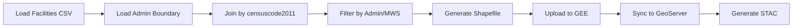

# CoRE Stack Computing Pipeline Documentation

## Overview

The `computing/misc` directory contains Celery tasks for processing geospatial data layers for the CoRE (Community Resource Enhancement) Stack platform. These modules transform raw geospatial data into actionable layers distributed across multiple platforms.

## Architecture Overview



## Module Categories

### 1. Boundary Processing

| Module | Purpose | Output Type |
|--------|---------|-------------|
| [`admin_boundary.py`](admin_boundary.md) | Village/tehsil boundaries with census data | Vector |
| [`nrega.py`](nrega.md) | NREGA work site locations | Vector (Points) |
| [`facilities_proximity.py`](facilities_proximity.md) | Village facility distance metrics | Vector |

### 2. Pan-India Clip Modules (Vector)

These modules share an identical pattern - clipping pan-India vector data to block boundaries.

| Module | Data Source | Workspace |
|--------|-------------|-----------|
| [`agroecological_space.py`](agroecological_space.md) | Agroecological zones | `agroecological` |
| [`factory_csr.py`](pan_india_clip_modules.md) | Factory CSR projects | `factory_csr` |
| [`green_credit.py`](pan_india_clip_modules.md) | Green Credit projects | `green_credit` |
| [`lcw_conflict.py`](pan_india_clip_modules.md) | Land conflict data | `lcw` |
| [`mining_data.py`](pan_india_clip_modules.md) | Mining sites | `mining` |
| [`drainage_lines.py`](drainage_lines.md) | Drainage network | `drainage` |

### 3. Raster Processing Modules

These modules clip pan-India raster data and sync via Google Cloud Storage.

| Module | Data Type | Workspace |
|--------|-----------|-----------|
| [`catchment_area.py`](catchment_area.md) | Catchment area | `catchment_area_singleflow` |
| [`distancetonearestdrainage.py`](distancetonearestdrainage.md) | Distance to drainage | `distance_nearest_upstream_DL` |
| [`naturaldepression.py`](naturaldepression.md) | Natural depressions | `natural_depression` |
| [`slope_percentage.py`](slope_percentage.md) | Slope gradient | `slope_percentage` |

### 4. Complex Analysis Modules

These modules perform advanced spatial analysis.

| Module | Purpose | Output |
|--------|---------|--------|
| [`aquifer_vector.py`](aquifer_vector.md) | Aquifer intersection analysis | Vector with yield data |
| [`soge_vector.py`](soge_vector.md) | Groundwater extraction stage | Vector with GW data |
| [`restoration_opportunity.py`](restoration_opportunity.md) | Forest restoration potential | Raster + Vector |
| [`stream_order.py`](stream_order.md) | Stream network analysis | Raster + Vector |
| [`ndvi_time_series.py`](ndvi_time_series.md) | Vegetation time series | Vector (time series) |

### 5. Utility Modules

| Module | Purpose |
|--------|---------|
| [`hls_interpolated_ndvi.py`](hls_interpolated_ndvi.md) | NDVI gap-filling utilities |

## Processing Patterns

### Pattern 1: Pan-India Vector Clip



**Used by:** `agroecological_space.py`, `factory_csr.py`, `green_credit.py`, `lcw_conflict.py`, `mining_data.py`

### Pattern 2: Simple Raster Clip



**Used by:** `catchment_area.py`, `distancetonearestdrainage.py`, `naturaldepression.py`, `slope_percentage.py`

### Pattern 3: Raster-to-Vector Conversion



**Used by:** `restoration_opportunity.py`, `stream_order.py`

### Pattern 4: MWS-Join Analysis



**Used by:** `aquifer_vector.py`, `soge_vector.py`

### Pattern 5: Local Data Processing



**Used by:** `admin_boundary.py`, `nrega.py`

### Pattern 6: Hybrid CSV-Geometry Join



**Used by:** `facilities_proximity.py`

## Common Integration Points

### Utility Functions

```
computing.utils
├── push_shape_to_geoserver()   # Direct shapefile upload
├── sync_fc_to_geoserver()      # FeatureCollection sync
├── sync_layer_to_geoserver()   # Layer sync
├── sync_raster_to_gcs()        # Raster to GCS
├── sync_raster_gcs_to_geoserver() # GCS to GeoServer
├── save_layer_info_to_db()     # Database persistence
├── update_layer_sync_status()  # Status tracking
├── generate_shape_files()      # JSON to Shapefile
└── get_directory_size()        # File size calculation
```

### GEE Utilities

```
utilities.gee_utils
├── ee_initialize()             # GEE authentication
├── valid_gee_text()            # Text sanitization
├── get_gee_asset_path()        # Asset path generation
├── get_gee_dir_path()          # Directory path generation
├── is_gee_asset_exists()       # Asset existence check
├── create_gee_directory()      # GEE folder creation
├── upload_shp_to_gee()         # Shapefile upload
├── export_vector_asset_to_gee() # Vector export
├── export_raster_asset_to_gee() # Raster export
├── check_task_status()         # Task monitoring
├── make_asset_public()         # ACL management
├── gdf_to_ee_fc()              # GeoDataFrame to EE FC
└── merge_fc_into_existing_fc() # FC merge
```

### STAC Generation

```
computing.STAC_specs
├── generate_vector_stac()      # Vector STAC metadata
└── generate_raster_stac()      # Raster STAC metadata
```

## Data Flow

### Input Sources

| Source | Type | Used By |
|--------|------|---------|
| Census 2011 GeoJSON | Local | `admin_boundary.py` |
| SOI Tehsil GeoJSON | Local | `admin_boundary.py`, `nrega.py` |
| NREGA S3 Bucket | AWS S3 | `nrega.py` |
| Facilities CSV | Local | `facilities_proximity.py` |
| GEE External Datasets | GEE | Pan-India clip modules |
| Pan-India Rasters | GEE | Raster processing modules |
| HLS/MODIS | GEE | `ndvi_time_series.py` |

### Output Destinations

| Destination | Purpose |
|-------------|---------|
| Google Earth Engine | Cloud analysis, asset storage |
| GeoServer | WMS/WFS services for visualization |
| PostgreSQL Database | Layer metadata, sync status |
| STAC Catalog | Standardized metadata for discovery |

## Task Parameters

### Standard Parameters

Most tasks accept these common parameters:

| Parameter | Type | Description |
|-----------|------|-------------|
| `state` | str | State name |
| `district` | str | District name |
| `block` | str | Block/tehsil name |
| `gee_account_id` | int | GEE account identifier |

### Custom Project Parameters

Some tasks support custom project mode:

| Parameter | Type | Description |
|-----------|------|-------------|
| `proj_id` | int | Project database ID |
| `roi_path` | str | Custom ROI asset path |
| `asset_suffix` | str | Custom asset naming suffix |
| `asset_folder` | list | Custom folder path |
| `app_type` | str | Application type (MWS, WATERBODY, etc.) |

## Naming Conventions

### GEE Asset Naming

```
projects/earthengine-legacy/assets/projects/nrm/{state}/{district}/{block}/{layer_name}
```

Example:
```
projects/earthengine-legacy/assets/projects/nrm/Rajasthan/Jaipur/Sanganer/admin_boundary_jaipur_sanganer
```

### GeoServer Layer Naming

- **Workspace:** Specific to data type (e.g., `panchayat_boundaries`, `nrega_assets`)
- **Layer Name:** `{layer_type}_{district}_{block}`

### STAC Layer Naming

Standardized names for catalog:
- `admin_boundaries_vector`
- `nrega_vector`
- `facilities_proximity_vector`
- `drainage_lines_vector`
- `aquifer_vector`
- `stage_of_groundwater_extraction_vector`

## Error Handling

All modules implement:
1. **Graceful degradation** - Continue with fallback data if primary source fails
2. **Task status monitoring** - Check GEE export task completion
3. **Database tracking** - Record sync status for each layer
4. **Logging** - Print statements for debugging

## Dependencies

### Python Packages
- **ee** - Google Earth Engine Python API
- **geopandas** - Geospatial data manipulation
- **shapely** - Geometry operations
- **celery** - Distributed task queue
- **boto3** - AWS S3 access (NREGA module)
- **unidecode** - Text normalization

### Django Models
- `projects.models.Project` - Custom project support
- `gee_computing.models.GEEAccount` - GEE account management

## Performance Considerations

1. **File Size Thresholds**
   - NREGA module uses different upload methods based on file size (>10MB uses direct shapefile upload)

2. **Scale Parameters**
   - Raster exports typically use 30m scale
   - Some analyses use tileScale=4 for large polygons

3. **Batch Processing**
   - NDVI time series processes year-by-year for multi-year requests
   - Incremental updates supported for existing assets

## Monitoring

Each task returns a boolean indicating GeoServer sync success:
- `True` - Layer successfully synced to GeoServer
- `False` - Sync failed or skipped

Database records track:
- Layer metadata (name, asset ID, dataset name)
- Sync status (GEE, GeoServer, STAC)
- Creation/update timestamps
