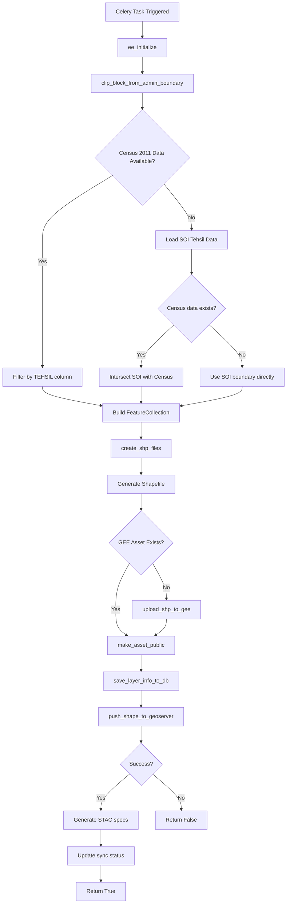
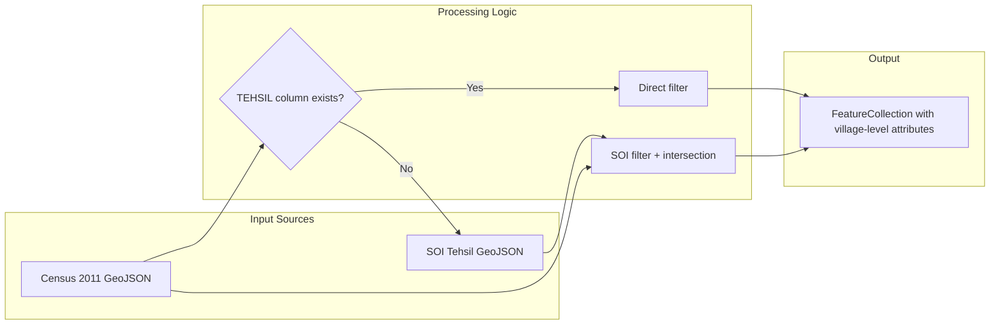

# Admin Boundary Module

**File:** [`computing/misc/admin_boundary.py`](../../computing/misc/admin_boundary.py)

## Overview

This module handles **administrative boundary processing** for geographic data, specifically extracting tehsil/block-level boundaries and synchronizing them across multiple geospatial platforms.

## Purpose

Processes Indian administrative boundaries (state → district → tehsil/block hierarchy) and distributes them to:
- **Google Earth Engine (GEE)** - Cloud-based geospatial analysis platform
- **GeoServer** - Open-source geospatial data server
- **Database** - Layer metadata storage
- **STAC catalog** - SpatioTemporal Asset Catalog specifications

## Architecture



## Components

### Main Task: `generate_tehsil_shape_file_data()`

**Location:** Line 27

A Celery task decorated with `@app.task(bind=True)` that orchestrates the entire pipeline.

**Parameters:**
| Parameter | Type | Description |
|-----------|------|-------------|
| `state` | str | State name |
| `district` | str | District name |
| `block` | str | Block/tehsil name |
| `gee_account_id` | int | GEE account identifier |

**Processing Steps:**

| Step | Action | Purpose |
|------|--------|---------|
| 1 | Initialize GEE | Authenticate with Google Earth Engine |
| 2 | Generate asset ID | Create unique identifier for the boundary |
| 3 | Clip block boundary | Extract specific tehsil from source data |
| 4 | Create shapefiles | Convert to ESRI Shapefile format |
| 5 | Upload to GEE | Store as GEE asset if not exists |
| 6 | Make public | Set asset visibility to public |
| 7 | Save to database | Store layer metadata |
| 8 | Push to GeoServer | Publish as WMS/WFS layer |
| 9 | Generate STAC | Create STAC catalog entry |

### Data Extraction: `clip_block_from_admin_boundary()`

**Location:** Line 102

Handles the complex logic of extracting block boundaries from multiple data sources.

**Data Source Priority:**
1. **Primary**: Census 2011 data (contains village boundaries with demographic attributes)
2. **Fallback**: Survey of India (SOI) tehsil boundaries

**Logic Flow:**


### Shapefile Creation: `create_shp_files()`

**Location:** Line 86

Converts the GeoJSON FeatureCollection to ESRI Shapefile format:
- Writes JSON intermediate file
- Calls `generate_shape_files()` utility

## Data Attributes

When census data is available, each village feature includes:

### Identifiers
| Field | Description |
|-------|-------------|
| `vill_ID` | Village census ID |
| `vill_name` | Village name |
| `block_cen` | Block census code |
| `tehsil` | Tehsil name |
| `dist_cen` | District census code |
| `district` | District name |
| `state_cen` | State census code |
| `state` | State name |

### Demographic Metrics
| Field | Description |
|-------|-------------|
| `No_HH` | Number of Households |
| `TOT_P` | Total Population |
| `TOT_M` | Total Male |
| `TOT_F` | Total Female |

### Social Categories
| Field | Description |
|-------|-------------|
| `P_SC`, `M_SC`, `F_SC` | Scheduled Caste (Person/Male/Female) |
| `P_ST`, `M_ST`, `F_ST` | Scheduled Tribe (Person/Male/Female) |

### Literacy
| Field | Description |
|-------|-------------|
| `P_LIT`, `M_LIT`, `F_LIT` | Literate (Person/Male/Female) |
| `P_ILL`, `M_ILL`, `F_ILL` | Illiterate (Person/Male/Female) |

### Asset Indices
| Field | Description |
|-------|-------------|
| `ADI_2001/2011/2019` | Asset Deprivation Index |
| `BF_2001/2011/2019` | Basic Facilities |
| `FC_2001/2011/2019` | Financial Capital |
| `MSW_2001/2011/2019` | Mean Standard of Living |
| `ASSET_2001/2011/2019` | Asset Index |

## Integration Points

```
computing/misc/admin_boundary.py
├── computing.utils
│   ├── generate_shape_files()     # JSON → Shapefile conversion
│   ├── push_shape_to_geoserver()  # GeoServer publication
│   ├── save_layer_info_to_db()    # Database persistence
│   └── update_layer_sync_status() # Status tracking
├── utilities.gee_utils
│   ├── ee_initialize()            # GEE authentication
│   ├── valid_gee_text()           # Text sanitization
│   ├── get_gee_asset_path()       # Asset path generation
│   ├── is_gee_asset_exists()      # Asset existence check
│   ├── create_gee_directory()     # GEE folder creation
│   ├── upload_shp_to_gee()        # Shapefile upload
│   └── make_asset_public()        # ACL management
└── computing.STAC_specs
    └── generate_vector_stac()     # STAC metadata generation
```

## Constants Used

| Constant | Source | Description |
|----------|--------|-------------|
| `ADMIN_BOUNDARY_INPUT_DIR` | `utilities.constants` | Input directory for boundary data |
| `ADMIN_BOUNDARY_OUTPUT_DIR` | `utilities.constants` | Output directory for generated files |

## Output

### GEE Asset
- **Naming:** `admin_boundary_{district}_{block}`
- **Path:** `projects/earthengine-legacy/assets/projects/nrm/{state}/{district}/{block}/admin_boundary_{district}_{block}`

### GeoServer Layer
- **Workspace:** `panchayat_boundaries`
- **Format:** WMS/WFS service

### STAC Entry
- **Layer Name:** `admin_boundaries_vector`

## Usage

```python
# Trigger via Celery
from computing.misc.admin_boundary import generate_tehsil_shape_file_data

result = generate_tehsil_shape_file_data.delay(
    state="Rajasthan",
    district="Jaipur",
    block="Sanganer",
    gee_account_id=1
)
```

## Error Handling

- Handles missing Census 2011 data gracefully by falling back to SOI boundaries
- Continues processing even if census data file is not found
- Logs errors for debugging

## Dependencies

- **ee** (Google Earth Engine Python API)
- **geopandas** - Geospatial data manipulation
- **shapely** - Geometry operations
- **geojson** - GeoJSON handling
- **Celery** - Distributed task queue
