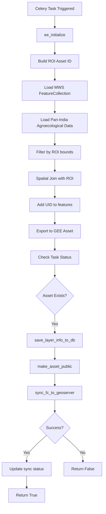
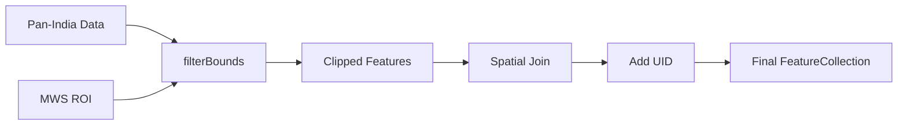
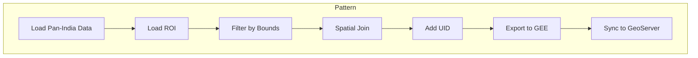

# Agroecological Space Module

**File:** [`computing/misc/agroecological_space.py`](../../computing/misc/agroecological_space.py)

## Overview

This module generates **agroecological zone data** for specific administrative blocks by clipping pan-India agroecological classification data to the region of interest (ROI).

## Purpose

Extracts agroecological zone information for micro-watersheds (MWS) and distributes to:
- **Google Earth Engine (GEE)** - Vector asset storage
- **GeoServer** - Visualization via WMS/WFS (workspace: `agroecological`)
- **Database** - Layer metadata storage

## Architecture



## Components

### Main Task: `generate_agroecological_data()`

**Location:** Line 22

**Parameters:**
| Parameter | Type | Description |
|-----------|------|-------------|
| `state` | str | State name |
| `district` | str | District name |
| `block` | str | Block/tehsil name |
| `gee_account_id` | int | GEE account identifier |

**Returns:** `bool` - Whether layer was successfully synced to GeoServer

## Processing Logic

### 1. ROI Definition
```python
roi_asset_id = get_gee_asset_path(state, district, block) + "filtered_mws_{district}_{block}_uid"
```
Uses pre-computed MWS boundaries with unique identifiers.

### 2. Data Source
```python
pan_india_asset_id = f"{GEE_EXT_DATASET_PATH}/Agroecological_space_pan_india"
```
Loads pan-India agroecological classification from external dataset.

### 3. Spatial Processing



**Spatial Join Logic:**
- Uses `ee.Filter.intersects()` with leftField=".geo" and rightField=".geo"
- Joins clipped data with ROI features to associate each agroecological feature with its containing MWS
- Extracts `uid` from matched ROI feature and adds to clipped feature

### 4. UID Assignment
```python
def add_uid(feature):
    feature = ee.Feature(feature)
    roi_match = ee.Feature(feature.get("roi_match"))
    uid = roi_match.get("uid")
    return feature.set("uid", uid).set("roi_match", None)
```

## Integration Points

```
computing/misc/agroecological_space.py
├── computing.utils
│   ├── sync_fc_to_geoserver()    # GeoServer sync
│   ├── save_layer_info_to_db()   # Database persistence
│   └── update_layer_sync_status() # Status tracking
├── utilities.gee_utils
│   ├── ee_initialize()           # GEE authentication
│   ├── valid_gee_text()          # Text sanitization
│   ├── check_task_status()       # Task monitoring
│   ├── make_asset_public()       # ACL management
│   ├── is_gee_asset_exists()     # Asset existence check
│   ├── export_vector_asset_to_gee() # Vector export
│   └── get_gee_asset_path()      # Asset path generation
└── utilities.constants
    └── GEE_EXT_DATASET_PATH      # External dataset path
```

## Output

| Platform | Asset/Layer Name | Workspace |
|----------|------------------|-----------|
| GEE | `{district}_{block}_agroecological` | N/A |
| GeoServer | `{district}_{block}_agroecological` | `agroecological` |

**Dataset Name:** `Agroecological`

## Usage

```python
# Trigger via Celery
from computing.misc.agroecological_space import generate_agroecological_data

result = generate_agroecological_data.delay(
    state="Rajasthan",
    district="Jaipur",
    block="Sanganer",
    gee_account_id=1
)
```

## Pattern Classification

This module follows the **Pan-India Clip Pattern**:



This pattern is shared with:
- `factory_csr.py`
- `green_credit.py`
- `lcw_conflict.py`
- `mining_data.py`

## Dependencies

- **ee** (Google Earth Engine Python API)
- **Celery** - Distributed task queue
