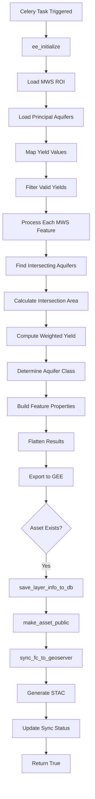
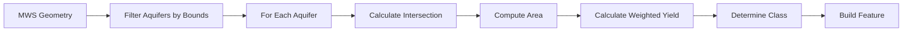

# Aquifer Vector Module

**File:** [`computing/misc/aquifer_vector.py`](../../computing/misc/aquifer_vector.py)

## Overview

This module generates **aquifer vector layers** by processing principal aquifer data and calculating intersection statistics with micro-watersheds (MWS). It provides detailed aquifer characteristics including yield values, lithology, and groundwater potential.

## Purpose

Processes aquifer boundary data to:
- Calculate intersection areas between aquifers and MWS
- Determine aquifer classification (Alluvium vs Hard-Rock)
- Compute weighted yield contributions
- Distribute to GEE, GeoServer, and STAC

## Architecture



## Components

### Main Task: `generate_aquifer_vector()`

**Location:** Line 22

**Parameters:**
| Parameter | Type | Description |
|-----------|------|-------------|
| `state` | str | State name |
| `district` | str | District name |
| `block` | str | Block/tehsil name |
| `gee_account_id` | int | GEE account identifier |

**Returns:** `bool` - Whether layer was successfully synced to GeoServer

## Processing Logic

### 1. Yield Value Mapping

The module maps textual yield descriptions to numerical values:

```python
yield_dict = ee.Dictionary({
    "": "NA",
    "-": "NA",
    "Upto 2%": 0.02,
    "1-2%": 0.02,
    "Upto 1.5%": 0.015,
    "Upto 3%": 0.03,
    # ... more mappings
    "8 - 16%": 0.16,
    "Not Explored": "NA",
    # ... additional mappings
})
```

### 2. MWS Processing

For each MWS feature:



### 3. Aquifer Classification

```python
aquifer_class = ee.Algorithms.If(
    ee.String(principal_value).equals("Alluvium"), 
    "Alluvium", 
    "Hard-Rock"
)
```

### 4. Feature Properties

Each output feature contains:

| Property | Description |
|----------|-------------|
| `uid` | MWS unique identifier |
| `id` | Feature ID |
| `area_in_ha` | MWS area in hectares |
| `intersection_area_ha` | Aquifer-MWS intersection area |
| `%_area_aquifer` | Percentage of MWS covered by aquifer |
| `weighted_contribution` | Weighted yield contribution |
| `aquifer_count` | Number of aquifers intersecting MWS |
| `aquifer_class` | "Alluvium" or "Hard-Rock" |
| `Age` | Geological age |
| `Lithology_` | Lithology code |
| `Major_Aq_1` | Major aquifer code |
| `Major_Aqui` | Major aquifer name |
| `Principal_` | Principal aquifer type |
| `avg_mbgl` | Average depth to water level |
| `m2_perday` | Specific capacity |
| `m3_per_day` | Yield in m³/day |
| `y_value` | Numerical yield value |

## Integration Points

```
computing/misc/aquifer_vector.py
├── computing.utils
│   ├── sync_fc_to_geoserver()    # GeoServer sync
│   ├── save_layer_info_to_db()   # Database persistence
│   └── update_layer_sync_status() # Status tracking
├── utilities.gee_utils
│   ├── ee_initialize()           # GEE authentication
│   ├── valid_gee_text()          # Text sanitization
│   ├── check_task_status()       # Task monitoring
│   ├── make_asset_public()       # ACL management
│   ├── is_gee_asset_exists()     # Asset existence check
│   ├── export_vector_asset_to_gee() # Vector export
│   └── get_gee_asset_path()      # Asset path generation
├── utilities.constants
│   └── GEE_DATASET_PATH          # Dataset path
└── computing.STAC_specs
    └── generate_vector_stac()    # STAC metadata generation
```

## Output

| Platform | Asset/Layer Name | Workspace |
|----------|------------------|-----------|
| GEE | `aquifer_vector_{district}_{block}` | N/A |
| GeoServer | `aquifer_vector_{district}_{block}` | `aquifer` |

**Dataset Name:** `Aquifer`

**STAC Layer Name:** `aquifer_vector`

## Usage

```python
# Trigger via Celery
from computing.misc.aquifer_vector import generate_aquifer_vector

result = generate_aquifer_vector.delay(
    state="Rajasthan",
    district="Jaipur",
    block="Sanganer",
    gee_account_id=1
)
```

## Key Calculations

### Intersection Area
```python
intersection = mws_geom.intersection(aquifer_geom, 1)
intersection_area_ha = intersection.area(1).divide(10000)
```

### Weighted Yield
```python
fraction = intersection_area.divide(mws_geom.area(1))
weighted_yield = fraction.multiply(aquifer.get("y_value"))
```

## Dependencies

- **ee** (Google Earth Engine Python API)
- **Celery** - Distributed task queue
