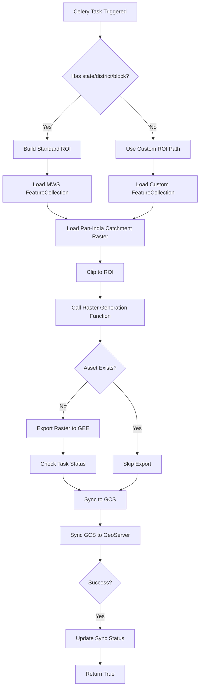
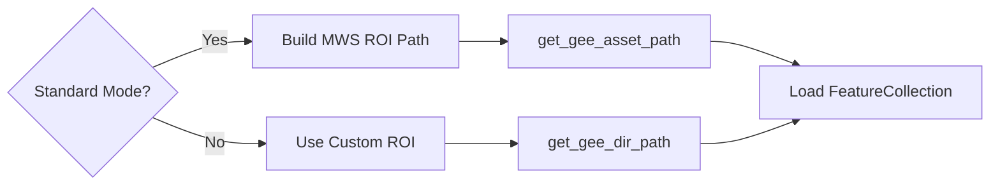
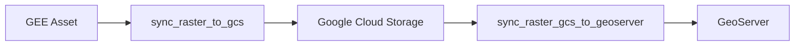

# Catchment Area Module

**File:** [`computing/misc/catchment_area.py`](../../computing/misc/catchment_area.py)

## Overview

This module generates **catchment area raster layers** by clipping pan-India catchment data to specific regions of interest. It supports both standard administrative boundaries (state/district/block) and custom project-based ROIs.

## Purpose

Processes catchment area data for:
- **MWS (Micro-Watershed)** applications with administrative boundaries
- **Custom Projects** with user-defined ROI paths
- Distributes to GEE, GeoServer (via GCS), and database

## Architecture



## Components

### Main Task: `generate_catchment_area_singleflow()`

**Location:** Line 25

**Parameters:**
| Parameter | Type | Description |
|-----------|------|-------------|
| `state` | str, optional | State name |
| `district` | str, optional | District name |
| `block` | str, optional | Block/tehsil name |
| `gee_account_id` | int, optional | GEE account identifier |
| `proj_id` | int, optional | Project ID for custom projects |
| `roi_path` | str, optional | Custom ROI asset path |
| `asset_suffix` | str, optional | Custom asset suffix |
| `asset_folder` | list, optional | Custom asset folder path |
| `app_type` | str | Application type (default: "MWS") |

**Returns:** `bool` - Whether layer was successfully synced to GeoServer

### Helper Function: `catchment_area_raster_generation()`

**Location:** Line 85

Handles the actual raster export and synchronization logic.

**Parameters:**
| Parameter | Type | Description |
|-----------|------|-------------|
| `raster` | ee.Image | Clipped raster image |
| `roi` | ee.FeatureCollection | Region of interest |
| `proj_id` | int, optional | Project ID |
| `state` | str, optional | State name |
| `district` | str, optional | District name |
| `block` | str, optional | Block name |
| `description` | str | Layer description |
| `asset_id` | str | GEE asset identifier |

## Processing Logic

### 1. ROI Determination



### 2. Data Source
```python
catchment_area_raster = ee.Image(CATCHMETN_AREA)  # From constants.pan_india_urls
```

### 3. Raster Processing
```python
raster = catchment_area_raster.clip(roi_boundary.geometry())
```

## Integration Points

```
computing/misc/catchment_area.py
├── computing.utils
│   ├── save_layer_info_to_db()   # Database persistence
│   └── update_layer_sync_status() # Status tracking
├── utilities.gee_utils
│   ├── ee_initialize()           # GEE authentication
│   ├── check_task_status()       # Task monitoring
│   ├── valid_gee_text()          # Text sanitization
│   ├── get_gee_asset_path()      # Asset path generation
│   ├── is_gee_asset_exists()     # Asset existence check
│   ├── sync_raster_to_gcs()      # GCS synchronization
│   ├── sync_raster_gcs_to_geoserver() # GeoServer sync
│   ├── export_raster_asset_to_gee() # Raster export
│   ├── make_asset_public()       # ACL management
│   └── get_gee_dir_path()        # Directory path generation
├── utilities.constants
│   └── GEE_PATHS                 # GEE path configurations
├── constants.pan_india_urls
│   └── CATCHMETN_AREA            # Pan-India catchment URL
└── projects.models
    └── Project                    # Project model for custom projects
```

## Output

| Platform | Asset/Layer Name | Workspace |
|----------|------------------|-----------|
| GEE | `catchment_area_{district}_{block}_raster` | N/A |
| GeoServer | `catchment_area_{district}_{block}_raster` | `catchment_area_singleflow` |

**Dataset Name:** `Catchment Area`

## Raster Sync Workflow



This module uses the **Raster Sync Pattern**:
1. Export raster to GEE asset
2. Sync GEE asset to Google Cloud Storage (GCS)
3. Sync GCS to GeoServer for WMS/WCS publication

## Usage

### Standard Administrative Boundary
```python
from computing.misc.catchment_area import generate_catchment_area_singleflow

result = generate_catchment_area_singleflow.delay(
    state="Rajasthan",
    district="Jaipur",
    block="Sanganer",
    gee_account_id=1
)
```

### Custom Project
```python
result = generate_catchment_area_singleflow.delay(
    proj_id=123,
    roi_path="projects/earthengine-legacy/assets/projects/custom/roi",
    asset_suffix="project_123",
    asset_folder=["CustomProject"],
    app_type="WATERBODY",
    gee_account_id=1
)
```

## Dependencies

- **ee** (Google Earth Engine Python API)
- **Celery** - Distributed task queue
- **projects.models.Project** - For custom project support
