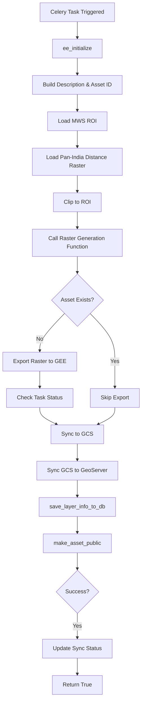
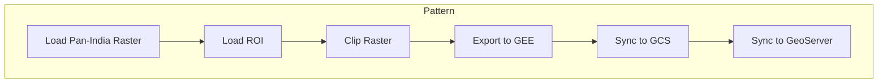

# Distance to Nearest Drainage Module

**File:** [`computing/misc/distancetonearestdrainage.py`](../../computing/misc/distancetonearestdrainage.py)

## Overview

This module generates **distance to nearest drainage line raster layers** by clipping pan-India drainage distance data to specific block boundaries. It provides distance measurements from each pixel to the nearest upstream drainage line.

## Purpose

Processes drainage proximity data for:
- Hydrological analysis
- Water resource planning
- Watershed characterization
- Distributes to GEE, GeoServer (via GCS), and database

## Architecture



## Components

### Main Task: `generate_distance_to_nearest_drainage_line()`

**Location:** Line 22

**Parameters:**
| Parameter | Type | Description |
|-----------|------|-------------|
| `state` | str | State name |
| `district` | str | District name |
| `block` | str | Block/tehsil name |
| `gee_account_id` | int | GEE account identifier |

**Returns:** `bool` - Whether layer was successfully synced to GeoServer

### Helper Function: `distance_to_drainage_line_raster_generation()`

**Location:** Line 52

Handles the raster export and synchronization logic.

**Parameters:**
| Parameter | Type | Description |
|-----------|------|-------------|
| `state` | str | State name |
| `district` | str | District name |
| `block` | str | Block name |
| `description` | str | Layer description |
| `roi` | ee.FeatureCollection | Region of interest |
| `raster` | ee.Image | Clipped raster image |

## Processing Logic

### 1. ROI Definition
```python
roi = ee.FeatureCollection(
    get_gee_asset_path(state, district, block)
    + "filtered_mws_"
    + valid_gee_text(district.lower())
    + "_"
    + valid_gee_text(block.lower())
    + "_uid"
)
```

### 2. Data Source
```python
distance_upsream_dl = ee.Image(DISTANCE_TO_UPSTREAM_DL)  # From constants.pan_india_urls
```

### 3. Raster Processing
```python
raster = distance_upsream_dl.clip(roi.geometry())
```

## Integration Points

```
computing/misc/distancetonearestdrainage.py
├── computing.utils
│   ├── save_layer_info_to_db()   # Database persistence
│   └── update_layer_sync_status() # Status tracking
├── utilities.gee_utils
│   ├── ee_initialize()           # GEE authentication
│   ├── check_task_status()       # Task monitoring
│   ├── valid_gee_text()          # Text sanitization
│   ├── get_gee_asset_path()      # Asset path generation
│   ├── is_gee_asset_exists()     # Asset existence check
│   ├── sync_raster_to_gcs()      # GCS synchronization
│   ├── sync_raster_gcs_to_geoserver() # GeoServer sync
│   ├── export_raster_asset_to_gee() # Raster export
│   └── make_asset_public()       # ACL management
└── constants.pan_india_urls
    └── DISTANCE_TO_UPSTREAM_DL   # Pan-India drainage distance URL
```

## Output

| Platform | Asset/Layer Name | Workspace |
|----------|------------------|-----------|
| GEE | `distance_to_drainage_line_{district}_{block}_raster` | N/A |
| GeoServer | `distance_to_drainage_line_{district}_{block}_raster` | `distance_nearest_upstream_DL` |

**Dataset Name:** `Distance to Drainage Line`

**Style Name:** `distance_nearest_upstream_DL`

## Raster Sync Workflow

This module follows the **Raster Sync Pattern**:


## Usage

```python
from computing.misc.distancetonearestdrainage import generate_distance_to_nearest_drainage_line

result = generate_distance_to_nearest_drainage_line.delay(
    state="Rajasthan",
    district="Jaipur",
    block="Sanganer",
    gee_account_id=1
)
```

## Pattern Classification

This module follows the **Simple Raster Clip Pattern**:



This pattern is shared with:
- `naturaldepression.py`
- `slope_percentage.py`
- `catchment_area.py`

## Dependencies

- **ee** (Google Earth Engine Python API)
- **Celery** - Distributed task queue
