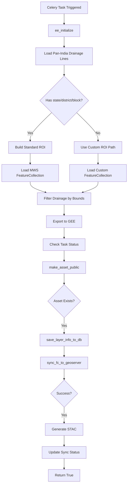
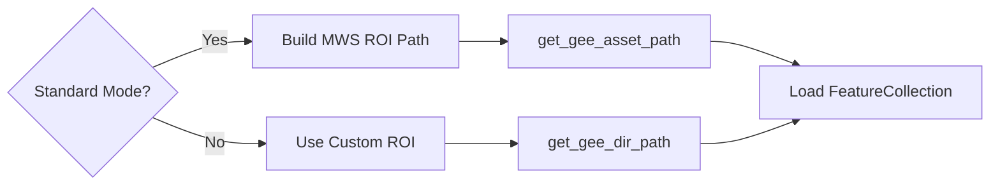
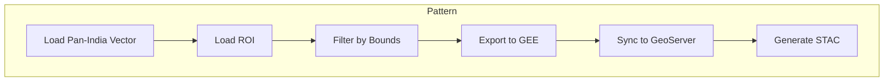

# Drainage Lines Module

**File:** [`computing/misc/drainage_lines.py`](../../computing/misc/drainage_lines.py)

## Overview

This module generates **drainage line vector layers** by clipping pan-India drainage line data to specific regions of interest. It supports both standard administrative boundaries (state/district/block) and custom project-based ROIs.

## Purpose

Processes drainage network data for:
- Hydrological analysis
- Watershed delineation
- Water resource management
- Distributes to GEE, GeoServer, and STAC

## Architecture



## Components

### Main Task: `clip_drainage_lines()`

**Location:** Line 26

**Parameters:**
| Parameter | Type | Description |
|-----------|------|-------------|
| `state` | str, optional | State name |
| `district` | str, optional | District name |
| `block` | str, optional | Block/tehsil name |
| `asset_suffix` | str, optional | Custom asset suffix |
| `asset_folder` | list, optional | Custom asset folder path |
| `gee_account_id` | int, optional | GEE account identifier |
| `roi_path` | str, optional | Custom ROI asset path |
| `app_type` | str | Application type (default: "MWS") |
| `proj_id` | int, optional | Project ID for custom projects |

**Returns:** `bool` - Whether layer was successfully synced to GeoServer

## Processing Logic

### 1. Data Source
```python
pan_india_drainage = ee.FeatureCollection(
    GEE_DATASET_PATH + "/drainage-line/pan_india_drainage_lines"
)
```

### 2. ROI Determination



### 3. Spatial Filter
```python
clipped_drainage = pan_india_drainage.filterBounds(roi.geometry())
```

## Integration Points

```
computing/misc/drainage_lines.py
├── computing.utils
│   ├── sync_layer_to_geoserver() # GeoServer sync (alternative)
│   ├── sync_fc_to_geoserver()    # GeoServer sync
│   ├── save_layer_info_to_db()   # Database persistence
│   └── update_layer_sync_status() # Status tracking
├── utilities.gee_utils
│   ├── ee_initialize()           # GEE authentication
│   ├── valid_gee_text()          # Text sanitization
│   ├── get_gee_asset_path()      # Asset path generation
│   ├── check_task_status()       # Task monitoring
│   ├── make_asset_public()       # ACL management
│   ├── is_gee_asset_exists()     # Asset existence check
│   ├── export_vector_asset_to_gee() # Vector export
│   └── get_gee_dir_path()        # Directory path generation
├── utilities.constants
│   ├── GEE_DATASET_PATH          # Dataset path
│   └── GEE_PATHS                 # GEE path configurations
├── projects.models
│   └── Project                    # Project model for custom projects
└── computing.STAC_specs
    └── generate_vector_stac()    # STAC metadata generation
```

## Output

| Platform | Asset/Layer Name | Workspace |
|----------|------------------|-----------|
| GEE | `drainage_lines_{district}_{block}` | N/A |
| GeoServer | `drainage_lines_{district}_{block}` | `drainage` |

**Dataset Name:** `Drainage`

**STAC Layer Name:** `drainage_lines_vector`

## Usage

### Standard Administrative Boundary
```python
from computing.misc.drainage_lines import clip_drainage_lines

result = clip_drainage_lines.delay(
    state="Rajasthan",
    district="Jaipur",
    block="Sanganer",
    gee_account_id=1
)
```

### Custom Project
```python
result = clip_drainage_lines.delay(
    proj_id=123,
    roi_path="projects/earthengine-legacy/assets/projects/custom/roi",
    asset_suffix="project_123",
    asset_folder=["CustomProject"],
    app_type="WATERBODY",
    gee_account_id=1
)
```

## Pattern Classification

This module follows the **Vector Clip Pattern**:



## Dependencies

- **ee** (Google Earth Engine Python API)
- **Celery** - Distributed task queue
- **projects.models.Project** - For custom project support
