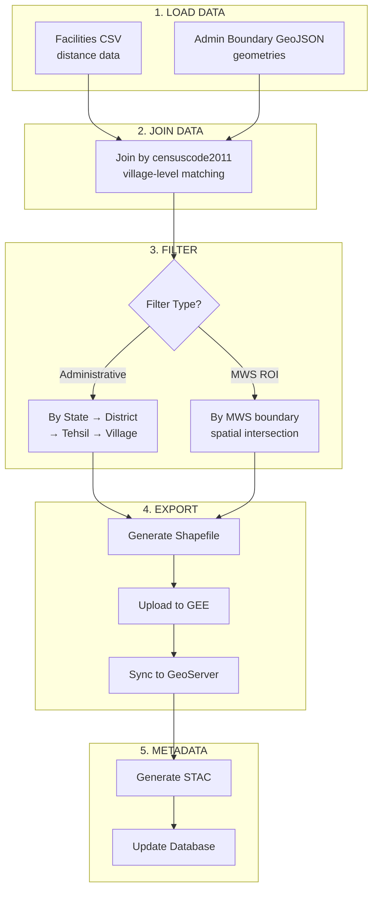

# Facilities Proximity Module

## Overview

The Facilities Proximity module processes and analyzes facility proximity data for villages across India. It provides distance metrics from villages to various essential facilities including healthcare, education, agriculture, banking, and food distribution centers.

## Data Sources

### Primary Data Source
- **CSV File**: `data/closest_facilities/closest_facilities.csv`
  - Contains village-level distance metrics to 25+ facility types
  - Identifier: `censuscode2011` (primary key for joining)
  - Location hierarchy: `state` → `district` → `subdistrict` (tehsil) → `name` (village)

### Geometry Source
- **Admin Boundary GeoJSON files**: Pan India village boundary geometries
  - Located in `data/admin-boundary/input/`
  - Joined with CSV data using censuscode2011

## Distance Metrics

The module tracks distances to the following facility categories:

### Agriculture (9 facilities)
| Field | Display Name |
|-------|--------------|
| `agri_industry_agri_processing_distance` | Agricultural Processing Unit |
| `agri_industry_agri_support_infrastructure_distance` | Agricultural Support Infrastructure |
| `agri_industry_co_operatives_societies_distance` | Co-operative Societies |
| `agri_industry_dairy_animal_husbandry_distance` | Dairy/Animal Husbandry |
| `agri_industry_distribution_utilities_distance` | Distribution Utilities |
| `agri_industry_industrial_manufacturing_distance` | Industrial Manufacturing |
| `agri_industry_markets_trading_distance` | Markets/Trading Centers |
| `agri_industry_storage_warehousing_distance` | Storage/Warehousing |
| `apmc_distance` | APMC Market |

### Banking (4 facilities)
| Field | Display Name |
|-------|--------------|
| `bank_atm_distance` | Bank ATM |
| `bank_branch_distance` | Bank Branch |
| `bank_mitra_distance` | Bank Mitra |
| `csc_distance` | Common Service Center |

### Health (5 facilities)
| Field | Display Name |
|-------|--------------|
| `health_chc_distance` | Community Health Center (CHC) |
| `health_dis_h_distance` | District Hospital |
| `health_phc_distance` | Primary Health Center (PHC) |
| `health_s_t_h_distance` | Sub-Divisional Hospital |
| `health_sub_cen_distance` | Health Sub-Center |

### Education (6 facilities)
| Field | Display Name |
|-------|--------------|
| `college_distance` | College |
| `school_higher_secondary_distance` | Higher Secondary School |
| `school_primary_distance` | Primary School |
| `school_secondary_distance` | Secondary School |
| `school_upper_primary_distance` | Upper Primary School |
| `universities_distance` | University |

### Food (1 facility)
| Field | Display Name |
|-------|--------------|
| `pds_distance` | Public Distribution System (PDS) |

## Processing Flow



## Celery Tasks

### `generate_facilities_proximity_layer`

Main task for generating facilities proximity layers for administrative areas.

**Parameters:**
| Parameter | Type | Required | Description |
|-----------|------|----------|-------------|
| `state` | str | Yes | State name |
| `district` | str | Yes | District name |
| `block` | str | Yes | Block/tehsil name |
| `gee_account_id` | int | No | GEE account ID |
| `village_code` | int/str | No | Village census code for village-level |
| `sync_to_geoserver` | bool | No | Sync to GeoServer (default: True) |
| `generate_stac` | bool | No | Generate STAC metadata (default: True) |

**Returns:**
```python
{
    "status": "success",  # or "error", "no_data", "pending"
    "state": "Uttar Pradesh",
    "district": "Jaunpur",
    "block": "Badlapur",
    "villages_count": 150,
    "gee_asset_id": "projects/ee-corestackdev/assets/apps/mws/...",
    "layer_id": 123,
    "layer_at_geoserver": True,
}
```

**Example Usage:**
```python
from computing.misc.facilities_proximity import generate_facilities_proximity_layer

# Block-level processing
result = generate_facilities_proximity_layer.delay(
    state="Uttar Pradesh",
    district="Jaunpur",
    block="Badlapur",
    gee_account_id=1,
)

# Village-level processing
result = generate_facilities_proximity_layer.delay(
    state="Uttar Pradesh",
    district="Jaunpur",
    block="Badlapur",
    village_code=123456,
    gee_account_id=1,
)
```

### `generate_facilities_for_mws`

Task for generating facilities layers for MWS (Micro-Watershed) boundaries.

**Parameters:**
| Parameter | Type | Required | Description |
|-----------|------|----------|-------------|
| `state` | str | Yes | State name |
| `district` | str | Yes | District name |
| `block` | str | Yes | Block/tehsil name |
| `mws_uid` | str | Yes | MWS unique identifier |
| `mws_geometry_geojson` | dict | No | MWS boundary as GeoJSON |
| `gee_account_id` | int | No | GEE account ID |
| `sync_to_geoserver` | bool | No | Sync to GeoServer (default: True) |

**Example Usage:**
```python
from computing.misc.facilities_proximity import generate_facilities_for_mws

result = generate_facilities_for_mws.delay(
    state="Uttar Pradesh",
    district="Jaunpur",
    block="Badlapur",
    mws_uid="MWS_001",
    mws_geometry_geojson={"type": "Polygon", "coordinates": [...]},
)
```

### `generate_facilities_report`

Task for generating facilities proximity reports.

**Parameters:**
| Parameter | Type | Required | Description |
|-----------|------|----------|-------------|
| `state` | str | Yes | State name |
| `district` | str | No | District name |
| `block` | str | No | Block/tehsil name |
| `village_codes` | list | No | List of village codes |
| `report_type` | str | No | "summary", "detailed", or "geojson" |

**Example Usage:**
```python
from computing.misc.facilities_proximity import generate_facilities_report

# Summary report
result = generate_facilities_report.delay(
    state="Uttar Pradesh",
    district="Jaunpur",
    block="Badlapur",
    report_type="summary",
)

# MWS-level report
result = generate_facilities_report.delay(
    state="Uttar Pradesh",
    village_codes=[123456, 123457, 123458],
    report_type="detailed",
)
```

## Convenience Functions

### Direct Access Functions

These functions can be called directly without Celery for synchronous operations:

```python
from computing.misc.facilities_proximity import (
    get_village_facilities,
    get_block_facilities,
    get_district_facilities,
    get_mws_facilities,
    get_facilities_summary,
)
```

#### `get_village_facilities`

Get facility distances for a specific village.

```python
# By census code
village = get_village_facilities(
    state="Uttar Pradesh",
    censuscode=123456,
)

# By name hierarchy
village = get_village_facilities(
    state="Uttar Pradesh",
    district="Jaunpur",
    tehsil="Badlapur",
    village_name="Rajepur",
)
```

**Returns:**
```python
{
    "village_info": {
        "censuscode2011": 123456,
        "name": "Rajepur",
        "subdistrict": "Badlapur",
        "district": "Jaunpur",
        "state": "Uttar Pradesh",
    },
    "facilities": {
        "health_phc_distance": {
            "distance_km": 5.2,
            "display_name": "Primary Health Center (PHC)",
            "category": "health",
        },
        "school_primary_distance": {
            "distance_km": 1.5,
            "display_name": "Primary School",
            "category": "education",
        },
        # ... more facilities
    }
}
```

#### `get_block_facilities`

Get all villages with facilities in a block/tehsil.

```python
villages = get_block_facilities(
    state="Uttar Pradesh",
    tehsil="Badlapur",
    district="Jaunpur",
)
```

#### `get_district_facilities`

Get all villages with facilities in a district.

```python
villages = get_district_facilities(
    state="Uttar Pradesh",
    district="Jaunpur",
)
```

#### `get_mws_facilities`

Get villages with facilities for an MWS.

```python
villages = get_mws_facilities(
    state="Uttar Pradesh",
    village_codes=[123456, 123457, 123458],
)
```

#### `get_facilities_summary`

Get aggregated statistics for villages.

```python
summary = get_facilities_summary(villages)
```

**Returns:**
```python
{
    "aggregated_stats": {
        "health_phc_distance": {
            "display_name": "Primary Health Center (PHC)",
            "category": "health",
            "min": 0.5,
            "max": 15.2,
            "mean": 5.8,
            "median": 4.2,
            "villages_within_5km": 85,
            "villages_within_10km": 120,
            "villages_within_20km": 145,
            "total_villages": 150,
        },
        # ... more facilities
    },
    "category_summary": {
        "health": {
            "facilities": [...],
            "avg_distance": 6.5,
        },
        "education": {
            "facilities": [...],
            "avg_distance": 3.2,
        },
        # ... more categories
    }
}
```

## Output Locations

### Local Files
- **Shapefiles**: `data/facilities_output/{state}/facilities_{district}_{block}/`
- **GeoJSON**: `data/facilities_output/{state}/facilities_{district}_{block}.json`

### GEE Assets
- **Path**: `projects/ee-corestackdev/assets/apps/mws/{state}/{district}/{block}/facilities_proximity_{district}_{block}`

### GeoServer
- **Workspace**: `facilities`
- **Layer Name**: `facilities_{district}_{block}`

### STAC
- **Catalog**: `data/STAC_specs/CorestackCatalogs/{state}/{district}/{block}/`
- **Layer Name**: `facilities_proximity_vector`

## Integration Points

### With Admin Boundary Module
- Uses admin boundary geometries from `computing.misc.admin_boundary`
- Joins facilities data with village boundaries using `censuscode2011`

### With MWS Pipeline
- Supports MWS-level processing via spatial intersection
- Integrates with MWS boundary files for ROI filtering

### With Standard Pipeline
- Follows the same pattern as other `computing/misc/` modules
- Uses shared utilities from `computing.utils` and `utilities.gee_utils`

## Error Handling

The module handles the following error scenarios:

1. **Missing CSV File**: Raises `FileNotFoundError` with descriptive message
2. **No Villages Found**: Returns status "no_data" with message
3. **Missing Geometries**: Falls back to point geometries from lat/lon in CSV
4. **Join Failures**: Logs warning and continues with available data
5. **GEE Upload Failures**: Logs error and continues with local processing

## Future Enhancements

1. **Dynamic Distance Fields**: Automatically discover new distance fields from CSV
3. **Batch Processing**: Support batch processing for multiple blocks
4. **API Integration**: REST API endpoints for direct access
5. **Visualization**: Built-in visualization for distance metrics

## Related Documentation

- [README](README.md) - Overall pipeline documentation
- [Admin Boundary Module](admin_boundary.md) - Village boundary processing