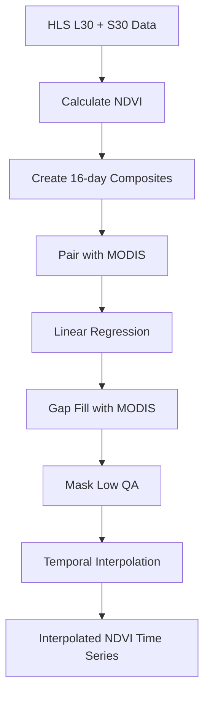
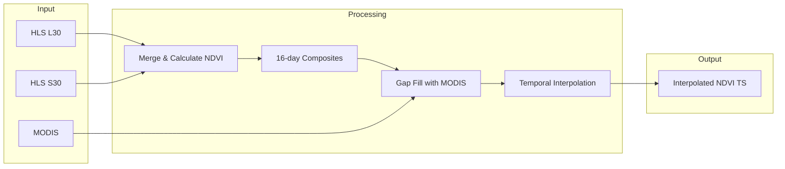

# HLS Interpolated NDVI Module

**File:** [`computing/misc/hls_interpolated_ndvi.py`](../../computing/misc/hls_interpolated_ndvi.py)

## Overview

This module provides **utility functions for generating gap-filled, interpolated NDVI time series** from Harmonized Landsat-Sentinel (HLS) data. It is a supporting module used by `ndvi_time_series.py`.

## Purpose

Creates high-quality NDVI time series by:
- Combining Landsat and Sentinel data
- Gap-filling with MODIS data
- Temporal interpolation for missing values
- Producing 14-16 day composite intervals

## Architecture



## Key Functions

### 1. `get_hls_collection()`

**Location:** Line 221

Fetches and merges HLS Landsat (L30) and Sentinel (S30) collections.

**Parameters:**
| Parameter | Type | Description |
|-----------|------|-------------|
| `start_date` | str | Start date (YYYY-MM-DD) |
| `end_date` | str | End date (YYYY-MM-DD) |
| `roi_boundary` | ee.Geometry | Region of interest |

**Returns:** `ee.ImageCollection` - Merged HLS with NDVI and NDWI bands

**Processing:**
```python
# Landsat L30 NDVI: (B5 - B4) / (B5 + B4)
ndvi_band = image.normalizedDifference(["B5", "B4"]).rename("NDVI")

# Sentinel S30 NDVI: (B8 - B4) / (B8 + B4)
ndvi_band = image.normalizedDifference(["B8", "B4"]).rename("NDVI")
```

### 2. `Get_LS_16Day_NDVI_TimeSeries()`

**Location:** Line 25

Creates 16-day NDVI composite time series.

**Parameters:**
| Parameter | Type | Description |
|-----------|------|-------------|
| `inputStartDate` | str | Start date |
| `inputEndDate` | str | End date |
| `harmonized_LS_ic` | ee.ImageCollection | HLS collection |
| `roi_boundary` | ee.Geometry | Region of interest |
| `days` | int | Composite interval (14 or 16) |

**Returns:** `ee.ImageCollection` - 16-day NDVI composites

### 3. `Combine_LS_Modis()`

**Location:** Line 119

Pairs HLS data with MODIS for gap-filling.

**Processing:**
1. Renames HLS bands with `_lsc` suffix
2. Pairs each HLS image with corresponding MODIS image (±8 days)
3. Performs linear regression between HLS and MODIS
4. Applies gap-filling using regression model

### 4. `gapfillLSM()`

**Location:** Line 74

Performs actual gap-filling using MODIS data.

**Logic:**
```python
# Linear regression model
offset = LSC_modis_regression_model.select("offset")
scale = LSC_modis_regression_model.select("scale")

# Gap-filled value
modisfit = image.select(modis_bandName).multiply(scale).add(offset)
gapfill = lsc_image.unmask(nodata).where(mask.Not(), modisfit)
```

**Quality Weights:**
| MODIS QA Value | Weight | Description |
|----------------|--------|-------------|
| 0 | 0.8 | Good data |
| 1 | 0.5 | Marginal data |
| 2+ | 0.2 | Snow/ice or cloudy |

### 5. `interpolate_timeseries()`

**Location:** Line 186

Performs temporal interpolation on gap-filled time series.

**Processing:**
1. Masks low-quality pixels (QA = 0.2)
2. Adds timestamp band to each image
3. Uses spatial-temporal join to find before/after images
4. Performs linear interpolation between valid observations

**Interpolation Formula:**
```python
timeRatio = (t - t1) / (t2 - t1)
interpolated = beforeMosaic + (afterMosaic - beforeMosaic) * timeRatio
```

### 6. `get_padded_ndvi_ts_image()`

**Location:** Line 253

Main entry point - generates complete interpolated NDVI time series.

**Parameters:**
| Parameter | Type | Description |
|-----------|------|-------------|
| `startDate` | str | Start date (YYYY-MM-DD) |
| `endDate` | str | End date (YYYY-MM-DD) |
| `roi_boundary` | ee.Geometry | Region of interest |
| `days` | int | Composite interval (default: 16) |

**Returns:** `ee.ImageCollection` - Interpolated NDVI time series

## Data Sources

| Source | Collection ID | Resolution | Bands Used |
|--------|---------------|------------|------------|
| HLS Landsat | `NASA/HLS/HLSL30/v002` | 30m | B4, B5 (Red, NIR) |
| HLS Sentinel | `NASA/HLS/HLSS30/v002` | 30m | B4, B8 (Red, NIR) |
| MODIS | `MODIS/061/MOD13Q1` | 250m | NDVI, SummaryQA |

## Processing Pipeline



## Usage

```python
from computing.misc.hls_interpolated_ndvi import get_padded_ndvi_ts_image

# Generate NDVI time series for a region
ndvi_ts = get_padded_ndvi_ts_image(
    start_date="2023-07-01",
    end_date="2024-06-30",
    roi_boundary=roi_geometry,
    days=14
)
```

## Dependencies

- **ee** (Google Earth Engine Python API)
- No external dependencies (pure GEE processing)

## Notes

- This module is not a Celery task - it provides utility functions
- Used by `ndvi_time_series.py` for generating vegetation index time series
- Gap-filling uses MODIS as a proxy for missing HLS observations
