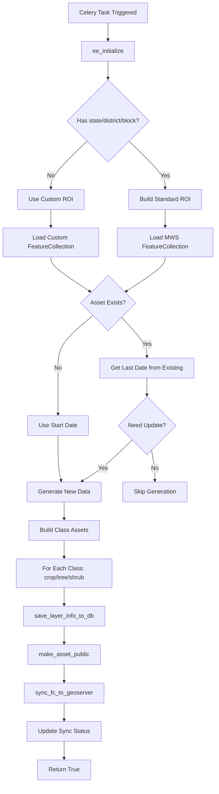
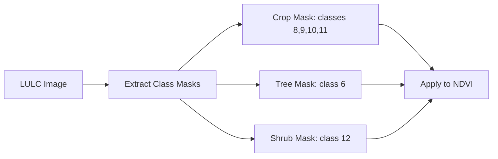
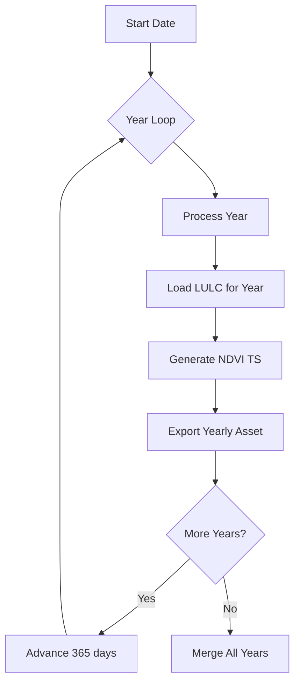

# NDVI Time Series Module

**File:** [`computing/misc/ndvi_time_series.py`](../../computing/misc/ndvi_time_series.py)

## Overview

This module generates **NDVI (Normalized Difference Vegetation Index) time series data** for micro-watersheds. It processes vegetation index data by land cover class (crop, tree, shrub) and creates temporal aggregations for analysis.

## Purpose

Creates vegetation index time series for:
- Agricultural monitoring
- Forest health assessment
- Vegetation change detection
- Distributes to GEE, GeoServer, and database

## Architecture



## Components

### Main Task: `ndvi_timeseries()`

**Location:** Line 34

**Parameters:**
| Parameter | Type | Description |
|-----------|------|-------------|
| `state` | str, optional | State name |
| `district` | str, optional | District name |
| `block` | str, optional | Block/tehsil name |
| `roi` | ee.FeatureCollection, optional | Custom ROI |
| `asset_suffix` | str, optional | Custom asset suffix |
| `asset_folder_list` | list, optional | Custom asset folder |
| `start_year` | int | Start year (fiscal: July 1) |
| `end_year` | int | End year (fiscal: June 30) |
| `app_type` | str | Application type (default: "MWS") |
| `gee_account_id` | int, optional | GEE account identifier |

**Returns:** `bool` - Whether layer was successfully synced to GeoServer

### Helper Functions

#### `extract_class_fc()`
**Location:** Line 172

Extracts features for a specific land cover class from yearly NDVI asset.

#### `build_final_class_asset()`
**Location:** Line 196

Merges yearly NDVI assets into a single time series per class.

#### `_generate_data()`
**Location:** Line 243

Generates yearly NDVI data with LULC masking.

#### `get_last_date()`
**Location:** Line 365

Extracts the last date from existing NDVI asset for incremental updates.

## Processing Logic

### 1. Fiscal Year Definition
```python
start_date = f"{start_year}-07-01"   # July 1 of start year
end_date = f"{end_year+1}-06-30"     # June 30 of end year
```

### 2. LULC Masking

NDVI is masked by land cover class:



**LULC Classes:**
| Class | Description |
|-------|-------------|
| 6 | Tree cover |
| 8, 9, 10, 11 | Crop types |
| 12 | Shrub cover |

### 3. NDVI Processing

```python
# Get interpolated NDVI time series
ndvi = get_padded_ndvi_ts_image(f_start_date_str, f_end_date_str, roi, 14)

# Add masked bands for each class
def add_masked_bands(img):
    nd = img.select("gapfilled_NDVI_lsc")
    date = img.date().format("YYYY-MM-dd")
    
    return ee.Image.cat([
        nd.updateMask(crop_mask).rename(ee.String("crop_").cat(date)),
        nd.updateMask(tree_mask).rename(ee.String("tree_").cat(date)),
        nd.updateMask(shrub_mask).rename(ee.String("shrub_").cat(date)),
    ])
```

### 4. Zonal Statistics

```python
reduced = ndvi_band_stack.reduceRegions(
    collection=roi.select(["uid"]),
    reducer=ee.Reducer.mean(),
    scale=30,
    tileScale=4
)
```

### 5. Yearly Processing

For multi-year time series, processes each year separately:



## Integration Points

```
computing/misc/ndvi_time_series.py
├── computing.misc.hls_interpolated_ndvi
│   └── get_padded_ndvi_ts_image()  # NDVI time series generation
├── computing.utils
│   ├── get_layer_object()          # Layer metadata retrieval
│   ├── save_layer_info_to_db()     # Database persistence
│   ├── sync_layer_to_geoserver()   # GeoServer sync
│   ├── update_layer_sync_status()  # Status tracking
│   └── sync_fc_to_geoserver()      # GeoServer sync
├── utilities.gee_utils
│   ├── ee_initialize()             # GEE authentication
│   ├── valid_gee_text()            # Text sanitization
│   ├── get_gee_dir_path()          # Directory path generation
│   ├── export_vector_asset_to_gee() # Vector export
│   ├── check_task_status()         # Task monitoring
│   ├── is_gee_asset_exists()       # Asset existence check
│   ├── merge_fc_into_existing_fc() # FeatureCollection merge
│   ├── make_asset_public()         # ACL management
│   ├── create_gee_dir()            # GEE directory creation
│   └── build_gee_helper_paths()    # Path building
├── utilities.constants
│   └── GEE_PATHS                   # GEE path configurations
└── gee_computing.models
    └── GEEAccount                  # GEE account model
```

## Output

Three separate assets are generated per block:

| Class | Asset Name | Description |
|-------|------------|-------------|
| Crop | `ndvi_timeseries_{district}_{block}_crop` | Agricultural vegetation |
| Tree | `ndvi_timeseries_{district}_{block}_tree` | Forest/tree vegetation |
| Shrub | `ndvi_timeseries_{district}_{block}_shrub` | Shrubland vegetation |

**GeoServer Workspace:** `ndvi_timeseries`

**Dataset Name:** `NDVI Timeseries`

## Feature Properties

Each MWS feature contains time series properties:

```
{
  "uid": "unique_mws_id",
  "crop_2023-07-01": 0.65,
  "crop_2023-07-15": 0.68,
  "crop_2023-08-01": 0.72,
  ...
  "tree_2023-07-01": 0.45,
  "tree_2023-07-15": 0.47,
  ...
  "shrub_2023-07-01": 0.32,
  ...
}
```

## Usage

```python
from computing.misc.ndvi_time_series import ndvi_timeseries

result = ndvi_timeseries.delay(
    state="Rajasthan",
    district="Jaipur",
    block="Sanganer",
    start_year=2022,
    end_year=2023,
    gee_account_id=1
)
```

## Incremental Updates

The module supports incremental updates:
1. Checks if asset already exists
2. Retrieves last date from existing asset
3. Only generates data for new time periods
4. Merges new data with existing data

## Dependencies

- **ee** (Google Earth Engine Python API)
- **Celery** - Distributed task queue
- **datetime** - Date handling
- **gee_computing.models.GEEAccount** - GEE account management
- **computing.misc.hls_interpolated_ndvi** - NDVI processing utilities
