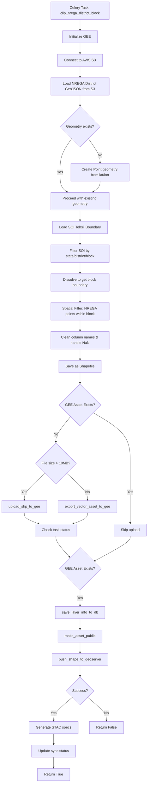
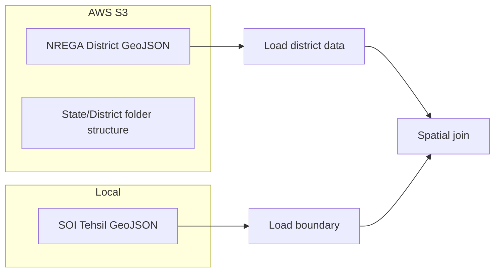
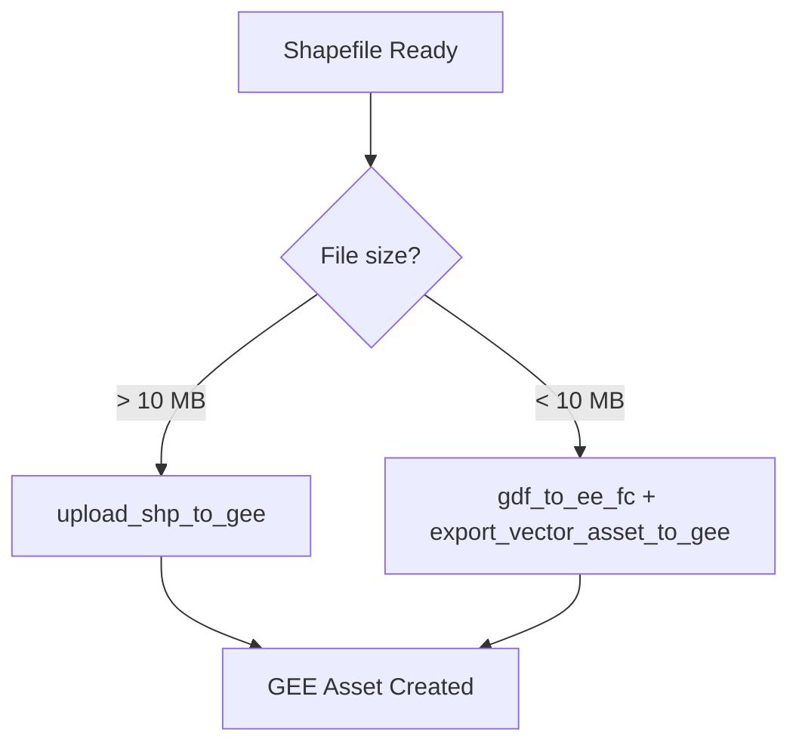

# NREGA Assets Module

**File:** [`computing/misc/nrega.py`](../../computing/misc/nrega.py)

## Overview

This module processes **NREGA (National Rural Employment Guarantee Act) assets** data - geospatial point data representing work sites under India's rural employment scheme. It clips district-level NREGA data to block boundaries and synchronizes across GEE, GeoServer, and STAC.

## Purpose

Extracts NREGA work site locations for specific administrative blocks and distributes them to:
- **Google Earth Engine (GEE)** - Cloud-based geospatial analysis platform
- **GeoServer** - Open-source geospatial data server (workspace: `nrega_assets`)
- **Database** - Layer metadata storage
- **STAC catalog** - SpatioTemporal Asset Catalog specifications

## Architecture



## Components

### Main Task: `clip_nrega_district_block()`

**Location:** Line 53

A Celery task that processes NREGA assets for a specific block.

**Parameters:**
| Parameter | Type | Description |
|-----------|------|-------------|
| `state` | str | State name |
| `district` | str | District name |
| `block` | str | Block/tehsil name |
| `gee_account_id` | int | GEE account identifier |

**Returns:** `bool` - Whether layer was successfully synced to GeoServer

### Helper Function: `export_shp_to_gee()`

**Location:** Line 41

Handles large file uploads (>10MB) to Google Earth Engine using shapefile upload method.

**Parameters:**
| Parameter | Type | Description |
|-----------|------|-------------|
| `district` | str | District name |
| `block` | str | Block name |
| `layer_path` | str | Path to shapefile |
| `asset_id` | str | GEE asset identifier |
| `gee_account_id` | int | GEE account identifier |

## Data Flow

### Input Sources



### Data Processing

1. **S3 Data Fetch**: Loads NREGA GeoJSON from AWS S3 bucket (`NREGA_BUCKET`)
2. **Geometry Creation**: Builds Point geometries from lat/lon if missing
3. **Boundary Loading**: Uses SOI tehsil boundary for spatial clipping
4. **Spatial Filter**: Keeps only NREGA points within block boundary
5. **Data Cleaning**: 
   - Applies `unidecode` for text normalization
   - Cleans column names (spaces → underscores)
   - Handles NaN values

### Output

| Platform | Asset/Layer Name | Workspace |
|----------|------------------|-----------|
| GEE | `nrega_{district}_{block}` | N/A |
| GeoServer | `nrega_{district}_{block}` | `nrega_assets` |
| STAC | `nrega_vector` | N/A |

## GEE Upload Strategy

The module uses a size-based upload strategy:



- **Large files (>10MB)**: Direct shapefile upload via `upload_shp_to_gee()`
- **Small files (<10MB)**: Convert to EE FeatureCollection and export

## Integration Points

```
computing/misc/nrega.py
├── computing.utils
│   ├── push_shape_to_geoserver()  # GeoServer publication
│   ├── save_layer_info_to_db()    # Database persistence
│   ├── get_directory_size()       # File size calculation
│   └── update_layer_sync_status() # Status tracking
├── utilities.gee_utils
│   ├── gdf_to_ee_fc()             # GeoDataFrame to EE FeatureCollection
│   ├── export_vector_asset_to_gee() # Vector export to GEE
│   ├── check_task_status()        # Task monitoring
│   ├── valid_gee_text()           # Text sanitization
│   ├── get_gee_asset_path()       # Asset path generation
│   ├── upload_shp_to_gee()        # Shapefile upload
│   ├── is_gee_asset_exists()      # Asset existence check
│   ├── ee_initialize()            # GEE authentication
│   └── make_asset_public()        # ACL management
├── utilities.constants
│   ├── ADMIN_BOUNDARY_INPUT_DIR   # Boundary input directory
│   ├── NREGA_ASSETS_INPUT_DIR     # NREGA input directory
│   └── NREGA_ASSETS_OUTPUT_DIR    # Output directory
└── computing.STAC_specs
    └── generate_vector_stac()     # STAC metadata generation
```

## Constants Used

| Constant | Source | Description |
|----------|--------|-------------|
| `ADMIN_BOUNDARY_INPUT_DIR` | `utilities.constants` | Input directory for boundary data |
| `NREGA_ASSETS_INPUT_DIR` | `utilities.constants` | Input directory for NREGA data |
| `NREGA_ASSETS_OUTPUT_DIR` | `utilities.constants` | Output directory for generated files |
| `NREGA_BUCKET` | `nrm_app.settings` | AWS S3 bucket name |
| `S3_ACCESS_KEY` | `nrm_app.settings` | AWS access key |
| `S3_SECRET_KEY` | `nrm_app.settings` | AWS secret key |

## Relationship with admin_boundary.py

### Shared Resources

Both modules share:
- **SOI Tehsil Boundary** (`ADMIN_BOUNDARY_INPUT_DIR + "/soi_tehsil.geojson"`)
- **Utility functions** from `computing.utils` and `utilities.gee_utils`
- **STAC generation** from `computing.STAC_specs`

### Key Differences

| Aspect | `admin_boundary.py` | `nrega.py` |
|--------|---------------------|------------|
| **Data Type** | Polygon boundaries (villages) | Point features (work sites) |
| **Data Source** | Local Census 2011 + SOI | AWS S3 bucket |
| **Boundary Usage** | Extract village polygons | Spatial filter for points |
| **GEE Upload Method** | `upload_shp_to_gee()` only | Size-based: `upload_shp_to_gee()` (>10MB) or `export_vector_asset_to_gee()` (<10MB) |
| **GeoServer Workspace** | `panchayat_boundaries` | `nrega_assets` |
| **STAC Layer Name** | `admin_boundaries_vector` | `nrega_vector` |
| **Dataset Name** | `Admin Boundary` | `NREGA Assets` |

## Usage

```python
# Trigger via Celery
from computing.misc.nrega import clip_nrega_district_block

result = clip_nrega_district_block.delay(
    state="Rajasthan",
    district="Jaipur",
    block="Sanganer",
    gee_account_id=1
)
```

## Error Handling

- Handles missing S3 files gracefully with empty GeoDataFrame
- Creates Point geometries from lat/lon if geometry column missing
- Handles missing block boundaries with appropriate error messages
- Logs all processing steps for debugging

## Dependencies

- **ee** (Google Earth Engine Python API)
- **geopandas** - Geospatial data manipulation
- **pandas** - Data manipulation
- **shapely** - Geometry operations
- **boto3** - AWS S3 access
- **unidecode** - Text normalization
- **Celery** - Distributed task queue
- **numpy** - Numerical operations
