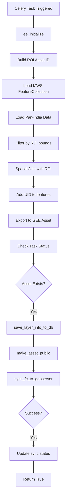

# Pan-India Clip Modules (Factory CSR, Green Credit, LCW Conflict, Mining Data)

## Overview

These four modules share an identical **Pan-India Clip Pattern** - they clip pan-India vector datasets to specific block boundaries and synchronize to GEE, GeoServer, and database.

---

# Factory CSR Module

**File:** [`computing/misc/factory_csr.py`](../../computing/misc/factory_csr.py)

## Purpose

Extracts Factory Corporate Social Responsibility (CSR) project locations for specific blocks.

## Data Source
```python
pan_india_asset_id = f"{GEE_EXT_DATASET_PATH}/Factory_CSR_pan_india"
```

## Output

| Platform | Asset/Layer Name | Workspace |
|----------|------------------|-----------|
| GEE | `{district}_{block}_factory_csr` | N/A |
| GeoServer | `{district}_{block}_factory_csr` | `factory_csr` |

**Dataset Name:** `Factory CSR`

---

# Green Credit Module

**File:** [`computing/misc/green_credit.py`](../../computing/misc/green_credit.py)

## Purpose

Extracts Green Credit project locations for specific blocks.

## Data Source
```python
pan_india_asset_id = f"{GEE_EXT_DATASET_PATH}/Green_credit_pan_india"
```

## Output

| Platform | Asset/Layer Name | Workspace |
|----------|------------------|-----------|
| GEE | `{district}_{block}_green_credit` | N/A |
| GeoServer | `{district}_{block}_green_credit` | `green_credit` |

**Dataset Name:** `Green Credit`

---

# LCW Conflict Module

**File:** [`computing/misc/lcw_conflict.py`](../../computing/misc/lcw_conflict.py)

## Purpose

Extracts Land Conflict Watch (LCW) conflict location data for specific blocks.

## Data Source
```python
pan_india_asset_id = f"{GEE_EXT_DATASET_PATH}/lcw_conflict_pan_india"
```

## Output

| Platform | Asset/Layer Name | Workspace |
|----------|------------------|-----------|
| GEE | `{district}_{block}_lcw_conflict` | N/A |
| GeoServer | `{district}_{block}_lcw_conflict` | `lcw` |

**Dataset Name:** `LCW Conflict`

---

# Mining Data Module

**File:** [`computing/misc/mining_data.py`](../../computing/misc/mining_data.py)

## Purpose

Extracts mining site location data for specific blocks.

## Data Source
```python
pan_india_asset_id = f"{GEE_EXT_DATASET_PATH}/Mining_data_pan_india"
```

## Output

| Platform | Asset/Layer Name | Workspace |
|----------|------------------|-----------|
| GEE | `{district}_{block}_mining` | N/A |
| GeoServer | `{district}_{block}_mining` | `mining` |

**Dataset Name:** `Mining`

---

## Shared Architecture

All four modules follow the **Pan-India Clip Pattern**:



## Shared Processing Logic

### 1. ROI Definition
```python
roi_asset_id = (
    get_gee_asset_path(state, district, block)
    + "filtered_mws_"
    + valid_gee_text(district.lower())
    + "_"
    + valid_gee_text(block.lower())
    + "_uid"
)
```

### 2. Spatial Filter
```python
clipped_data = pan_india_data.filterBounds(roi.geometry())
```

### 3. Spatial Join (Add UID)
```python
spatial_filter = ee.Filter.intersects(
    leftField=".geo", rightField=".geo", maxError=1
)

join = ee.Join.saveFirst(matchKey="roi_match")
joined_data = join.apply(clipped_data, roi, spatial_filter)

def add_uid(feature):
    feature = ee.Feature(feature)
    roi_match = ee.Feature(feature.get("roi_match"))
    uid = roi_match.get("uid")
    return feature.set("uid", uid).set("roi_match", None)

clipped_data_with_uid = joined_data.map(add_uid)
```

## Shared Integration Points

```
All Four Modules
├── computing.utils
│   ├── sync_fc_to_geoserver()    # GeoServer sync
│   ├── save_layer_info_to_db()   # Database persistence
│   └── update_layer_sync_status() # Status tracking
├── utilities.gee_utils
│   ├── ee_initialize()           # GEE authentication
│   ├── valid_gee_text()          # Text sanitization
│   ├── check_task_status()       # Task monitoring
│   ├── make_asset_public()       # ACL management
│   ├── is_gee_asset_exists()     # Asset existence check
│   ├── export_vector_asset_to_gee() # Vector export
│   └── get_gee_asset_path()      # Asset path generation
└── utilities.constants
    └── GEE_EXT_DATASET_PATH      # External dataset path
```

## Usage Pattern

All four modules use identical invocation:

```python
# Factory CSR
from computing.misc.factory_csr import generate_factory_csr_data
result = generate_factory_csr_data.delay(state, district, block, gee_account_id)

# Green Credit
from computing.misc.green_credit import generate_green_credit_data
result = generate_green_credit_data.delay(state, district, block, gee_account_id)

# LCW Conflict
from computing.misc.lcw_conflict import generate_lcw_conflict_data
result = generate_lcw_conflict_data.delay(state, district, block, gee_account_id)

# Mining Data
from computing.misc.mining_data import generate_mining_data
result = generate_mining_data.delay(state, district, block, gee_account_id)
```

## Dependencies

- **ee** (Google Earth Engine Python API)
- **Celery** - Distributed task queue
