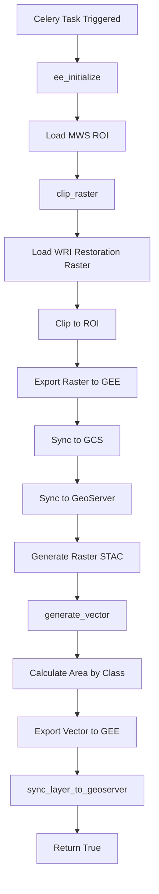
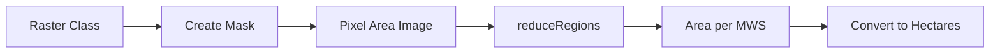
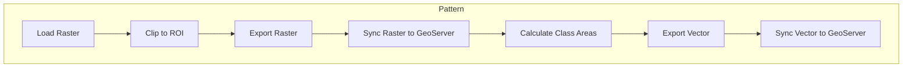

# Restoration Opportunity Module

**File:** [`computing/misc/restoration_opportunity.py`](../../computing/misc/restoration_opportunity.py)

## Overview

This module generates **forest landscape restoration opportunity layers** based on WRI (World Resources Institute) data. It produces both raster and vector outputs with restoration potential classifications.

## Purpose

Processes restoration opportunity data for:
- Forest restoration planning
- Land degradation assessment
- Conservation prioritization
- Distributes to GEE, GeoServer, and STAC

## Architecture



## Components

### Main Task: `generate_restoration_opportunity()`

**Location:** Line 25

**Parameters:**
| Parameter | Type | Description |
|-----------|------|-------------|
| `state` | str | State name |
| `district` | str | District name |
| `block` | str | Block/tehsil name |
| `gee_account_id` | int | GEE account identifier |

**Returns:** `bool` - Whether layer was successfully synced to GeoServer

### Helper Functions

#### `clip_raster()`
**Location:** Line 55

Clips the restoration opportunity raster to ROI and exports to GEE.

#### `generate_vector()`
**Location:** Line 114

Converts raster classes to vector features with area calculations.

## Processing Logic

### 1. Raster Processing

**Data Source:**
```python
restoration_raster = ee.Image(
    GEE_DATASET_PATH + "/WRI/LandscapeRestorationOpportunities"
)
```

**Classification Values:**
| Value | Label | Description |
|-------|-------|-------------|
| 0 | Excluded Areas | Not suitable for restoration |
| 1 | Mosaic Restoration | Mixed land use restoration |
| 2 | Wide-scale Restoration | Large-scale forest restoration |
| 3 | Protection | Areas needing protection |

### 2. Vector Generation

For each class, calculates pixel area within each MWS:



**Processing:**
```python
for arg in args:
    mask = raster.eq(ee.Number(arg["value"]))
    pixel_area = ee.Image.pixelArea()
    forest_area = pixel_area.updateMask(mask)
    
    fc = forest_area.reduceRegions(
        collection=fc, 
        reducer=ee.Reducer.sum(), 
        scale=10, 
        crs=raster.projection()
    )
    
    # Convert to hectares
    value = ee.Number(value).multiply(0.0001)
    feature = feature.set(arg["label"], value)
```

## Integration Points

```
computing/misc/restoration_opportunity.py
├── computing.utils
│   ├── sync_layer_to_geoserver() # GeoServer sync
│   ├── save_layer_info_to_db()   # Database persistence
│   └── update_layer_sync_status() # Status tracking
├── utilities.gee_utils
│   ├── ee_initialize()           # GEE authentication
│   ├── check_task_status()       # Task monitoring
│   ├── valid_gee_text()          # Text sanitization
│   ├── get_gee_asset_path()      # Asset path generation
│   ├── is_gee_asset_exists()     # Asset existence check
│   ├── sync_raster_to_gcs()      # GCS synchronization
│   ├── sync_raster_gcs_to_geoserver() # GeoServer sync
│   ├── export_raster_asset_to_gee() # Raster export
│   ├── export_vector_asset_to_gee() # Vector export
│   └── make_asset_public()       # ACL management
├── utilities.constants
│   └── GEE_DATASET_PATH          # Dataset path
└── computing.STAC_specs
    ├── generate_raster_stac()    # Raster STAC generation
    └── generate_vector_stac()    # Vector STAC generation
```

## Output

### Raster Output

| Platform | Asset/Layer Name | Workspace |
|----------|------------------|-----------|
| GEE | `restoration_{district}_{block}_raster` | N/A |
| GeoServer | `restoration_{district}_{block}_raster` | `restoration` |

**Dataset Name:** `Restoration Raster`

**STAC Layer Name:** `wri_restoration_raster`

### Vector Output

| Platform | Asset/Layer Name | Workspace |
|----------|------------------|-----------|
| GEE | `restoration_{district}_{block}_vector` | N/A |
| GeoServer | `restoration_{district}_{block}_vector` | `restoration` |

**Dataset Name:** `Restoration Vector`

## Feature Properties

Each MWS feature contains:

```json
{
  "uid": "unique_mws_id",
  "Excluded Areas": 123.45,
  "Mosaic Restoration": 456.78,
  "Wide-scale Restoration": 789.01,
  "Protection": 234.56
}
```

All area values are in **hectares**.

## Usage

```python
from computing.misc.restoration_opportunity import generate_restoration_opportunity

result = generate_restoration_opportunity.delay(
    state="Rajasthan",
    district="Jaipur",
    block="Sanganer",
    gee_account_id=1
)
```

## Pattern Classification

This module follows the **Raster-to-Vector Pattern**:



This pattern is shared with:
- `stream_order.py`

## Dependencies

- **ee** (Google Earth Engine Python API)
- **Celery** - Distributed task queue
