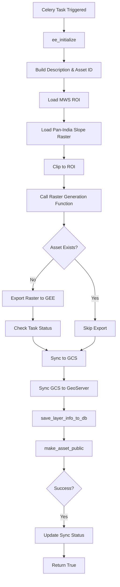

# Slope Percentage Module

**File:** [`computing/misc/slope_percentage.py`](../../computing/misc/slope_percentage.py)

## Overview

This module generates **slope percentage raster layers** by clipping pan-India slope data to specific block boundaries. Slope percentage is critical for land use planning, erosion assessment, and watershed management.

## Purpose

Processes slope gradient data for:
- Agricultural suitability analysis
- Erosion risk assessment
- Infrastructure planning
- Distributes to GEE, GeoServer (via GCS), and database

## Architecture



## Components

### Main Task: `generate_slope_percentage_data()`

**Location:** Line 19

**Parameters:**
| Parameter | Type | Description |
|-----------|------|-------------|
| `state` | str | State name |
| `district` | str | District name |
| `block` | str | Block/tehsil name |
| `gee_account_id` | int | GEE account identifier |

**Returns:** `bool` - Whether layer was successfully synced to GeoServer

### Helper Function: `slope_percentage_raster_generation()`

**Location:** Line 44

Handles the raster export and synchronization logic.

## Processing Logic

### 1. ROI Definition
```python
roi = ee.FeatureCollection(
    get_gee_asset_path(state, district, block)
    + "filtered_mws_"
    + valid_gee_text(district.lower())
    + "_"
    + valid_gee_text(block.lower())
    + "_uid"
)
```

### 2. Data Source
```python
slope_percentage_raster = ee.Image(SLOPE_PERCENTAGE)  # From constants.pan_india_urls
```

### 3. Raster Processing
```python
raster = slope_percentage_raster.clip(roi.geometry())
```

## Integration Points

```
computing/misc/slope_percentage.py
├── computing.utils
│   ├── save_layer_info_to_db()   # Database persistence
│   └── update_layer_sync_status() # Status tracking
├── utilities.gee_utils
│   ├── ee_initialize()           # GEE authentication
│   ├── check_task_status()       # Task monitoring
│   ├── valid_gee_text()          # Text sanitization
│   ├── get_gee_asset_path()      # Asset path generation
│   ├── is_gee_asset_exists()     # Asset existence check
│   ├── sync_raster_to_gcs()      # GCS synchronization
│   ├── sync_raster_gcs_to_geoserver() # GeoServer sync
│   ├── export_raster_asset_to_gee() # Raster export
│   └── make_asset_public()       # ACL management
└── constants.pan_india_urls
    └── SLOPE_PERCENTAGE          # Pan-India slope URL
```

## Output

| Platform | Asset/Layer Name | Workspace |
|----------|------------------|-----------|
| GEE | `{district}_{block}_slope_percentage_raster` | N/A |
| GeoServer | `{district}_{block}_slope_percentage_raster` | `slope_percentage` |

**Dataset Name:** `Slope Percentage`

**Style Name:** `slope_percentage`

## Usage

```python
from computing.misc.slope_percentage import generate_slope_percentage_data

result = generate_slope_percentage_data.delay(
    state="Rajasthan",
    district="Jaipur",
    block="Sanganer",
    gee_account_id=1
)
```

## Pattern Classification

This module follows the **Simple Raster Clip Pattern** - identical to:
- `distancetonearestdrainage.py`
- `naturaldepression.py`
- `catchment_area.py`

## Dependencies

- **ee** (Google Earth Engine Python API)
- **Celery** - Distributed task queue
