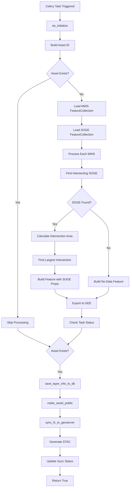
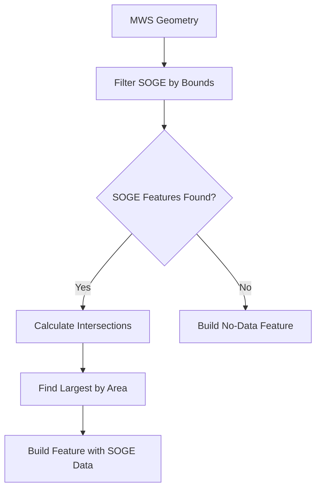
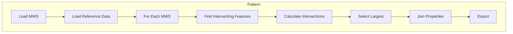

# SOGE Vector Module (Stage of Groundwater Extraction)

**File:** [`computing/misc/soge_vector.py`](../../computing/misc/soge_vector.py)

## Overview

This module generates **Stage of Groundwater Extraction (SOGE) vector layers** by processing groundwater data and associating it with micro-watersheds. SOGE indicates the level of groundwater development and extraction in an area.

## Purpose

Processes groundwater extraction data for:
- Groundwater resource assessment
- Water security planning
- Aquifer management
- Distributes to GEE, GeoServer, and STAC

## Architecture



## Components

### Main Task: `generate_soge_vector()`

**Location:** Line 25

**Parameters:**
| Parameter | Type | Description |
|-----------|------|-------------|
| `state` | str | State name |
| `district` | str | District name |
| `block` | str | Block/tehsil name |
| `gee_account_id` | int | GEE account identifier |

**Returns:** `bool` - Whether layer was successfully synced to GeoServer

## Processing Logic

### 1. Data Source
```python
soge_fc = ee.FeatureCollection(GEE_DATASET_PATH + "/SOGE_vector_2020")
```

### 2. MWS Processing

For each MWS feature:



### 3. Intersection Calculation
```python
def calculate_intersection(soge_feature):
    soge_geom = soge_feature.geometry()
    intersection_geom = soge_geom.intersection(mws_geom, 10)
    intersection_area_ha = ee.Number(intersection_geom.area(10)).divide(10000)
    return soge_feature.set({"intersection_area_ha": intersection_area_ha})

soge_with_intersections = soge_within_mws.map(calculate_intersection)
largest_soge = soge_with_intersections.sort("intersection_area_ha", False).first()
```

### 4. No-Data Handling

When no SOGE data intersects with MWS:
```python
def handle_no_data():
    return ee.Feature(mws_geom, {
        "uid": uid,
        "area_in_ha": area_in_ha,
        "max_intersection_area_ha": 0,
        "pct_area_soge": 0,
        "class": "No Data",
        "agwd_dom_i": -9999,
        # ... other fields set to -9999
    })
```

## Integration Points

```
computing/misc/soge_vector.py
├── computing.utils
│   ├── sync_fc_to_geoserver()    # GeoServer sync
│   ├── save_layer_info_to_db()   # Database persistence
│   └── update_layer_sync_status() # Status tracking
├── utilities.gee_utils
│   ├── ee_initialize()           # GEE authentication
│   ├── valid_gee_text()          # Text sanitization
│   ├── get_gee_asset_path()      # Asset path generation
│   ├── is_gee_asset_exists()     # Asset existence check
│   ├── sync_raster_to_gcs()      # GCS synchronization
│   ├── check_task_status()       # Task monitoring
│   ├── sync_raster_gcs_to_geoserver() # GeoServer sync
│   ├── export_vector_asset_to_gee() # Vector export
│   └── make_asset_public()       # ACL management
├── utilities.constants
│   └── GEE_DATASET_PATH          # Dataset path
└── computing.STAC_specs
    └── generate_vector_stac()    # STAC metadata generation
```

## Output

| Platform | Asset/Layer Name | Workspace |
|----------|------------------|-----------|
| GEE | `soge_vector_{district}_{block}` | N/A |
| GeoServer | `soge_vector_{district}_{block}` | `soge` |

**Dataset Name:** `SOGE`

**STAC Layer Name:** `stage_of_groundwater_extraction_vector`

## Feature Properties

Each MWS feature contains:

| Property | Description |
|----------|-------------|
| `uid` | MWS unique identifier |
| `area_in_ha` | MWS area in hectares |
| `max_intersection_area_ha` | Largest SOGE intersection area |
| `pct_area_soge` | Percentage of MWS covered by SOGE |
| `class` | SOGE classification |
| `agwd_dom_i` | Domestic groundwater draft |
| `agwd_irr` | Irrigation groundwater draft |
| `agwd_tot` | Total groundwater draft |
| `ar_gwr_tot` | Annual groundwater recharge |
| `code` | SOGE code |
| `gwr_2011_2` | Groundwater resource 2011 |
| `na_gwa` | Net annual groundwater availability |
| `nat_discha` | Natural discharge |
| `sgw_dev_pe` | Stage of groundwater development percentage |
| `soge_block` | Block name from SOGE |
| `soge_district` | District name from SOGE |
| `soge_objectid` | SOGE object ID |
| `soge_state` | State name from SOGE |
| `soge_tehsil` | Tehsil name from SOGE |

## Usage

```python
from computing.misc.soge_vector import generate_soge_vector

result = generate_soge_vector.delay(
    state="Rajasthan",
    district="Jaipur",
    block="Sanganer",
    gee_account_id=1
)
```

## Pattern Classification

This module follows the **MWS-Join Pattern**:



This pattern is similar to:
- `aquifer_vector.py`

## Dependencies

- **ee** (Google Earth Engine Python API)
- **Celery** - Distributed task queue
