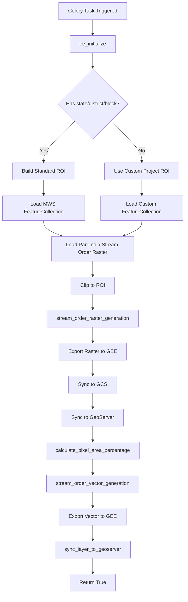
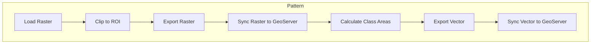

# Stream Order Module

**File:** [`computing/misc/stream_order.py`](../../computing/misc/stream_order.py)

## Overview

This module generates **stream order raster and vector layers** by clipping pan-India stream order data to specific regions. It produces both raster outputs and vector summaries with area percentages by stream order class.

## Purpose

Processes stream network data for:
- Hydrological analysis
- Drainage network characterization
- Watershed delineation
- Distributes to GEE, GeoServer, and database

## Architecture



## Components

### Main Task: `generate_stream_order()`

**Location:** Line 28

**Parameters:**
| Parameter | Type | Description |
|-----------|------|-------------|
| `state` | str, optional | State name |
| `district` | str, optional | District name |
| `block` | str, optional | Block/tehsil name |
| `gee_account_id` | int, optional | GEE account identifier |
| `proj_id` | int, optional | Project ID for custom projects |
| `roi_path` | str, optional | Custom ROI asset path |
| `asset_suffix` | str, optional | Custom asset suffix |
| `asset_folder` | list, optional | Custom asset folder |
| `app_type` | str | Application type (default: "MWS") |

**Returns:** `bool` - Whether layer was successfully synced to GeoServer

### Helper Functions

#### `stream_order_raster_generation()`
**Location:** Line 124

Handles raster export and synchronization.

#### `stream_order_vector_generation()`
**Location:** Line 185

Handles vector export and GeoServer sync.

#### `calculate_pixel_area_percentage()`
**Location:** Line 283

Calculates percentage area by stream order class for each MWS.

## Processing Logic

### 1. Data Source
```python
stream_order_raster = ee.Image(PAN_INDIA_SO)  # From constants.pan_india_path
```

### 2. Stream Order Classes

| Order | Label | Description |
|-------|-------|-------------|
| 1 | 1 | First-order streams (headwaters) |
| 2 | 2 | Second-order streams |
| 3 | 3 | Third-order streams |
| 4 | 4 | Fourth-order streams |
| 5 | 5 | Fifth-order streams |
| 6 | 6 | Sixth-order streams |
| 7 | 7 | Seventh-order streams |
| 8 | 8 | Eighth-order streams |
| 9 | 9 | Ninth-order streams |
| 10 | 10 | Tenth-order streams |
| 11 | 11 | Eleventh-order streams (major rivers) |

### 3. Area Calculation

For each stream order class:


**Processing:**
```python
for arg in class_labels:
    raster_band = raster.select(["b1"])
    mask = raster_band.eq(ee.Number(arg["value"]))
    class_area = pixel_area.updateMask(mask)
    
    fc_with_total = class_area.reduceRegions(
        collection=fc_with_total,
        reducer=ee.Reducer.sum(),
        scale=30,
        crs=raster.projection()
    )
    
    # Calculate percentage
    percentage = class_area_sum.divide(total_area).multiply(100)
```

## Integration Points

```
computing/misc/stream_order.py
├── computing.utils
│   ├── save_layer_info_to_db()   # Database persistence
│   ├── update_layer_sync_status() # Status tracking
│   └── sync_layer_to_geoserver() # GeoServer sync
├── utilities.gee_utils
│   ├── ee_initialize()           # GEE authentication
│   ├── check_task_status()       # Task monitoring
│   ├── valid_gee_text()          # Text sanitization
│   ├── get_gee_asset_path()      # Asset path generation
│   ├── is_gee_asset_exists()     # Asset existence check
│   ├── sync_raster_to_gcs()      # GCS synchronization
│   ├── sync_raster_gcs_to_geoserver() # GeoServer sync
│   ├── export_raster_asset_to_gee() # Raster export
│   ├── make_asset_public()       # ACL management
│   ├── get_gee_dir_path()        # Directory path generation
│   └── export_vector_asset_to_gee() # Vector export
├── utilities.constants
│   └── GEE_PATHS                 # GEE path configurations
├── constants.pan_india_path
│   └── PAN_INDIA_SO              # Pan-India stream order path
└── projects.models
    └── Project                    # Project model for custom projects
```

## Output

### Raster Output

| Platform | Asset/Layer Name | Workspace |
|----------|------------------|-----------|
| GEE | `stream_order_{district}_{block}_raster` | N/A |
| GeoServer | `stream_order_{district}_{block}_raster` | `stream_order` |

**Dataset Name:** `Stream Order`

### Vector Output

| Platform | Asset/Layer Name | Workspace |
|----------|------------------|-----------|
| GEE | `stream_order_{district}_{block}_vector` | N/A |
| GeoServer | `stream_order_{district}_{block}_vector` | `stream_order` |

## Feature Properties

Each MWS feature contains:

```json
{
  "uid": "unique_mws_id",
  "1": 12.5,
  "2": 18.3,
  "3": 25.7,
  "4": 15.2,
  "5": 10.8,
  "6": 8.4,
  "7": 5.2,
  "8": 2.8,
  "9": 1.1,
  "10": 0.0,
  "11": 0.0
}
```

All values are **percentages** of MWS area.

## Usage

### Standard Administrative Boundary
```python
from computing.misc.stream_order import generate_stream_order

result = generate_stream_order.delay(
    state="Rajasthan",
    district="Jaipur",
    block="Sanganer",
    gee_account_id=1
)
```

### Custom Project
```python
result = generate_stream_order.delay(
    proj_id=123,
    roi_path="projects/earthengine-legacy/assets/projects/custom/roi",
    asset_suffix="project_123",
    asset_folder=["CustomProject"],
    app_type="WATERBODY",
    gee_account_id=1
)
```

## Pattern Classification

This module follows the **Raster-to-Vector Pattern**:



This pattern is shared with:
- `restoration_opportunity.py`

## Dependencies

- **ee** (Google Earth Engine Python API)
- **Celery** - Distributed task queue
- **projects.models.Project** - For custom project support
