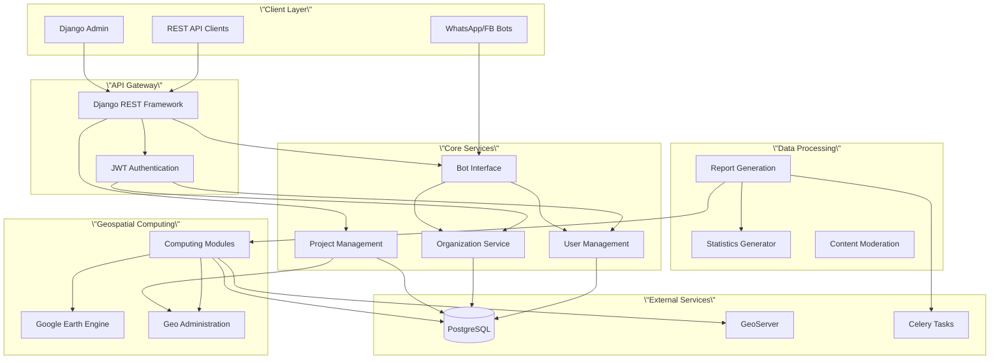

# Overview

CoRE Stack Backend is a comprehensive Django-based REST API system designed for natural resource management applications. This platform enables organizations to manage watershed planning, plantation monitoring, community engagement, and geospatial computing through a unified, multi-tenant architecture. The system integrates advanced technologies including Google Earth Engine for geospatial analysis, Celery for asynchronous task processing, and a sophisticated state machine architecture for bot interfaces.

## System Architecture

The backend follows a modular, service-oriented architecture built on Django 4.x with Django REST Framework. The system is organized into distinct functional domains, each handling specific aspects of natural resource management while maintaining clean separation of concerns.

This architecture ensures **scalability**, **maintainability**, and **clear separation of concerns** across different functional domains while maintaining data consistency through proper foreign key relationships.

## Core Functional Domains

### Multi-Tenant Organization Management

The foundation of the system is a sophisticated multi-tenant architecture that supports multiple organizations with complete data isolation. Each organization operates independently with its own users, projects, and resources while sharing the same underlying infrastructure.

The organization model [organization/models.py](../organization/models.py#L11-L30) provides UUID-based identification for security and supports ODK project integration. Organizations act as the top-level entity in the hierarchy, containing multiple projects with their own access controls.

Sources: [organization/models.py](../organization/models.py#L11-L30), [users/models.py](../users/models.py#L8-L110)

### User Management and Authorization

The system implements a **hierarchical permission system** built on Django's authentication framework, extended with organization-aware multi-tenancy. Users are categorized into account types (Individual or Organization) and assigned roles within specific projects through a flexible group-based permission model [users/models.py](../users/models.py#L13-L110).

The user model includes comprehensive metadata such as contact information, ODK credentials, and profile pictures. The permission system supports granular project-level access control through the `UserProjectGroup` model, enabling sophisticated role-based access patterns across different projects within an organization.

Sources: [users/models.py](users/models.py#L8-L132), [nrm\_app/settings.py](../nrm_app/settings.py#L168-L189)

### Bot Interface and State Machine Architecture

One of the most innovative aspects of this system is the bot interface module that supports multi-platform messaging through WhatsApp, Telegram, and Facebook. The core innovation is a **state machine JSON (SMJ)** framework [bot\_interface/models.py](../bot_interface/models.py#L46-L59) that defines conversational flows as configurable JSON definitions.

This architecture enables non-technical users to create and modify complex conversational workflows without touching code. The system tracks user sessions, logs interactions, and archives completed flows through comprehensive data models [bot\_interface/models.py](../bot_interface/models.py#L81-L176).

Sources: [bot\_interface/models.py](../bot_interface/models.py#L7-L176), [bot_interface/statemachine.py](../bot_interface/statemachine.py)

### Geospatial Computing with Google Earth Engine

The computing modules represent the analytical heart of the system, providing extensive geospatial analysis capabilities through Google Earth Engine integration. The system maintains a catalog of 30+ analysis scripts [README.md](README.md#L30-L60) covering hydrology, climate, terrain, land use, and welfare analysis.

Computations are organized into datasets and layers through the computing models [computing/models.py](computing/models.py#L12-L72), with support for vector, raster, point, and custom layer types. Each layer is linked to administrative boundaries (state, district, block) and tracked through GEE asset paths, enabling reproducibility and audit trails.

Sources: [computing/models.py](computing/models.py#L5-L72), [gee\_computing/models.py](gee_computing/models.py#L6-L33), [README.md](../README.md#L30-L60)

### Geographic Administration and Planning

The geoadmin module provides comprehensive management of Indian administrative boundaries with support for multiple coordinate systems. The system maintains both census code-based administrative units [geoadmin/models.py](../geoadmin/models.py#L9-L37) and Survey of India (SOI) boundaries [geoadmin/models.py](../geoadmin/models.py#L40-L66), enabling flexible geographic analysis.

Projects are tied to specific geographic extents through foreign key relationships, supporting operations at state, district, and block levels. This enables region-specific planning and analysis with proper geographic context.

Sources: [geoadmin/models.py](../geoadmin/models.py#L9-L66), [projects/models.py](../projects/models.py#L1-L54)

### Report Generation and Analytics

The DPR (Detailed Project Report) system generates comprehensive reports for watershed projects based on ODK field data collection. The system manages multiple data types including settlements, wells, water bodies, groundwater structures, agricultural data, and livelihood information [dpr/models.py](../dpr/models.py#L4-L310).

All ODK submissions include moderation flags and JSON data storage, enabling both structured analysis and flexible data access. The system also tracks maintenance activities for water structures, providing complete lifecycle management.

Sources: [dpr/models.py](../dpr/models.py#L4-L319)

## Technology Stack

The system leverages a modern, production-ready technology stack optimized for geospatial computing and multi-tenant SaaS operations:

| Component | Technology | Purpose |
| --- | --- | --- |
| **Backend Framework** | Django 4.2 | Web framework and ORM |
| **API Layer** | Django REST Framework | RESTful API development |
| **Authentication** | Simple JWT | Token-based authentication |
| **Database** | PostgreSQL | Relational data storage |
| **Task Queue** | Celery + RabbitMQ | Asynchronous task processing |
| **Geospatial Engine** | Google Earth Engine | Earth observation data analysis |
| **Mapping Server** | GeoServer | Geospatial data serving |
| **API Documentation** | drf-yasg (Swagger) | Interactive API documentation |

Sources: [nrm\_app/settings.py](../nrm_app/settings.py#L75-L130), [nrm\_app/celery.py](../nrm_app/celery.py), [installation/environment.yml](../installation/environment.yml)

## Project Structure

The repository is organized into functional modules, each representing a distinct domain of functionality:

| Module | Purpose |
| --- | --- |
| **nrm\_app/** | Core Django project configuration |
| **users/** | User management and authentication |
| **organization/** | Multi-tenant organization management |
| **projects/** | Project and application type management |
| **bot\_interface/** | Multi-platform bot framework |
| **computing/** | Geospatial analysis modules |
| **gee\_computing/** | Google Earth Engine integration |
| **geoadmin/** | Administrative boundary management |
| **dpr/** | Report generation and ODK data |
| **moderation/** | Content moderation workflow |
| **public\_api/** | External API access |
| **stats\_generator/** | Statistical calculations |
| **utilities/** | Shared utility functions |

Sources: [nrm\_app/settings.py](../nrm_app/settings.py#L75-L130), [get\_repo\_structure](.)

## Key Features

### Hierarchical Permission System

The system implements a sophisticated 4-tier permission model:

1. **Superadmin**: Full system access across all organizations
2. **Organization Admin**: Complete control within their organization
3. **Project Manager**: Manage specific projects and assign users
4. **App User**: Role-based access to specific application features

This hierarchy is enforced through custom permission decorators and the `has_project_permission` method on the User model [users/models.py](../users/models.py#L65-L110).

Sources: [users/models.py](../users/models.py#L65-L110), <users/permissions.py>

### Asynchronous Task Processing

Long-running geospatial computations and report generation are handled by Celery workers, preventing request timeouts and enabling background processing. The system uses a dedicated 'nrm' queue [README.md](../README.md#L25-L28) for task routing and supports multiple worker processes for scalability.

Sources: <../nrm_app/celery.py>, <../computing/tasks.py>

### Configurable State Machine Flows

The bot interface uses a JSON-based state machine definition system that enables rapid iteration on conversational workflows without code changes. Flows are defined in the SMJ model [bot\_interface/models.py](../bot_interface/models.py#L46-L59) and can be swapped across different bot instances.

Sources: [bot\_interface/models.py](../bot_interface/models.py#L46-L59), <bot_interface/statemachine.py>

### Comprehensive Audit Trail

All major entities track creation and modification timestamps along with user attribution. Combined with detailed user logs [bot\_interface/models.py](../bot_interface/models.py#L138-L161) and session archiving [bot\_interface/models.py](../bot_interface/models.py#L165-L176), this provides complete traceability for compliance and debugging.

Sources: [bot\_interface/models.py](../bot_interface/models.py#L138-L176)

## Getting Started

For beginner developers, we recommend the following learning path:

1. **Understand the Basics**: Start with [Project Architecture and Module Organization](/3-project-architecture-and-module-organization)  to understand how the system is organized
2. **Set Up Your Environment**: Follow [Quick Start](./2-quick-start)  and [Environment Configuration and Setup](./4-environment-configuration-and-setup)  to get the system running locally
3. **Explore the Core**: Study [Django Project Settings and Environment Variables](/5-django-project-settings-and-environment-variables)  to understand configuration
4. **Learn User Management**: Review [Multi-Tenant Organization and User Management](/6-multi-tenant-organization-and-user-management)  to understand the permission system
5. **Dive Deeper**: Explore specific domains based on your interests - geospatial computing, bot interfaces, or report generation

Sources: [README.md](../README.md#L1-L29), [docs/index.md](../docs/index.md#L1-L150)

## Next Steps

Continue your journey through the CoRE Stack documentation:

* **For Setup**: [Quick Start](./2-quick-start.md)  provides step-by-step installation instructions
* **For Architecture**: [Project Architecture and Module Organization](/3-project-architecture-and-module-organization)  dives deeper into system design
* **For Configuration**: [Environment Configuration and Setup](/4-environment-configuration-and-setup)  explains all required settings
* **For Core Concepts**: [Django Project Settings and Environment Variables](/5-django-project-settings-and-environment-variables)  details the configuration system
* **For User Management**: [Multi-Tenant Organization and User Management](/6-multi-tenant-organization-and-user-management)  explains the multi-tenant architecture

The CoRE Stack Backend is designed to be approachable for beginners while providing the depth and sophistication needed for complex natural resource management applications. Start with the basics, experiment with the provided scripts, and gradually explore the more advanced features as you become comfortable with the system.