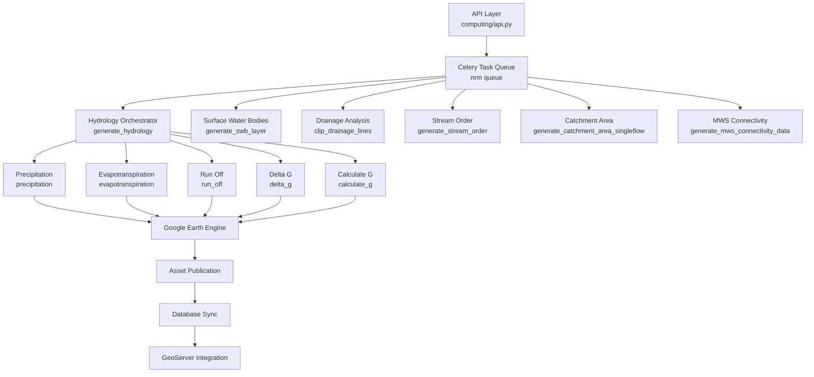

# Hydrological Computing Modules

The Hydrological Computing Modules provide a comprehensive suite of geospatial analysis capabilities for water resource management, enabling sophisticated micro-watershed hydrological modeling through Google Earth Engine integration. This system supports both fortnightly and annual temporal resolutions, processing precipitation, evapotranspiration, runoff, and groundwater dynamics at various administrative scales.

## Architecture Overview

The hydrological computing system operates as a coordinated pipeline of Celery-managed tasks that leverage Google Earth Engine's computational infrastructure. The architecture  orchestrates multiple independent computational modules—each responsible for specific hydrological parameters—while managing asset publication, database synchronization, and GeoServer integration through a unified API layer.

## Core Hydrological Parameters

### Micro-Watershed Hydrology Generation

The `generate_hydrology` function serves as the primary orchestrator for hydrological computations, coordinating four fundamental water balance components [computing/mws/generate\_hydrology.py#L28-L42]. The function accepts geographical boundaries (state, district, block), temporal parameters (start\_year, end\_year), and supports both fortnightly and annual aggregation modes through the `is_annual` flag.

The orchestration follows a parallel execution pattern where precipitation, evapotranspiration, and runoff computations are initiated simultaneously [computing/mws/generate\_hydrology.py#L80-L109]. After task completion, the system validates asset existence, makes assets publicly accessible, and synchronizes metadata to the database with algorithm versioning information.

**Parameter Configuration:**

| Parameter | Type | Description | Default |
| --- | --- | --- | --- |
| state | str | Administrative state boundary | None |
| district | str | Administrative district boundary | None |
| block | str | Administrative block boundary | None |
| start\_year | int | Hydrological year start (July 1) | Required |
| end\_year | int | Hydrological year end (June 30) | Required |
| is\_annual | bool | Annual vs fortnightly aggregation | False |




#### Precipitation Processing

The precipitation module processes temporal precipitation data using IMERG datasets, generating multi-temporal composites for the specified analysis period [computing/mws/precipitation.py#L16-L24]. The function constructs asset identifiers using a standardized naming convention combining administrative boundaries and temporal resolution suffixes.

The implementation handles both fortnightly and annual aggregations, with fortnightly processing generating 26 composite periods per hydrological year. The system validates asset path availability before initiating Earth Engine export tasks, ensuring data consistency across the pipeline [computing/mws/precipitation.py#L83-L127].

Precipitation data uses a hydrological year definition from July 1 to June 30, which differs from calendar year boundaries and aligns with monsoon cycle analysis requirements for agricultural planning.

#### Evapotranspiration Calculation

Evapotranspiration computations leverage the FLDAS (Famine Early Warning Systems Network Land Data Assimilation System) dataset, providing global-scale ET estimates at 0.1° resolution [computing/mws/evapotranspiration.py#L192-L297]. The module implements dual data sources—`et_fldas` for regional coverage and `et_global_fldas` for worldwide availability—ensuring computational continuity across different geographical extents.

The ET calculation employs monthly aggregation logic, where FLDAS provides single monthly average values that require temporal scaling to represent actual ET for varying month lengths [computing/mws/evapotranspiration.py#L392-L407]. The system extracts first and last dates for each month, multiplies by day count, and generates continuous temporal composites matching the precipitation temporal resolution.

#### Surface Runoff Modeling

Runoff calculations implement a water balance approach combining precipitation inputs, evapotranspiration losses, and terrain characteristics to estimate surface water flow [computing/mws/run\_off.py#L175-L218]. The module generates raster outputs representing runoff depth or volume, depending on the parameterization scheme.

The computation follows a chunked processing strategy for large temporal extents, managing Earth Engine memory constraints through iterative asset generation and merging operations [computing/mws/evapotranspiration.py#L136-L167]. This approach ensures that multi-year analyses complete without exceeding computational resource limits.

### Groundwater Dynamics

#### Delta G (Groundwater Change)

The delta\_g module quantifies temporal changes in groundwater storage, providing critical indicators for aquifer sustainability assessment [computing/mws/delta\_g.py#L14-L22]. The function processes multi-temporal hydrological datasets to compute storage differentials, supporting both fortnightly and annual resolution analysis.

The implementation generates metadata-enriched assets with algorithm version tracking, enabling reproducibility and longitudinal comparisons across different analysis periods [computing/mws/delta\_g.py#L104-L173]. Asset paths follow hierarchical organization by administrative boundaries, facilitating efficient data discovery and management.

#### G Parameter Calculation

The calculate\_g function computes the groundwater recharge parameter (G), representing net groundwater accretion or depletion [computing/mws/calculateG.py#L17-L26]. This parameter integrates multiple hydrological components, typically incorporating precipitation infiltration, runoff reduction, and evapotranspiration partitioning.

The calculation requires delta\_g outputs as primary inputs, with additional parameters derived from the hydrological balance equation. The system validates input asset availability before initiating computation, ensuring pipeline integrity [computing/mws/calculateG.py#L27-L131].

#### Well Depth Analysis

Well depth monitoring provides ground-based validation and trend analysis for groundwater dynamics [computing/mws/well\_depth.py#L16-L22]. The module processes observational well data, generating temporal depth profiles and trend indicators for water resource management.

The implementation handles spatial interpolation and temporal aggregation, converting point measurements to spatially continuous layers suitable for integration with other hydrological parameters [computing/mws/well\_depth.py#L62-L172].

## Surface Water Body Detection

The surface water bodies module employs multi-spectral remote sensing analysis to identify and classify water features across the landscape [computing/surface\_water\_bodies/swb.py#L26-L40]. The system supports multiple detection algorithms (swb1-swb4) with varying parameterization and classification thresholds.

### Multi-Algorithm Approach

The swb implementation provides four distinct detection strategies, each optimized for different environmental conditions and water body characteristics [computing/surface\_water\_bodies/swb.py]. This multi-algorithm approach enables adaptive processing for varying turbidity, vegetation cover, and seasonal conditions.

The module includes asset synchronization functionality that automatically publishes generated layers to GeoServer and records metadata in the application database [computing/surface\_water\_bodies/swb.py#L131-L185]. This integration ensures seamless data flow between Earth Engine processing and visualization endpoints.

## Catchment and Drainage Analysis

### Drainage Network Processing

The drainage lines module processes vector hydrography datasets, clipping and standardizing drainage features to match administrative boundaries [computing/misc/drainage\_lines.py#L25-L37]. The system validates topology, handles multipart geometries, and generates standardized outputs suitable for hydrological modeling.

### Stream Order Classification

Stream order analysis implements the Strahler classification scheme, organizing drainage networks into hierarchical systems based on confluence patterns [computing/misc/stream\_order.py#L27-L40]. The module generates both raster representations for spatial analysis and vector layers for attribute-based querying.

The implementation includes pixel area percentage calculations, enabling quantification of drainage density and network characteristics [computing/misc/stream\_order.py#L283-L330]. These metrics support geomorphological analysis and hydrological response modeling.

### Catchment Area Delineation

Catchment area computation uses single-flow direction algorithms to delineate contributing areas for each drainage network segment [computing/misc/catchment\_area.py#L24-L36]. The module generates raster outputs representing upstream contributing area, supporting flood risk assessment and hydrological modeling applications.

The catchment\_area function in the catchment\_area subdirectory provides specialized analysis for surface water body integration, computing maximum stream order and catchment characteristics [computing/catchment\_area/catchmentarea.py#L10-L32].

### Natural Depression Identification

Natural depression mapping identifies topographic depressions that function as localized catchment areas, supporting water harvesting and groundwater recharge site identification [computing/misc/naturaldepression.py#L21-L49]. The module employs digital elevation model analysis to locate closed depressions across the landscape.

### Distance to Drainage

The distance to nearest drainage line module computes proximity metrics for hydrological connectivity analysis [computing/misc/distancetonearestdrainage.py#L21-L54]. This analysis supports erosion risk assessment, site suitability evaluation, and infrastructure planning applications.

Distance to drainage calculations provide critical inputs for identifying potential recharge zones and assessing hydrological connectivity across heterogeneous landscapes.

## Advanced Hydrological Indices

### Drainage Density

The drainage density module computes linear drainage feature length per unit area, providing a quantitative measure of drainage network development [computing/clart/drainage\_density.py#L23-L74]. Higher drainage density values indicate more dissected terrain with greater surface runoff potential.

The implementation generates vector outputs with per-feature density attributes, enabling spatial analysis and correlation with other landscape characteristics [computing/clart/drainage\_density.py#L75-L226].

### MWS Connectivity

Micro-watershed connectivity analysis quantifies the hydrological linkages between adjacent watersheds, supporting integrated water resource management [computing/mws/mws\_connectivity.py#L21-L92]. The module identifies flow pathways and assesses cumulative effects of upstream interventions on downstream areas.

## API Integration

### Request Processing

All hydrological computations are initiated through REST API endpoints that validate authentication, extract parameters, and enqueue Celery tasks for asynchronous processing [computing/api.py]. The API layer implements security checks via decorators and provides standardized response formats for task initiation confirmation.

### Key Endpoints

| Endpoint | Function | Module | Temporal Resolution |
| --- | --- | --- | --- |
| generate\_fortnightly\_hydrology | Hydrological parameters | mws/generate\_hydrology | Fortnightly |
| generate\_annual\_hydrology | Hydrological parameters | mws/generate\_hydrology | Annual |
| generate\_swb | Surface water bodies | surface\_water\_bodies/swb | Variable |
| generate\_drainage\_layer | Drainage network | misc/drainage\_lines | Static |
| stream\_order | Stream classification | misc/stream\_order | Static |
| generate\_catchment\_area\_SF | Catchment delineation | misc/catchment\_area | Static |
| generate\_natural\_depression | Depression mapping | misc/naturaldepression | Static |
| generate\_distance\_nearest\_upstream\_DL | Drainage proximity | misc/distancetonearestdrainage | Static |

Example API call for fortnightly hydrology:

```python
POST /api/generate_fortnightly_hydrology/
{
  "state": "Rajasthan",
  "district": "Jaipur",
  "block": "Jaipur",
  "start_year": 2022,
  "end_year": 2023,
  "gee_account_id": "project-id"
}
```

## Data Flow and Asset Management

### Asset Path Structure

Generated assets follow a hierarchical organization scheme reflecting administrative boundaries and data types [computing/mws/generate\_hydrology.py#L35-L48]. Asset paths incorporate state, district, and block identifiers, enabling efficient spatial querying and data management.

### Database Synchronization

The system maintains metadata records for all generated layers through the `save_layer_info_to_db` function [computing/mws/generate\_hydrology.py#L110-L150]. Records include asset IDs, algorithm versions, temporal extents, and administrative associations, supporting comprehensive provenance tracking and metadata discovery.

### GeoServer Integration

Published layers are automatically registered with GeoServer workspaces, enabling visualization and geospatial service delivery [computing/surface\_water\_bodies/swb.py#L131-L185]. The integration supports multiple workspace types corresponding to different data categories (hydrology, drainage, surface water bodies).

## Computational Considerations

### Task Orchestration

The hydrological pipeline uses parallel task execution to minimize total processing time, with independent parameter computations (precipitation, ET, runoff) initiated simultaneously [computing/mws/generate\_hydrology.py#L80-L109]. Task status monitoring ensures dependent operations proceed only after prerequisite assets are available.

### Memory Management

Large temporal extent analyses employ chunked processing strategies to avoid exceeding Earth Engine memory limits [computing/mws/evapotranspiration.py#L136-L167]. This approach partitions temporal ranges into manageable segments, generating intermediate assets that are subsequently merged into final composites.

### Recursion Limits

The system sets elevated recursion limits (6000) to accommodate nested function calls in complex hydrological computations [computing/mws/generate\_hydrology.py#L36], preventing stack overflow errors in deeply nested processing workflows.

## Temporal Resolution Strategies

### Fortnightly Processing

Fortnightly (biweekly) temporal resolution provides detailed seasonal dynamics, supporting agricultural planning and water resource allocation decisions [computing/mws/precipitation.py#L83-L127]. This resolution generates 26 data points per hydrological year, capturing intra-seasonal variability.

### Annual Processing

Annual aggregation provides long-term trend analysis and climate variability assessment [computing/mws/evapotranspiration.py#L168-L217]. This resolution is suitable for strategic planning and inter-annual comparisons, reducing computational overhead for multi-decadal analyses.

The system supports temporal resampling between resolutions, enabling users to generate both detailed monitoring data and summary statistics from the same underlying datasets.

## Next Steps

For comprehensive geospatial computing integration, examine the [Google Earth Engine Integration and Authentication](/9-google-earth-engine-integration-and-authentication)  documentation to understand the underlying infrastructure enabling these hydrological computations. The [Climate Analysis and Drought Assessment](/11-climate-analysis-and-drought-assessment)  module extends these hydrological foundations with climate correlation and drought monitoring capabilities.

The [Land Use Land Cover Analysis](/12-land-use-land-cover-analysis)  documentation describes complementary vegetation and landscape analysis that, when integrated with hydrological parameters, enables comprehensive watershed management and conservation planning.