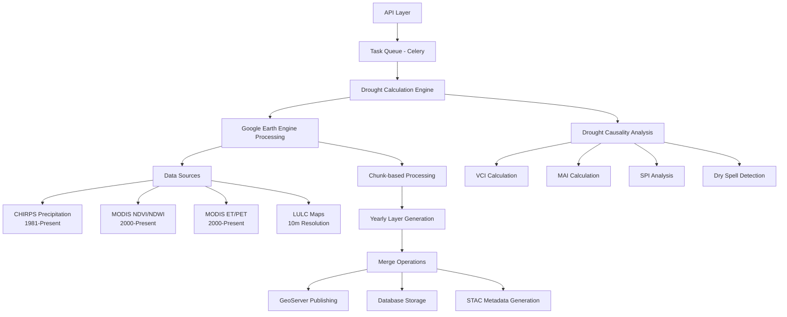

# Climate Analysis and Drought Assessment

The Climate Analysis and Drought Assessment module provides comprehensive drought monitoring capabilities through the integration of multi-sensor satellite data, meteorological indices, and vegetation health metrics. This system enables granular drought assessment at micro-watershed levels with historical analysis spanning from 1981 to present, supporting agricultural planning and water resource management decisions.

## Architectural Overview

The drought assessment system operates on a multi-tier architecture leveraging Google Earth Engine (GEE) for distributed geospatial computing, Celery for asynchronous task orchestration, and GeoServer for spatial data delivery. The system processes



 climate data across three analytical dimensions: vegetation condition through remote sensing indices, meteorological drought through precipitation analysis, and agricultural drought through evapotranspiration and moisture adequacy metrics.

## Core Drought Calculation Engine

The primary drought calculation workflow orchestrates multi-temporal satellite data processing through the  Celery task . This task accepts administrative boundaries (state, district, block) and temporal parameters (start\_year, end\_year) to generate comprehensive drought assessments. The system implements a chunk-based processing strategy dividing large AOIs into 30-feature segments to prevent GEE export errors .

`calculate_drought`

[drought.py#L26-L39](computing/drought/drought.py#L26-L39)

[drought.py#L119](computing/drought/drought.py#L119)

### Multi-Source Data Integration

The drought layer generation process integrates four primary data sources, each serving specific analytical requirements [generate\_layers.py#L152-L177](computing/drought/generate_layers.py#L152-L177):

| Data Source | Collection | Resolution | Temporal Range | Purpose |
| --- | --- | --- | --- | --- |
| CHIRPS | UCSB-CHG/CHIRPS/DAILY | 5,566m | 1981-Present | Precipitation analysis |
| MODIS NDVI | MODIS/MOD09GA\_006\_NDVI | 464m | 2000-Present | Vegetation health |
| MODIS NDWI | MODIS/MOD09GA\_006\_NDWI | 464m | 2000-Present | Water stress |
| MODIS ET/PET | MODIS/061/MOD16A2GF | 500m | 2000-Present | Evapotranspiration |

The system utilizes region-specific monsoon onset and offset dates through spatial intersection with five agro-climatic zones (Northern, Western, Central, Eastern, Southern) to define analytical periods appropriate for different geographical contexts [generate\_layers.py#L281-L323](computing/drought/generate_layers.py#L281-L323).

### Processing Workflow

The yearly drought generation process follows a systematic four-stage pipeline:

1. **Layer Generation** - `generate_drought_layers` processes each year's data in chunks, computing drought indices for each segment using the `drought_chunk` function [generate\_layers.py#L120-L152](computing/drought/generate_layers.py#L120-L152)
2. **Chunk Merging** - `merge_drought_layers_chunks` combines exported chunks into yearly feature collections [merge\_layers.py#L15-L55](computing/drought/merge_layers.py#L15-L55)
3. **Temporal Aggregation** - `merge_yearly_layers` consolidates multi-year data into a single feature collection with year-specific properties [merge\_layers.py#L56-L103](computing/drought/merge_layers.py#L56-L103)
4. **Distribution** - `push_to_geoserver_db_stc` publishes results to GeoServer, updates the layer database, and generates STAC metadata [drought.py#L165-L222](computing/drought/drought.py#L165-L222)

The system implements incremental processing capabilities, detecting the last processed year from existing assets and only generating data for missing years, enabling efficient updates without recomputing historical data [drought.py#L65-L72](computing/drought/drought.py#L65-L72).

## Drought Indices and Classification Framework

The drought assessment framework employs three complementary classification systems for comprehensive drought characterization:

### Vegetation Condition Index (VCI)

VCI evaluates vegetation health through normalized comparison of current NDVI values against historical minimum and maximum values. The classification schema follows [drought\_causality.py#L277-L281](computing/drought/drought_causality.py#L277-L281):

| VCI Value (%) | Vegetation Condition | Drought Severity |
| --- | --- | --- |
| 60-100 | Good | No Drought |
| 40-60 | Fair | Moderate Stress |
| 0-40 | Poor | Severe Stress |

The system calculates VCI modes by categorizing weekly values into bins and determining the most frequent category through weighted scoring [drought\_causality.py#L50-L66](computing/drought/drought_causality.py#L50-L66).

### Moisture Adequacy Index (MAI)

MAI represents agricultural drought conditions based on the relationship between actual evapotranspiration and potential evapotranspiration [drought\_causality.py#L284-L288](computing/drought/drought_causality.py#L284-L288):

| MAI (%) | Agricultural Drought Class | Impact Level |
| --- | --- | --- |
| 51-100 | Mild drought | Low stress |
| 26-50 | Moderate drought | Medium stress |
| 0-25 | Severe drought | High stress |

### Area Sown Assessment

The system incorporates cropping area statistics as an indicator of drought impact through agricultural response [drought\_causality.py#L289-L293](computing/drought/drought_causality.py#L289-L293):

| Area Sown (%) | Drought Condition | Agricultural Implication |
| --- | --- | --- |
| 0-33.3 | Severe drought | Major reduction in cultivated area |
| 33.3-50 | Moderate drought | Partial reduction in cultivated area |
| 50-100 | Mild drought | Near-normal cultivation patterns |

## Drought Causality Analysis

The drought causality module extends basic drought assessment by identifying causal factors and relationships between different drought indicators. The `drought_causality` Celery task processes multi-year data to compute frequency, intensity, and pathway analyses [drought\_causality.py#L502-L544](computing/drought/drought_causality.py#L502-L544).

### Computed Metrics

The causality analysis generates eighteen distinct metrics for each micro-watershed across the analysis period [drought\_causality.py#L297-L320](computing/drought/drought_causality.py#L297-L320):

**Frequency Metrics:**

* `frequency_of_no_drought` - Count of periods with no drought conditions
* `frequency_of_mild_drought` - Count of mild drought occurrences
* `frequency_of_moderate_drought` - Count of moderate drought occurrences
* `frequency_of_severe_drought` - Count of severe drought occurrences

**Intensity Metrics:**

* `intensity_of_no_drought` - Cumulative intensity of non-drought periods
* `intensity_of_mild_drought` - Cumulative intensity of mild drought
* `intensity_of_moderate_drought` - Cumulative intensity of moderate drought
* `intensity_of_severe_drought` - Cumulative intensity of severe drought

**Drought Pathways:**

* `severe_drought_path1-3` - Severe drought progression patterns
* `moderate_drought_path1-18` - Moderate drought progression pathways
* `mild_drought_dryspell_score` - Dry spell contribution to mild drought
* `mild_drought_rainfall_deviation_score` - Precipitation deviation contribution
* `mild_drought_spi_score` - Standardized Precipitation Index contribution

The pathway analysis identifies transitions between drought states, enabling understanding of drought evolution patterns and recovery trajectories [drought\_causality.py#L409-L475](computing/drought/drought_causality.py#L409-L475).

The causality analysis employs a scoring mechanism where pathways are ranked by severity and frequency, enabling prioritized intervention planning by identifying the most common and impactful drought progression patterns in each micro-watershed.

## API Integration

### Drought Layer Generation

The system exposes the `generate_drought_layer` REST endpoint for triggering drought calculation workflows [api.py#L513-L545](computing/api.py#L513-L545):

```python
POST /api/computing/generate_drought_layer/
{
  "state": "State Name",
  "district": "District Name",
  "block": "Block Name",
  "start_year": 2000,
  "end_year": 2023,
  "gee_account_id": 1
}
```

The endpoint initiates an asynchronous Celery task and returns immediately with task confirmation, enabling long-running computations without HTTP timeout issues.

### Drought Causality Analysis

The `mws_drought_causality` endpoint provides access to advanced causality analysis [api.py#L731-L755](computing/api.py#L731-L755):

```python
POST /api/computing/mws_drought_causality/
{
  "state": "state_name",
  "district": "district_name",
  "block": "block_name",
  "start_year": 2000,
  "end_year": 2023,
  "gee_account_id": 1
}
```

## Data Outputs and Storage

### GeoServer Publishing

Processed drought layers are automatically published to GeoServer as vector layers using WMS and WFS services, enabling web-based visualization and querying. The publishing workflow includes style application and workspace organization based on administrative hierarchy [drought.py#L188-L203](computing/drought/drought.py#L188-L203).

### Database Storage

Layer metadata and asset paths are stored in the Layer model, tracking algorithm versions, temporal ranges, and synchronization status [models.py#L28-L72](computing/models.py#L32-L72). The schema supports versioning and enables efficient querying of available drought data across geographical and temporal dimensions.

### STAC Metadata

The system generates SpatioTemporal Asset Catalog (STAC) metadata for drought layers, enhancing discoverability and interoperability with other geospatial systems [drought.py#L204-L211](computing/drought/drought.py#L204-L211).

## Integration with Hydrological Computing

The drought assessment module operates within the broader hydrological computing framework, sharing data sources and analytical foundations with precipitation and evapotranspiration modules. Precipitation data from the CHIRPS dataset drives both meteorological drought analysis and hydrological modeling [precipitation.py#L16-L127](computing/mws/precipitation.py#L16-L127), while evapotranspiration calculations from MODIS data support moisture adequacy assessments [evapotranspiration.py#L17-L407](computing/mws/evapotranspiration.py#L17-L407).

For deeper understanding of the underlying hydrological processes that influence drought conditions, refer to the [Hydrological Computing Modules](/10-hydrological-computing-modules)  documentation. The interrelationship between vegetation health, precipitation patterns, and evapotranspiration rates forms the foundation for comprehensive climate resilience planning.