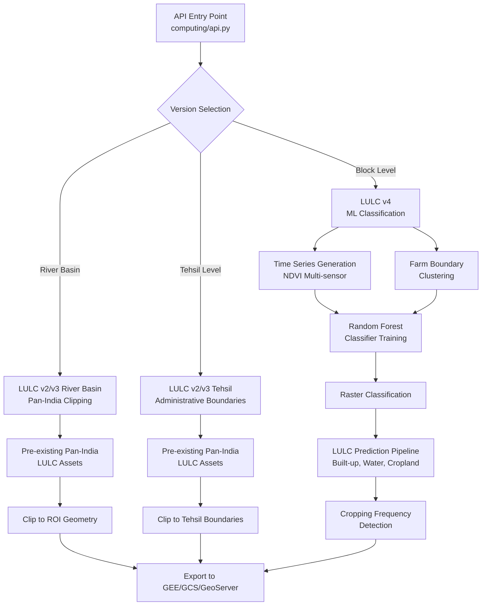

# Land Use Land Cover Analysis

The Land Use Land Cover (LULC) Analysis module provides comprehensive geospatial classification capabilities for monitoring and analyzing land use patterns across multiple administrative boundaries. This system leverages Google Earth Engine (GEE) for high-resolution satellite image processing and machine learning-based classification to generate detailed land use maps with temporal analysis capabilities.

The module supports three major versions (v2, v3, v4) with increasingly sophisticated classification approaches, from pan-India asset clipping in v2/v3 to sophisticated ML-based boundary-aware classification in v4. The system processes multi-temporal satellite data from Landsat and Sentinel constellations, applying advanced techniques including sensor harmonization, time series interpolation, and temporal correction to deliver accurate land use classifications at 10-meter resolution.

## System Architecture and Version Evolution



The LULC system follows a layered architecture with distinct processing pipelines tailored to different use cases and classification requirements. The version evolution represents a progression from simple asset clipping to sophisticated ML-driven classification.

The system architecture demonstrates clear separation of concerns between asset management (v2/v3) and processing-intensive classification (v4). Version 4 represents a paradigm shift by implementing per-location classification models that understand local agricultural patterns through boundary-aware training.

**Sources**: [lulc\_v4.py](../computing/lulc/v4/lulc_v4.py#L28-L57), [clip\_lulc\_v3.py](../computing/lulc/lulc_v3.py#L32-L45)

## LULC Version 4: Advanced ML-Based Classification

LULC v4 implements the most sophisticated classification approach, employing a multi-stage pipeline that combines time series analysis, boundary clustering, and machine learning classification to deliver high-accuracy land use maps.

The v4 pipeline executes through five distinct phases orchestrated by the `generate_lulc_v4` Celery task: time series generation, farm boundary clustering, classifier creation, raster classification, and final LULC prediction generation. Each phase runs as an independent GEE task with status monitoring to ensure completion before proceeding to subsequent stages.

Sources: [lulc\_v4.py](computing/lulc/v4/lulc_v4.py#L28-L57)

### Time Series Generation

The foundation of v4 classification lies in multi-sensor temporal data processing. The `time_series` function generates comprehensive NDVI time series by harmonizing data from Landsat-7, Landsat-8, and Sentinel-2 sensors using the Chastain regression method for cross-sensor calibration. This harmonization process applies slope and intercept coefficients derived from cross-calibration studies to normalize reflectance values across different sensor platforms, ensuring temporal consistency in the time series.

The system implements sophisticated gap-filling using MODIS data correlation and linear interpolation to address cloud cover and sensor gaps. The output is a multi-band raster where each band represents a temporal NDVI observation, enabling the classifier to learn seasonal vegetation patterns crucial for distinguishing between different land use types.
Sources: [time\_series.py](computing/lulc/v4/time_series.py#L12-L65), [cropping\_frequency\_detection.py](computing/lulc/v4/cropping_frequency_detection.py#L8-L20)

### Farm Boundary Clustering

Farm boundary identification and clustering represent a critical preprocessing step that improves classification accuracy by focusing ML efforts on agricultural areas. The `cluster_farm_boundaries` function applies geometric and spatial filters to identify potential farm parcels from input boundaries, filtering based on rectangularity (≥0.67), size (500-2000 units), and entropy (<1) to select parcels with typical farm characteristics.

The clustering process buffers farm boundaries by 10 meters and uses vectorization to merge adjacent farms into agricultural zones, filtering out isolated farms that don't have at least three neighboring farms to remove false positives in scrubland areas. This approach significantly reduces misclassification by establishing clear agricultural zones before classification.
Sources: [farm\_boundaries\_clustering.py](computing/lulc/v4/farm_boundaries_clustering.py#L11-L75)

### Random Forest Classifier Training

The `create_model_classifier` function implements stratified sampling from labeled training data to train a Random Forest classifier with 50 trees. The training data generation process applies sophisticated filtering logic to identify high-confidence training samples for each class:

* **Farm**: High rectangularity, appropriate size range, low entropy, proximity to other farms
* **Plantation**: Area between 1000-20000 units with existing plantation labels
* **Scrubland**: Large areas (>60000 units) with <50% overlap with LULC v3 scrubland classes (8-11)

The sampling process extracts 20,000 points per class using stratified sampling with a fixed seed (42) for reproducibility. The classifier learns from the multi-band time series data, associating temporal NDVI patterns with land use classes. This boundary-aware training approach allows the model to capture local agricultural characteristics specific to each block.
Sources: [create\_classifier.py](computing/lulc/v4/create_classifier.py#L9-L172)

### Raster Classification

Once trained, the classifier processes the time series data through the `classify_raster` function, which applies the trained model to predict land use classes for each pixel in the region of interest. The classification output is refined by filtering out null predictions and applying label mapping to translate numerical class values back to descriptive labels.

The classified raster is then exported as a vector asset representing refined boundaries with mode-based class assignments, providing polygon-level classification suitable for agricultural planning and monitoring. This vector output serves as the foundation for subsequent LULC prediction generation.
Sources: [classify\_raster.py](computing/lulc/v4/classify_raster.py#L10-L56)

### LULC Prediction Pipeline

The `generate_final` function orchestrates the comprehensive LULC prediction process, which combines multiple specialized prediction models to generate the final classified output. The pipeline follows a hierarchical masking strategy, progressively refining predictions by overlaying specialized classifiers:

1. **Built-up Prediction**: Uses NDWI and NDVI-based cleaning to identify urban areas with spectral signature analysis
2. **Water Body Prediction**: Combines Sentinel-1 SAR data for Kharif season and Dynamic World data for Rabi/Zaid seasons, with NDWI-based cleaning
3. **Barren Land Prediction**: Identifies non-vegetated, non-water areas using spectral indices
4. **Farm Assignment**: Applies vector-based farm boundaries from clustering results
5. **Scrubland Assignment**: Uses classified scrubland polygons from the classification step
6. **Plantation Assignment**: Applies plantation boundaries from the classification output
7. **Cropland Prediction**: Uses a separate ML model trained on Sentinel-1 SAR time series to identify agricultural areas
8. **Cropping Frequency Detection**: Analyzes temporal NDVI patterns to determine single, double, or triple cropping patterns

The masking strategy works by progressively applying each prediction layer, with later layers only filling pixels classified as background (value 0) in earlier layers. This hierarchical approach ensures that high-confidence predictions (built-up, water) take precedence over more variable classes (cropland), while the cropping frequency analysis provides detailed agricultural intensity metrics for farm areas.
Sources: [lulc\_v4.py](computing/lulc/v4/lulc_v4.py#L57-L208), [built\_up.py](computing/lulc/utils/built_up.py#L76-L101), [cropland.py](computing/lulc/utils/cropland.py#L321-L421), [water\_body.py](computing/lulc/utils/water_body.py#L309-L329)

## Specialized Classification Modules

The LULC system implements specialized modules for different land use types, each optimized for the unique spectral and temporal characteristics of the target class.

### Built-up Area Detection

Built-up area identification employs a multi-stage approach combining spectral indices with morphological filtering. The `get_builtup_prediction` function utilizes built-up indices derived from Landsat data, followed by NDWI-based cleaning to remove water bodies misclassified as built-up and NDVI-based cleaning to eliminate vegetation with similar spectral signatures. This two-step cleaning process significantly reduces false positives in complex urban-peri-urban environments.

The NDWI-based cleaning applies a threshold (typically -0.1 to 0.1) to identify water pixels and replaces them with the built-up class, while the NDVI-based cleaning identifies vegetation pixels (NDVI > 0.3) and reassigns them to appropriate classes.
Sources: [built\_up.py](computing/lulc/utils/built_up.py#L5-L101)

### Water Body Detection

Water body classification implements season-specific approaches optimized for different hydrological conditions:

* **Kharif Season (June-October)**: Uses Sentinel-1 SAR data with VV and VH backscatter analysis, applying thresholds to identify permanent and seasonal water bodies during the monsoon period when optical data is limited by cloud cover
* **Rabi/Zaid Seasons (November-May)**: Leverages Dynamic World near-real-time land cover classification, which provides more accurate water identification during cloud-free periods

The final prediction undergoes NDWI-based cleaning to refine boundaries and remove mixed pixels. The system also implements temporal correction to handle seasonal variations in water extent.
Sources: [water\_body.py](computing/lulc/utils/water_body.py#L25-L329)

### Cropland and Cropping Frequency Analysis

Cropland detection utilizes a sophisticated machine learning pipeline based on Sentinel-1 SAR time series analysis, which provides year-round observation capability regardless of cloud cover. The `get_cropland_prediction` function implements:

* **SAR Time Series Processing**: Generates 16-day composites from VV and VH backscatter data
* **Feature Engineering**: Creates temporal metrics including mean, standard deviation, and trend indicators
* **Slope Integration**: Incorporates DEM-derived slope information to filter out steep areas unlikely to be cultivated
* **ML Classification**: Uses a pre-trained random forest model with cross-validation
* **Spectral Cleaning**: Applies NDVI-based cleaning to remove forest misclassified as cropland

Cropping frequency detection extends cropland classification by analyzing temporal patterns to classify agricultural intensity:

* **Single Cropping**: One distinct growing season per year
* **Double Cropping**: Two growing seasons with distinct peak NDVI periods
* **Triple Cropping**: Three or more growing cycles (common in irrigated areas)

The algorithm employs k-means clustering (typically 3 clusters) on the NDVI time series to identify growing seasons, then counts the number of peaks to determine cropping frequency. This analysis provides critical insights into agricultural productivity and irrigation infrastructure.
Sources: [cropland.py](computing/lulc/utils/cropland.py#L321-L421), [cropping\_frequency\_detection.py](computing/lulc/v4/cropping_frequency_detection.py#L561-L588)

## LULC Version 3: Pan-India Asset Clipping

LULC v3 provides a streamlined approach suitable for river basin and tehsil-level analysis by clipping pre-computed pan-India LULC assets to the region of interest. This approach is computationally efficient and ideal for applications requiring consistent, standardized classifications across large areas.

The `clip_lulc_v3` Celery task implements asset clipping from the pan-India LULC v3 dataset stored in GEE, applying spatial filtering to extract the area of interest and exporting at 10-meter resolution with mode-based pyramiding for visualization. The system supports incremental processing by checking existing layers and only processing new time periods, significantly reducing computational overhead for recurring analyses.

Key features include:

* **Asset Management**: Checks for existing assets and implements backup/overwrite strategies
* **Database Integration**: Saves layer information to the database with metadata including start/end years
* **Multi-Workspace Output**: Generates outputs for LULC\_level\_1, LULC\_level\_2, and LULC\_level\_3 workspaces
* **Public Access**: Automatically makes assets public for API access
* **GeoServer Sync**: Synchronizes outputs to GeoServer for web mapping applications

The temporal correction algorithm in v3 implements sophisticated logic to handle classification inconsistencies across years:

* **Background Pixel Correction**: Fills gaps using adjacent year data
* **Intermediate Year Temporal Smoothing**: Applies rules for vegetation pattern consistency
* **First/Last Year Correction**: Uses single-year temporal extrapolation

Sources: [lulc\_v3.py](computing/lulc/lulc_v3.py#L32-L292), [utils/lulc\_v3.py](computing/lulc/utils/lulc_v3.py#L1-L200)

## API Integration and Task Management

The LULC module integrates with the broader computing system through REST API endpoints in `computing/api.py`, which provide task initiation for various LULC processing scenarios:

```python
generate_lulc_v4(state, district, block, start_year, end_year)

# Version 3 processing (tehsil-level clipping)
generate_lulc_v3_tehsil(state, district, block, gee_account_id)

# Version 2 processing (river basin clipping)
lulc_river_basin_v2(state, district, block, start_year, end_year)
```

All processing executes asynchronously through Celery, enabling long-running GEE tasks without blocking API responses. The system implements comprehensive error handling and task status monitoring through the `check_task_status` utility function, which polls GEE for task completion with configurable intervals and timeouts.

The API endpoints support flexible parameter specification including:

* **Administrative Boundaries**: State, district, and block/tehsil identifiers
* **Temporal Range**: Start and end years for multi-year analysis
* **Custom GEE Accounts**: Support for multi-tenant GEE authentication
* **Custom ROIs**: Ability to specify custom region of interest paths

Sources: [api.py](computing/api.py#L1-L100), [lulc\_v3.py](computing/lulc/lulc_v3.py#L208-L234)

## Output Management and Integration

The LULC system implements comprehensive output management across multiple storage platforms:

### Google Earth Engine Asset Storage

* Primary storage for raster outputs at 10-meter resolution
* Assets organized by state/district/block hierarchy
* Public access configuration for external consumption
* Version-specific asset naming conventions for traceability

### Google Cloud Storage Sync

* Optional synchronization to GCS for backup and distribution
* TIFF export with compression for efficient storage
* Organized by workspace and temporal periods
* Supports bulk download for offline analysis

### GeoServer Publishing

* Automatic WMS/WFS service publication
* Style configuration for optimal visualization
* Multi-level pyramid generation for fast rendering
* Integration with web mapping applications

### Database Metadata

* Layer registration with complete metadata
* Status tracking for processing and synchronization
* Support for incremental updates and versioning
* Query interface for layer discovery and access

The `sync_lulc_to_gcs` and `sync_lulc_to_geoserver` functions handle the export pipeline, creating tiles at multiple zoom levels and configuring visualization styles optimized for LULC class discrimination. The system maintains consistency across platforms through checksum validation and retry logic for failed transfers.
Sources: [lulc\_v3.py](computing/lulc/lulc_v3.py#L208-L234)

## Classification Schema and Land Use Classes

The LULC system implements a hierarchical classification scheme with detailed land use categories tailored for natural resource management applications:

| Class ID | Class Name | Description | Detection Method |
| --- | --- | --- | --- |
| 1 | Built-up | Urban and peri-urban development areas | NDWI/NDVI-based spectral analysis |
| 2-4 | Water Bodies | Permanent and seasonal water features | SAR backscatter + Dynamic World |
| 5 | Cropland (Single) | Agricultural areas with one crop cycle | SAR time series ML classification |
| 6 | Forest | Natural and plantation forest areas | NDVI temporal analysis |
| 8-11 | Cropland (Double/Triple) | Intensive agricultural areas | Cropping frequency detection |
| 12 | Scrubland | Degraded vegetation and shrub areas | NDVI threshold + morphological filters |
| 13 | Plantation | Commercial crop plantations | Boundary-aware ML classification |

The v4 system introduces a predicted\_cluster band that stores cropping frequency information (0: background, 1: single crop, 2: double crop, 3: triple crop) alongside the primary land use classification, enabling detailed agricultural productivity analysis.
Sources: [lulc\_v4.py](computing/lulc/v4/lulc_v4.py#L130-L160)

## Performance Optimization and Scalability

The LULC system implements multiple optimization strategies to handle large-scale processing efficiently:

### Computational Efficiency

* **Asset Existence Checking**: Pre-flight validation to avoid redundant processing
* **Parallel Task Execution**: Independent processing of time periods and classes
* **Incremental Processing**: Only processing new temporal periods for recurring analyses
* **Best Effort Reduction**: Using bestEffort=True in reduceRegion operations for faster computation

### Memory Management

* **Chunked Processing**: Dividing large regions into manageable processing blocks
* **Vector-to-Raster Optimization**: Efficient boundary representation through vector masking
* **Band Selection**: Selecting only necessary spectral bands to reduce data transfer

### Storage Optimization

* **Pyramid Policies**: Using mode-based pyramiding for categorical data
* **Asset Versioning**: Backup strategies for data preservation during updates
* **Lazy Loading**: Loading assets on-demand to minimize memory footprint

The system processes typical blocks (approximately 100-500 sq km) in 2-6 hours depending on the time series length and cloud cover conditions, with most time spent on time series generation and ML training phases.
Sources: [lulc\_v4.py](computing/lulc/v4/lulc_v4.py#L1-L10), [gee\_utils.py](utilities/gee_utils.py#L1-L50)

The cropping frequency detection algorithm's effectiveness depends critically on the quality of the underlying NDVI time series. Ensure proper sensor harmonization and gap-filling before running cropping frequency analysis, as noisy time series will produce unreliable season detection and cropping frequency estimates.

## Error Handling and Validation

The LULC system implements comprehensive error handling at multiple levels:

### Task Level

* GEE task status monitoring with configurable timeouts
* Automatic retry for transient failures
* Task cancellation and cleanup on critical errors

### Data Quality

* Asset existence validation before processing
* Boundary geometry validation
* Spectral index range checking for detection anomalies

### Integration Level

* Database transaction rollback on processing failures
* Asset cleanup for partial exports
* Status tracking for troubleshooting

The `check_task_status` utility implements exponential backoff for polling GEE tasks, handling rate limits and transient failures while providing detailed logging for audit trails.
Sources: [lulc\_v3.py](computing/lulc/lulc_v3.py#L100-L150)

When processing large administrative units with LULC v4, consider splitting the region into smaller processing blocks if you encounter GEE memory limits. The time series generation step is particularly memory-intensive for areas >500 sq km or with multi-year temporal ranges.

## Next Steps

For comprehensive understanding of the geospatial computing infrastructure, explore these related modules:

* [Google Earth Engine Integration and Authentication](/9-google-earth-engine-integration-and-authentication)  - Learn about GEE authentication and asset management
* [Hydrological Computing Modules](/10-hydrological-computing-modules)  - Understand how LULC integrates with watershed analysis
* [Celery Asynchronous Task Processing](/8-celery-asynchronous-task-processing)  - Deep dive into the task orchestration system
* [Asset Export and GeoServer Integration](/14-asset-export-and-geoserver-integration)  - Learn about publishing LULC outputs for web applications

The LULC system demonstrates sophisticated application of remote sensing and machine learning techniques for natural resource management, providing critical inputs for agricultural planning, water resource management, and environmental monitoring applications across India.