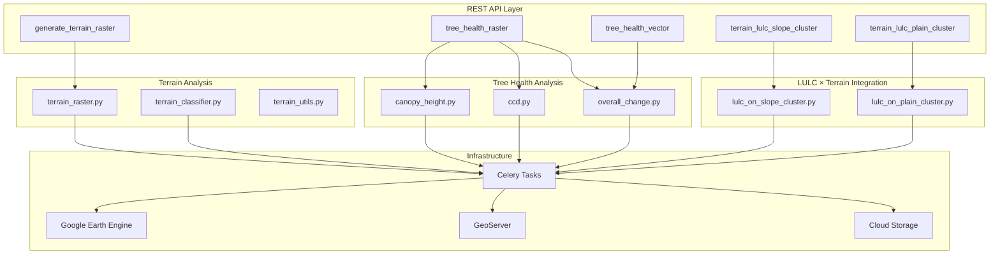
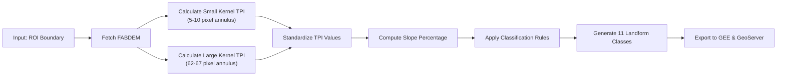
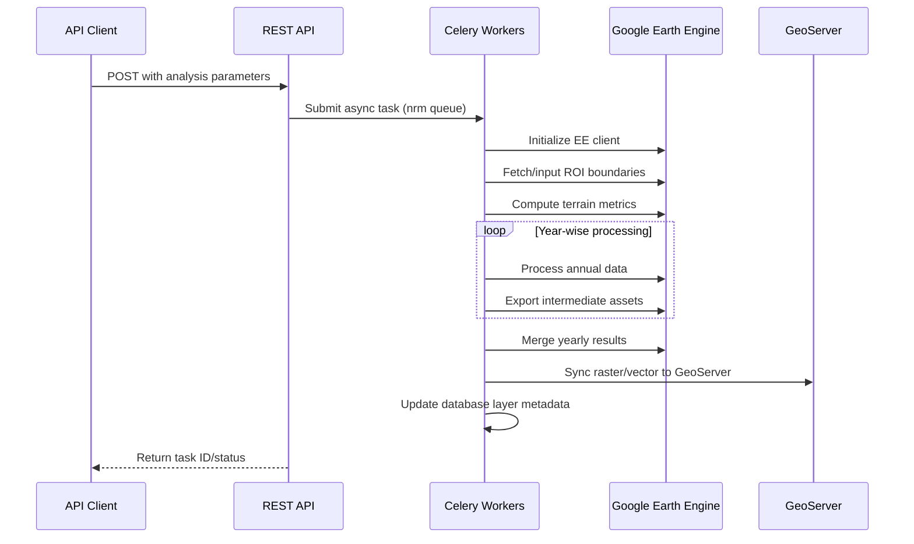

# Terrain and Tree Health Monitoring

The Terrain and Tree Health Monitoring system provides comprehensive geospatial analysis capabilities for natural resource management, integrating advanced terrain characterization with vegetation health assessment through Google Earth Engine (GEE). This system enables micro-watershed level analysis supporting land use planning, conservation initiatives, and environmental monitoring across India.

## System Architecture Overview

The monitoring architecture follows a modular design with three primary functional streams: terrain characterization, tree health assessment, and their integrated analysis. The system leverages asynchronous task processing via Celery for computationally intensive GEE operations, while exposing RESTful API endpoints for triggering analyses.

Sources: [computing/api.py](/computing/api.py#L544-L620), [computing/api.py](/computing/api.py#L755-L835)

## Terrain Characterization System

### Core Terrain Analysis Pipeline

Terrain analysis utilizes the FABDEM (Forest And Buildings removed Copernicus DEM) dataset, which provides elevation data at 30m resolution with artificial obstacles removed for accurate topographic assessment. The system computes **Topographic Position Index (TPI)** at two spatial scales using annular kernels, enabling multi-scale terrain characterization.

The `terrain_raster` Celery task orchestrates the complete terrain classification workflow, processing administrative boundaries ranging from micro-watersheds (MWS) to block levels.

 Each analysis generates eleven distinct landform classes based on standardized TPI values combined with slope percentage gradients [computing/terrain\_descriptor/terrain\_raster.py](/computing/terrain_descriptor/terrain_raster.py#L23-L34).

Sources: [computing/terrain\_descriptor/terrain\_raster.py](/computing/terrain_descriptor/terrain_raster.py#L1-L50), [computing/terrain\_descriptor/terrain\_utils.py](/computing/terrain_descriptor/terrain_utils.py#L1-L70)

### GEETerrainClassifier Implementation

The `GEETerrainClassifier` class encapsulates terrain classification logic with predefined cluster centroids for terrain grouping. The classification algorithm employs **adaptive thresholding** based on local elevation standard deviation, ensuring appropriate classification across diverse topographic contexts [computing/lulc\_X\_terrain/terrain\_classifier.py](/computing/lulc_X_terrain/terrain_classifier.py#L4-L35).

The kernel creation method generates annular kernels for TPI calculation:

* Small scale: 5-10 pixel radius (150-300m) capturing local topographic variation
* Large scale: 62-67 pixel radius (1.86-2.01km) capturing regional landscape context

Classification applies standardized TPI thresholds (±100) scaled by a terrain variability factor derived from elevation standard deviation, with minimum factor constraint of 0.3 to prevent over-sensitivity in flat areas [computing/lulc\_X\_terrain/terrain\_classifier.py](/computing/lulc_X_terrain/terrain_classifier.py#L15-L52).

The adaptive threshold mechanism adjusts classification sensitivity based on local terrain complexity—using higher thresholds in rugged terrain (larger elevation std dev) and lower thresholds in flat areas, preventing over-classification of minor topographic variations as distinct landforms.

### Landform Classification Schema

The system classifies terrain into eleven distinct landform types based on the combination of TPI values at both scales and slope gradients:

| Landform Class | TPI Condition (Small/Large) | Slope Range | Code |
| --- | --- | --- | --- |
| Plains | Within threshold limits | < 5% | 5 |
| Broad Slopes | Within threshold limits | 5-20% | 6 |
| Open Slopes | Small: Below/Large: Above | 5-20% | 3 |
| Upper Slopes | Small: Above/Large: Below | 5-20% | 4 |
| Local Ridges | Small: Above/Large: Within | Any | 2 |
| Midslope Ridges | Both: Within high range | Any | 8 |
| U-shaped Valleys | Small: Below/Large: Within | Any | 1 |
| V-shaped Valleys | Small: Below/Large: Above | Any | 9 |
| Canyons/Deep Valleys | Both: Below threshold | > 20% | 10 |
| Local Depressions | Small: Above/Large: Within | Any | 7 |

Sources: [computing/terrain\_descriptor/terrain\_utils.py](/computing/terrain_descriptor/terrain_utils.py#L51-L115), [computing/lulc\_X\_terrain/terrain\_classifier.py](/computing/lulc_X_terrain/terrain_classifier.py#L51-L119)

## Tree Health Monitoring System

### Canopy Height Analysis

Canopy Height (CH) analysis estimates vegetation height structure using GEE-hosted raster datasets from the `corestack-trees` project. The `tree_health_ch_raster` task processes yearly time series data (typically spanning 2017-2023) at block-level administrative boundaries, generating annual canopy height rasters clipped to the region of interest [computing/tree\_health/canopy\_height.py](/computing/tree_health/canopy_height.py#L21-L70).

The workflow supports two data sources:

* **Model-based estimates**: Historical datasets (2017-2022) using `modal_ch_` prefix from pan-India models [constants/pan\_india\_urls.py](/constants/pan_india_urls.py#L14-L18)
* **Direct measurement**: Recent datasets (2023+) using direct `ch_` prefix without model application [constants/pan\_india\_urls.py](/constants/pan_india_urls.py#L19-L21)

Annual canopy height rasters enable temporal trend analysis for detecting forest growth patterns, degradation events, and seasonal variations in vegetation structure across managed plantations and natural forest stands.

### Canopy Cover Density Assessment

Canopy Cover Density (CCD) quantifies vegetation density and closure characteristics using similar processing pipelines to canopy height. The `tree_health_ccd_raster` task generates yearly density classifications that distinguish between sparse, medium, and dense canopy cover regimes [computing/tree\_health/ccd.py](/computing/tree_health/ccd.py#L21-L70).

CCD datasets complement canopy height by providing:

* Vertical structure information (via CH)
* Horizontal density characteristics (via CCD)
* Combined metrics for comprehensive forest stand characterization

The system processes both modal CCD estimates from trained models and raw density measurements, maintaining consistency with the canopy height data sources [constants/pan\_india\_urls.py](/constants/pan_india_urls.py#L14-L21).

### Overall Change Detection

The `tree_health_overall_change_raster` task synthesizes multi-temporal vegetation metrics into a comprehensive change assessment layer. This layer captures net changes in vegetation health over the analysis period (e.g., 2017-2022), enabling identification of degradation, recovery, and stable forest areas [computing/tree\_health/overall\_change.py](/computing/tree_health/overall_change.py#L21-L70).

The overall change raster serves as a primary indicator for:

* Conservation priority identification
* Deforestation monitoring
* Reforestation effectiveness assessment
* Climate impact evaluation on forest ecosystems

### Vector Data Generation

For integration with GIS workflows and spatial decision support systems, the system provides vectorized versions of all tree health metrics. The `tree_health_vector` API endpoint triggers concurrent generation of:

* Canopy height vectors (`tree_health_ch_vector`)
* CCD vectors (`tree_health_ccd_vector`)
* Overall change vectors (`tree_health_overall_change_vector`)

Vector generation processes involve:

1. Converting classified rasters to polygon features
2. Merging yearly assets into multi-year feature collections
3. Exporting to GEE for cloud-hosted access
4. Synchronizing to GeoServer for WMS/WFS service provision [computing/api.py](/computing/api.py#L809-L861)

Sources: [computing/tree\_health/canopy\_height\_vector.py](/computing/tree_health/canopy_height_vector.py#L23-L80), [computing/tree\_health/ccd\_vector.py](/computing/tree_health/ccd_vector.py#L22-L70)

## LULC × Terrain Integration

### Terrain-Aware Land Use Classification

The system integrates Land Use Land Cover (LULC) data with terrain characteristics to enable **terrain-contextualized land use analysis**. Two primary integration pathways exist:

1. **LULC on Slope Clusters**: Focuses on areas classified as slope-dominated terrain (slope > 5%), generating L2-level clusters that combine landform type with land cover characteristics [computing/lulc\_X\_terrain/lulc\_on\_slope\_cluster.py](/computing/lulc_X_terrain/lulc_on_slope_cluster.py#L20-L70)
2. **LULC on Plain Clusters**: Targets flat terrain areas (plains, slope < 5%), applying distinct classification rules appropriate for level terrain contexts [computing/lulc\_X\_terrain/lulc\_on\_plain\_cluster.py](/computing/lulc_X_terrain/lulc_on_plain_cluster.py#L20-L70)

Both workflows process LULC time series data (typically annual composites from 2015-2023), extracting area-based land cover proportions for each micro-watershed feature before applying cluster assignment algorithms [computing/lulc\_X\_terrain/lulc\_on\_slope\_cluster.py](/computing/lulc_X_terrain/lulc_on_slope_cluster.py#L51-L70).

### Cluster Assignment Algorithm

The cluster assignment process utilizes **predefined centroids** calibrated for each terrain context (slope vs. plain) and agro-ecological zone. The algorithm:

1. Extracts landform classification from terrain raster for each MWS polygon
2. Calculates proportional area of each LULC class within the polygon
3. Constructs feature vectors combining terrain type and land cover composition
4. Assigns cluster based on minimum Euclidean distance to cluster centroids
5. Exports resulting feature collection with cluster attributes [computing/lulc\_X\_terrain/lulc\_on\_slope\_cluster.py](/computing/lulc_X_terrain/lulc_on_slope_cluster.py#L136-L251)

This integrated approach enables identification of:

* Agricultural suitability zones on different terrain types
* Erosion risk areas based on slope × LULC combinations
* Conservation priority areas considering terrain constraints
* Development planning constraints and opportunities

## API Endpoints and Usage

### Terrain Analysis Endpoints

**POST** `/api/computing/generate_terrain_descriptor/`

* **Purpose**: Initiates terrain cluster classification for administrative boundaries
* **Parameters**: state, district, block, gee\_account\_id
* **Response**: Task initiation confirmation
* **Processing**: Asynchronous Celery task in 'nrm' queue [computing/api.py](/computing/api.py#L544-L565)

**POST** `/api/computing/generate_terrain_raster/`

* **Purpose**: Generates classified terrain raster (11 landform classes)
* **Parameters**: state, district, block, gee\_account\_id
* **Response**: Task initiation confirmation
* **Processing**: Asynchronous Celery task in 'nrm' queue [computing/api.py](/computing/api.py#L565-L593)

**POST** `/api/computing/terrain_lulc_slope_cluster/`

* **Purpose**: Generates LULC clusters for slope-dominated terrain
* **Parameters**: state, district, block, start\_year, end\_year, gee\_account\_id
* **Response**: Task initiation confirmation
* **Processing**: Asynchronous Celery task in 'nrm' queue [computing/api.py](/computing/api.py#L593-L619)

**POST** `/api/computing/terrain_lulc_plain_cluster/`

* **Purpose**: Generates LULC clusters for plain terrain
* **Parameters**: state, district, block, start\_year, end\_year, gee\_account\_id
* **Response**: Task initiation confirmation
* **Processing**: Asynchronous Celery task in 'nrm' queue [computing/api.py](/computing/api.py#L619-L642)

### Tree Health Endpoints

**POST** `/api/computing/tree_health_raster/`

* **Purpose**: Initiates raster-based tree health analysis (CH + CCD + Overall Change)
* **Parameters**: state, district, block, start\_year, end\_year, gee\_account\_id
* **Response**: Task initiation confirmation
* **Processing**: Concurrent Celery tasks for

 each metric [computing/api.py](/computing/api.py#L755-L809)

**POST** `/api/computing/tree_health_vector/`

* **Purpose**: Initiates vector-based tree health analysis
* **Parameters**: state, district, block, start\_year, end\_year, gee\_account\_id
* **Response**: Task initiation confirmation
* **Processing**: Concurrent Celery tasks for vectorization [computing/api.py](/computing/api.py#L809-L861)

## Data Flow and Integration

### Complete Analysis Pipeline

The complete terrain and tree health monitoring workflow follows a staged execution pattern, with each step being executed asynchronously using Celery tasks. The system implements hierarchical asset organization following the pattern:

`projects/{project}/assets/{app_type}/{state}/{district}/{block}/{layer_name}`

Asset naming conventions:

* Terrain rasters: `terrain_raster_{district}_{block}` [computing/terrain\_descriptor/terrain\_raster.py](/computing/terrain_descriptor/terrain_raster.py#L31-L50)
* Canopy height: `ch_raster_{district}_{block}_{year}` [computing/tree\_health/canopy\_height.py](/computing/tree_health/canopy_height.py#L47-L60)
* CCD: `ccd_raster_{district}_{block}_{year}` [computing/tree\_health/ccd.py](/computing/tree_health/ccd.py#L47-L60)
* LULC terrain clusters: `{district}_{block}_lulcXslopes_clusters` or `lulcXplains_clusters` [computing/lulc\_X\_terrain/lulc\_on\_slope\_cluster.py](/computing/lulc_X_terrain/lulc_on_slope_cluster.py#L21-L32)

The system implements asset existence checks before computation to prevent redundant processing and optimize resource utilization [computing/tree\_health/canopy\_height.py](/computing/tree_health/canopy_height.py#L65-L68).

## Next Steps

For comprehensive environmental monitoring workflows, explore related geospatial computing capabilities:

* **Land Use Land Cover Analysis**: Understand vegetation classification and change detection methodology in [Land Use Land Cover Analysis](/12-land-use-land-cover-analysis)
* **Hydrological Computing Modules**: Examine how terrain characteristics integrate with water resource assessment in [Hydrological Computing Modules](/10-hydrological-computing-modules)
* **Asset Export and GeoServer Integration**: Learn about layer publishing and service provision mechanisms in [Asset Export and GeoServer Integration](/14-asset-export-and-geoserver-integration)
* **Google Earth Engine Integration**: Review authentication, initialization, and optimization patterns in [Google Earth Engine Integration and Authentication](/9-google-earth-engine-integration-and-authentication)

The terrain and tree health monitoring capabilities described here provide foundational data layers for comprehensive natural resource management and conservation planning initiatives across India.