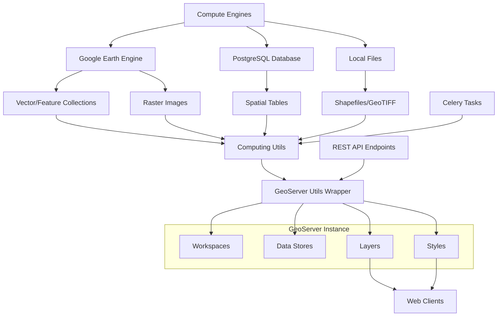

# Asset Export and GeoServer Integration

The Asset Export and GeoServer Integration system provides a comprehensive infrastructure for publishing geospatial computation results to a centralized GeoServer instance, enabling web-based visualization and data distribution. This integration layer supports multiple geospatial data formats and provides automated workflows for asset management, from Google Earth Engine computation outputs to published web-accessible layers.

## Architecture Overview

The system follows a modular architecture with clear separation between compute engines, asset

 utilities, and the GeoServer REST API wrapper. The integration leverages environment-based configuration for secure credential management and supports both synchronous and asynchronous workflows through Celery task orchestration.

## Core GeoServer Integration

The integration centers around the `Geoserver` utility class in , which provides a comprehensive Python wrapper around GeoServer's REST API. This class handles authentication via HTTP Basic Auth and encapsulates all common GeoServer operations while abstracting away the underlying REST API complexity.

Asset Export and GeoServer Integration | core-stack-org/core-stack-backend | Zread

`utilities/geoserver_utils.py`

The connection to GeoServer is configured through environment variables defined in the Django settings, allowing for secure credential management across deployment environments. These settings include `GEOSERVER_URL`, `GEOSERVER_USERNAME`, and `GEOSERVER_PASSWORD` which are loaded at runtime to initialize the Geoserver client instance.

Sources: [geoserver\_utils.py](utilities/geoserver_utils.py#L68-L89), [settings.py](nrm_app/settings.py#L336-L338)

The Geoserver class includes internal helper classes for efficient data handling. The `DataProvider` class manages in-memory binary data for direct uploads without temporary files, while the `FileReader` class provides streaming file read callbacks for large file operations, ensuring memory-efficient processing during asset transfers.

Sources: [geoserver\_utils.py](utilities/geoserver_utils.py#L32-L53)

## Workspace and Data Store Management

GeoServer organizes published data through a hierarchical structure of workspaces and data stores. The system provides comprehensive workspace management capabilities including creation, listing, deletion, and default workspace configuration. Each workspace acts as a logical namespace for organizing related layers and data stores.

Data stores represent connections to the underlying data sources, with the system supporting multiple store types based on the geospatial data format. For raster data, coverage stores manage GeoTIFF files and other raster formats, while for vector data, feature stores connect to PostgreSQL databases or file-based sources like Shapefiles and GeoPackages.

Sources: [geoserver\_utils.py](utilities/geoserver_utils.py#L177-L257), [geoserver\_utils.py](utilities/geoserver_utils.py#L273-L364)

The system implements specialized methods for each store type. Vector stores can be created with PostgreSQL connection parameters including database credentials, connection pooling settings, and geometry handling configurations. File-based vector stores support both local file uploads and in-memory binary data streams through the FileReader and DataProvider classes.

Sources: [geoserver\_utils.py](utilities/geoserver_utils.py#L1516-L1687), [geoserver\_utils.py](utilities/geoserver_utils.py#L1741L-1811)

The system automatically manages store and layer deletion cascades. When deleting a vector or raster store, GeoServer automatically removes all associated layers, simplifying cleanup operations for batch processing workflows.

Sources: [geoserver\_utils.py](utilities/geoserver_utils.py#L314-L339), [geoserver\_utils.py](utilities/geoserver_utils.py#L517-L542)

## Raster Asset Publishing

Raster assets, primarily GeoTIFF files generated from Google Earth Engine computations, are published through the coverage store mechanism. The `create_coveragestore` method handles the complete workflow of creating a coverage store from a local file path, configuring the store with the appropriate file type and content type specifications, and automatically publishing the associated layer.

For scenarios where raster data exists only in memory or needs to be uploaded without intermediate file storage, the `upload_raster` method accepts binary blob data and creates coverage stores directly from memory buffers. This capability is particularly useful for streaming large computation results directly to GeoServer without disk I/O overhead.

Sources: [geoserver\_utils.py](utilities/geoserver_utils.py#L374-L456)

The system supports time-enabled raster layers through the `publish_time_dimension_to_coveragestore` method. This capability allows publishing temporal datasets such as satellite image time series or climate data with configuration for presentation format, time units, and default value selection. The time dimension enables GeoServer to serve temporal data through WMS-Time extensions.

Sources: [geoserver\_utils.py](utilities/geoserver_utils.py#L457-L516)

## Vector Asset Publishing

Vector assets including Shapefiles, GeoPackages, and database tables are published through the feature store workflow. The `create_shp_datastore` method handles the complete process of zipping shapefile components, uploading to GeoServer, and creating the corresponding data store and layer. This method automatically handles the required shapefile component files (.shp, .shx, .dbf, .prj) by packaging them into a single ZIP archive before upload.

Sources: [computing/utils.py](computing/utils.py#L41-L72)

For vector data originating from Google Earth Engine FeatureCollections, the `sync_fc_to_geoserver` function provides an end-to-end workflow. This function attempts to retrieve FeatureCollection data directly from Earth Engine, but falls back to Google Cloud Storage intermediate storage for large collections that exceed Earth Engine's direct transfer limits. The workflow includes geometry validation, CRS assignment (defaulting to EPSG:4326), and conversion to GeoPackage format for efficient storage and retrieval.

Sources: [computing/utils.py](computing/utils.py#L113-L151)

PostgreSQL-based vector data is published through the `create_featurestore` method, which establishes a database connection pool and exposes spatial tables as GeoServer layers. This method supports extensive connection parameter tuning including connection pooling, timeout settings, and geometry optimization options for production deployment scenarios.

Sources: [geoserver\_utils.py](utilities/geoserver_utils.py#L1516-L1679)

## Style Management and Visualization

GeoServer's styling capabilities are leveraged through SLD (Styled Layer Descriptor) XML generation utilities. The `geoserver_styles.py` module provides functions for creating various style types appropriate for different geospatial data visualizations. For raster data, the `coverage_style_xml` function generates color ramp styles supporting multiple classification methods including interval, unique, and color bins.

Sources: [geoserver\_styles.py](utilities/geoserver_styles.py#L84-L132)

Vector data styling includes categorized, classified, and outline-only styles. The `catagorize_xml` function creates discrete category styles with unique colors for each distinct attribute value, suitable for nominal data visualization. The `classified_xml` function generates class breaks for continuous data classification, automatically distributing data values across the specified number of classes using various color ramp options.

Sources: [geoserver\_styles.py](utilities/geoserver_styles.py#L205-L314)

Style publication is a separate step from layer creation. Use the `publish\_style` method to associate an uploaded SLD style with a specific layer within a workspace, enabling immediate visual representation without additional configuration.

Sources: [geoserver\_utils.py](utilities/geoserver_utils.py#L1448-L1487)

## Layer Group Management

For complex visualizations requiring multiple layers to be displayed together, the system supports layer group creation and management. The `create_layergroup` method enables bundling multiple layers into a single entity with configurable mode (single or container), titles, abstract descriptions, and metadata. Layer groups simplify client-side map configuration by treating multiple layers as a single map element with defined draw order and visibility rules.

Sources: [geoserver\_utils.py](utilities/geoserver_utils.py#L639-L809)

The system provides methods for dynamic layer group modification including adding and removing individual layers from existing groups. This capability supports workflows where new computation results need to be automatically added to existing visualization products without manual reconfiguration.

Sources: [geoserver\_utils.py](utilities/geoserver_utils.py#L944-L1078)

## Batch Processing Workflows

The integration includes utility scripts for common batch processing scenarios. The `tiff_to_geoserver.py` script demonstrates a multi-level raster publication workflow, processing input GeoTIFF files through multiple resolution levels and publishing each to dedicated workspaces with appropriate styles. This pattern is particularly useful for generating multi-scale map products from base computation results.

Sources: [tiff\_to\_geoserver.py](utilities/tiff_to_geoserver.py#L8-L46)

The batch processing workflow includes automatic workspace and style assignment based on naming conventions, temporary file management for intermediate processing stages, and cleanup of temporary resources after completion. This design ensures reproducible publication workflows while minimizing resource consumption.

Sources: [tiff\_to\_geoserver.py](utilities/tiff_to_geoserver.py#L18-L46)

## API Integration Points

REST API endpoints in `computing/api.py` provide external access to the GeoServer integration capabilities. The `delete_layer` endpoint enables programmatic layer removal by workspace and layer name, supporting dynamic layer lifecycle management for applications that create temporary layers during analysis workflows.

Sources: [computing/api.py](computing/api.py#L154-L170)

The `get_layers_for_workspace` endpoint provides layer discovery functionality, returning all layers within a specified workspace. This capability enables client applications to dynamically discover available layers and build map configurations programmatically without requiring pre-known layer specifications.

Sources: [computing/api.py](computing/api.py#L1346-L1360)

## Error Handling and Reliability

The integration implements comprehensive error handling through the custom `GeoserverException` class, which captures both HTTP status codes and descriptive messages from GeoServer API responses. This structured error handling enables calling code to distinguish between authentication failures, resource conflicts, and other error conditions for appropriate recovery strategies.

Sources: [geoserver\_utils.py](utilities/geoserver_utils.py#L24-L28)

The system includes server management operations including catalog reload and cache reset capabilities. These operations ensure that GeoServer's internal state remains consistent with the on-disk configuration, particularly important when external tools modify configuration files or when data store schemas change after initial publication.

Sources: [geoserver\_utils.py](utilities/geoserver_utils.py#L141-L164)

## Integration with Computation Workflows

The GeoServer integration is tightly coupled with Google Earth Engine computation workflows through Celery task orchestration. Functions like `generate_nrega_layer` in the computing API demonstrate the pattern of triggering computation tasks through Celery's `apply_async` method, with tasks responsible for both computation execution and subsequent GeoServer publishing.

Sources: [computing/api.py](computing/api.py#L92-L112)

This asynchronous processing pattern ensures that long-running computations do not block API responses while providing reliable execution and progress tracking through Celery's task monitoring capabilities. Tasks can publish intermediate results to GeoServer during execution for progressive visualization, enabling users to monitor computation progress through web maps.