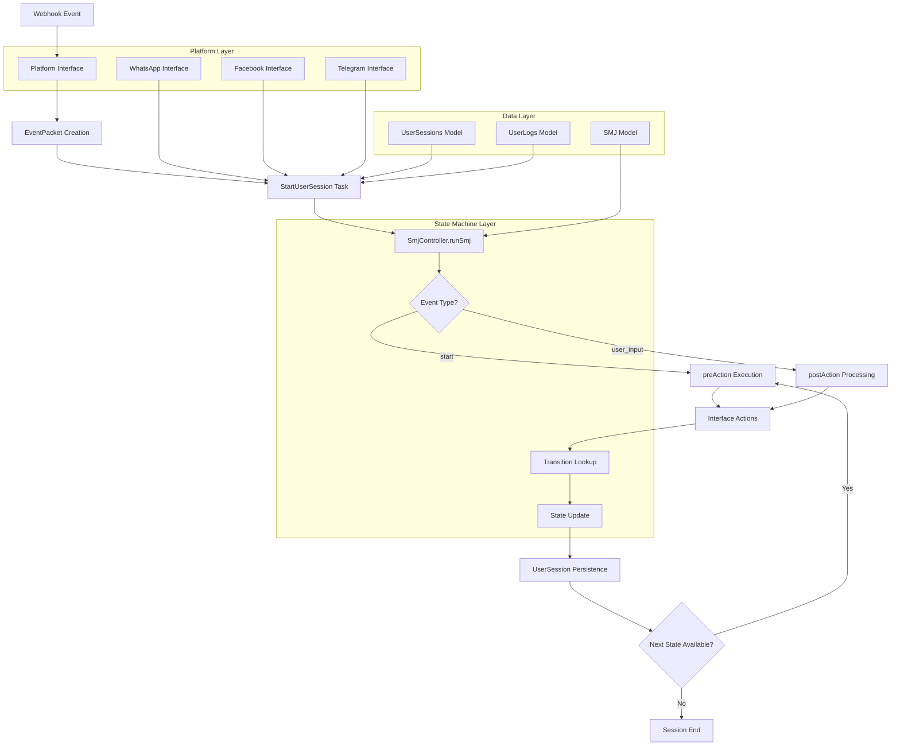
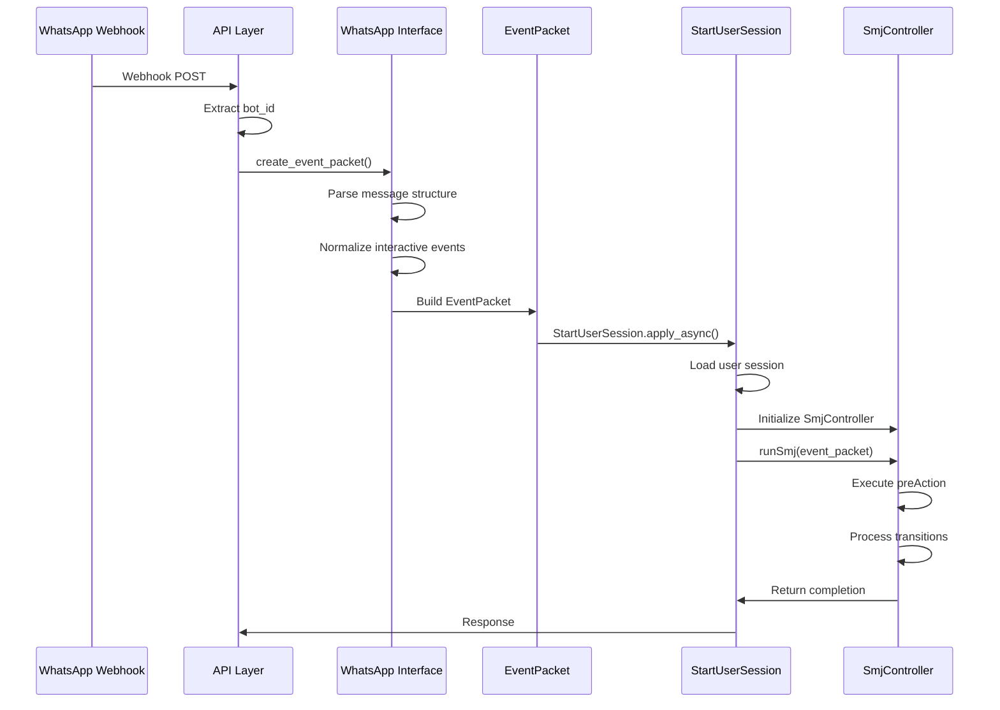

# State Machine Architecture for Bot Conversations

The state machine architecture forms the conversational backbone of the bot system, enabling structured, multi-platform dialogue flows through a JSON-driven state machine design. This architecture separates conversation logic from platform-specific implementations, supporting WhatsApp, Facebook, and Telegram interfaces through a unified execution engine.

## Architecture Overview

The system implements a hierarchical state machine pattern where conversations are defined as State Machine JSON (SMJ) files, executed by the SmjController class, and persisted across user sessions. The architecture follows a clean separation of concerns with platform interfaces, state management, and conversation orchestration layers.



Sources: [statemachine.py](../bot_interface/statemachine.py#L1-L50), [models.py](../bot_interface/models.py#L46-L80)

## Core Components

### StateMapData Base Class

The StateMapData class serves as the foundational state machine container, managing conversation context and state navigation. It maintains critical session data including the current state, SMJ identifier, platform type, bot configuration, user context, language preferences, and the current session payload. This class provides state navigation primitives through methods like jumpToSmj for transitioning between conversation flows and setCurrentState for tracking conversation progression.

Sources: [statemachine.py](../bot_interface/statemachine.py#L5-L130)

The class implements state existence validation through ifStateExists method, which verifies whether a target state exists in the loaded SMJ definition before attempting navigation. It also provides preAction and postAction lists for each state, enabling execution of preparatory and follow-up logic during state transitions.

### SmjController Orchestration Engine

SmjController extends StateMapData to implement the complete state machine execution lifecycle. The controller manages the complex flow of conversation execution, beginning with runSmj which serves as the primary entry point for processing user events and driving conversation progression.

Sources: [statemachine.py](../bot_interface/statemachine.py#L533-L660)

The controller intelligently handles SMJ context mismatches by implementing \_load\_correct\_smj\_states, which validates and loads the appropriate SMJ definition when event context differs from the current loaded state machine. This prevents conversation corruption when users jump between different conversation flows.

The execution flow follows a deterministic pattern: when a "start" event is received, the controller executes preAction sequences (sending messages, presenting menus, calling functions), processes user responses through postAction handlers, evaluates transition conditions, and advances to the next state. This cycle continues until reaching a terminal state or external interruption.

## State Machine JSON (SMJ) Structure

SMJ files define conversation flows as declarative JSON structures. Each SMJ contains an array of state objects, where each state includes a name, preAction list, postAction list, and transition definitions. This structure enables complex, multi-step conversations with branching logic and conditional navigation.

Sources: [onboarding.json](../bot_interface/community-engagement-smj/onboarding.json#L1-L50), [join\_community.json](../bot_interface/community-engagement-smj/join_community.json#L1-L50)

```json
{
  "name": "Welcome",
  "preAction": [
    {
      "text": [
        {
          "en": "Welcome! Let's help you join a new community.",
          "hi": "स्वागत है! आइए आपको एक नए समुदाय में शामिल होने में मदद करते हैं।",
          "default": "Welcome! Let's help you join a new community."
        }
      ]
    },
    {
      "menu": [
        {
          "label": "सूची से चुनें",
          "value": "state_district",
          "caption": "आपकी बेहतर सेवा के लिए, हमें आपकी लोकेशन की आवश्यकता है। आप अपनी लोकेशन कैसे भेजना चाहते हैं? \n1. आप राज्य और ज़िले की सूची में से अपनी लोकेशन चुन सकते हैं। \n2. बस अपनी लोकेशन भेजें।"
        },
        {
          "label": "स्थान भेज देंगे",
          "value": "location_pin"
        }
      ]
    }
  ],
  "postAction": [],
  "transition": [
    {
      "SendState": ["state_district"]
    },
    {
      "SendLocationRequest": ["location_pin"]
    },
    {
      "Welcome": ["failed"]
    }
  ]
}
```

### State Components Table

| Component | Purpose | Execution Phase | Data Types |
| --- | --- | --- | --- |
| name | Unique state identifier | State lookup | String |
| preAction | Initialization logic | State entry | Text, Menu, Function |
| postAction | Processing logic | State exit | Function calls |
| transition | Navigation rules | Event handling | Event→State mappings |

## Event Processing Pipeline

The event processing pipeline transforms incoming platform messages into state machine events through a multi-stage transformation process. This pipeline ensures consistent event handling across different messaging platforms while preserving platform-specific context.



Sources: [whatsapp.py](../bot_interface/interface/whatsapp.py#L38-L100), [data\_classes.py](../bot_interface/data_classes.py#L5-L22)

### EventPacket Data Structure

The EventPacket dataclass encapsulates all context needed for event processing, serving as the universal event format across platforms. It contains the event identifier, bot configuration, message type, payload data, metadata, timestamp, message identifiers, user information, and SMJ context (smj\_id, current state, context\_id).

Sources: [data\_classes.py](../bot_interface/data_classes.py#L5-L22)

The packet includes optional fields for different data types—media\_id for audio/image content, wa\_id for WhatsApp-specific identifiers, and user\_number for user lookup. The context preservation mechanism (smj\_id, state, context\_id) enables conversation continuity across asynchronous message handling.

## State Execution Lifecycle

### preAction Phase

The preAction phase executes when a state is entered, responsible for user communication and initialization. It iterates through the preAction list, supporting three action types: text messages (with multi-language support), menu presentations (interactive buttons), and function calls for complex logic.

Sources: [statemachine.py](../bot_interface/statemachine.py#L132-L288)

Text actions leverage the FactoryInterface pattern to instantiate the appropriate platform interface (WhatsApp, Facebook, Telegram) and call sendText with the localized message. Menu actions call sendButton to present interactive options, with caption extraction for enhanced presentation. Function actions execute named functions through callFunctionByName, passing the data\_dict containing session context.

The preAction phase supports SMJ jumping through special function returns. When a function returns "success" and includes "\_smj\_jump" in data\_dict, the state machine automatically transitions to the specified SMJ, preserving session context through \_update\_user\_session\_context.

### postAction Phase

The postAction phase processes user responses and executes transition logic. It runs through postAction functions, typically handling data storage, validation, and business logic. Functions receive the event data containing user responses (text input, button selections, location data, media uploads) and can modify the conversation flow based on validation results.

Sources: [statemachine.py](../botemachine.py#L306-L470)

Event data is enriched with type-specific payloads: location\_data (latitude, longitude, address), audio\_data (media\_id, file\_path), and photo\_data (media\_id, file\_path). Functions can trigger state transitions by returning event strings that match transition definitions, or they can prepare internal transitions by returning "internal\_transition\_prepared" with transition metadata in data\_dict.

### Transition Resolution

The findAndDoTransition method implements the transition resolution logic, matching events against the current state's transition dictionary. The findTransitionState function performs the actual matching, supporting exact event matches, wildcard patterns (["\*"]), and default transitions for unmatched events.

Sources: [statemachine.py](../botemachine.py#L510-L520)

Transition dictionaries map target states to event lists: if the user event matches any event in the list, the state machine advances to the target state. For example, a "SendState" state with transition [{"SendDistrict": ["success"]}, {"SendState": ["failure"]}] would advance to "SendDistrict" on success events or remain in "SendState" on failure events.

## Session Persistence and Context Management

### UserSessions Model

The UserSessions model maintains conversation state across interactions, storing the current SMJ reference, current state, expected response type, user configuration, session payload, and miscellaneous data. This model enables conversation continuity when users respond to messages after delays or when conversations span multiple sessions.

Sources: [models.py](../bot_interface/models.py#L99-L135)

The current\_session field stores accumulated conversation data as a JSON structure, maintaining state-specific data collected throughout the conversation flow. The expected\_response\_type field guides event processing by indicating the anticipated input format (text, button, location, image, audio).

### Session Context Preservation

The \_update\_user\_session\_context method ensures SMJ context persists during conversation jumps, updating the user session with the new SMJ identifier and initial state. This prevents conversation corruption when functions trigger SMJ jumps, maintaining the correct conversation context for subsequent event processing.

Sources: [statemachine.py](../bot_interface/statemachine.py#L557-L575)

When users jump between conversation flows (e.g., from onboarding to work demand submission), the session context automatically updates to reflect the current SMJ and state, ensuring that subsequent events are processed in the correct conversational context.

## Function Execution Framework

### callFunctionByName Dispatcher

The callFunctionByName function serves as the dispatcher for executing named functions defined in SMJ files. It maps function names to their implementations across generic and platform-specific interfaces, supporting both platform-agnostic operations (user\_input, pick\_img, move\_forward) and platform-specific features (send\_location\_request, send\_community\_by\_location).

Sources: [utils.py](../bot_interface/utils.py#L1617-L1700)

The dispatcher maintains a registry of available functions, handling data\_dict preparation and return value processing. Functions receive the data\_dict containing session context, user information, and event-specific data, enabling them to access conversation history and make navigation decisions.

### Generic Interface Functions

The GenericInterface provides platform-agnostic functions for common operations. The move\_forward function implements internal transition preparation, storing button selections in the user session and preparing transition metadata without creating new Celery tasks (preventing race conditions).

Sources: [generic.py](../bot_interface/interface/generic.py#L50-L120)

The save\_data function implements data persistence, extracting values from the current\_session using getDataFrom configuration and storing them in model fields using saveIn directives. The end\_session function archives completed conversations, creating UserArchive records with the complete session data.

## Platform Integration Architecture

### Factory Pattern Implementation

The FactoryInterface class implements the factory pattern to create appropriate platform interfaces based on app\_type configuration. The build\_interface method maps platform identifiers ("WA" for WhatsApp, "FB" for Facebook, "TG" for Telegram) to their respective interface implementations.

Sources: [models.py](../bot_interface/models.py#L20-L35)

This abstraction enables platform-specific implementations (WhatsAppInterface, FacebookInterface, TelegramInterface) while maintaining a unified API surface for state machine execution, allowing the same SMJ definitions to work across multiple messaging platforms.

### WhatsApp Interface Implementation

The WhatsAppInterface extends GenericInterface with WhatsApp-specific functionality, implementing create\_event\_packet for parsing WhatsApp webhook structures and normalizing interactive events into semantic SMJ events. The interface handles WhatsApp Business API specifics, including message acknowledgment, media downloading, and format-specific response generation.

Sources: [whatsapp.py](../bot_interface/interface/whatsapp.py#L38-L100), [api.py](../bot_interface/api.py#L61-L200)

The webhook entry point in api.py handles incoming WhatsApp messages, extracting bot configuration from the display\_phone\_number, preventing duplicate processing through message ID tracking, and marking messages as read to acknowledge receipt. Event packets are asynchronously processed through the StartUserSession Celery task.

## SMJ Jumping and Flow Composition

### SMJ Jump Mechanism

The jumpToSmj utility function enables conversation flow composition by allowing navigation between SMJ definitions. Functions can prepare SMJ jumps by including jump data in the data\_dict, which the state machine processes during preAction or postAction execution.

Sources: [utils.py](../bot_interface/utils.py#L1540-L1615)

Jump data includes the target SMJ name, initial state within that SMJ, and validation that the initial state exists in the target SMJ. The function stores the jump metadata in data\_dict["\_smj\_jump"], which the state machine processes to update states, smj\_id, and current\_state before executing the new state's preAction.

### Flow Composition Example

Complex conversations are composed from smaller, reusable SMJ flows. For example, the onboarding flow includes state selection (SendState → SendDistrict) and location-based community lookup (SendLocationRequest → CommunityByLocation), while the join\_community flow reuses similar state selection patterns but differs in post-action processing.

Sources: [onboarding.json](../bot_interface/community-engagement-smj/onboarding.json#L50-L150), [join\_community.json](../bot_interface/community-engagement-smj/join_community.json#L50-L100)

This modularity enables conversation features to be developed, tested, and reused independently, reducing code duplication and improving maintainability across the conversation system.

## Error Handling and Recovery

### State Validation

The state machine implements robust validation through ifStateExists, which verifies that target states exist before attempting navigation. This prevents runtime errors from malformed transition definitions or missing states in SMJ files.

Sources: [statemachine.py](../bot_interface/statemachine.py#L97-L107)

When \_load\_correct\_smj\_states encounters invalid SMJ identifiers or state names, it logs detailed error information without failing the entire conversation, allowing graceful degradation and error reporting.

### Transition Fallbacks

The transition resolution system includes fallback mechanisms for unmatched events. If an exact event match is not found, the system checks for wildcard patterns (["\*"]) and default transitions (marked with "nomatch"), ensuring that conversations can continue even with unexpected user input.

Sources: [statemachine.py](../bot_interface/statemachine.py#L510-L520)

This fallback strategy enables conversations to remain in the current state for retry or transition to error states for clarification, providing resilience against invalid user input or unexpected event sequences.

## Performance Considerations

### Asynchronous Task Processing

The StartUserSession Celery task enables asynchronous event processing, preventing webhook timeouts and enabling parallel conversation handling. The task uses the "whatsapp" queue for dedicated processing capacity.

Sources: [tasks.py](../bot_interface/tasks.py#L19-L25), [api.py](../bot_interface/api.py#L165-L180)

The move\_forward function optimizes performance by preparing internal transitions within the same execution context rather than creating new Celery tasks. This prevents task queue overhead and eliminates race conditions from duplicate message creation.

### Session Caching

User sessions are cached during conversation execution to minimize database queries. The current\_session field maintains conversation state in memory, reducing database load for rapid message exchanges within the same conversation flow.

Sources: [models.py](../bot_interface/models.py#L125-L128)

The expected\_response\_type field enables efficient event validation without reprocessing the SMJ definition for each incoming message, improving response times for high-volume bot interactions.

## Next Steps

For deeper understanding of the bot system architecture, explore [WhatsApp and Facebook Bot Integration](/16-whatsapp-and-facebook-bot-integration)  for platform-specific implementation details. The [Community Management System](/17-community-management-system)  documentation explains how conversation state integrates with community membership and user management features.