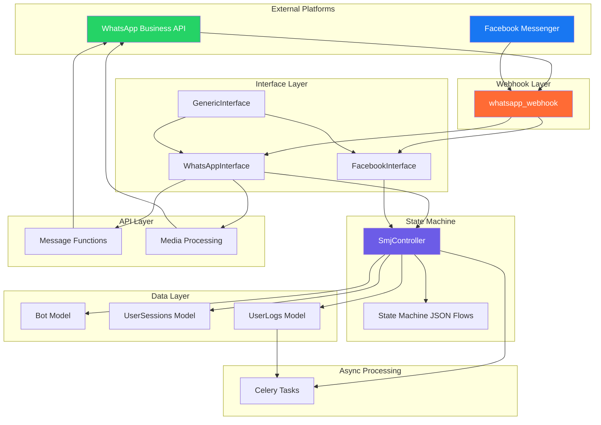
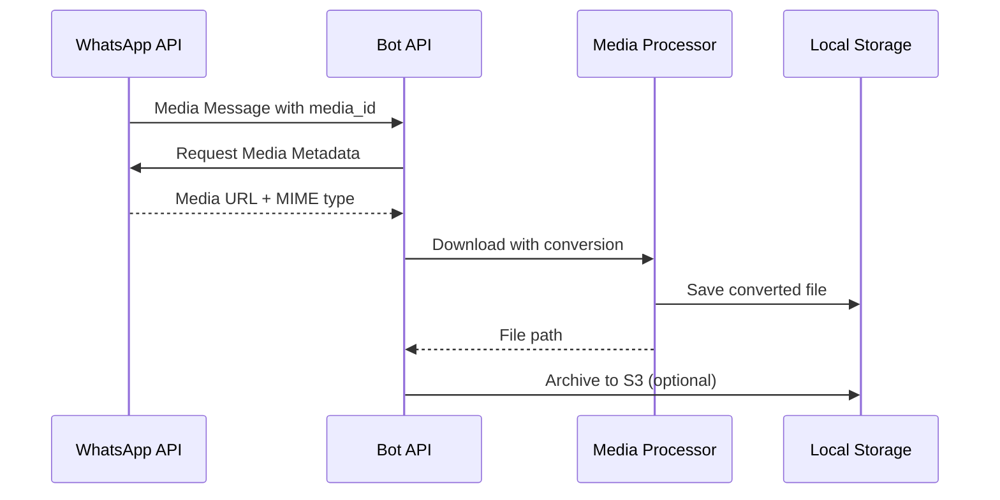

# WhatsApp and Facebook Bot Integration

The WhatsApp and Facebook Bot Integration module provides a comprehensive messaging platform for community engagement through WhatsApp Business API and Facebook Messenger. This system implements a state machine-driven conversation framework with support for multi-lingual interactions, media handling, and asynchronous task processing.

## Architecture Overview

The bot integration follows a layered architecture with clear separation of concerns across webhook handling, message processing, state management, and external API communication.

## Core Components

### Webhook Entry Point

The webhook endpoint serves as the primary entry point for incoming messages from WhatsApp and Facebook platforms. Located at `bot_interface/urls.py`, it exposes a single endpoint `/webhook` that handles both verification requests and message events <bot_interface/urls.py#L4-L7>.

The webhook implementation in `bot_interface/api.py` validates incoming requests through two phases:

1. **GET Verification**: During initial webhook setup, the system verifies the request using a verification token comparison <bot_interface/api.py#L68-L92>
2. **POST Message Handling**: Processes incoming message payloads with structural validation and metadata extraction <bot_interface/api.py#L94-L130>

### Interface Architecture

The system implements a Factory pattern for creating platform-specific interfaces. The `FactoryInterface` class in `bot_interface/models.py` dynamically instantiates the appropriate interface based on the application type (WA for WhatsApp, FB for Facebook, TG for Telegram) <bot_interface/models.py#L20-L44>.

The `GenericInterface` provides base functionality that all platform-specific implementations inherit, including methods for user input handling, image/audio processing, data movement, session management, and session termination <bot_interface/interface/generic.py#L11-L158>.

The WhatsAppInterface class extends GenericInterface with platform-specific implementations for WhatsApp Business API, handling the unique payload structures and response formats required by WhatsApp's messaging framework.

## Message Processing Flow




### Event Packet Creation

Incoming webhook data is transformed into standardized event packets through the `create_event_packet` method in `WhatsAppInterface` <bot_interface/interface/whatsapp.py#L44-L94>. This process includes:

1. **Bot Validation**: Verifies the bot instance exists in the database
2. **JSON Parsing**: Handles both raw JSON and webhook list formats
3. **Message Data Extraction**: Processes contacts, messages, and metadata
4. **Context Preservation**: Maintains SMJ (State Machine JSON) context across interactions
5. **Event Normalization**: Converts platform-specific interactions into semantic events

The event packet structure defined in `bot_interface/data_classes.py` captures all essential information for state machine processing:

```python
@dataclass
class EventPacket:
    event: str
    bot_id: int
    type: str = ""
    data: Any = ""
    misc: Any = ""
    timestamp: str = ""
    message_id: str = ""
    media_id: str = ""
    wa_id: str = ""
    user_number: str = ""
    smj_id: Optional[int] = None
    state: Optional[str] = None
    context_id: Optional[str] = None
```

### State Machine Integration

The `SmjController` class in `bot_interface/statemachine.py` manages conversation state transitions based on event packets. The `runSmj` method orchestrates the complete state machine execution flow:

1. **Context Loading**: Retrieves or creates user sessions with proper SMJ context <bot_interface/statemachine.py#L614-L625>
2. **State Jumps**: Handles transitions between different SMJ flows while preserving context
3. **Pre-actions**: Executes actions before state transitions (sending messages, collecting data)
4. **State Transitions**: Processes events and determines next states based on transition rules
5. **Post-actions**: Executes cleanup and logging after transitions <bot_interface/statemachine.py#L611-L700>

The state machine supports complex conversation flows with branching logic, conditional transitions, and context-aware routing. Flows are defined in JSON files stored in `bot_interface/community-engagement-smj/`, including specialized flows for onboarding, work demands, grievances, stories, and community management.

## Messaging Capabilities

### Text and Interactive Messages

The system supports multiple message types through dedicated API functions:

| Message Type | Function | Description |
| --- | --- | --- |
| Text | `send_text()` | Sends plain text with optional bold formatting |
| Text with URL | `send_text_url()` | Sends text with URL preview support |
| Button | `send_button_msg()` | Interactive buttons (max 3 options) |
| List | `send_list_msg()` | Scrollable lists for >3 options |
| Location Request | `send_location_request()` | Prompts user for location data |

The `sendButton` method in `WhatsAppInterface` automatically routes to either button or list messages based on menu size <bot_interface/interface/whatsapp.py#L616-L658>. This abstraction simplifies flow design by handling platform limitations transparently.

### Media Handling

The media processing pipeline supports multiple file types with automatic conversion:

**Image Processing**: Images are downloaded from WhatsApp servers, stored locally, and converted to high-DPI format for better display quality <bot_interface/api.py#L716-L735>.

**Audio Processing**: Voice notes and audio files undergo a multi-stage conversion pipeline:

1. **Download**: Retrieves audio from WhatsApp's CDN using media ID and access tokens
2. **Format Detection**: Identifies codec from MIME type (AAC, AMR, MP3, OGG, OPUS)
3. **Conversion**: Converts supported formats to MP3 using FFmpeg for compatibility
4. **Quality Control**: Ensures consistent bitrate (192k default) and file integrity

The `convert_wav_to_mp3` function implements robust audio conversion with size validation and detailed error logging <bot_interface/api.py#L801-L860>.

WhatsApp voice messages use the OGG/OPUS codec and require conversion before playback on standard audio players. The system handles this transparently through the audio conversion pipeline.

### Media Download Workflow

## Data Models and Session Management





### Bot Configuration

The `Bot` model in `bot_interface/models.py` stores configuration for each bot instance:

* **app\_type**: Platform identifier (WA, FB, TG)
* **bot\_name**: Display name for the bot
* **bot\_number**: Phone number for WhatsApp bots
* **config\_json**: Platform-specific configuration including BSP URLs and authentication headers
* **smj**: Reference to initial state machine flow
* **language**: Default language for messages
* **init\_state**: Starting state for conversations <bot_interface/models.py#L60-L77>

### User Sessions

The `UserSessions` model manages active conversation state:

* **app\_type**: Platform identifier
* **bot**: Reference to bot instance
* **user**: Reference to BotUsers entry
* **phone**: User's phone number for contact
* **user\_config**: User-specific preferences
* **current\_session**: JSON data for current interaction context
* **current\_smj**: Reference to active state machine flow
* **current\_state**: Current state in conversation flow
* **expected\_response\_type**: Next expected input type (text, button, location, media)
* **misc\_data**: Flexible JSON field for storing flow-specific data <bot_interface/models.py#L99-L134>

The system automatically creates sessions for new users and preserves context across multiple interactions, enabling complex multi-step flows without losing user progress.

### Logging and Archiving

The `UserLogs` model captures all user interactions for analytics and debugging:

* **key1-key4**: Flexible key-value pairs for event metadata
* **misc**: Additional JSON data for complex event structures
* **smj**: Reference to state machine flow
* **created\_at**: Timestamp for event ordering <bot_interface/models.py#L138-L161>

The `FlowLoggerMixin` in `bot_interface/flow_logger.py` provides specialized logging for flow completion events, particularly for work demands and grievances. This includes rich context data like community information, location hierarchies, and flow metadata <bot_interface/flow_logger.py#L1-L185>.

Sessions are archived to `UserArchive` when flows complete successfully, preserving conversation data for future reference while maintaining clean active session records <bot_interface/models.py#L165-L176>.

## Authentication and Platform Configuration

### Business Solution Provider (BSP) Integration

The system supports multiple BSPs through a flexible configuration system in `bot_interface/auth.py`:

```python
BSP_URLS = {
    "URL_360": "https://waba-v2.360dialog.io/",
    "FB_META": "https://graph.facebook.com/v24.0/919379201250837/",
    "FB_META_TEST": "https://graph.facebook.com/v24.0/905190956007447/",
}

BSP_Headers = {
    "HEADERS_360": {"D360-API-KEY": f"{AUTH_TOKEN_360}"},
    "HEADERS_FB_META": {"Authorization": f"Bearer {AUTH_TOKEN_FB_META}"},
}
```

The `get_bsp_url_headers` function dynamically retrieves the correct API endpoints and authentication headers based on bot instance configuration <bot_interface/auth.py#L35-L73>. This architecture allows seamless switching between different BSPs without code changes.

Store BSP credentials in Django settings (AUTH\_TOKEN\_360, AUTH\_TOKEN\_FB\_META) rather than in the database to maintain security and enable environment-specific configurations.

## Asynchronous Task Processing

The system leverages Celery for long-running operations that would block webhook responses:

### Task Queue Configuration

The `StartUserSession` task initializes user sessions with community status checking and flow routing <bot_interface/tasks.py#L13-L200>. This task operates on the "whatsapp" queue to isolate messaging tasks from other background processing.

### Flow Processing Tasks

Complex flow completion events (work demands, grievances) trigger async processing through `process_work_demand_task`. This pattern ensures:

1. **Responsive Webhooks**: Quick acknowledgment of incoming messages
2. **Reliable Processing**: Task retries on failure without losing data
3. **Scalability**: Horizontal scaling with multiple Celery workers
4. **Visibility**: Task monitoring through Django Admin or Flower

The FlowLoggerMixin automatically queues async tasks when `enable_async=True` is passed to `log_flow_completion` <bot_interface/flow_logger.py#L108-L110>.

## Community Engagement Features

### Multi-Community Management

The system handles users with multiple community memberships through sophisticated context management:

**Community Detection**: The `get_user_communities` method determines user community status via API calls with database fallback <bot_interface/interface/whatsapp.py#L1042-L1162>.

**Flow Routing**: Users are routed to different flows based on community count:

* Single community: Direct to service menu
* Multiple communities: Display community selection menu
* No communities: Start onboarding flow

The `store_active_community_and_context` method manages community selection while preserving navigation context for back-button functionality <bot_interface/interface/whatsapp.py#L1327-L1384>.

### Location-Based Services

The system supports location sharing for community discovery and work demand reporting:

1. **Location Request**: Send prompts requesting user's current location via `send_location_request` <bot_interface/api.py#L665-L714>
2. **Location Processing**: Parse latitude/longitude from WhatsApp location messages
3. **Geospatial Matching**: Match location to communities and administrative boundaries
4. **Context Storage**: Store location data in user session for subsequent steps

### Work Demand Flow

The work demand flow exemplifies the system's multi-step interaction capabilities:

1. **Community Selection**: User selects community (if multiple)
2. **Service Menu**: Choose work demand reporting
3. **Location Input**: Share work location
4. **Media Upload**: Upload photos/audio describing the work demand
5. **Details Collection**: Provide additional text information
6. **Submission**: Process and submit demand asynchronously

The `process_and_submit_work_demand` method coordinates this flow, collecting data across multiple states and triggering async processing upon completion <bot_interface/interface/whatsapp.py#L1939-L2191>.

## Configuration and Deployment

### Environment Setup

Configure the following environment variables in `nrm_app/settings.py`:

```python
AUTH_TOKEN_360 = os.environ.get("AUTH_TOKEN_360")
AUTH_TOKEN_FB_META = os.environ.get("AUTH_TOKEN_FB_META")

# Media Storage
WHATSAPP_MEDIA_PATH = "/path/to/media/storage/"

# Celery Configuration
CELERY_BROKER_URL = os.environ.get("CELERY_BROKER_URL")
CELERY_RESULT_BACKEND = os.environ.get("CELERY_RESULT_BACKEND")
```

### Bot Instance Configuration

Create bot instances through Django Admin or API with proper configuration:

```json
{
  "app_type": "WA",
  "bot_name": "Community Engagement Bot",
  "bot_number": "+919876543210",
  "config_json": {
    "bsp_url": "URL_360",
    "headers": "HEADERS_360",
    "namespace": "production"
  },
  "smj": 1,
  "language": "hi",
  "init_state": "welcome"
}
```

### Webhook Setup

Configure webhooks with the external platforms:

1. **WhatsApp**: Register webhook URL with your BSP (360dialog or Meta)
2. **Verification Token**: Set verification token to "Hello Coretsack" <bot_interface/api.py#L8
3. **Events**: Subscribe to message events (messages, status updates)

## Next Steps

To deepen your understanding of the bot integration system:

* **State Machine Architecture**: Explore the detailed state machine implementation in [State Machine Architecture for Bot Conversations](/15-state-machine-architecture-for-bot-conversations)
* **Community Management**: Understand how communities integrate with bot flows in [Community Management System](/17-community-management-system)
* **Content Moderation**: Learn about moderation workflows in [Content Moderation Workflow](/18-content-moderation-workflow)
* **Media Processing**: Review media handling details in [Media Upload and Handling System](/19-media-upload-and-handling-system)

The bot integration system provides a robust foundation for building sophisticated conversational experiences across WhatsApp and Facebook platforms, with extensible patterns for adding new message types, flows, and platform integrations.