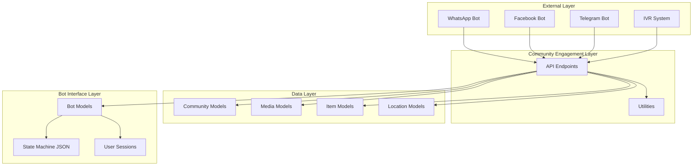

# Community Management System

The Community Management System is a Django-based platform designed to facilitate community engagement through bot interfaces, enabling users to submit stories, grievances, asset demands, and content while maintaining geographic and organizational boundaries. The system serves as the bridge between community members and administrative structures, supporting multiple interaction channels including WhatsApp, Facebook, and Telegram bots.

## System Architecture

The Community Management System follows a multi-layered architecture that integrates geographic administration, user management, content submission, and bot interaction flows. At its core, the system manages communities as organizational units tied to specific geographic locations and projects, with users submitting various types of content that flow through moderation workflows.

## Core Data Models

### Geographic and Organizational Structure

The system implements a hierarchical location model that supports three administrative levels: State, District, and Block. Each level can serve as the geographic boundary for a community, enabling flexible community definitions ranging from state-wide initiatives to block-specific programs. The `Location` model maintains unique combinations of these levels through a unique constraint, ensuring data integrity while allowing communities to span multiple geographic areas through many-to-many relationships [community\_engagement/models.py#L16-L30](/community_engagement/models.py#L16-L30).

The `Community` model serves as the primary organizational unit, linking projects to bot instances and geographic locations. Each community is associated with a project from the project management system and optionally a bot instance for automated interactions. This design allows communities to be defined by both organizational intent (through projects) and communication channels (through bots) [community\_engagement/models.py#L41-L48](/community_engagement/models.py#L41-L48).

### User-Community Relationships

The `Community_user_mapping` model establishes the relationship between users and communities while tracking user interaction patterns. The `is_last_accessed_community` flag enables the system to remember which community a user most recently engaged with, providing continuity across bot conversations and user sessions [community\_engagement/models.py#L51-L59](/community_engagement/models.py#L51-L59).

### Content Management

The system supports four primary content types through the `Item` model: Stories, Grievances, Asset Demands, and Content. Each item follows a state machine workflow appropriate to its type, with states ranging from UNMODERATED to RESOLVED depending on the item type. The `ITEM_TYPE_STATE_MAP` dictionary defines valid state transitions for each item type, ensuring consistent workflow enforcement [community\_engagement/models.py#L90-L133](/community_engagement/models.py#L90-L133).

Items can include multiple media attachments through a many-to-many relationship with the `Media` model. Media supports four types: IMAGE, AUDIO, VIDEO, and DOC, and can originate from BOT or IVR sources. This flexibility allows users to submit rich content through various channels while maintaining source attribution [community\_engagement/models.py#L72-L79](/community_engagement/models.py#L72-L79).

## API Architecture

### Item Management Endpoints

The `upsert_item` endpoint serves as the primary content ingestion point, handling both creation and updates of items. The endpoint accepts multipart form data to support simultaneous item creation and media file uploads. When source is specified as "BOT", a bot\_id parameter is required to associate the item with the correct bot instance [community\_engagement/api.py#L291-L430](/community_engagement/api.py#L291-L430).

Media files are uploaded to Amazon S3 using boto3, with organized folder structure by media type (images, audios, videos, docs). Each file receives a unique UUID-based filename to prevent collisions. The `attach_media_files` utility function handles the complete upload workflow, creating Media records and associating them with items [community\_engagement/api.py#L159-L198](/community_engagement/api.py#L159-L198).

Media upload failures are logged but don't interrupt the entire request—the system gracefully continues processing remaining files after catching exceptions during S3 uploads. This design prevents one failed file from blocking the entire content submission.

### Community Discovery Endpoints

The system provides multiple methods for discovering communities based on different access patterns:

* **By Geographic Location**: `get_communities_by_location` filters communities by state\_id, district\_id, or tehsil\_id parameters, requiring at least one parameter to prevent unbounded queries [community\_engagement/api.py#L732-L770](/community_engagement/api.py#L732-L770)
* **By Coordinates**: `get_communities_by_lat_lon` enables location-based discovery using latitude and longitude values, supporting geospatial applications [community\_engagement/api.py#L849-L882](/community_engagement/api.py#L849-L882)
* **By User**: `get_community_by_user` retrieves all communities a user belongs to based on their contact number [community\_engagement/api.py#L964-L999](/community_engagement/api.py#L964-L999)

The system also provides hierarchical navigation through `get_districts_with_community` and `get_tehsils_with_community`, enabling progressive disclosure of geographic areas that have active communities [community\_engagement/api.py#L1520-L1569](/community_engagement/api.py#L1520-L1569).

### User Management Endpoints

User-community mapping supports both bulk and individual operations. The `map_users_to_community` endpoint accepts CSV files with phone numbers in the header to batch-add users to a community project, streamlining onboarding processes [community\_engagement/api.py#L1068-L1148](/community_engagement/api.py#L1068-L1148). For individual additions, `add_user_to_community` handles single user enrollment with duplicate detection [community\_engagement/api.py#L1220-L1275](/community_engagement/api.py#L1220-L1275).

The `is_user_in_community` endpoint provides membership verification and returns the user's last accessed community, enabling personalized experiences and context-aware bot conversations [community\_engagement/api.py#L1368-L1436](/community_engagement/api.py#L1368-L1436).

### Content Retrieval Endpoints

The `get_items_by_community` endpoint implements paginated retrieval of community items with optional filtering by item type and state. The endpoint enforces state validation against the `ITEM_TYPE_STATE_MAP` to ensure only valid state combinations are requested [community\_engagement/api.py#L1908-L2037](/community_engagement/api.py#L1908-L2037).

For user-centric views, `get_items_status` returns the status of items submitted by a specific user, with optional filters for bot\_id, community\_id, and asset\_demand\_only parameters. This enables users to track their submissions and review moderation outcomes [community\_engagement/api.py#L2134-L2195](/community_engagement/api.py#L2134-L2195).

## State Machine Workflow

Each item type follows a distinct state machine workflow defined in `ITEM_TYPE_STATE_MAP`:

| Item Type | Valid States |
| --- | --- |
| CONTENT | UNMODERATED, PUBLISHED, REJECTED |
| GRIEVANCE | UNMODERATED, INPROGRESS, RESOLVED, REJECTED |
| ASSET\_DEMAND | UNMODERATED, ACCEPTED\_STAGE\_1, REJECTED\_STAGE\_1, INPROGRESS, RESOLVED |
| STORY | UNMODERATED, PUBLISHED, REJECTED |

The system enforces these constraints during item creation and updates, ensuring that items only transition through valid states. This design prevents invalid state combinations that could break business logic or user expectations [community\_engagement/models.py#L107-L133](/community_engagement/models.py#L107-L133).

## Utility Functions

The `create_community_for_project` utility handles the complete workflow of creating a community from project data. It creates a Project record, determines the appropriate Location level based on the project's geographic scope, creates or retrieves the corresponding Location record, and establishes the Community with the appropriate relationships [community\_engagement/utils.py#L73-L111](/community_engagement/utils.py#L73-L111).

The `generate_item_title` utility provides consistent item title generation by combining the item type with timestamp information, creating human-readable titles like "Asset Demand - 10 Sep 2025, 11:50 AM" that help users identify their submissions [community\_engagement/utils.py#L112-L118](/community_engagement/utils.py#L112-L118).

## Integration with Bot Interface

The Community Management System integrates with the Bot Interface module through foreign key relationships. Communities can be associated with Bot instances, enabling automated communication channels. Media records also reference Bot instances when sourced from bot interactions, maintaining traceability of content origins [community\_engagement/models.py#L44](/community_engagement/models.py#L44).

The Bot Interface's State Machine JSON (SMJ) model defines conversation flows that can leverage community engagement APIs, enabling bots to collect stories, grievances, and other content based on configurable workflows [bot\_interface/models.py#L46-L59](/bot_interface/models.py#L46-L59).

The system's auth-free decorators on most endpoints enable bot platforms to access community engagement functionality without complex authentication flows, simplifying integration with WhatsApp, Facebook, and Telegram platforms while maintaining security through phone number validation.

## Next Steps

To deepen your understanding of the ecosystem, explore the [State Machine Architecture for Bot Conversations](/15-state-machine-architecture-for-bot-conversations)  to understand how communities leverage conversational flows, or review the [Content Moderation Workflow](/18-content-moderation-workflow)  to see how items transition through their state machines after submission. For implementation details on connecting external platforms, see [WhatsApp and Facebook Bot Integration](/16-whatsapp-and-facebook-bot-integration) .