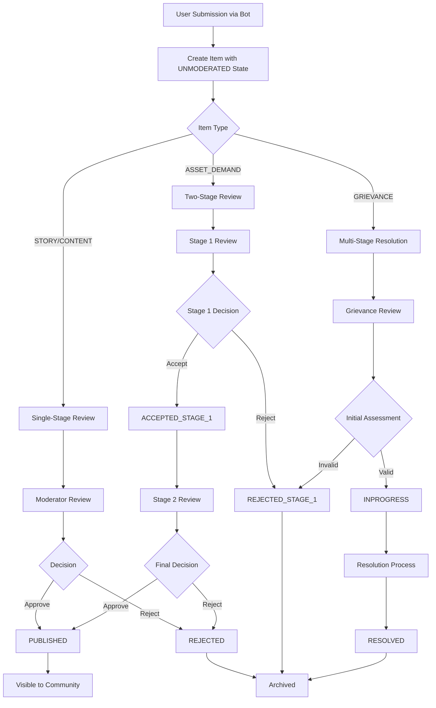
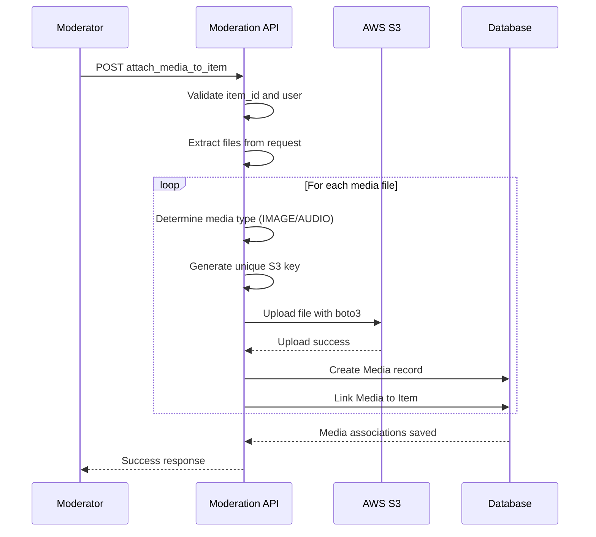
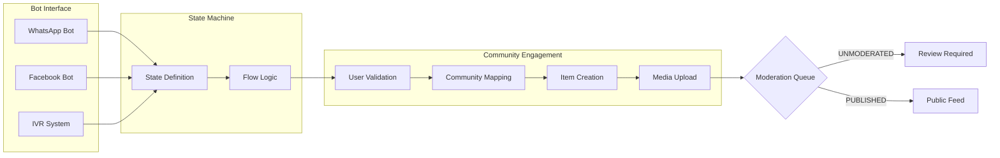

# Content Moderation Workflow

The Content Moderation Workflow serves as the gatekeeper for user-generated content within the Community Engagement system, ensuring quality control and appropriate publishing of community submissions. This system manages the lifecycle of user-submitted items including stories, grievances, asset demands, and general content, processing them from initial submission through to publication or rejection. Moderators review submissions with supporting media attachments, apply state transitions, and ensure community standards are maintained before content becomes visible to the broader user base.

## Moderation State Machine

Community items flow through a structured state machine that determines their visibility and processing status. Each item type supports different state transitions based on its purpose and workflow requirements.

### Item Types and Supported States

| Item Type | Description | Supported States |
| --- | --- | --- |
| STORY | Community narratives and experiences | UNMODERATED, PUBLISHED, REJECTED |
| GRIEVANCE | Community complaints or issues | UNMODERATED, INPROGRESS, RESOLVED, REJECTED\_STAGE\_1 |
| ASSET\_DEMAND | Requests for community resources | UNMODERATED, PUBLISHED, REJECTED, ACCEPTED\_STAGE\_1, REJECTED\_STAGE\_1 |
| CONTENT | General community content | UNMODERATED, PUBLISHED, REJECTED |

### State Definitions

* **UNMODERATED**: Initial state for all newly submitted items awaiting moderator review
* **PUBLISHED**: Approved content visible to the community
* **REJECTED**: Content declined by moderators, removed from visibility
* **INPROGRESS**: Grievances currently being addressed or investigated
* **RESOLVED**: Grievances that have been successfully addressed and closed
* **ACCEPTED\_STAGE\_1**: Asset demands approved for initial processing phase
* **REJECTED\_STAGE\_1**: Asset demands declined during initial review phase

Sources: [community\_engagement/models.py](../community_engagement/models.py#L90-L134), [community\_engagement/api.py](../community_engagement/api.py#L1-L200)

## Moderation Workflow Architecture

The moderation process follows a structured flow from user submission through review to final disposition. This workflow integrates with bot interfaces for content collection and supports multi-stage moderation for complex item types like asset demands and grievances.



Sources: [community\_engagement/models.py](../community_engagement/models.py#L134-L150), [community\_engagement/api.py](../community_engagement/api.py#L294-L431)

## Moderation API Operations

The moderation system provides RESTful endpoints for managing item states and accessing content requiring review. Moderators interact with items through upsert operations that can create new submissions or update existing items with state changes.

### Item Creation and Update

The primary moderation endpoint handles both creation and state updates through a unified interface. When creating items, the system automatically generates titles based on item type and submission timestamp if not provided.

**Key Parameters for Moderation:**

| Parameter | Type | Required | Description |
| --- | --- | --- | --- |
| `item_id` | String | No | Existing item ID for updates |
| `item_type` | String | Yes | STORY, GRIEVANCE, ASSET\_DEMAND, or CONTENT |
| `state` | String | No | Target state for moderation updates |
| `community_id` | Integer | Yes | Associated community identifier |
| `coordinates` | String | Yes | JSON string with lat/lon |
| `category_id` | Integer | Yes | Item category reference |
| `number` | String | Yes | User's contact number |
| `source` | String | Yes | Source of submission (BOT, IVR) |
| `bot_id` | Integer | Conditional | Required when source is BOT |
| `image_files` | File | No | Supporting image uploads |
| `audio_files` | File | No | Supporting audio uploads |

Sources: [community\_engagement/api.py](../community_engagement/api.py#L210-L294), [community\_engagement/api.py](../community_engagement/api.py#L47-L146)

### Moderation Queue Access

Moderators retrieve items requiring review through filtered API calls that support pagination and state-based filtering. This enables efficient workflow management for large volumes of community submissions.

**Endpoint:** `GET /api/community-engagement/items-by-community/`

**Query Parameters:**

* `community_id` (required): Filter items by community
* `item_type` (optional): Filter by item type
* `item_state` (optional): Filter by moderation state
* `limit` (optional): Items per page (default 10)
* `offset` (optional): Pagination offset (default 0)

**Response Structure:**

```json
{
  "success": true,
  "data": [
    {
      "id": 7,
      "number": "917702828811",
      "title": "Asset Demand - 10 Sep 2025, 11:50 AM",
      "item_type": "ASSET_DEMAND",
      "state": "UNMODERATED",
      "created_at": "2025-09-10 06:20:52",
      "latitude": 24.9175964,
      "longitude": 86.2940056,
      "images": ["https://communityengagementstack.s3..."],
      "audios": ["https://communityengagementstack.s3..."]
    }
  ],
  "total": 1,
  "limit": 5,
  "offset": 0,
  "has_more": true
}
```

Sources: [community\_engagement/api.py](../community_engagement/api.py#L1786-L1912)

## Media Attachment and Storage

Content moderation involves reviewing and managing various media types submitted with community items. The system supports image and audio files uploaded through bot interfaces, with secure S3 storage for all media assets.

### Media Upload Workflow

When moderators receive items with media attachments, the system processes uploads through a standardized workflow:



### Supported Media Types

| Media Type | Description | S3 Folder | Extensions |
| --- | --- | --- | --- |
| IMAGE | Visual documentation and photos | `images/` | jpg, jpeg, png, gif |
| AUDIO | Voice recordings and testimonies | `audios/` | wav, mp3, m4a |

Media uploads are processed asynchronously using boto3's S3 client. Each file receives a UUID-based filename to prevent collisions, and the system automatically extracts the file extension from the original upload to determine proper MIME handling.

### Media Attachment Endpoint

**Endpoint:** `POST /api/community-engagement/attach-media/`

**Request Parameters:**

* `item_id` (required): Target item identifier
* `number` (required): User's contact number
* `source` (required): BOT or IVR
* `bot_id` (conditional): Required when source is BOT
* `image_files` (optional): Image file uploads
* `audio_files` (optional): Audio file uploads

Sources: [community\_engagement/api.py](../community_engagement/api.py#L159-L200), [community\_engagement/api.py](../community_engagement/api.py#L484-L546)

## Bot Integration and Submission Flow

The moderation workflow is tightly integrated with the bot interface system, which serves as the primary collection point for community submissions. Content flows from WhatsApp, Facebook, and other bot platforms through standardized submission handlers into the moderation queue.



### Bot-to-Moderation Data Flow

### Session and User Context

The bot interface maintains session context through `UserSessions` models that track user progress through conversation flows. When a submission completes, the bot system automatically creates community items with appropriate metadata including:

* User identification via phone number
* Bot instance reference for source attribution
* Session context for user journey tracking
* Geographic coordinates when available
* Timestamps for submission timeline

This integration ensures that moderated content retains complete provenance information about its origin, facilitating follow-up communication with submitters and enabling analytics on submission patterns across different bot channels and user demographics.

Sources: [bot\_interface/models.py](../bot_interface/models.py#L99-L135), [community\_engagement/models.py](../community_engagement/models.py#L72-L79)

## User Status Tracking and Notifications

Community members can track the status of their submissions through dedicated API endpoints that provide real-time feedback on moderation decisions. This transparency builds trust in the moderation system and enables users to follow up on their contributions.

### Item Status Retrieval

Users access their submission history through a status endpoint that filters by user identification and optional parameters like bot ID or community ID.

**Endpoint:** `GET /api/community-engagement/items-status/`

**Query Parameters:**

* `number` (required): User's contact number
* `bot_id` (optional): Filter by specific bot
* `community_id` (optional): Filter by community
* `asset_demand_only` (optional): Boolean to show only asset demands

**Response Structure:**

```json
{
  "success": true,
  "data": [
    {
      "id": 8,
      "title": "Grievance - 11 Sep 2025, 1:44 PM",
      "transcription": "",
      "status": "UNMODERATED"
    }
  ]
}
```

This endpoint enables community engagement workflows where users can receive feedback on their submissions, understand moderation decisions, and follow the progress of grievances or asset demands through the resolution pipeline.

Sources: [community\_engagement/api.py](../community_engagement/api.py#L2038-L2135)

## Moderation Best Practices

Effective content moderation requires consistent application of community standards while handling diverse submission types efficiently. The system supports several workflow patterns that moderators can adopt based on organizational requirements.

For high-volume communities, consider implementing batch processing of UNMODERATED items by filtering on specific item types or geographic regions. This approach allows moderators to develop expertise in particular content categories while maintaining throughput during peak submission periods.


### State Transition Guidelines

| Current State | Allowed Next States | When to Use |
| --- | --- | --- |
| UNMODERATED | PUBLISHED, REJECTED | Standard review process for stories and content |
| UNMODERATED | INPROGRESS, REJECTED\_STAGE\_1 | Initial grievance triage |
| UNMODERATED | ACCEPTED\_STAGE\_1, REJECTED\_STAGE\_1 | Asset demand preliminary review |
| ACCEPTED\_STAGE\_1 | PUBLISHED, REJECTED | Asset demand final approval |
| INPROGRESS | RESOLVED, REJECTED\_STAGE\_1 | Grievance closure decisions |

### Review Prioritization Framework

Moderators can optimize their workflow by prioritizing reviews based on:

1. **Item Type**: Grievances and asset demands typically require faster turnaround than stories
2. **Submission Age**: Older UNMODERATED items should be reviewed to prevent queue backlog
3. **Geographic Distribution**: Ensure equitable coverage across all community regions
4. **Media Content**: Items with supporting media often require less follow-up clarification