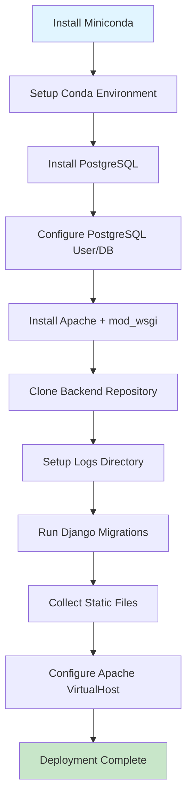
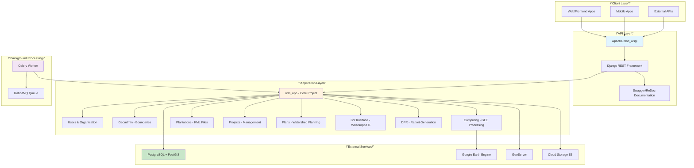

# Quick Start

This guide will help you get the CoRE Stack Backend up and running quickly on your local system or development environment. The CoRE Stack Backend is a comprehensive Django-based REST API designed for natural resource management, supporting plantation management, watershed planning, and multi-tenant organization management.

## Prerequisites and System Requirements

Before beginning the installation process, ensure your system meets the following requirements. The installation script is designed for **Linux-based operating systems**, with Ubuntu 20.04+ being the recommended platform. If you're using Windows, you'll need to install **Windows Subsystem for Linux (WSL)** first.

### Required Software

The installation script handles most dependencies automatically, but you need to have these prerequisites installed:

* **Git**: For cloning the repository (usually pre-installed on Linux)
* **Bash**: For running the installation script (pre-installed on Linux)
* **Sudo access**: For installing system packages (PostgreSQL, Apache)

### What Gets Installed Automatically

The installation script (`installation/install.sh`) will automatically install and configure the following components:

| Component | Purpose | Version |
| --- | --- | --- |
| Miniconda | Python environment management | Latest |
| Python | Core runtime environment | 3.10.13 |
| PostgreSQL | Database server | 15.2 |
| Apache + mod\_wsgi | Web server and WSGI handler | Latest |
| Django | Web framework | 5.2 |
| Celery | Asynchronous task queue | 4.4.0 |
| Google Earth Engine API | Geospatial computing | 1.5.9 |
| GeoPandas | Geospatial data processing | 1.0.1 |

Sources: [installation/install.sh](../installation/install.sh#L1-L30), [installation/environment.yml](../installation/environment.yml#L1-L50)

## Automated Installation (Recommended)

The quickest way to get started is using the provided installation script, which handles all dependencies, configuration, and setup automatically.

### Step 1: Clone the Repository

Begin by cloning the CoRE Stack Backend repository and navigating to the installation directory:

```bash
git clone https://github.com/core-stack-org/core-stack-backend.git
cd core-stack-backend/installation
```

This creates a local copy of the codebase and positions you in the installation folder containing the setup script.

### Step 2: Run the Installation Script

Make the installation script executable and run it with sudo privileges:

```bash
chmod +x install.sh
./install.sh
```

The installation process performs the following operations:

The installation script typically takes 10-15 minutes to complete, depending on your internet connection speed. It downloads Miniconda (~400MB), Python packages, and system packages automatically.



Sources: [installation/install.sh](../installation/install.sh#L125-L186)

### What the Script Does

The installation script executes a comprehensive setup process in the following sequence:

The script creates a PostgreSQL database named `nrm` with user credentials (`nrm`/`nrm@123`), sets up Apache to serve the Django application, and configures all necessary paths and permissions. By the end of this process, your system will be fully configured and ready to run the CoRE Stack Backend.

Sources: [installation/install.sh](../installation/install.sh#L32-L100), [README.md](../README.md#L1-L50)

## Manual Installation Steps

If you prefer a manual setup or need to customize the installation, you can follow these steps individually.

### Step 1: Create Python Environment

First, ensure Miniconda is installed (or install it manually), then create the Conda environment from the provided YAML specification:

```bash
conda env create -f installation/environment.yml -n corestack-backend
conda activate corestack-backend
```

This creates a Python 3.10 environment with all required packages including Django, DRF, Celery, Google Earth Engine, and geospatial libraries like GDAL, GeoPandas, and Rasterio.

Sources: [installation/environment.yml](../installation/environment.yml#L1-L390)

### Step 2: Database Setup

Install and configure PostgreSQL:

```bash
sudo apt-get install -y postgresql postgresql-contrib libpq-dev
sudo -u postgres psql -c "CREATE USER nrm WITH PASSWORD 'nrm@123';"
sudo -u postgres psql -c "CREATE DATABASE nrm OWNER nrm;"
```

This creates the necessary database user and database that Django will use for data persistence.

Sources: [installation/install.sh](../installation/install.sh#L40-L47)

### Step 3: Django Configuration

Navigate to the project directory and run Django management commands to set up the database schema and static files:

```bash
python manage.py migrate
python manage.py collectstatic --noinput
```

These commands apply all database migrations (creating tables for users, organizations, projects, etc.) and collect static files (CSS, JavaScript) into a single directory for serving.

Sources: [manage.py](../manage.py#L1-L24), [installation/install.sh](../installation/install.sh#L108-L116)

## Running the Application

Once the installation is complete, you can start the Django development server and Celery worker.

### Starting the Django Server

Activate the Conda environment and start the Django development server:

```bash
conda activate corestack-backend
python manage.py runserver
```

This starts the development server on `http://127.0.0.1:8000` by default. You should see output indicating that Django is running and ready to accept connections.

### Starting the Celery Worker

For background task processing (required for geospatial computing, report generation, and async operations), start the Celery worker in a separate terminal:

```bash
conda activate corestack-backend
celery -A nrm_app worker -l info -Q nrm
```

Here, `nrm_app` is the Django application name and `nrm` is the RabbitMQ queue name used for task distribution.

Sources: [nrm\_app/celery.py](../nrm_app/celery.py#L1-L19), [README.md](../README.md#L35-L40)

Always keep the Celery worker running when developing features that involve background tasks, such as report generation, Google Earth Engine computations, or file processing operations.

## Architecture Overview

The CoRE Stack Backend follows a modular, multi-tenant architecture designed for scalability and data isolation. Here's a visual representation of the system components:

### Key Components

* **nrm\_app**: The main Django project containing settings, URL configuration, and WSGI application
* **Users & Organization**: Multi-tenant user management with hierarchical permissions (Superadmin, Organization Admin, Project Manager, App User)
* **Geoadmin**: Administrative boundary management for states, districts, blocks, and villages
* **Computing**: Google Earth Engine integration for hydrological, climate, and land use analysis
* **Plantations**: KML file upload, validation, and plantation boundary management
* **Projects**: Project tracking and user assignment management
* **Plans**: Watershed planning with CLART-based water structure identification
* **Bot Interface**: WhatsApp and Facebook bot integration using state machine architecture
* **DPR**: Detailed Project Report generation with multi-level reporting (MWS, Tehsil, Village)

Sources: [nrm\_app/settings.py](../nrm_app/settings.py#L75-L130), [nrm\_app/urls.py](../nrm_app/urls.py#L1-L68)

## Access Points and Verification

After successfully starting the application, verify your setup by accessing these endpoints:

| Endpoint | URL | Purpose |
| --- | --- | --- |
| API Documentation | <http://localhost/> | Interactive ReDoc API documentation |
| Swagger UI | <http://localhost/swagger/> | Swagger UI for API exploration |
| Django Admin | <http://localhost/admin/> | Django administration interface |
| Static Files | <http://localhost/static/> | Served static assets (CSS, JS) |

### Verifying the Installation

1. **Check API Documentation**: Navigate to <http://localhost/> to see the ReDoc API documentation. This confirms that Django is running and the API endpoints are accessible.
2. **Test Django Admin**: Visit <http://localhost/admin/> to access the Django admin panel. You'll need to create a superuser first:

   ```bash
   python manage.py createsuperuser
   ```
3. **Verify Celery**: If you have background tasks configured, check the Celery worker terminal for activity logs confirming task processing.
4. **Check Logs**: Review the application logs at `/var/www/data/corestack/logs/nrm_app.log` for any errors or warnings:

   ```bash
   tail -f /var/www/data/corestack/logs/nrm_app.log
   ```

Sources: [nrm\_app/urls.py](../nrm_app/urls.py#L48-L68), [installation/install.sh](../installation/install.sh#L99-L107)

## Project Structure Overview

The repository is organized into functional modules, each responsible for a specific domain of the application:

```
core-stack-backend/
├── nrm_app/              ├── users/                # Custom user model and authentication
├── organization/         # Multi-tenant organization management
├── projects/             # Project tracking and user assignment
├── geoadmin/            # Administrative boundaries (State, District, Block, Village)
├── computing/           # Google Earth Engine integration for spatial analysis
│   ├── mws/            # Microwatershed generation and analysis
│   ├── lulc/           # Land Use Land Cover analysis
│   ├── drought/        # Drought frequency and causality analysis
│   ├── tree_health/    # Tree canopy monitoring
│   └── terrain_descriptor/  # Terrain classification
├── gee_computing/      # Google Earth Engine compute services
├── plantations/        # KML file upload and plantation management
├── plans/              # Watershed planning with CLART
├── dpr/                # Detailed Project Report generation
├── bot_interface/      # WhatsApp and Facebook bot integration
│   ├── statemachine.py # State machine for conversation flow
│   └── interface/     # Bot platform adapters
├── community_engagement/ # Community management features
├── moderation/         # Content moderation system
├── public_api/         # Public-facing API endpoints
├── stats_generator/    # Statistics and indicator calculations
└── utilities/          # Shared utility functions and helpers
```





Each module contains its own models, views, URLs, serializers, and business logic, following Django's app-based architecture.

Sources: [README.md](../README.md#L52-L85)

## Common Issues and Troubleshooting

### PostgreSQL Connection Issues

If you encounter "connection refused" errors when running migrations:

```bash
# Check PostgreSQL status
sudo systemctl status postgresql

# Start PostgreSQL if not running
sudo systemctl start postgresql

# Verify user exists
sudo -u postgres psql -c "\du"
```

### Static File Issues

If static files are not loading correctly:

```bash
# Recollect static files
python manage.py collectstatic --noinput

# Check permissions on static directory
ls -la static/
```

### Celery Worker Not Processing Tasks

If background tasks are not executing:

1. Verify RabbitMQ is running: `sudo systemctl status rabbitmq-server`
2. Check Celery logs for error messages
3. Ensure the queue name matches (`-Q nrm`)
4. Verify tasks are defined with the `@shared_task` decorator

Sources: [README.md](../README.md#L35-L40), [nrm\_app/celery.py](../nrm_app/celery.py#L1-L19)

## Next Steps

Now that you have CoRE Stack Backend running, explore these key areas:

* **[Project Architecture and Module Organization](./3-project-architecture-and-module-organization)** : Understand the complete system architecture, module interactions, and design patterns
* **[Environment Configuration and Setup](./4-environment-configuration-and-setup)** : Learn about environment variables, configuration management, and customization options
* **[Django Project Settings and Environment Variables](./5-django-project-settings-and-environment-variables)** : Deep dive into settings configuration for production deployment

For developers starting with feature development, begin by reviewing the [Python Practices](../guide/development/practices.md) guide to understand coding standards and best specific to this project.