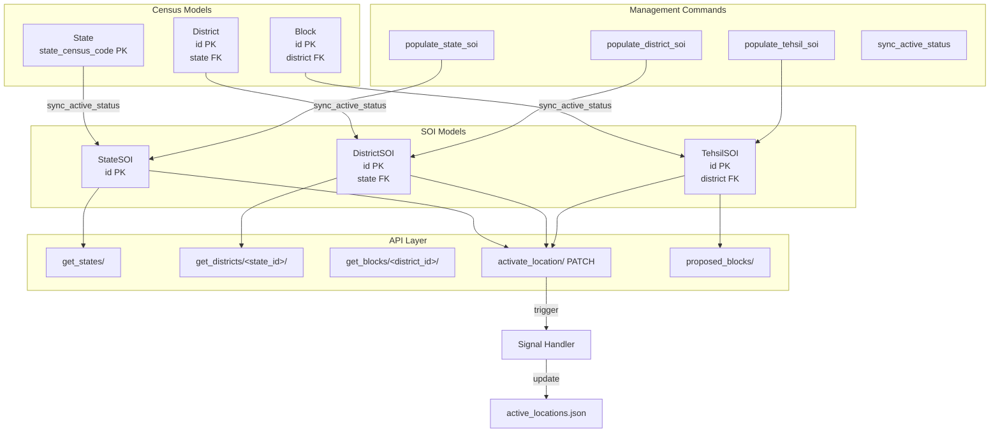
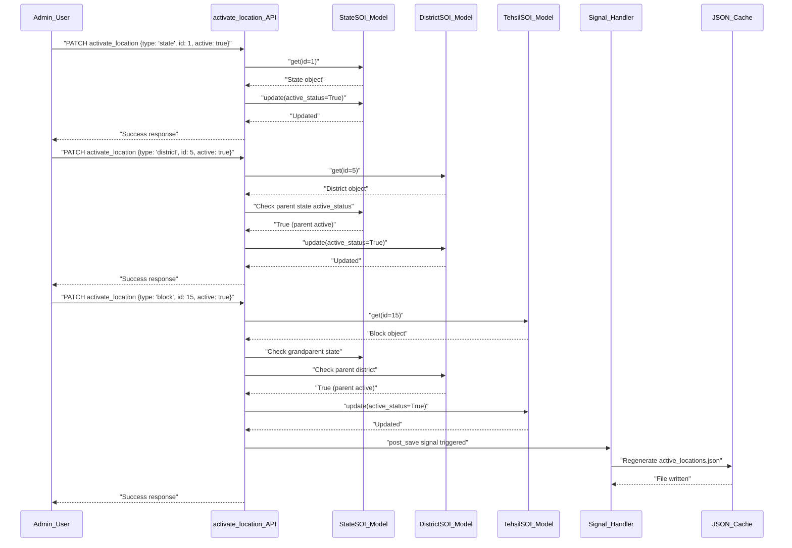

# Administrative Boundaries Management

The Administrative Boundaries Management system provides a comprehensive framework for managing India's hierarchical administrative divisions (States, Districts, and Blocks/Tehsils) with dual data sources supporting both Census and Survey of India (SOI) datasets. This system serves as the foundational geospatial reference layer enabling all computational and planning modules to operate within precise geographic boundaries.

## Architecture Overview

The geoadmin module implements a **dual-model architecture** that maintains parallel representations of administrative boundaries from two authoritative sources, enabling flexibility in data usage while ensuring data integrity through synchronization mechanisms.



Sources: [geoadmin/models.py](../geoadmin/models.py#L1-L96), [geoadmin/api.py](../geoadmin/api.py#L1-L117), [geoadmin/management/commands/sync\_active\_status.py](../geoadmin/management/commands/sync_active_status.py#L1-L100)

## Model Architecture

The system maintains **two parallel model hierarchies** serving different purposes:

### Census Models (Authoritative Source)

These models represent the official Census administrative divisions with census codes as primary identifiers:

* **State**: Uses `state_census_code` (20 chars) as primary key, containing `state_name` and `active_status` fields. The census code serves as the unique identifier for state-level operations.
* **District**: Auto-incrementing `id` as primary key with `district_census_code`, `district_name`, and foreign key relationship to `State`. Multiple districts belong to a single state.
* **Block**: Auto-incrementing `id` as primary key with `block_census_code`, `block_name`, and foreign key relationship to `District`. Blocks represent the third administrative level.

### SOI Models (Working Models)

Survey of India models provide the operational boundary datasets used across the platform:

* **StateSOI**: Auto-incrementing `id` as primary key with `state_name` and `active_status`. These models store the actual geometric boundary data used in computations.
* **DistrictSOI**: Auto-incrementing `id` with `district_name`, foreign key to `StateSOI`, and `active_status`. Maintains parent-child relationship with states.
* **TehsilSOI**: Auto-incrementing `id` with `tehsil_name`, foreign key to `DistrictSOI`, and `active_status`. Note that **TehsilSOI corresponds to Block** in the Census model nomenclature.

### Supporting Models

**State\_District\_Block\_Properties**: Stores aggregated boundary metadata including `dashboard_geojson` as a JSONField, enabling efficient retrieval of pre-computed geometries for dashboard visualizations.

**UserAPIKey**: Extends `AbstractAPIKey` to provide API-based access to boundary data. Includes `user`, `name`, `api_key`, `is_active`, `created_at`, `expires_at`, `last_used_at` fields, and an `is_expired` property for key lifecycle management.

Sources: [geoadmin/models.py](../geoadmin/models.py#L9-L96)

## API Endpoints

The geoadmin module exposes RESTful endpoints for hierarchical boundary retrieval and activation management:

### Public Endpoints (Auth\_free)

**GET /api/v1/get\_states/**
Returns all states with normalized names for fuzzy matching. Includes `state_id`, `state_name`, `active_status`, and `normalized_state_name` fields. Used for populating state dropdowns in user interfaces.

**GET /api/v1/get\_districts/<state\_id>/**
Retrieves districts filtered by state using `state_id` parameter. Returns district records with `district_id`, `district_name`, `state_id`, `active_status`, and `normalized_district_name`. The state\_id must correspond to the SOI state ID.

**GET /api/v1/get\_blocks/<district\_id>/**
Fetches tehsils/blocks filtered by district. The API returns `block_id`, `block_name` (aliased from `tehsil_name`), `district_id`, `active_status`, `normalized_tehsil_name`, and `normalized_block_name`. Note that this endpoint actually queries TehsilSOI model.

**GET /api/v1/proposed\_blocks/**
Returns **activated location hierarchy** in transformed format suitable for frontend consumption. Includes state-level labels and nested district/block structures. This endpoint leverages the `activated_tehsils()` utility to filter only active locations and transforms the data structure using `transform_data()` for optimized client-side rendering.

### Authentication-Required Endpoints

**PATCH /api/v1/activate\_location/**
Manages location activation status with **hierarchical validation rules**:

* **States**: Can be activated/deactivated independently
* **Districts**: Can only be activated if parent State is active
* **Blocks**: Require both parent State and District to be active before activation

Request body requires `location_type` (state/district/block), `location_id`, and `active` (boolean). The endpoint performs validation before applying changes and returns appropriate error messages for hierarchy violations.

**POST /api/v1/generate\_api\_key/**
Unified endpoint for API key lifecycle management. Supports two operations:

* **Generate**: Creates new API key with optional `name` and `expiry_days` (default 3000 days)
* **Deactivate**: Deactivates existing key by providing `action`, `user_id`, and `api_key`

Uses `UserAPIKey.objects.create_key()` for secure key generation and stores the key with expiration tracking.

**GET /api/v1/get\_user\_api\_keys/**
Retrieves all API keys associated with the authenticated user. Enables key management and monitoring from client applications.

Sources: [geoadmin/api.py](../geoadmin/api.py#L21-L206), [geoadmin/urls.py](../geoadmin/urls.py#L5-L13), [geoadmin/utils.py](../geoadmin/utils.py#L34-L101)

## Data Management Commands

### Population Commands

**python manage.py populate\_state\_soi --file <path> --clear**
Populates StateSOI table from JSON data. Supports optional file path specification (default: `data/state_soi_data.json`) and `--clear` flag to truncate existing data before import. Performs upsert operations using `get_or_create()` and updates `active_status` for existing records.

**python manage.py populate\_district\_soi**
Similar population command for DistrictSOI model with identical parameters and behavior.

**python manage.py populate\_tehsil\_soi**
Populates TehsilSOI table from JSON source, following the same pattern as state and district population commands.

### Synchronization Command

**python manage.py sync\_active\_status [options]**
Synchronizes `active_status` from Census models (State, District, Block) to SOI models (StateSOI, DistrictSOI, TehsilSOI) using **name-based matching**.

**Command Options**:

* `--dry-run`: Preview changes without database modification
* `--verbose`: Display detailed match/mismatch information
* `--include-inactive`: Process inactive source records (default: only active)
* `--case-sensitive`: Enable case-sensitive matching (default: case-insensitive)

The command performs sequential synchronization: States → StateSOI, Districts → DistrictSOI, Blocks → TehsilSOI. Each sync operation uses `normalize_name()` to handle special characters (&, -, parentheses) and extra whitespace, ensuring robust matching across datasets.

Sources: [geoadmin/management/commands/populate\_state\_soi.py](../geoadmin/management/commands/populate_state_soi.py#L26-L90), [geoadmin/management/commands/sync\_active\_status.py](../geoadmin/management/commands/sync_active_status.py#L6-L98), [geoadmin/utils.py](../geoadmin/utils.py#L11-L31)

## Utility Functions

### Name Normalization

The `normalize_name()` function standardizes location names by removing special characters and collapsing whitespace:

* Removes: ampersands (&), hyphens (-), parentheses (())
* Collapses multiple spaces to single space
* Trims leading/trailing whitespace

Example transformations:

* "Andaman & Nicobar" → "Andaman Nicobar"
* "Andaman (Nicobar)" → "Andaman Nicobar"

This normalization enables fuzzy matching between Census and SOI datasets despite naming variations.

### Activated Tehsils Retrieval

The `activated_tehsils()` function queries the **complete active hierarchy**:

1. Retrieves all `StateSOI` records with `active_status=True`, ordered by state name
2. For each active state, retrieves associated `DistrictSOI` records with `active_status=True`
3. For each active district, retrieves `TehsilSOI` records with `active_status=True`
4. Constructs nested JSON structure with state → district → block relationships

Returns list of objects containing `state_name`, `state_id`, and nested `districts` array with `district_name`, `district_id`, and `blocks` sub-array.

### Data Transformation

The `transform_data()` function converts the raw hierarchy into **frontend-optimized format**:

* Uses "label" key for display names
* Converts all IDs to strings for consistent JavaScript handling
* Adds both `block_id` and `tehsil_id` for backward compatibility
* Sorts arrays alphabetically by name for predictable UI ordering

Sources: [geoadmin/utils.py](../geoadmin/utils.py#L11-L101)

## Signal-Based Cache Management

The system implements **automatic JSON cache regeneration** using Django signals:

**Signal Handler**: `post_save` receiver on `TehsilSOI` model triggers `update_generate_activated_locations_json_data()` only when `active_status` field is modified.

**Cache Generation**: The `generate_activated_locations_json_data()` function:

1. Reads current activated hierarchy using `activated_tehsils()`
2. Transforms data using `transform_data()`
3. Writes to `data/activated_locations/active_locations.json`

This cache eliminates redundant database queries when the proposed\_blocks endpoint is called, improving response times for high-traffic scenarios. The signal ensures cache consistency without manual intervention.

Sources: [geoadmin/signals.py](../geoadmin/signals.py#L14-L44), [geoadmin/apps.py](../geoadmin/apps.py#L8-L9)

## Integration with Other Modules

### Computing Module

The `computing.models.Layer` model establishes foreign key relationships to geoadmin models:

* `state`: References `StateSOI`
* `district`: References `DistrictSOI`
* `block`: References `TehsilSOI`

This integration enables **spatially-bounded computations** where layers are automatically associated with their administrative context. All computational outputs (LULC, terrain, drought assessments, etc.) inherit this geographic metadata.

### Plans Module

The `plans.models.PlanApp` model demonstrates **dual-reference pattern**:

* References Census models: `state` (State), `district` (District), `block` (Block)
* References SOI models: `state_soi` (StateSOI), `district_soi` (DistrictSOI), `tehsil_soi` (TehsilSOI)

This design supports workflows requiring both census codes for official reporting and SOI boundaries for geospatial operations. The module also stores `village_name` and `gram_panchayat` for sub-block level planning.

Sources: [computing/models.py](../computing/models.py#L34-L56), [plans/models.py](../plans/models.py#L23-L71)

## Django Admin Configuration

The geoadmin module provides comprehensive admin interfaces for all boundary models:

**StateAdmin**: Lists `state_census_code`, `state_name`, `active_status` with search on name/code and filtering by status.

**StateSOIAdmin**: Lists `id`, `state_name`, `active_status` with search and status filter.

**DistrictAdmin**: Displays `id`, `district_census_code`, `district_name`, `state`, `active_status`. Includes autocomplete for state selection and filtering by state/status.

**BlockAdmin**: Shows `id`, `block_census_code`, `block_name`, `district`, `active_status`. Features autocomplete for district and nested filtering by state.

**DistrictSOIAdmin** and **TehsilSOIAdmin**: Mirror their Census counterparts with SOI-specific fields and relationships.

These admin interfaces enable manual data management, status updates, and troubleshooting through the Django administration interface.



Sources: [geoadmin/admin.py](../geoadmin/admin.py#L6-L62)

## Activation Workflow

The location activation process follows a **strict hierarchical sequence** ensuring geographic consistency:

**Validation Rules**:

1. **State Activation**: No prerequisites - can activate independently
2. **District Activation**: Requires parent state `active_status=True`
3. **Block Activation**: Requires both parent state and district `active_status=True`

The system provides **granular error messages** identifying exactly which parent level needs activation before proceeding, enabling efficient troubleshooting by administrators.

Sources: [geoadmin/api.py](../geoadmin/api.py#L90-L206)

## Best Practices

### Data Synchronization

Always run `sync_active_status` with `--dry-run` first to preview changes:

```bash
python manage.py sync_active_status --dry-run --verbose
```

This prevents accidental deactivations and allows verification of matching accuracy before applying changes to production databases.

### Name Matching Variations

When Census and SOI names don't match exactly:

1. Use `--case-sensitive` flag for exact matching if datasets are consistent
2. Review verbose output to identify problematic names
3. Consider standardizing source data before synchronization
4. The normalization function handles common variations, but manual correction may be needed for exceptional cases

### Activation Sequence

Follow the **bottom-up activation sequence** to minimize validation errors:

1. Activate all required states first
2. Activate districts within active states
3. Activate blocks within active districts

This sequence prevents dependency violations and reduces the number of API calls required for complete activation.

### Cache Management

The JSON cache at `data/activated_locations/active_locations.json` is **automatically updated** via signals. Manual cache regeneration is typically unnecessary unless:

* The signal handler is disabled
* Direct database modifications bypass the API
* Cache file corruption occurs

In these cases, manually trigger cache update by saving any TehsilSOI record through Django admin.

Sources: [geoadmin/management/commands/sync\_active\_status.py](../geoadmin/management/commands/sync_active_status.py#L33-L88), [geoadmin/api.py](../geoadmin/api.py#L101-L161)

## Table: Administrative Boundary Model Comparison

| Feature | Census Models | SOI Models | Purpose |
| --- | --- | --- | --- |
| **State Primary Key** | `state_census_code` (char) | `id` (auto-increment) | Census uses official codes, SOI uses sequential IDs |
| **District Primary Key** | `id` (auto-increment) | `id` (auto-increment) | Both use auto-increment with census\_code as reference |
| **Block/Tehsil Mapping** | Block model | TehsilSOI model | Different terminology, same administrative level |
| **Foreign Key Depth** | 3-level hierarchy (State→District→Block) | 3-level hierarchy (StateSOI→DistrictSOI→TehsilSOI) | Identical structure enabling synchronization |
| **Active Status** | Boolean field on all models | Boolean field on all models | Enables phased rollout by geographic area |
| **Geometric Data** | Not stored (census codes only) | Stored in associated Layer models | SOI models linked to GeoServer assets via computing module |
| **Usage Pattern** | Reference for official reporting | Operational boundaries for computations | Dual-use design for compliance and functionality |

Sources: [geoadmin/models.py](../geoadmin/models.py#L9-L67)

## Next Steps

The Administrative Boundaries Management system provides the foundational geographic framework for all platform operations. Understanding this module is essential before exploring:

* **[Micro-Watershed Generation and Analysis](/21-micro-watershed-generation-and-analysis)** : Leverages TehsilSOI boundaries for hydrological unit delineation
* **[Water Structure Planning with CLART](/22-water-structure-planning-with-clart)** : Uses activated block hierarchy for structure site selection
* **[Project Management and Tracking](/23-project-management-and-tracking)** : References both Census and SOI models for project location tracking
* **[Hydrological Computing Modules](/10-hydrological-computing-modules)** : Dependent on geoadmin boundaries for all spatial computations

The API key management system also enables integration with [Public API Architecture and Design](/28-public-api-architecture-and-design)  for external system access to boundary data.