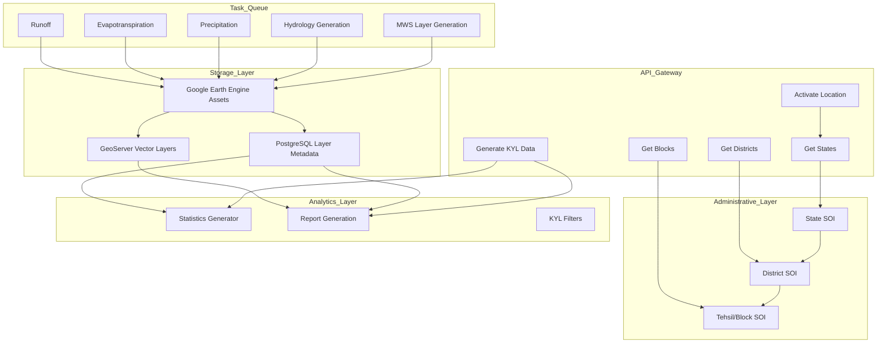
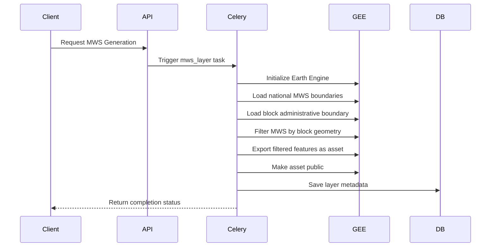
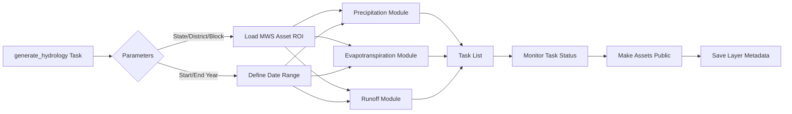
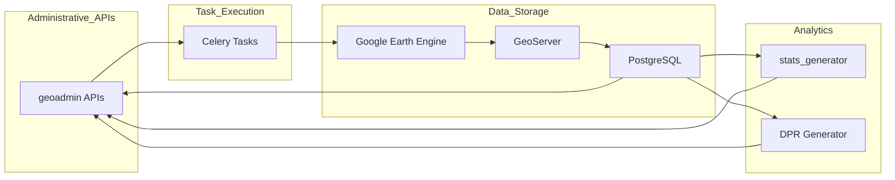

# Micro-Watershed Generation and Analysis

The Micro-Watershed Generation and Analysis system is a geospatial computing framework that leverages Google Earth Engine (GEE) for hydrological analysis at the micro-watershed level. This system provides comprehensive water balance assessment, terrain analysis, and hydrological indicator computation for decentralized water resource planning across administrative boundaries in India.

## System Architecture

The micro-watershed (MWS) analysis system integrates multiple computational modules to generate, analyze, and report hydrological data organized by state, district, and block administrative hierarchies. The architecture follows a distributed task processing pattern using Celery for asynchronous execution of GEE computations, with results stored as vector assets and accessed through RESTful APIs.

The stack processes hydrological data through four primary stages: **boundary extraction**, **hydrological computation**, **statistics generation**, and **report composition**. Each stage is modularized to support independent execution and reusability across different administrative contexts.

Sources: [geoadmin/models.py](../computing/mws/mws.py#L9-L60), [geoadmin/api.py](../geoadmin/api.py#L18-L75), [computing/mws/mws.py](../computing/mws/mws.py#L27-L70)

## Administrative Boundary Management

The geographic foundation for MWS analysis is built upon a three-tier administrative hierarchy managed by the `geoadmin` module. The system uses Survey of India (SOI) administrative boundaries as the spatial reference framework, storing state, district, and tehsil (block) geometries with activation status controls.

### Data Model

The administrative data model consists of five primary models with hierarchical relationships:

| Model | Primary Key | Foreign Key | Purpose |
| --- | --- | --- | ----- |
| StateSOI | id | None | State-level administrative boundaries |
| DistrictSOI | id | StateSOI | District-level boundaries linked to state |
| TehsilSOI | id | DistrictSOI | Block/tehsil boundaries linked to district |
| State | state\_census\_code | None | State census reference data |
| District | id | State | District census reference data |
| Block | id | District | Block census reference data |

The activation status system enforces hierarchical validation—districts require active parent states, and blocks require active parent districts before activation [geoadmin/api.py](../geoadmin/api.py#L87-L90). This ensures computational resources are only allocated to geographically enabled regions.

### API Endpoints

Administrative data is accessible through RESTful endpoints:

* `GET /api/v1/get_states/` - Retrieve all states with normalized names
* `GET /api/v1/get_districts/<state_id>/` - Get districts for a specific state
* `GET /api/v1/get_blocks/<district_id>/` - Get tehsils/blocks for a district
* `PATCH /api/v1/activate_location/` - Activate or deactivate locations with validation
* `GET /api/v1/proposed_blocks/` - Retrieve activated tehsils with transformed metadata

The `activate_location` endpoint implements sophisticated validation logic checking parent dependencies before allowing activation [geoadmin/api.py](../geoadmin/api.py#L140-L180).

Sources: [geoadmin/models.py](../geoadmin/models.py#L40-L66), [geoadmin/api.py](../geoadmin/api.py#L20-L57), [geoadmin/urls.py](../geoadmin/urls.py#L5-L14)

## MWS Layer Generation

The foundation of hydrological analysis is the creation of micro-watershed vector layers within GEE. The `mws_layer` Celery task extracts MWS features from a national hydrological boundaries dataset and filters them to the specified block boundaries.

### Extraction Process

The task begins by authenticating with GEE using the provided service account credentials [computing/mws/mws.py](../computing/mws/mws.py#L27-L28). It constructs a unique asset ID using the normalized district and block names, then checks if the asset already exists to avoid redundant computation.

The core filtering operation uses GEE's `filterBounds` method to extract MWS features that intersect with the administrative boundary geometry [computing/mws/mws.py#L38-L44]. The filtered FeatureCollection is then exported as a permanent asset with the description format `filtered_mws_<district>_<block>_uid`.

### Metadata Persistence

After successful asset creation, the task executes `save_layer_info_to_db` to record layer metadata in PostgreSQL [computing/mws/mws.py#L55-L62]. This includes the layer name, asset ID, dataset type, and algorithm version, enabling downstream applications to discover and access the generated layers programmatically.

Sources: [computing/mws/mws.py](../computing/mws/mws.py#L27-L70), [computing/utils.py](../computing/utils.py#L5-L22)

## Hydrological Computation Framework

Once MWS boundaries are established, the system generates comprehensive hydrological datasets through the `generate_hydrology` task. This orchestrator coordinates parallel execution of three critical hydrological components: precipitation, evapotranspiration, and runoff.

### Task Orchestration

The `generate_hydrology` Celery task accepts administrative identifiers and temporal parameters to initiate hydrological computation [computing/mws/generate\_hydrology.py#L28-L42]:

The task constructs a Region of Interest (ROI) by loading the previously generated MWS asset for the specified block [computing/mws/generate\_hydrology.py#L53-L60](../computing/mws/generate\_hydrology.py#L53-L60). This ROI serves as the spatial filter for all subsequent computations, ensuring that hydrological data is generated only for the relevant micro-watersheds.

### Temporal Configuration

The system supports both annual and fortnightly temporal resolutions through the `is_annual` parameter. For monsoon-based analysis, the hydrological year is defined as July 1st through June 30th of the following year [computing/mws/generate\_hydrology.py#L44-L47](../computing/mws/generate\_hydrology.py#L44-L47), capturing the complete agricultural cycle relevant to Indian water resource planning.

### Parallel Execution

The task submits three independent computational jobs to GEE:

1. **Precipitation** - IMD gridded rainfall data for the specified temporal range
2. **Evapotranspiration** - FLDAS evapotranspiration estimates computed from MODIS datasets
3. **Runoff** - Surface runoff calculated from precipitation minus infiltration and ET

Each module returns a task ID, asset ID, and last processed date [computing/mws/generate\_hydrology.py#L63-L88]. The orchestrator monitors these tasks and returns their collective status upon completion.

Sources: [computing/mws/generate\_hydrology.py](../computing/mws/generate_hydrology.py#L28-L120), [computing/mws/precipitation.py](../computing/mws/precipitation.py#L16-L25), [computing/mws/evapotranspiration.py](../computing/mws/evapotranspiration.py#L17-L26), [computing/mws/run\_off.py](../computing/mws/run_off.py#L21-L31)

## Precipitation Computation

The precipitation module processes Indian Meteorological Department (IMD) gridded rainfall data, computing zonal statistics for each micro-watershed at the specified temporal resolution.

### Data Processing Pipeline

The `_generate_data` function extracts precipitation data from the IMD GEE ImageCollection and applies MWS boundaries for zonal aggregation [computing/mws/precipitation.py#L83-L127](../computing/mws/precipitation.py#L83-L127). For annual resolution, data is aggregated by summing daily values within each year. For fortnightly resolution, the system aggregates data into 14-day periods aligned with agricultural cycles.

The module generates assets with the naming convention `<asset_suffix>_precipitation_annual` or `<asset_suffix>_precipitation_fortnight` and stores them in the GEE asset hierarchy organized by state, district, and block.

Sources: [computing/mws/precipitation.py](../computing/mws/precipitation.py#L16-L127)

## Evapotranspiration Calculation

Evapotranspiration (ET) is computed using FLDAS (FERA-Land Data Assimilation System) datasets, which provide consistent ET estimates for water balance analysis.

### FLDAS Integration

The `et_global_fldas` function processes FLDAS MODIS datasets, filtering by start and end dates and applying temporal aggregation based on the `is_annual` parameter [computing/mws/evapotranspiration.py#L289-L397](../computing/mws/evapotranspiration.py#L289-L397). Since FLDAS provides monthly average values, the system multiplies monthly estimates by the number of days in each month to obtain actual ET volume.

For large temporal ranges (spanning multiple years), the system implements chunked processing using `merge_assets_chunked_on_year` [computing/mws/evapotranspiration.py#L136-L167](../computing/mws/evapotranspiration.py#L136-L167), which processes each year separately and merges the results to avoid GEE memory limitations.

### Asset Generation

ET assets are generated with the naming pattern `<asset_suffix>_evapotranspiration_annual` or `<asset_suffix>_evapotranspiration_fortnight` and stored alongside other hydrological datasets in the block-level asset hierarchy.

Sources: [computing/mws/evapotranspiration.py](../computing/mws/evapotranspiration.py#L17-L407)

## Runoff Estimation

The runoff module calculates surface runoff by combining precipitation inputs with terrain-derived infiltration parameters. The `generate_run_off` function uses the SCS-CN (Soil Conservation Service Curve Number) method adapted for regional hydrological modeling in Indian contexts.

### Calculation Methodology

The `_generate_layer` function applies terrain parameters from the MWS boundary dataset to compute infiltration rates and runoff coefficients for each micro-watershed [computing/mws/run\_off.py#L97-L174](../computing/mws/run\_off.py#L97-L174). Runoff is calculated as the portion of precipitation that does not infiltrate into the soil profile, accounting for soil type, land cover, and antecedent moisture conditions.

Assets are generated with the naming convention `<asset_suffix>_runoff_annual` or `<asset_suffix>_runoff_fortnight`, maintaining consistency with other hydrological datasets.

Sources: [computing/mws/run\_off.py](../computing/mws/run_off.py#L21-L465)

## Water Balance Analysis

The system integrates precipitation, evapotranspiration, and runoff datasets to compute comprehensive water balance indicators for each micro-watershed. The water balance analysis reveals groundwater recharge potential and extraction sustainability.

### DeltaG Computation

The delta\_g module computes annual changes in groundwater storage (ΔG) using the water balance equation: ΔG = P - ET - RO, where P is precipitation, ET is evapotranspiration, and RO is runoff [computing/mws/delta\_g.py#L14-L23](../computing/mws/delta\_g.py#L14-L23). Positive ΔG values indicate net groundwater recharge, while negative values indicate net extraction.

The module generates assets with the naming convention `<asset_suffix>_deltaG_annual`, storing multi-year time series for trend analysis.

### Net Value Calculation

The net\_value module computes the cumulative water balance across all years, providing a summary indicator of overall groundwater status [computing/mws/net\_value.py#L14-L91](../computing/mws/net\_value.py#L14-L91). This single value helps planners quickly identify watersheds with critical water resource issues.

### Well Depth Analysis

The well\_depth module processes groundwater level data from monitoring wells, extracting time series for trend analysis and correlation with water balance estimates [computing/mws/well\_depth.py#L16-L65](../computing/mws/well\_depth.py#L16-L65). This helps validate hydrological models and identify areas where groundwater depletion is most severe.

Sources: [computing/mws/delta\_g.py](../computing/mws/delta_g.py#L14-L173), [computing/mws/net\_value.py](../computing/mws/net_value.py#L14-L91), [computing/mws/well\_depth.py](../computing/mws/well_depth.py#L16-L172)

## Statistics Generation and KYL Filters

The statistics generator module processes raw hydrological data into analytical indicators tailored for the Know Your Landscape (KYL) web application. The `generate_mws_data_for_kyl_filters` function aggregates hydrological, terrain, and land use data at the MWS level.

### Data Aggregation Process

The function reads from pre-generated Excel files containing 23 different data sheets [stats\_generator/mws\_indicators.py#L51-L100](../stats\_generator/mws\_indicators.py#L51-L100), including:

* **Hydrological**: Annual and seasonal precipitation, evapotranspiration, runoff, deltaG, net value
* **Terrain**: Slope distribution, elevation ranges, terrain clusters
* **Land Use**: Cropping intensity, surface water bodies, change detection metrics
* **Drought**: Moderate and severe drought year classifications
* **Vectors**: Restoration sites, aquifers, SOGE (Special Other General Expenditure) areas, conflict zones

For each MWS UID in the block, the system aggregates all relevant indicators and creates structured GeoJSON with associated properties [stats\_generator/mws\_indicators.py#L15-L30](../stats\_generator/mws\_indicators.py#L15-L30).

### API Access

The KYL data is accessible through the `generate_mws_data_for_kyl` endpoint, which accepts state, district, block, and file\_type parameters [stats\_generator/api.py#L72-L98](../stats\_generator/api.py#L72-L98). The endpoint supports regeneration of cached data through the optional `regenerate` parameter [stats\_generator/api.py#L72-L98](../stats\_generator/api.py#L72-L98).

The Excel file path structure follows the pattern: `{EXCEL\_PATH}/data/stats\_excel\_files/{STATE\_FOLDER}/{DISTRICT\_FOLDER}/{DISTRICT}\_{BLOCK}.xlsx`, enabling hierarchical organization and efficient access. Regeneration can be triggered by passing `regenerate=true` in the query string to force re-parsing of source Excel files.

Sources: [stats\_generator/mws\_indicators.py](../stats\_generator/mws\_indicators.py#L15-L912), [stats\_generator/api.py](../stats\_generator/api.py#L72-L98), [stats\_generator/urls.py](../stats\_generator/urls.py#L25-L32)

## Report Generation

The Detailed Project Report (DPR) generation system creates comprehensive MWS-level reports by synthesizing hydrological, terrain, and socio-economic data. The `gen_mws_report.py` module contains specialized functions for extracting and formatting diverse datasets.

### Report Composition

The DPR system generates reports for 14 different thematic areas [dpr/gen\_mws\_report.py#L218-L2318](../dpr/gen\_mws\_report.py#L218-L2318):

| Function | Purpose | Data Sources |
| --- | --- | --- |
| `get_osm_data` | OpenStreetMap features (roads, forests, water bodies) | OSM Overpass API |
| `get_terrain_data` | Terrain characteristics, slope distribution | GeoServer terrain layers |
| `get_change_detection_data` | Land use change over time | Change detection algorithms |
| `get_land_conflict_industrial_data` | Land use conflicts | Industrial datasets |
| `get_factory_data` | Factory locations and CSR data | Industrial registry |
| `get_mining_data` | Mining leases and activity | Mining department data |
| `get_green_credit_data` | Green credit schemes | Environmental datasets |
| `get_cropping_intensity` | Agricultural intensity patterns | Crop classification |
| `get_double_cropping_area` | Double cropped area statistics | Multi-temporal analysis |
| `get_surface_water_bodies_data` | Water body extent and change | Surface water detection |
| `get_water_balance_data` | Water balance and trend analysis | Hydrological computations |
| `get_soge_data` | Special Other General Expenditure | Government expenditure data |
| `get_drought_data` | Drought classification and years | Climate indicators |
| `get_village_data` | Village-level demographics | Census data |

### Water Balance Reporting

The `get_water_balance_data` function integrates hydrological indicators into narrative assessments of groundwater status [dpr/gen\_mws\_report.py#L1819-L1920](../dpr/gen\_mws\_report.py#L1819-L1920). It uses the Mann-Kendall trend test to determine if groundwater is improving, stable, or declining based on multi-year G values. DeltaG analysis reveals whether the water balance is positive (recharge > extraction) or negative (extraction > recharge).

The system categorizes years as drought or non-drought based on moderate and severe drought indices, correlating precipitation patterns with groundwater trends to provide actionable insights for water resource planning.

### Data Retrieval Pattern

Report generation functions consistently follow a pattern of reading Excel files from the block-level hierarchy, extracting MWS-specific data using UID filters, and aggregating statistics for narrative presentation [dpr/gen\_mws\_report.py#L33-L77](../dpr/gen\_mws\_report.py#L33-L77). Helper functions like `calculate_area`, `calculate_river_length`, and `filter_within_boundary` support spatial analysis and metric computation [dpr/gen\_mws\_report.py#L1819-L1920](../dpr/gen\_mws\_report.py#L1819-L1920).

Sources: [dpr/gen\_mws\_report.py](dpr/gen_mws_report.py#L1-L2619), [dpr/gen\_mws\_report.py](dpr/gen_mws_report.py#L218-L280), [dpr/gen\_mws\_report.py](dpr/gen_mws_report.py#L1819-L1920)

## Integration Patterns and Dependencies

The MWS generation and analysis system exhibits distinct integration patterns that enable scalable geospatial computing across multiple administrative regions [dpr/gen\_mws\_report.py#L33-L77](../dpr/gen\_mws\_report.py#L33-L77).

### Hierarchical Data Flow

The hierarchical dependency chain begins with administrative activation in `geoadmin`, which triggers MWS layer generation tasks. These tasks generate hydrological datasets in GEE, which are then indexed in PostgreSQL and served through GeoServer. The analytics modules consume these datasets to generate statistics and reports.

### Asset Naming Convention

Consistent asset naming conventions enable programmatic discovery and access:

* **MWS Boundaries**: `filtered_mws_<district>_<block>_uid`
* **Precipitation**: `<district>_<block>_precipitation_annual` or `_fortnight`
* **Evapotranspiration**: `<district>_<block>_evapotranspiration_annual` or `_fortnight`
* **Runoff**: `<district>_<block>_runoff_annual` or `_fortnight`
* **DeltaG**: `<district>_<block>_deltaG_annual`
* **Net Value**: `<district>_<block>_net_value`
* **Well Depth**: `<district>_<block>_well_depth`

### Error Handling and Monitoring

All Celery tasks implement error handling with task status monitoring through `check_task_status` utilities. GEE task IDs are tracked and polled until completion or failure [computing/mws/mws.py](../computing/mws/mws.py#L51-L55). Failed tasks can be retried without affecting downstream computations.

Sources: [computing/mws/generate\_hydrology.py](../computing/mws/generate_hydrology.py#L28-L247), [utilities/gee\_utils.py](../computing/mws/mws.py#L6-L15)

## Configuration and Environment

The system requires specific environment variables and GEE service account configurations:

* **GEE Authentication**: Service account JSON credentials for GEE authentication
* **GEE Asset Paths**: Centralized GEE asset hierarchy defined in `GEE_DATASET_PATH` constants
* **GeoServer Configuration**: URL and workspace settings for layer serving
* **Excel Directory Path**: Path to block-level Excel files for statistics generation

The `GEE\_DATASET\_PATH` constant references the national hydrological boundaries dataset at `/hydrological\_boundaries/microwatershed`, which serves as the master source for all MWS filtering operations. This dataset must be publicly accessible or the GEE service account must have read permissions.

## Next Steps

To extend your understanding of the micro-watershed system, explore:

* **[Google Earth Engine Integration and Authentication](/9-google-earth-engine-integration-and-authentication)**  for details on GEE service account setup and authentication mechanisms
* **[Hydrological Computing Modules](/10-hydrological-computing-modules)**  for deeper technical specifications of precipitation, ET, and runoff algorithms
* **[Multi-Level Reporting (MWS, Tehsil, Village)](/25-multi-level-reporting-mws-tehsil-village)**  for report generation patterns and template customization
* **[Administrative Boundaries Management](/20-administrative-boundaries-management)**  for administrative boundary data management and SOI integration
* **[Django Project Settings and Environment Variables](/5-django-project-settings-and-environment-variables)** for system configuration and deployment considerations