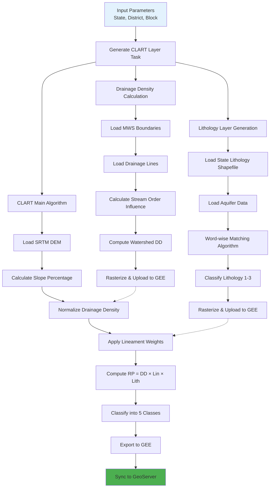
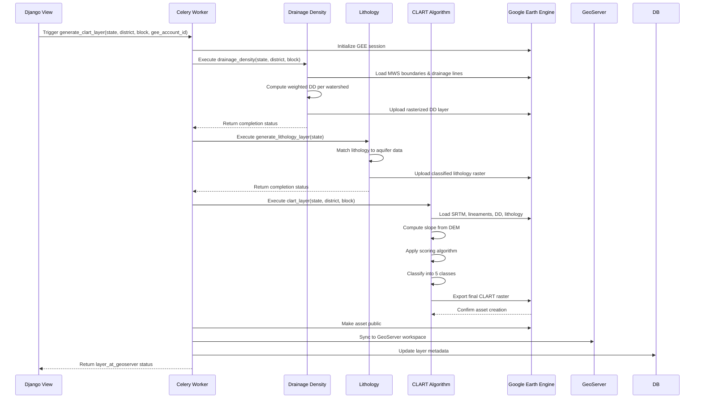

# Water Structure Planning with CLART

The CLART (Catchment Level Analysis and Resource Tool) module provides a sophisticated geospatial framework for identifying optimal locations for water structure planning within micro-watersheds. By integrating terrain analysis, hydrological characteristics, and geological properties, CLART generates a five-class suitability map that guides engineers and planners in prioritizing structure placement for maximum water conservation impact.

## Architectural Overview

CLART operates as a multi-stage geospatial computing pipeline that processes terrain, hydrological, and geological data through Google Earth Engine. The system combines three foundational layers—drainage density, lineaments, and lithology—with slope analysis to produce a comprehensive suitability assessment for water structures such as check dams, farm ponds, and recharge structures.

The architecture demonstrates a hierarchical processing workflow where intermediate layers (drainage density and lithology) are computed and cached in Google Earth Engine before being consumed by the main CLART algorithm. This design optimizes computational efficiency by avoiding redundant calculations when processing multiple blocks within the same district.

Sources: [computing/clart/clart.py](../computing/clart/clart.py#L23-L29), [computing/clart/lithology.py](../computing/clart/lithology.py#L20-L22), [computing/clart/drainage\_density.py](../computing/clart/drainage_density.py#L23-L32)

## Core Components

### Drainage Density Analysis

Drainage density serves as a fundamental hydrological indicator in CLART, representing the total length of drainage channels per unit area. The system calculates this metric for each micro-watershed by applying weighted influence factors to stream orders, recognizing that lower-order streams contribute more significantly to surface water accumulation.

The drainage density calculation employs a declining weight system across 11 stream orders:

| Stream Order | Influence Factor | Rationale |
| --- | --- | --- |
| 1 | 0.156 | First-order streams capture initial runoff, highest importance |
| 2 | 0.143 | Early tributary formation |
| 3 | 0.130 | Moderate contribution to flow accumulation |
| 4 | 0.117 | Secondary channel influence |
| 5 | 0.104 | Intermediate channel capacity |
| 6-11 | 0.091-0.026 | Progressive decrease in upstream contribution significance |

The calculation follows the formula: DD = Σ(L₁ × W₁ + L₂ × W₂ + ... + Lₙ × Wₙ) × 100 / Area, where L represents stream length, W represents influence factor, and Area is measured in hectares. This weighted approach prioritizes locations with dense networks of lower-order streams, which typically indicate favorable conditions for water structure placement.

Sources: [computing/clart/drainage\_density.py](../computing/clart/drainage_density.py#L117-L173)

### Lithology Classification

Lithology analysis provides critical insights into the subsurface characteristics that influence water storage and recharge potential. The system integrates geological survey data with aquifer mapping information using an intelligent word-wise matching algorithm that accommodates variations in naming conventions across datasets.

The lithology classification process involves several key steps:

1. **Data Loading**: Reads state-level lithology shapefiles and aquifer yield data from standardized directories
2. **Spatial Alignment**: Clips lithology polygons to aquifer boundaries using geospatial operations
3. **Attribute Matching**: Performs fuzzy matching between lithology descriptions and aquifer classifications based on principal aquifer, major aquifer, and geological age attributes
4. **Scoring System**: Assigns cumulative scores based on attribute matches, filtering out entries with only age matches
5. **Classification**: Maps aquifer yield values to three lithology classes based on recommended RIF (Recharge Index Factor) thresholds

The classification scheme assigns Lithology Class 3 (most favorable) to areas with RIF < 10, Class 2 to areas with 10 ≤ RIF ≤ 15, and Class 1 (least favorable) to areas with RIF > 15. This three-tier system allows the CLART algorithm to prioritize locations with higher recharge potential.

Sources: [computing/clart/lithology.py](../computing/clart/lithology.py#L24-L131)

### CLART Scoring Algorithm

The heart of the system lies in the CLART scoring algorithm, which synthesizes multiple geospatial parameters into a five-class suitability assessment. The algorithm operates through a series of weighted calculations and conditional classifications that reflect hydrological engineering principles.

The process begins with normalizing drainage density values to a 0-1 range, then applying a ternary scoring system:

* **DD Score 1**: Low drainage density (0-0.334 normalized), indicating sparse channel networks
* **DD Score 2**: Moderate drainage density (0.334-0.667 normalized)
* **DD Score 3**: High drainage density (0.667-1.0 normalized), suggesting abundant surface runoff

Lineament presence is encoded as a binary weight (10 for present, 1 for absent), recognizing that geological fractures often indicate preferential flow paths for groundwater recharge. The raw product (RP) is calculated as: RP = DD\_Score × Lineament\_Weight × Lithology\_Class, creating a composite index that integrates surface flow characteristics, structural geology, and subsurface permeability.

The CLART algorithm strategically uses negative values (-1000, -2000, -3000) as intermediate markers during classification logic before converting them to positive scores (1, 2, 3). This approach prevents cascading classification errors in subsequent conditional operations—a critical pattern for complex multi-factor suitability analysis in Earth Engine workflows.

The final five-class system incorporates slope constraints to ensure engineering feasibility:

| CLART Class | Description | Slope Constraint | Suitability |
| --- | --- | --- | --- |
| Class 1 | Optimal | 0-20% of max slope | Highest priority for check dams and recharge structures |
| Class 2 | High | 0-25% of max slope | Favorable for farm ponds and percolation tanks |
| Class 3 | Medium | 0-20% of max slope | Suitable for smaller structures with appropriate design modifications |
| Class 4 | Moderate | 25-30% of max slope | Requires specialized engineering interventions |
| Class 5 | Low | >30% of max slope | Generally unsuitable, limited to small contour bunds |

This slope-constrained classification ensures that identified locations are not only hydrologically favorable but also practical for construction, avoiding sites where steep terrain would prohibit standard water structure implementation.

Sources: [computing/clart/clart.py](../computing/clart/clart.py#L104-L210)

## Implementation Workflow

### Task Execution Pipeline

CLART processing is orchestrated through a Celery task that manages the sequential execution of component algorithms. The `generate_clart_layer` task accepts administrative boundaries (state, district, block) and a GEE account ID, ensuring proper initialization and resource allocation for each computation.

The workflow demonstrates error handling at each stage, with asset existence checks preventing redundant computations. Upon successful completion, the system automatically publishes the layer to GeoServer for map visualization and generates STAC (SpatioTemporal Asset Catalog) specifications for enhanced discoverability and interoperability.

Sources: [computing/clart/clart.py](../computing/clart/clart.py#L23-L29), [computing/clart/clart.py](../computing/clart/clart.py#L226-L259)

### Data Processing and Storage

CLART leverages a multi-tier storage strategy optimized for different access patterns and performance requirements:

1. **Google Earth Engine Assets**: Primary storage for intermediate and final raster layers, enabling server-side analysis and visualization
2. **Google Cloud Storage**: Temporary staging area for GeoTIFF files during upload processes
3. **GeoServer**: Published map services for web-based visualization and WMS/WFS access
4. **PostgreSQL/PostGIS**: Metadata storage including layer information, sync status, and STAC specifications

The system employs a consistent naming convention for assets following the pattern: `{state}/{district}/{block}/{layer_type}_{district}_{block}`, enabling systematic asset management and retrieval across administrative hierarchies. Layer metadata tracked in the database includes synchronization status, STAC generation flags, and override configurations for custom field inputs.

Sources: [computing/clart/clart.py](../computing/clart/clart.py#L32-L45), [computing/clart/clart.py](../computing/clart/clart.py#L228-L257)

## Integration with Water Rejuvenation Workflows

### Field Engineer Support (FES) Integration

The `fes_clart_to_geoserver` task provides a critical integration point for field engineers who may need to incorporate local knowledge or site-specific observations into the planning process. This workflow allows uploading custom GeoTIFF files that override or supplement the algorithmically generated CLART layers.

The FES workflow maintains data lineage by creating separate assets with "\_fes" suffixes, ensuring traceability between algorithmic outputs and field-modified versions. The system updates the layer metadata with override flags and references to the custom asset paths, preserving the original algorithmic result while acknowledging the field-validated version.

Sources: [computing/clart/fes\_clart\_to\_geoserver.py](../computing/clart/fes_clart_to_geoserver.py#L22-L53)

### Water Body Desilting Integration

The water rejuvenation module provides complementary functionality for planning structure implementation at specific water body locations. The `Upload_Desilting_Points` task processes Excel files containing proposed desilting or structure locations, validating coordinates and identifying nearest water pixels within a configurable search radius (default 1500 meters).

This integration enables:

1. **Coordinate Validation**: Ensures proposed structure locations have valid latitude/longitude values
2. **Nearest Water Pixel Detection**: Uses Google Earth Engine to identify the closest surface water body from historical imagery
3. **Watershed Identification**: Determines the micro-watershed(s) that would benefit from the proposed structure
4. **Zone of Influence Generation**: Creates ZOI layers for impact assessment and monitoring

The task manages workflow orchestration through multiple boolean flags (`is_closest_wp`, `is_lulc_required`, `is_processing_required`) that allow selective execution of processing components based on project requirements.

Sources: [waterrejuvenation/tasks.py](../waterrejuvenation/tasks.py#L68-L200)

### API Access and Data Delivery

The system provides REST API endpoints for consuming CLART and related water structure planning data:

1. **Administrative-boundary Query**: `/waterrejuvenation/get_waterbodies_data_by_admin/` - Retrieves all water bodies within a specified state, district, and tehsil, with optional filtering by unique identifier (UID)
2. **Individual Water Body Query**: `/waterrejuvenation/get_waterbody_data/` - Retrieves detailed information for a specific water body by UID
3. **Excel Result Generation**: `/waterrejuvenation/get_uploaded_result/` - Generates downloadable Excel reports from processed desilting point data

These endpoints employ API key authentication for security and support both JSON and Excel output formats. The administrative-boundary endpoint implements intelligent caching, storing pre-merged datasets to reduce computational overhead for frequently accessed regions.

Sources: [waterrejuvenation/api.py](../waterrejuvenation/api.py#L27-L96), [waterrejuvenation/urls.py](../waterrejuvenation/urls.py#L28-L48)

## Utility Functions and Supporting Infrastructure

### Vector-to-Raster Conversion

The `rasterize_vector` function provides essential geoprocessing capabilities for converting vector data (shapefiles, GeoJSON) into raster format required by Earth Engine operations. The utility handles spatial transformations, resolution specification, and attribute preservation during conversion.

Key parameters include:

* **Resolution**: Fixed at 0.000278 degrees (~30 meters) to match Landsat imagery scale
* **Background Value**: Set to 0 for areas outside feature boundaries
* **Touch Policy**: Uses `all_touched=True` to include cells intersected by feature boundaries, preserving edge detail important for hydrological analysis

Sources: [computing/clart/rasterize\_vector.py](../computing/clart/rasterize_vector.py#L8-L52)

### GeoServer Synchronization

The system automates the publishing workflow from Earth Engine assets to GeoServer map services through a two-stage process:

1. **GCS Staging**: Raster images are exported from Earth Engine to Google Cloud Storage
2. **GeoServer Publishing**: Images are ingested into GeoServer workspaces with appropriate styling configurations

This automated pipeline ensures that newly computed CLART layers are immediately available for web map visualization without manual intervention. The system tracks synchronization status in the database, enabling retry logic and status monitoring.

Sources: [computing/clart/clart.py](../computing/clart/clart.py#L238-L248)

## Next Steps

For comprehensive understanding of related geospatial computing workflows, explore the [Hydrological Computing Modules](/10-hydrological-computing-modules)  documentation, which covers the broader ecosystem of catchment area analysis, surface water body mapping, and drought assessment. To understand how CLART layers integrate with project management workflows, refer to [Project Management and Tracking](/23-project-management-and-tracking) . For insights into the underlying Google Earth Engine infrastructure, review [Google Earth Engine Integration and Authentication](/9-google-earth-engine-integration-and-authentication).