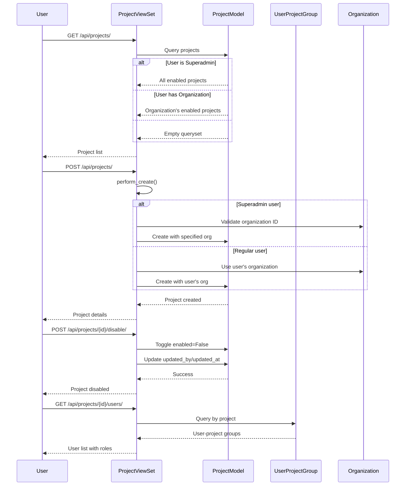
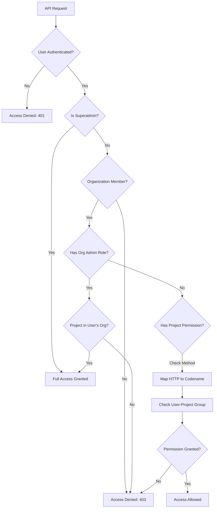
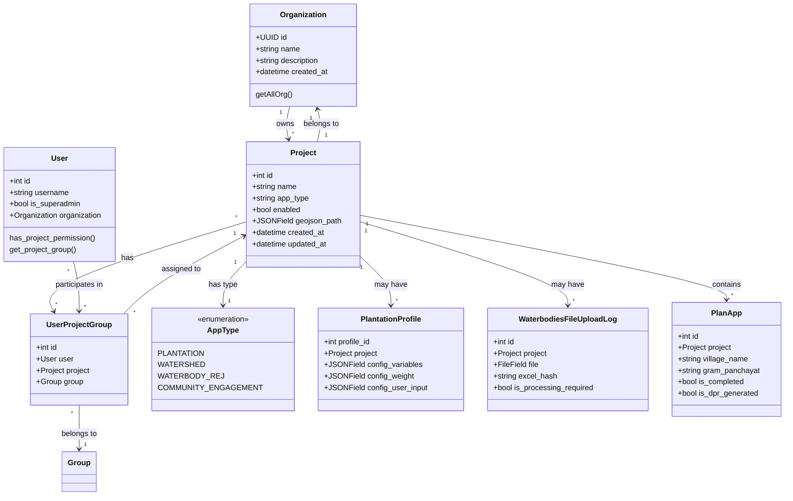

# Project Management and Tracking

The Project Management and Tracking system serves as the foundational framework for organizing and monitoring diverse environmental and community initiatives within the Core Stack backend. This module provides a centralized, multi-tenant architecture that enables organizations to manage projects across various application domains including plantations, watershed planning, waterbody rejuvenation, and community engagement. The system implements role-based access control, geospatial boundary associations, and seamless integration with specialized computation modules, ensuring that each project maintains its unique configuration while adhering to organizational governance standards.

Sources: [projects/models.py](../projects/models.py#L16-L50), [README.md](../README.md#L1-L50)

## Core Architecture Overview

The project management system follows a hierarchical multi-tenant design where organizations own multiple projects, each associated with specific application types and geographic boundaries. The architecture leverages Django REST Framework for API endpoints, integrates with specialized modules for domain-specific functionality, and maintains strict permission boundaries through organization-level isolation and project-specific role assignments. Projects serve as the primary container for all computational workflows, data uploads, and reporting activities, with each project's configuration determining which specialized features become available.

Sources: [projects/models.py](/projects/models.py#L7-L11), [organization/models.py](/organization/models.py#L11-L34)


## Data Model and Application Types

The `Project` model serves as the central entity with a flexible `app_type` field that determines which specialized modules and features are activated for each project. The system currently supports four primary application types defined in the `AppType` enumeration: `PLANTATION` for tree planting initiatives, `WATERSHED` for hydrological planning, `WATERBODY_REJ` for waterbody rejuvenation efforts, and `COMMUNITY_ENGAGEMENT` for social outreach programs. Each project maintains relationships to multiple geographic boundary models including administrative divisions (State, District, Block) and Survey of India boundaries (StateSOI, DistrictSOI, TehsilSOI), enabling precise spatial filtering and region-specific analysis. The model also tracks metadata such as creation timestamps, creator information, and an enabled flag for soft deletion functionality.

Sources: [projects/models.py](/projects/models.py#L7-L50), [projects/serializers.py](/projects/serializers.py#L6-L95)

The dual geographic reference system (administrative vs SOI boundaries) provides flexibility for different spatial analysis requirements. Administrative boundaries support official reporting and jurisdiction-based queries, while SOI boundaries enable precise geospatial computations and satellite data alignment.

| Application Type | Value | Specialized Models | Primary Features |
| --- | --- | --- | --- |
| Plantations | `plantation` | PlantationProfile, KMLFile | Tree species configuration, KML boundary files, planting metrics |
| Watershed Planning | `watershed` | Plan, PlanApp | Micro-watershed generation, CLART water structures, DPR generation |
| Waterbody Rejuvenation | `waterbody` | WaterbodiesFileUploadLog, WaterbodiesDesiltingLog | Excel-based waterbody data, desilting tracking, GEE computation |
| Community Engagement | `community_engagement` | Community models | Bot interactions, moderation, media handling |

## REST API Endpoints and Actions

The `ProjectViewSet` provides comprehensive CRUD operations through a RESTful interface with enhanced actions for project management. The base endpoints include standard operations for listing, creating, retrieving, updating, and deleting projects, with query filtering based on user permissions and organization membership. Superadmins can access all enabled projects across organizations, while regular users are restricted to projects within their organization. The ViewSet implements custom serializer selection logic that returns detailed information for single-project retrieval and summary information for list operations, optimizing data transfer for different use cases.



Sources: [projects/views.py](/projects/views.py#L16-L94), [projects/urls.py](/projects/urls.py#L1-L13)

The ViewSet's `perform\_create` method enforces organization isolation by automatically assigning the requesting user's organization to non-superadmin users, preventing cross-organization project creation while allowing superadmins to specify the target organization explicitly.

### Custom Actions

Beyond standard CRUD operations, the ViewSet exposes specialized actions for project lifecycle management and user association tracking. The `update_app_type` action allows administrators to modify a project's application type and enabled status through a PATCH request, enabling project type migration without recreating the project. The `enable` and `disable` actions provide soft deletion functionality by toggling the enabled flag and updating audit fields, preserving historical data while hiding inactive projects from default queries. The `users` action retrieves all user-project group associations for a given project, enabling role-based access control auditing and team member listing.

Sources: [projects/views.py](/projects/views.py#L55-L89)

### Endpoint Reference

| HTTP Method | Endpoint | Description | Permission Required |
| --- | --- | --- | --- |
| GET | `/api/projects/` | List accessible projects | Authenticated, IsOrganizationMember |
| POST | `/api/projects/` | Create new project | Authenticated, IsOrganizationMember |
| GET | `/api/projects/{id}/` | Retrieve project details | Authenticated, IsOrganizationMember |
| PUT/PATCH | `/api/projects/{id}/` | Update project | Authenticated, IsOrganizationMember |
| DELETE | `/api/projects/{id}/` | Delete project | Authenticated, IsOrganizationMember |
| PATCH | `/api/projects/{id}/update_app_type/` | Change app type | Authenticated, IsOrganizationMember |
| GET | `/api/projects/{id}/users/` | List project users | Authenticated, IsOrganizationMember |
| POST | `/api/projects/{id}/enable/` | Enable project | Authenticated, IsOrganizationMember |
| POST | `/api/projects/{id}/disable/` | Disable project | Authenticated, IsOrganizationMember |

## Permission System and Role Management

The project management system implements a sophisticated permission framework combining organization-level isolation with project-specific role assignments. The `IsOrganizationMember` permission class enforces multi-tenant boundaries by verifying that users can only access projects belonging to their organization, with exceptions for superadmins who have system-wide access. The `HasProjectPermission` class provides granular control by mapping HTTP methods to permission codenames (view, add, change, delete) and checking user permissions through Django's built-in authorization system extended with project-aware permission checks. This dual-layer approach ensures data isolation while allowing flexible role-based access within organizational contexts.




Sources: [users/permissions.py](/users/permissions.py#L10-L110), [projects/views.py](/projects/views.py#L17-L18)

Project-specific roles are managed through the `UserProjectGroup` model which creates a many-to-many relationship between users and projects with Django's Group model as the intermediary. This design allows organizations to define custom permission groups (such as "Project Manager", "Field Officer", "Viewer") and assign users to these groups on a per-project basis. The unique constraint on the user-project combination ensures each user has exactly one role per project, simplifying permission resolution while maintaining flexibility. The system supports special organizational roles like "Organization Admin" and "Org Admin" which inherit project permissions across all projects within their organization.

Sources: [users/models.py](/users/models.py#L116-L133), [users/permissions.py](/users/permissions.py#L48-L68)

## Integration with Specialized Modules

Projects serve as the integration point for domain-specific functionality, with each application type activating corresponding specialized models and computational workflows. The plantation module extends projects through the `PlantationProfile` model which stores configuration variables, weight parameters, and user inputs specific to tree planting initiatives. This model includes a validation constraint that ensures it can only be associated with projects having the `PLANTATION` app\_type, preventing configuration mismatches. The system also supports KML file uploads for defining plantation boundaries through the `KMLFile` model, which automatically calculates file hashes for deduplication and stores files organized by project ID.



Sources: [plantations/models.py](/plantations/models.py#L82-L112), [plantations/models.py](/plantations/models.py#L46-L66)

The waterbody rejuvenation module provides similar extensibility through `WaterbodiesFileUploadLog` and `WaterbodiesDesiltingLog` models. These models track Excel file uploads containing waterbody data, maintain processing status flags for Google Earth Engine computations, and store desilting operation logs with geographic coordinates and intervention metadata. The file upload system automatically generates file paths organized by project ID and calculates MD5 hashes to prevent duplicate processing. Processing flags such as `is_processing_required`, `is_lulc_required`, and `is_closest_wp` enable selective execution of different computational workflows, optimizing resource usage by skipping unnecessary computations.

Sources: [waterrejuvenation/models.py](/waterrejuvenation/models.py#L39-L65), [waterrejuvenation/models.py](/waterrejuvenation/models.py#L132-L165)

Planning workflows integrate with projects through the `PlanApp` model which represents individual planning units within larger project contexts. Each PlanApp is associated with a specific project and contains village-level data including Gram Panchayat information, geographic coordinates, and workflow status flags. The model tracks the planning lifecycle through boolean fields such as `is_completed`, `is_dpr_generated`, `is_dpr_reviewed`, and `is_dpr_approved`, enabling progress tracking across the planning to DPR generation pipeline. This integration demonstrates how projects serve as containers for hierarchical work items that span multiple organizational units and geographic locations.

Sources: [plans/models.py](/plans/models.py#L23-L78)

## Admin Interface and Management

The Django admin interface provides a comprehensive project management dashboard with organized fieldsets, custom display methods, and efficient query optimization. The `ProjectAdmin` class groups fields into logical sections including Basic Information (name, organization, description, app type), Geographical Information (state, district, block references and SOI boundaries), User Information (audit fields), and Timestamps (automatically managed). Custom display methods such as `get_organization_name`, `get_created_by_full_name`, and `get_updated_by_full_name` enhance the list view by showing human-readable information with related object display, while autocomplete fields enable efficient selection of complex relationships like organizations and geographic boundaries.

Sources: [projects/admin.py](/projects/admin.py#L1-L134)

The admin interface implements advanced query optimization through `select_related()` calls that prefetch related objects including organization, users, and geographic boundaries. This optimization prevents N+1 query problems when displaying project lists with related object information. List filters enable administrators to quickly find projects by organization, application type, enabled status, state, or creation date, while search fields support full-text search across project names, descriptions, organization names, and creator information. The read-only configuration for timestamp fields ensures audit trail integrity while allowing administrators to view modification history.


Sources: [projects/admin.py](/projects/admin.py#L110-L134)

| Admin Feature | Implementation | Benefit |
| --- | --- | --- |
| Fieldsets Grouping | Organized into 4 logical sections | Improved usability and data entry workflow |
| Custom Display Methods | `get_organization_name`, `get_created_by_full_name` | Human-readable information without additional queries |
| Autocomplete Fields | organization, state\_soi, district\_soi, tehsil\_soi | Efficient selection of complex relationships |
| List Filters | organization, app\_type, enabled, state, created\_at | Rapid filtering and navigation |
| Search Fields | name, description, organization\_\_name, creator fields | Full-text search across key attributes |
| Query Optimization | select\_related for 8 related objects | Eliminates N+1 query problems |

## Testing and Quality Assurance

The Core-Stack management module includes comprehensive test coverage for both model functionality and API endpoints. The `ProjectModelTest` class validates core model behavior including project creation with various attributes, organization relationships, and app\_type enumeration handling. Tests verify that projects correctly store names, descriptions, geojson paths, and application type configurations, ensuring data integrity at the model layer. The `ProjectAPITest` class extends this validation to the API layer by testing authentication, authorization, and CRUD operations through APITestCase framework utilities.

Sources: [projects/tests.py](/projects/tests.py#L8-L114)

API tests cover multiple scenarios including listing projects as admin and regular users, creating projects with proper organization assignment, and retrieving individual project details. The test suite uses fixture methods to create test data including organizations, admin users, regular users, and projects with specific configurations. Assertions verify HTTP status codes, response data structure, and that users can only access projects within their organization scope. These tests ensure that the permission system correctly isolates organizational data while providing appropriate access levels for different user roles.


Sources: [projects/tests.py](/projects/tests.py#L38-L114)

```python
def test_project_app_type(self):
    project = Project.objects.create(
        name="Test Project",
        organization=self.organization,
        app_type=AppType.WATERSHED,
        enabled=True,
    )
    self.assertEqual(project.app_type, AppType.WATERSHED)
    self.assertTrue(project.enabled)

# API test example: Listing projects as regular user
def test_list_projects_as_regular_user(self):
    self.client.force_authenticate(user=self.regular_user)
    response = self.client.get(self.projects_url)
    self.assertEqual(response.status_code, status.HTTP_200_OK)
    self.assertEqual(len(response.data), 1)
```

Sources: [projects/tests.py](/projects/tests.py#L28-L35), [projects/tests.py](/projects/tests.py#L64-L70)

## Next Steps

For understanding how projects integrate with specific computational workflows, explore the specialized module documentation. The [Hydrological Computing Modules](/10-hydrological-computing-modules)  page details watershed planning project workflows, while [Google Earth Engine Integration and Authentication](/9-google-earth-engine-integration-and-authentication)  explains the computational backend used by waterbody rejuvenation projects. The [Detailed Project Report (DPR) Generation System](/24-detailed-project-report-dpr-generation-system)  documentation describes how planning projects progress through DPR generation, approval, and review cycles. For understanding the broader multi-tenant architecture that projects depend on, refer to [Multi-Tenant Organization and User Management](/6-multi-tenant-organization-and-user-management)  and [Authentication and Authorization System](/7-authentication-and-authorization-system) .