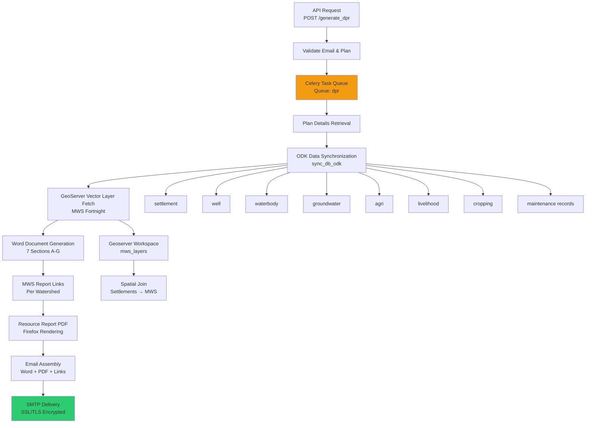
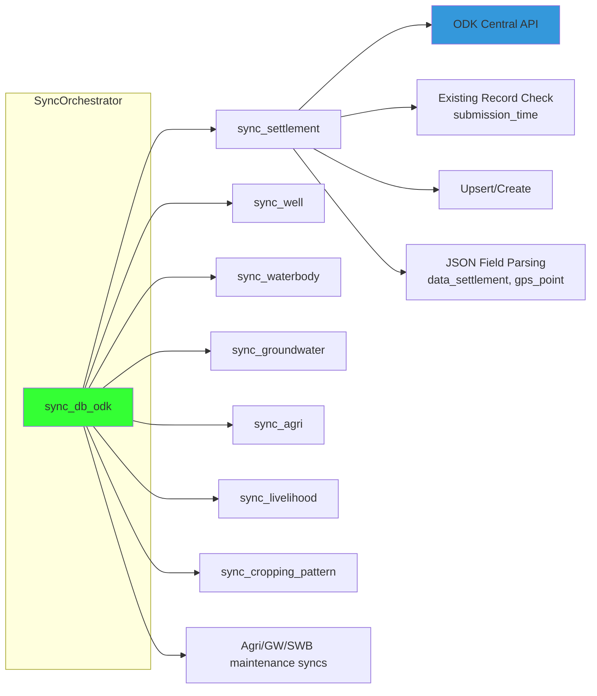

# Detailed Project Report (DPR) Generation System

The DPR Generation System is a sophisticated document orchestration engine that synthesizes geospatial, socio-economic, and infrastructure data into comprehensive project reports for rural development planning. This system integrates ODK-collected field data, GeoServer spatial layers, and multi-watershed analysis to produce structured Word documents delivered via email with supplementary MWS and resource reports.

## System Architecture

The DPR system operates as an asynchronous document pipeline combining real-time data synchronization with structured content generation. The architecture follows a multi-stage transformation pattern where raw ODK submissions are normalized, spatially contextualized, and assembled into standardized reporting formats.



Sources: [dpr/api.py](../dpr/api.py#L108-L147), [dpr/tasks.py](../dpr/tasks.py#L16-L65), [dpr/gen_dpr.py](../dpr/gen_dpr.py#L72-L127)

## API Interface

### DPR Generation Endpoint

The primary API entry point accepts a POST request with plan ID and email address, validate inputs before delegating to the Celery task queue for asynchronous processing.

Sources: [dpr/api.py](../dpr/api.py#L108-L147)

| Parameter | Type | Required | Description | Validation |
|-----------|------|----------|-------------|------------|
| plan_id | integer | Yes | PlanApp database identifier | `PlanApp.objects.get()` |
| email_id | string | Yes | Recipient email address | Regex validation in `validate_email()` |

**Response**: HTTP 202 Accepted with task initiation message

**Authentication**: `@auth_free` decorator allows public access with email validation

## DPR Document Structure

The generated DPR document follows a seven-section template, each section programmatically populated from normalized ODK data and spatial calculations. The document initialization creates a professional header with report title and generation date.

Sources: [dpr/gen_dpr.py](../dpr/gen_dpr.py#L262-L304)

### Section A: Team Details

Presents project team metadata including organization hierarchy (Organization → Project → Plan) and facilitator information. This section establishes the reporting context and methodology used in Participatory Rural Appraisal (PRA).

Sources: [dpr/gen_dpr.py](../dpr/gen_dpr.py#L298-L334)

| Field | Source Model | Description |
|-------|--------------|-------------|
| Organization | `plan.organization.name` | Implementing organization |
| Project | `plan.project.name` | Project name |
| Plan | `plan.plan` | Specific plan identifier |
| Facilitator | `plan.facilitator_name` | Field facilitator |
| Process Methodology | Static | "PRA, Gram Sabha, Transect Walk, GIS Mapping" |

### Section B: Brief of Village

Aggregates geographic and administrative context by performing spatial joins between settlement coordinates and micro-watershed (MWS) polygons. This section calculates centroids and identifies intersecting watersheds for each settlement.

Sources: [dpr/gen_dpr.py](../dpr/gen_dpr.py#L336-L438), [dpr/gen_dpr.py](../dpr/gen_dpr.py#L241-L252)

| Field | Calculation Method | Source |
|-------|-------------------|--------|
| Village Name | Direct lookup | `plan.village_name` |
| Gram Panchayat | Direct lookup | `plan.gram_panchayat` |
| Tehsil | Direct lookup | `plan.block.block_name` |
| District | Direct lookup | `plan.district.district_name` |
| State | Direct lookup | `plan.state.state_name` |
| Total Settlements | Count aggregation | `ODK_settlement.filter(plan_id)` |
| MWS IDs | Point-in-polygon spatial join | `mws_gdf.geometry.contains(point)` |
| Village Centroid | `geometry.unary_union.centroid` | Calculated from intersecting MWS polygons |

The spatial relationship algorithm uses GeoPandas to match settlement GPS coordinates to MWS polygons via `get_mws_uid_for_settlement_gdf()`, enabling watershed-based planning context.

> 💡 **Tip:**  
> **The spatial join operation performs iterative point‑in‑polygon checks for each settlement. For large plans with many settlements, consider using spatial indexing (RTree) on the MWS GeoDataFrame to improve query performance from O(n*m) to O(n log m) complexity.**

### Section C: Social Economic Ecological Profile

Synthesizes demographic, livelihood, and agricultural data across all settlements in the plan. This section employs nested tables for caste demographics and normalizes text formatting for readability.

Sources: [dpr/gen_dpr.py](../dpr/gen_dpr.py#L440-L684)

**Demographics Subsection** (`create_table_socio_eco`):

- Extracts household counts, caste composition from `ODK_settlement` model
- Categorizes settlements as "Single Caste Group" or "Mixed Caste Group" via `determine_caste_fields()` logic
- Embeds caste breakdown table (SC/ST/OBC/General) within each settlement row using Word's nested table structure

**MGNREGA Subsection** (`create_table_mgnrega_info`):
- Employment statistics: job card holders, work days, past participation
- Demand articulation: raised demands, community issues
- Worker composition: with/without job cards

**Crop Profile** (`create_table_crop_info`):
- Seasonal cropping patterns (Kharif/Rabi/Zaid) from `ODK_crop`
- Land classification and productivity metrics

**Livestock Profile** (`create_table_livestock`):
- Livestock census data from `ODK_settlement.livestock_census` JSON field
- Category-wise counts with formatting normalization

### Section D: Wells and Water Structures Details

Performs comprehensive asset inventory by geospatially associating water infrastructure with micro-watersheds. This section creates both summary and detailed tables for wells and surface waterbodies.

Sources: [dpr/gen_dpr.py](../dpr/gen_dpr.py#L684-L928)

**Well Inventory** (`populate_consolidated_well_tables`):

| Metric | Source | Aggregation |
|--------|--------|-------------|
| Total Wells | `ODK_well.filter(plan_id)` | Count per MWS |
| Functional Wells | `is_functional == 'yes'` | Count/percentage |
| Households Benefitted | Summation | Per MWS |
| Castes Using | Text field | Aggregated listing |

**Spatial Assignment Logic**:
```python
for well in wells_in_plan:
    well_point = Point(well.longitude, well.latitude)
    for mws_id, mws_polygon in zip(mws_gdf["uid"], mws_gdf["geometry"]):
        if well_point.within(mws_polygon):
            well_mws_id = mws_id
            break
```

**Waterbody Inventory** (`populate_consolidated_waterbody_tables`):
- Structure type categorization using `WATER_STRUCTURE_REVERSE_MAPPING`
- Management type (community/private/government)
- Dimension data storage in JSON format
- Repair activities derived from `get_waterbody_repair_activities()`

### Section E: Proposed Maintenance Work

Generates actionable maintenance schedules across four asset categories: groundwater recharge structures, irrigation structures, surface water bodies, and remote-sensed water bodies. This section pulls from maintenance models (`GW_maintenance`, `Agri_maintenance`, `SWB_maintenance`, `SWB_RS_maintenance`) created via `populate_maintenance_from_waterbody()`.

Sources: [dpr/gen_dpr.py](../dpr/gen_dpr.py#L1045-L1287), [dpr/mapping.py](../dpr/mapping.py#L259-L445)

Each maintenance table includes beneficiary demographics, structure type, and specific activities. The `STRUCTURE_TO_REPAIR_MAPPING` translates ODK waterbody types to appropriate repair activities (e.g., "Desiltation" for tanks, "Lining repair" for canals).

### Section F: NRM Works

Details proposed Natural Resource Management works by aggregating groundwater recharge structures and irrigation works from `ODK_groundwater` and `ODK_agri` models. This section links proposed interventions to their spatial MWS context.

Sources: [dpr/gen_dpr.py](../dpr/gen_dpr.py#L1341-L1425)

**Work Types Mapped**:
- Recharge: Contour trench, gully plug, check dam, percolation tank
- Irrigation: Farm pond, diversion channel, field channel, lift irrigation

### Section G: Plantations and Livelihood Works

Outcomes-based planning for livelihood interventions including plantations, fisheries, and community assets. Data sourced from `ODK_livelihood` with categorization by activity type.

Sources: [dpr/gen_dpr.py](../dpr/gen_dpr.py#L1427-L1658)

## Data Synchronization Pipeline

> 💡 **Tip:**
> The DPR system maintains near-real-time data consistency by synchronizing ODK submissions before document generation. The `sync_db_odk()` orchestrator calls entity-specific sync functions for each data type.



Sources: [dpr/utils.py](../dpr/utils.py#L74-L87), [dpr/utils.py](../dpr/utils.py#L146-L834)


**Sync Logic Pattern** (consistent across entities):
1. Fetch data from ODK Central via `fetch_odk_data_sync(ODK_URL)`
2. Check existence by `uuid` and `submission_time` comparison
3. Insert new records or update existing ones
4. Parse nested JSON fields (`data_<entity>`, `gps_point`)
5. Extract coordinates via `extract_coordinates()` helper
6. Skip rejected records (`status_re != "rejected"`)

## Celery Task Processing

DPR generation runs as a Celery task to handle document assembly time (typically 2-5 minutes) without blocking API responses. The task coordinates multiple report types into a single email delivery.

Sources: [dpr/tasks.py](../dpr/tasks.py#L16-L65)

**Task Workflow**:

1. **Plan Validation**: Retrieve `PlanApp` by ID
2. **Word Document**: Generate DPR via `create_dpr_document(plan)`
3. **MWS Identification**: Determine intersecting MWS IDs via `get_mws_ids_for_report()`
4. **MWS Report Links**: Construct URLs for each MWS report (HTML format)
5. **Resource Report**: Render PDF via Firefox headless browser at `render_pdf_with_firefox()`
6. **Email Assembly**: Attach Word document, PDF resource report, and HTML links in formatted email body

**Queue Configuration**: Uses dedicated `dpr` queue for resource isolation and priority management.

## Email Delivery System

The email subsystem configures SMTP backend with SSL encryption for secure document delivery. Emails contain multipart MIME content with HTML body, Word document attachment, and optional PDF resource report.

Sources: [dpr/gen_dpr.py](../dpr/gen_dpr.py#L130-L211)

**Email Components**:
- **From**: Configured `EMAIL_HOST_USER` environment variable
- **Subject**: `"DPR of plan: {plan_name}"`
- **Body**: HTML-formatted with MWS report links and resource report URL
- **Attachments**:
  - `{plan_name}.docx` - Generated DPR Word document
  - `Resource Report_{plan_name}.pdf` - Resource analysis (if successfully rendered)

**MWS Links Format**:
```html
<li>{mws_id}: <a href="{report_url}">View Report</a></li>
```

## PDF Rendering with Firefox

Resource reports require HTML-to-PDF conversion using Selenium-controlled Firefox headless browser. This enables accurate rendering of complex layouts including Chart.js visualizations and OpenLayers maps.

Sources: [dpr/gen_report_download.py](../dpr/gen_report_download.py#L25-L199)

**Configuration Parameters**:

| Parameter | Default | Description |
|-----------|---------|-------------|
| `FIREFOX_BIN` | Environment variable | Path to Firefox executable |
| `GECKODRIVER_LOG` | `geckodriver.log` | Driver logging file |
| `page_load_timeout` | 120s | Wait for page load completion |
| `ready_timeout` | 180s | Wait for JavaScript rendering |
| `viewport_width` | 1600px | Browser width |
| `viewport_height` | 1200px | Browser height |
| `print_landscape` | True | Orientation setting |

**Rendering Process**:
1. Initialize Firefox WebDriver with headless options
2. Navigate to resource report URL
3. Wait for page load and JavaScript execution
4. Execute `window.print()` command to generate PDF
5. Retrieve PDF bytes as base64-encoded output
6. Close browser session

## Structure Type Mappings

The system maintains bidirectional mappings between ODK form values and standardized structure names for consistent reporting across data sources.

Sources: [dpr/mapping.py](../dpr/mapping.py#L13-L79)

### Recharge Structure Mapping

| ODK Value | Display Name |
|-----------|--------------|
| contour_trench | Contour Trench |
| gully_plug | Gully Plug |
| check_dam | Check Dam |
| percolation_tank | Percolation Tank |
| farm_pond | Farm Pond |
| recharge_shaft | Recharge Shaft |

### Water Structure Mapping

| Category | Structures |
|----------|------------|
| Tanks | Tank, Percolation Tank, Ooranai |
| Ponds | Farm Pond, Community Pond, Pond |
| Channels | Canal, Stream, Channel |
| Others | Check Dam, Weir, Anicut, Nala Bund |

## Geospatial Integration

The DPR system leverages GeoServer WFS (Web Feature Service) to retrieve vector layers for micro-watershed boundaries. The `get_vector_layer_geoserver()` utility constructs WFS requests and returns GeoJSON features.

Sources: [dpr/utils.py](../dpr/utils.py#L45-L73), [dpr/gen_dpr.py](../dpr/gen_dpr.py#L87-L94)

**Layer Naming Convention**:

```
deltaG_fortnight_{transformed_district_name}_{transformed_block_name}
```

**WFS Request Parameters**:
- `service=WFS`
- `version=2.0.0`
- `request=GetFeature`
- `typeName=workspace:layer_name`
- `outputFormat=application/json`

The `transform_name()` function standardizes district and block names by converting spaces to underscores and lowercasing for consistent layer lookups.

## Error Handling and Resilience

The DPR generation system implements comprehensive error handling at multiple levels:

**API Level**:
- Email validation returns 400 Bad Request
- Plan not found returns 404 Not Found
- Generic exceptions return 500 Internal Server Error

**Task Level**:
- MWS report failures are logged but don't halt entire process
- Resource report PDF failures are handled gracefully
- Email delivery attempts include socket and SSL error catching

**Sync Level**:
- ODK API failures are logged with detailed exceptions
- Coordinate extraction errors default to None values
- Timezone handling for submission_time comparisons

## Next Steps

To deepen your understanding of the reporting ecosystem, explore:

- [Multi-Level Reporting (MWS, Tehsil, Village)](25-multi-level-reporting-mws-tehsil-village) - Understanding the hierarchical report generation for different administrative levels
- [Micro-Watershed Generation and Analysis](21-micro-watershed-generation-and-analysis) - The foundational hydrological units that contextualize DPR data
- [Statistics and Indicator Calculation](26-statistics-and-indicator-calculation) - The analytical engine behind socio-economic aggregations
- [Authentication and Authorization System](7-authentication-and-authorization-system) - Security patterns applied to report access controls